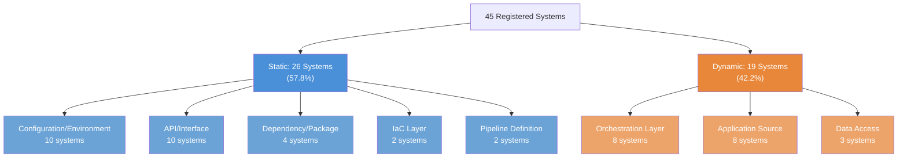

# Directive 0 — System Registry

> **Document Type:** Compliance Audit — System Classification  
> **Audit Target:** `k8s.io/kubernetes` monorepo (Go 1.25.0)  
> **Framework Authority Hierarchy:** NIST SP 800-53 Rev 5 > NIST SP 800-190 > CIS Kubernetes Benchmark v1.12.0 > CIS Controls v8  
> **Posture:** Assess-only — no code or documentation in the target repository is created, modified, or deleted  
> **Status:** Foundational reference for Directives 1–7  

---

## 1. Decomposition Methodology

### 1.1 Approach

This registry decomposes the Kubernetes monorepo along two orthogonal axes to produce a classified system inventory:

- **Vertical Axis (Functional Domains):** 10 domains representing distinct security and operational concerns within the Kubernetes codebase.
- **Horizontal Axis (Architectural Layers):** 8 layers representing the structural tiers at which code, configuration, and artifacts are organized.

Each **valid intersection** of a vertical domain and a horizontal layer constitutes a discrete **system**. Not all 80 possible intersections (10 × 8) produce valid systems — only intersections where the Kubernetes codebase contains substantive artifacts are registered.

### 1.2 System Identification Convention

Each system is assigned a unique identifier following the pattern:

```
SYS-{VERTICAL_ABBREV}-{HORIZONTAL_ABBREV}
```

**Vertical Abbreviations:**

| Abbreviation | Vertical Domain |
|---|---|
| IAM | Identity/Access |
| NET | Network Policy |
| SEC | Secret Management |
| IMG | Image Supply Chain |
| CCD | CI/CD |
| RUN | Application Runtime |
| OBS | Observability |
| CMP | Compliance |
| DAT | Data Persistence |
| EXT | External Integrations |

**Horizontal Abbreviations:**

| Abbreviation | Architectural Layer |
|---|---|
| IAC | IaC Layer |
| ORC | Orchestration Layer |
| APP | Application Source |
| CFG | Configuration/Environment |
| PIP | Pipeline Definition |
| DEP | Dependency/Package |
| API | API/Interface |
| DTA | Data Access |

**Example:** `SYS-IAM-APP` = Identity/Access × Application Source

### 1.3 Classification Model

Each system is classified as either **Static** or **Dynamic**:

- **Static:** Components whose state is defined at build, compile, or deploy time and changes only through explicit update cycles (e.g., Dockerfiles, pinned dependency versions, API type definitions, pipeline scripts). Directive 6 sampling: exactly 1 instance.
- **Dynamic:** Components that process requests, make runtime decisions, or change state during operation (e.g., authentication chains, admission controllers, controller reconciliation loops). Directive 6 sampling: 10–25 instances.

### 1.4 Framework Mapping Protocol

Every registered system is mapped to all five compliance frameworks:

1. **NIST SP 800-53 Rev 5** — Specific control IDs from families AC, AU, CM, IA, SC, SI
2. **NIST SP 800-190** — Risk area (Image / Registry / Orchestrator / Container / Host OS) or N/A
3. **NIST CSF** — Function (Identify / Protect / Detect / Respond / Recover)
4. **CIS Kubernetes Benchmark v1.12.0** — Section and check ID range (Sections 1–5)
5. **CIS Controls v8** — Control number(s) from IG2/IG3

Where NIST and CIS controls conflict, the more restrictive control is applied and the conflict is flagged in `appendix-framework-conflict-register.md`.

### 1.5 Foundational Reference Declaration

The `system_id` values defined in this document are the **authoritative reference** for all downstream directives (D1–D7). Every finding, classification, dependency, gap matrix entry, and accuracy sample in subsequent audit documents must reference a `system_id` from this registry.

---

## 2. Vertical Domain Inventory

### 2.1 Identity/Access (IAM)

**Description:** Authentication, authorization, RBAC policy enforcement, and service account lifecycle management. Governs who can access the Kubernetes API and what actions they are permitted to perform.

**Key Source Directories:**
- `pkg/auth/authorizer/abac/` — ABAC policy engine (`Source: pkg/auth/authorizer/abac/abac.go`)
- `pkg/auth/nodeidentifier/` — Node identity resolution (`Source: pkg/auth/nodeidentifier/interfaces.go`)
- `pkg/kubeapiserver/authenticator/` — Authentication chain configuration (x509, JWT, OIDC, Webhook, Bootstrap Token, ServiceAccount)
- `pkg/kubeapiserver/authorizer/` — Authorization chain configuration (Node, RBAC, Webhook, ABAC)
- `plugin/pkg/auth/authorizer/rbac/` — RBAC authorizer implementation (`Source: plugin/pkg/auth/authorizer/rbac/rbac.go`)
- `plugin/pkg/auth/authorizer/node/` — Node authorizer
- `pkg/serviceaccount/` — ServiceAccount token generation and validation
- `pkg/apis/rbac/` — RBAC API types (Role, ClusterRole, RoleBinding, ClusterRoleBinding)
- `pkg/apis/authentication/` — TokenReview API types
- `pkg/apis/authorization/` — SubjectAccessReview API types
- `pkg/certauthorization/` — Certificate-based authorization

**Primary NIST SP 800-53 Controls:** AC-2 (Account Management), AC-3 (Access Enforcement), AC-6 (Least Privilege), IA-2 (Identification and Authentication), IA-4 (Identifier Management), IA-5 (Authenticator Management), IA-8 (Identification and Authentication — Non-Organizational Users)

**Primary CIS Mappings:** CIS K8s Benchmark Section 5.1 (RBAC and Service Accounts), Section 3.1 (Authentication and Authorization); CIS Controls v8 Control 5 (Account Management), Control 6 (Access Control Management)

### 2.2 Network Policy (NET)

**Description:** Network segmentation, ingress/egress traffic control, and NetworkPolicy enforcement for pod-to-pod and pod-to-external communication boundaries.

**Key Source Directories:**
- `pkg/apis/networking/` — NetworkPolicy API type definitions
- `pkg/proxy/` — kube-proxy implementation (service routing, endpoint management)
- `plugin/pkg/admission/network/` — Network-related admission checks

**Primary NIST SP 800-53 Controls:** SC-7 (Boundary Protection), SC-8 (Transmission Confidentiality and Integrity)

**Primary CIS Mappings:** CIS K8s Benchmark Section 5.3 (Network Policies and CNI); CIS Controls v8 Control 4 (Secure Configuration of Enterprise Assets and Software)

### 2.3 Secret Management (SEC)

**Description:** Handling of Kubernetes Secrets, ConfigMaps, encryption at rest, and external credential provider integration for sensitive data lifecycle management.

**Key Source Directories:**
- `pkg/apis/core/` — Secret and ConfigMap API type definitions
- `pkg/credentialprovider/` — External credential provider interface
- `pkg/controller/` — Secret and ConfigMap controller logic (subset)
- `plugin/pkg/admission/serviceaccount/` — ServiceAccount secret injection

**Primary NIST SP 800-53 Controls:** SC-12 (Cryptographic Key Establishment and Management), SC-28 (Protection of Information at Rest), IA-5 (Authenticator Management)

**Primary CIS Mappings:** CIS K8s Benchmark Section 5.4 (Secrets Management); CIS Controls v8 Control 18 (Penetration Testing / Application Software Security)

### 2.4 Image Supply Chain (IMG)

**Description:** Container image build definitions, external dependency version pinning, image provenance, and registry management for supply chain integrity.

**Key Source Directories:**
- `build/pause/` — Pause container Dockerfile
- `build/server-image/` — Server image Dockerfile
- `build/dependencies.yaml` — External dependency version pins (zeitgeist v0.5.4, CNI 1.9.0, CoreDNS 1.13.1, etcd 3.6.7, crictl 1.34.0, protoc 23.4)
- `build/build-image/` — Build image infrastructure
- `build/release.sh`, `build/release-images.sh` — Release pipeline scripts

**Primary NIST SP 800-53 Controls:** CM-2 (Baseline Configuration), CM-7 (Least Functionality), SA-10 (Developer Configuration Management), SI-7 (Software, Firmware, and Information Integrity)

**NIST SP 800-190 Risk Areas:** Image risks (vulnerabilities, configuration defects, embedded malware, cleartext secrets), Registry risks (insecure access, stale images)

**Primary CIS Mappings:** CIS K8s Benchmark Section 4.2 (Pod Security Policies / Standards); CIS Controls v8 Control 2 (Inventory and Control of Software Assets), Control 7 (Continuous Vulnerability Management)

### 2.5 CI/CD (CCD)

**Description:** Build system, verification gates, release pipeline definitions, and contribution governance controlling how changes enter and are validated within the codebase.

**Key Source Directories:**
- `hack/verify-*.sh` — 49 verification scripts (golangci-lint, imports, generated files, openapi spec, boilerplate, codegen, conformance, feature gates, and more)
- `.github/` — Issue templates (bug-report, enhancement, failing-test, flaking-test), PR template, SECURITY.md
- `CONTRIBUTING.md` — Contribution guidelines (redirects to external community guide)
- `Makefile` — Build system targets
- `hack/update-*.sh` — Generation and update scripts

**Primary NIST SP 800-53 Controls:** CM-3 (Configuration Change Control), CM-9 (Configuration Management Plan), SA-10 (Developer Configuration Management)

**Primary CIS Mappings:** CIS K8s Benchmark Section 4.2 (Workload Policies); CIS Controls v8 Control 4 (Secure Configuration), Control 16 (Application Software Security)

### 2.6 Application Runtime (RUN)

**Description:** Core Kubernetes binary execution including kube-apiserver, kube-controller-manager, kube-scheduler, kubelet, and kube-proxy — the fundamental runtime components of the control plane and node agent.

**Key Source Directories:**
- `cmd/kube-apiserver/` — API server binary entry point
- `cmd/kube-controller-manager/` — Controller manager binary
- `cmd/kube-scheduler/` — Scheduler binary
- `cmd/kubelet/` — Node agent binary
- `cmd/kube-proxy/` — Network proxy binary
- `cmd/kubeadm/` — Cluster bootstrap tool
- `cmd/kubectl/` — CLI tool
- `cmd/cloud-controller-manager/` — Cloud controller binary
- `pkg/controlplane/` — API server control plane logic
- `pkg/scheduler/` — Scheduling framework
- `pkg/kubelet/` — Kubelet implementation
- `pkg/proxy/` — kube-proxy implementation (shared with NET)

**Primary NIST SP 800-53 Controls:** CM-6 (Configuration Settings), CM-7 (Least Functionality), SC-3 (Security Function Isolation), SI-2 (Flaw Remediation)

**Primary CIS Mappings:** CIS K8s Benchmark Section 1 (Control Plane Components), Section 4 (Worker Nodes); CIS Controls v8 Control 4 (Secure Configuration)

### 2.7 Observability (OBS)

**Description:** Metrics collection, audit event generation, tracing hooks, and monitoring endpoints providing visibility into Kubernetes cluster operations and security events.

**Key Source Directories:**
- `staging/src/k8s.io/apiserver/pkg/audit/` — Audit event generation, policy, backends (external staging reference)
- `pkg/apis/audit/` — Audit API types (if present in pkg/apis)
- `pkg/routes/` — Metrics and profiling endpoint registration
- `staging/src/k8s.io/component-base/metrics/` — Prometheus metrics framework (external staging reference)

**Primary NIST SP 800-53 Controls:** AU-2 (Event Logging), AU-3 (Content of Audit Records), AU-6 (Audit Record Review, Analysis, and Reporting), AU-12 (Audit Record Generation)

**Primary CIS Mappings:** CIS K8s Benchmark Section 3.2 (Logging); CIS Controls v8 Control 8 (Audit Log Management)

### 2.8 Compliance (CMP)

**Description:** Policy enforcement through admission control, pod security standards, and validating/mutating webhook orchestration ensuring workloads conform to security and operational policies.

**Key Source Directories:**
- `plugin/pkg/admission/` — 25 admission control plugins: admit, alwayspullimages, antiaffinity, certificates, defaulttolerationseconds, deny, eventratelimit, extendedresourcetoleration, gc, imagepolicy, limitranger, namespace, network, nodedeclaredfeatures, noderestriction, nodetaint, podnodeselector, podtolerationrestriction, podtopologylabels, priority, resourcequota, runtimeclass, security, serviceaccount, storage
- `pkg/kubeapiserver/admission/` — Admission chain configuration (`Source: pkg/kubeapiserver/admission/config.go`)
- `staging/src/k8s.io/pod-security-admission/` — Pod Security Standards enforcement (external staging reference)
- `pkg/apis/admission/` — Admission API types
- `pkg/apis/admissionregistration/` — Webhook registration API types

**Primary NIST SP 800-53 Controls:** CM-7 (Least Functionality), SI-3 (Malicious Code Protection), SI-10 (Information Input Validation)

**Primary CIS Mappings:** CIS K8s Benchmark Section 5.2 (Pod Security Standards); CIS Controls v8 Control 4 (Secure Configuration)

### 2.9 Data Persistence (DAT)

**Description:** Volume management, storage class definitions, CSI integration, and etcd state management governing how data is stored, accessed, and protected within the cluster.

**Key Source Directories:**
- `pkg/volume/` — Volume plugin implementations (configmap, csi, csimigration, downwardapi, emptydir, fc, flexvolume, git_repo, hostpath, image, iscsi, local, and more)
- `pkg/apis/storage/` — Storage API types (StorageClass, VolumeAttachment)
- `pkg/controller/volume/` — Volume controller logic (subset of `pkg/controller/`)
- `pkg/registry/storage/` — Storage resource registry

**Primary NIST SP 800-53 Controls:** SC-28 (Protection of Information at Rest), CP-9 (System Backup)

**Primary CIS Mappings:** CIS K8s Benchmark Section 2 (etcd), Section 5.4 (Secrets Management — overlaps with data at rest); CIS Controls v8 Control 4 (Secure Configuration)

### 2.10 External Integrations (EXT)

**Description:** Cloud provider interfaces, container runtime integration (CRI), container networking interface (CNI), and external webhook connections enabling Kubernetes to interact with external infrastructure and services.

**Key Source Directories:**
- `cmd/cloud-controller-manager/` — Cloud controller manager binary
- `pkg/credentialprovider/` — External credential provider plugins (shared with SEC)
- `staging/src/k8s.io/cloud-provider/` — Cloud provider interface (external staging reference)
- External webhook integration points in authenticator and authorizer configs

**Primary NIST SP 800-53 Controls:** IA-8 (Identification and Authentication — Non-Organizational Users), SC-8 (Transmission Confidentiality and Integrity), SA-9 (External System Services)

**Primary CIS Mappings:** CIS K8s Benchmark Section 1.2 (API Server — external auth), Section 4.2 (Pod Policies — image sources); CIS Controls v8 Control 1 (Inventory and Control of Enterprise Assets), Control 6 (Access Control Management)

---

## 3. Horizontal Layer Inventory

### 3.1 IaC Layer (IAC)

**Description:** Infrastructure-as-code artifacts defining container images, cluster provisioning templates, and infrastructure definitions that are consumed by build and deployment pipelines.

**Key Directory Patterns:** `build/pause/Dockerfile`, `build/server-image/Dockerfile`, `build/build-image/`, `cluster/` provisioning scripts, `build/*.sh`

**Architectural Significance:** Defines the immutable infrastructure baseline from which all runtime components are derived. Changes require explicit rebuild cycles.

### 3.2 Orchestration Layer (ORC)

**Description:** Core control plane logic that orchestrates runtime behavior including request routing, controller reconciliation loops, scheduling decisions, and node agent coordination.

**Key Directory Patterns:** `cmd/kube-apiserver/app/`, `cmd/kube-controller-manager/app/`, `cmd/kube-scheduler/app/`, `cmd/kubelet/app/`, `pkg/controller/`, `pkg/controlplane/`, `pkg/kubeapiserver/`

**Architectural Significance:** The primary runtime decision-making layer. All API requests pass through orchestration components for authentication, authorization, admission, and routing.

### 3.3 Application Source (APP)

**Description:** Implementation code containing business logic, plugin implementations, security modules, and utility libraries that provide the functional capabilities of the system.

**Key Directory Patterns:** `pkg/auth/`, `pkg/security/`, `pkg/scheduler/`, `pkg/kubelet/`, `pkg/proxy/`, `pkg/volume/`, `plugin/pkg/admission/`, `plugin/pkg/auth/`, `pkg/serviceaccount/`, `pkg/credentialprovider/`

**Architectural Significance:** Contains the core logic that implements security controls, policy enforcement, and operational features. The primary target for code quality and security-relevant audits.

### 3.4 Configuration/Environment (CFG)

**Description:** Configuration files, environment variable definitions, YAML manifests, and runtime parameter specifications that control system behavior without code changes.

**Key Directory Patterns:** `api/` (API rules, discovery), `cluster/` (provisioning configs), `hack/` (config templates), `cmd/*/app/options/` (flag definitions), `.github/` (repository config)

**Architectural Significance:** Separates policy from mechanism. Configuration drift or misconfiguration is a primary attack vector per CIS Kubernetes Benchmark.

### 3.5 Pipeline Definition (PIP)

**Description:** CI/CD scripts, verification gates, build automation, and release pipeline definitions that enforce quality and security standards on code changes.

**Key Directory Patterns:** `hack/verify-*.sh` (49 verification scripts), `.github/PULL_REQUEST_TEMPLATE.md`, `Makefile`, `build/release.sh`, `build/release-images.sh`

**Architectural Significance:** Defines the automated quality gates that prevent non-conformant changes from entering the codebase. Maps directly to NIST CM-3 change control requirements.

### 3.6 Dependency/Package (DEP)

**Description:** Module dependency management, version pinning, vendor directory governance, and external package tracking ensuring supply chain integrity.

**Key Directory Patterns:** `go.mod` (Go 1.25.0, root module `k8s.io/kubernetes`), `go.sum`, `vendor/`, `build/dependencies.yaml` (zeitgeist v0.5.4, CNI 1.9.0, CoreDNS 1.13.1, etcd 3.6.7)

**Architectural Significance:** Controls the external attack surface through dependency version pinning and integrity verification. A compromised dependency propagates to all consuming systems.

### 3.7 API/Interface (API)

**Description:** API type definitions, OpenAPI specifications, and interface contracts that define the programmatic surface area of Kubernetes components.

**Key Directory Patterns:** `pkg/apis/` (27 API type packages: rbac, authentication, authorization, admission, admissionregistration, networking, storage, core, certificates, and more), `api/openapi-spec/swagger.json`, `pkg/generated/openapi/`

**Architectural Significance:** Defines the contract between Kubernetes components and consumers. API type stability and correctness are critical for interoperability and security.

### 3.8 Data Access (DTA)

**Description:** State management, etcd interaction patterns, storage backend implementations, and data persistence logic governing how cluster state and sensitive data are stored and retrieved.

**Key Directory Patterns:** `pkg/registry/` (resource storage implementations), `staging/src/k8s.io/apiserver/pkg/storage/` (etcd storage layer — external staging reference), `pkg/volume/` (volume data access — shared with DAT-APP)

**Architectural Significance:** The persistence layer for all cluster state including RBAC bindings, Secrets, ConfigMaps, and workload definitions. Data integrity at this layer is foundational to all security controls.

---

## 4. System Registry Table

The following table registers all valid vertical × horizontal intersections identified in the Kubernetes codebase. Each row represents a discrete system with a unique `system_id`.

### 4.1 Identity/Access Systems

| system_id | vertical | horizontal | intersection_scope | classification | rationale | NIST_800-53_controls | NIST_800-190_risk_area | NIST_CSF_function | CIS_K8s_section | CIS_Controls_v8 |
|---|---|---|---|---|---|---|---|---|---|---|
| SYS-IAM-ORC | Identity/Access | Orchestration Layer | Authentication chain configuration (`pkg/kubeapiserver/authenticator/`), authorization chain configuration (`pkg/kubeapiserver/authorizer/`), request routing through auth middleware | Dynamic | Authentication and authorization chains process every API request at runtime; behavior varies with configured authenticators and authorizers | AC-3, IA-2, IA-8 | Orchestrator risks | Protect | 3.1 | 5, 6 |
| SYS-IAM-APP | Identity/Access | Application Source | ABAC policy engine (`pkg/auth/authorizer/abac/`), node identifier (`pkg/auth/nodeidentifier/`), RBAC authorizer (`plugin/pkg/auth/authorizer/rbac/`), node authorizer (`plugin/pkg/auth/authorizer/node/`), ServiceAccount management (`pkg/serviceaccount/`) | Dynamic | Auth plugins evaluate policies and make allow/deny decisions at runtime per-request | AC-3, AC-6, IA-2, IA-4 | Orchestrator risks | Protect | 5.1 | 5, 6 |
| SYS-IAM-CFG | Identity/Access | Configuration/Environment | OIDC provider configuration, ABAC policy file paths, webhook authentication endpoints, authorization mode flags, ServiceAccount issuer configuration | Static | Authentication and authorization configuration is defined at API server startup and changes only through explicit reconfiguration | AC-2, IA-5, IA-8 | Orchestrator risks | Protect | 3.1 | 5 |
| SYS-IAM-API | Identity/Access | API/Interface | RBAC API types (`pkg/apis/rbac/`), TokenReview (`pkg/apis/authentication/`), SubjectAccessReview (`pkg/apis/authorization/`), certificate authorization types (`pkg/certauthorization/`) | Static | API type definitions are compiled into binaries; changes require a new release cycle | AC-3, AC-6, IA-2 | N/A | Identify | 5.1 | 6 |
| SYS-IAM-DTA | Identity/Access | Data Access | RBAC Role/ClusterRole/RoleBinding/ClusterRoleBinding storage in etcd, ServiceAccount token persistence, authentication credential caching | Dynamic | RBAC bindings and ServiceAccount tokens are read and written at runtime as workloads are created and permissions are modified | AC-2, AC-3, AC-6 | Orchestrator risks | Protect | 5.1 | 5, 6 |

### 4.2 Network Policy Systems

| system_id | vertical | horizontal | intersection_scope | classification | rationale | NIST_800-53_controls | NIST_800-190_risk_area | NIST_CSF_function | CIS_K8s_section | CIS_Controls_v8 |
|---|---|---|---|---|---|---|---|---|---|---|
| SYS-NET-ORC | Network Policy | Orchestration Layer | kube-proxy orchestration (`cmd/kube-proxy/app/`), service routing and endpoint management, iptables/IPVS rule generation | Dynamic | kube-proxy processes service and endpoint changes at runtime, updating network rules dynamically | SC-7 | Container risks | Protect | 4.2 | 4 |
| SYS-NET-APP | Network Policy | Application Source | Proxy implementation (`pkg/proxy/`), endpoint change tracking, service load balancing logic, network admission plugin (`plugin/pkg/admission/network/`) | Dynamic | Network enforcement logic evaluates and applies rules at runtime as services and endpoints change | SC-7, SC-8 | Container risks | Protect | 5.3 | 4 |
| SYS-NET-CFG | Network Policy | Configuration/Environment | kube-proxy configuration flags, proxy mode selection (iptables/IPVS/nftables), cluster CIDR settings, network configuration in `cluster/` | Static | Network configuration is defined at deployment time; changes require explicit reconfiguration of proxy mode and CIDR ranges | SC-7 | Container risks | Protect | 5.3 | 4 |
| SYS-NET-API | Network Policy | API/Interface | NetworkPolicy API types (`pkg/apis/networking/`), Service and Endpoints API types in `pkg/apis/core/` | Static | NetworkPolicy API type definitions are compiled; structural changes require a new release cycle | SC-7 | N/A | Identify | 5.3 | 4 |

### 4.3 Secret Management Systems

| system_id | vertical | horizontal | intersection_scope | classification | rationale | NIST_800-53_controls | NIST_800-190_risk_area | NIST_CSF_function | CIS_K8s_section | CIS_Controls_v8 |
|---|---|---|---|---|---|---|---|---|---|---|
| SYS-SEC-ORC | Secret Management | Orchestration Layer | Secret/ConfigMap controller logic within `pkg/controller/`, ServiceAccount token controller, encryption provider initialization | Dynamic | Secret controllers create, rotate, and distribute secrets at runtime as workloads are created and service accounts are provisioned | SC-12, SC-28 | Container risks | Protect | 5.4 | 18 |
| SYS-SEC-APP | Secret Management | Application Source | Credential provider implementation (`pkg/credentialprovider/`), ServiceAccount secret injection (`plugin/pkg/admission/serviceaccount/`), encryption at rest modules | Dynamic | Credential providers and secret injection operate at runtime during pod creation and image pull operations | SC-28, IA-5 | Image risks | Protect | 5.4 | 18 |
| SYS-SEC-CFG | Secret Management | Configuration/Environment | Encryption configuration (EncryptionConfiguration resource), credential provider configuration files, ServiceAccount signing key paths | Static | Encryption and credential provider configuration is set at API server startup; key rotation requires explicit reconfiguration | SC-12, SC-28 | Container risks | Protect | 5.4 | 18 |
| SYS-SEC-API | Secret Management | API/Interface | Secret and ConfigMap API types in `pkg/apis/core/`, encryption provider API interfaces | Static | Secret/ConfigMap API type definitions are compiled; structural changes require a new release cycle | SC-28 | N/A | Identify | 5.4 | 18 |
| SYS-SEC-DTA | Secret Management | Data Access | Secret storage in etcd (encrypted at rest), ConfigMap persistence, ServiceAccount token storage, credential caching | Dynamic | Secrets are read and written at runtime; encryption/decryption occurs on every Secret read/write operation against etcd | SC-12, SC-28, IA-5 | Container risks | Protect | 5.4 | 18 |

### 4.4 Image Supply Chain Systems

| system_id | vertical | horizontal | intersection_scope | classification | rationale | NIST_800-53_controls | NIST_800-190_risk_area | NIST_CSF_function | CIS_K8s_section | CIS_Controls_v8 |
|---|---|---|---|---|---|---|---|---|---|---|
| SYS-IMG-IAC | Image Supply Chain | IaC Layer | Pause container Dockerfile (`build/pause/`), server image Dockerfile (`build/server-image/`), build image definitions (`build/build-image/`) | Static | Dockerfiles are declarative build definitions that change only through committed updates | CM-2, SI-7 | Image risks | Identify | 4.2 | 2, 7 |
| SYS-IMG-CFG | Image Supply Chain | Configuration/Environment | Dependency version pins in `build/dependencies.yaml` (zeitgeist v0.5.4, CNI 1.9.0, CoreDNS 1.13.1, etcd 3.6.7, crictl 1.34.0, protoc 23.4), image registry references | Static | Version pins and registry references are explicitly committed configuration; changes require PR-based update cycles | CM-2, CM-7 | Image risks, Registry risks | Identify | 4.2 | 2, 7 |
| SYS-IMG-PIP | Image Supply Chain | Pipeline Definition | Release scripts (`build/release.sh`, `build/release-images.sh`), image build pipeline (`build/common.sh`, `build/run.sh`) | Static | Build and release pipeline scripts are defined at commit time; execution is triggered but logic is static | SA-10, SI-7 | Image risks | Protect | 4.2 | 2, 16 |
| SYS-IMG-DEP | Image Supply Chain | Dependency/Package | External dependency tracking in `build/dependencies.yaml`, base image version management, zeitgeist dependency verification | Static | Dependency versions are pinned in committed manifests; updates require explicit version bumps and verification | CM-2, CM-7, SA-10 | Image risks, Registry risks | Identify | 4.2 | 2, 7 |

### 4.5 CI/CD Systems

| system_id | vertical | horizontal | intersection_scope | classification | rationale | NIST_800-53_controls | NIST_800-190_risk_area | NIST_CSF_function | CIS_K8s_section | CIS_Controls_v8 |
|---|---|---|---|---|---|---|---|---|---|---|
| SYS-CCD-CFG | CI/CD | Configuration/Environment | GitHub repository configuration (`.github/`), issue templates, PR template (`.github/PULL_REQUEST_TEMPLATE.md`), SECURITY.md, contribution guidelines (`CONTRIBUTING.md`) | Static | Repository governance configuration is committed and changes only through explicit updates | CM-3, CM-9 | N/A | Identify | N/A | 4, 16 |
| SYS-CCD-PIP | CI/CD | Pipeline Definition | 49 verification scripts (`hack/verify-*.sh`), Makefile build targets, documentation generation scripts (`hack/update-generated-docs.sh`), update scripts (`hack/update-*.sh`) | Static | Pipeline scripts are committed definitions; changes require PR-based review and merge | CM-3, SA-10 | N/A | Protect | N/A | 4, 16 |
| SYS-CCD-DEP | CI/CD | Dependency/Package | `go.mod` (module `k8s.io/kubernetes`, Go 1.25.0), `go.sum` integrity checksums, vendor directory governance (`hack/update-vendor.sh`, `hack/verify-vendor.sh`) | Static | Dependency manifests are committed artifacts; version changes require explicit pin-dependency workflow | CM-3, CM-7, SA-10 | N/A | Identify | N/A | 2, 4 |

### 4.6 Application Runtime Systems

| system_id | vertical | horizontal | intersection_scope | classification | rationale | NIST_800-53_controls | NIST_800-190_risk_area | NIST_CSF_function | CIS_K8s_section | CIS_Controls_v8 |
|---|---|---|---|---|---|---|---|---|---|---|
| SYS-RUN-IAC | Application Runtime | IaC Layer | Server image Dockerfile (`build/server-image/`), pause container image (`build/pause/`), kubemark image definitions | Static | Runtime container image definitions are declarative and change only through committed updates | CM-2, CM-6 | Container risks, Host OS risks | Identify | 1.1, 4.1 | 4 |
| SYS-RUN-ORC | Application Runtime | Orchestration Layer | kube-apiserver app startup (`cmd/kube-apiserver/app/`), kube-controller-manager orchestration (`cmd/kube-controller-manager/app/`), kube-scheduler orchestration (`cmd/kube-scheduler/app/`), kubelet orchestration (`cmd/kubelet/app/`), kube-proxy orchestration (`cmd/kube-proxy/app/`) | Dynamic | Control plane and node agent binaries process API requests, reconcile state, and schedule workloads continuously at runtime | CM-6, CM-7, SC-3 | Orchestrator risks | Protect | 1.1, 1.2, 1.3, 4.1, 4.2 | 4 |
| SYS-RUN-APP | Application Runtime | Application Source | Control plane implementation (`pkg/controlplane/`), scheduler framework (`pkg/scheduler/`), kubelet implementation (`pkg/kubelet/`), kubectl CLI (`pkg/kubectl/`), quota management (`pkg/quota/`), printers (`pkg/printers/`), probe logic (`pkg/probe/`) | Dynamic | Runtime application logic processes workloads, evaluates scheduling constraints, and manages pod lifecycles continuously | CM-7, SI-2 | Orchestrator risks, Container risks | Protect | 1.2, 4.2 | 4 |
| SYS-RUN-CFG | Application Runtime | Configuration/Environment | API server flags (`cmd/kube-apiserver/app/options/`), controller manager flags, scheduler flags, kubelet flags, kube-proxy flags, feature gate configuration (`pkg/features/`) | Static | Runtime component flags and feature gates are defined at binary startup; changes require process restart | CM-6, CM-7 | Orchestrator risks | Protect | 1.1, 1.2, 4.1, 4.2 | 4 |
| SYS-RUN-DEP | Application Runtime | Dependency/Package | Runtime Go module dependencies in `go.mod` (cobra, ginkgo, cadvisor, cel-go, prometheus, opencontainers, and 50+ libraries), `go.sum` checksums | Static | Runtime dependencies are pinned in `go.mod` and vendored; changes require explicit vendor update workflow | CM-7, SI-2, SA-10 | Image risks | Identify | N/A | 2, 4 |
| SYS-RUN-API | Application Runtime | API/Interface | OpenAPI specification (`api/openapi-spec/swagger.json`), generated OpenAPI definitions (`pkg/generated/openapi/`), CLI documentation generators (`cmd/gendocs/`, `cmd/genkubedocs/`, `cmd/genman/`) | Static | API specifications and documentation generators produce static artifacts from compiled code; changes require regeneration | CM-6 | N/A | Identify | 1.2 | 4 |

### 4.7 Observability Systems

| system_id | vertical | horizontal | intersection_scope | classification | rationale | NIST_800-53_controls | NIST_800-190_risk_area | NIST_CSF_function | CIS_K8s_section | CIS_Controls_v8 |
|---|---|---|---|---|---|---|---|---|---|---|
| SYS-OBS-ORC | Observability | Orchestration Layer | Audit event generation in API server request handling, audit policy evaluation, audit backend dispatch (staging reference: `staging/src/k8s.io/apiserver/pkg/audit/`) | Dynamic | Audit logging processes every API request at runtime, evaluating audit policy rules and dispatching events to configured backends | AU-2, AU-3, AU-12 | Orchestrator risks | Detect | 3.2 | 8 |
| SYS-OBS-APP | Observability | Application Source | Metrics endpoint registration (`pkg/routes/`), Prometheus client instrumentation, health check and liveness/readiness probe implementations (`pkg/probe/`) | Dynamic | Metrics collection and health probes execute continuously at runtime, responding to scrape requests and evaluating component health | AU-6, AU-12 | Orchestrator risks | Detect | 3.2 | 8 |
| SYS-OBS-CFG | Observability | Configuration/Environment | Audit policy configuration (audit policy YAML), metrics bind address flags, profiling configuration, logging verbosity settings | Static | Audit policy and metrics configuration is defined at component startup; changes require reconfiguration or restart | AU-2, AU-3 | Orchestrator risks | Detect | 3.2 | 8 |
| SYS-OBS-API | Observability | API/Interface | Audit API types (if present in `pkg/apis/`), metrics API surface, health/readiness endpoint contracts | Static | Observability API type definitions and endpoint contracts are compiled; structural changes require a new release | AU-2, AU-3 | N/A | Identify | 3.2 | 8 |

### 4.8 Compliance Systems

| system_id | vertical | horizontal | intersection_scope | classification | rationale | NIST_800-53_controls | NIST_800-190_risk_area | NIST_CSF_function | CIS_K8s_section | CIS_Controls_v8 |
|---|---|---|---|---|---|---|---|---|---|---|
| SYS-CMP-ORC | Compliance | Orchestration Layer | Admission chain configuration (`pkg/kubeapiserver/admission/`), mutating → validating → CEL admission pipeline orchestration, webhook dispatch | Dynamic | Admission controllers evaluate every CREATE/UPDATE/DELETE request at runtime, making policy decisions on workload mutations | CM-7, SI-10 | Orchestrator risks | Protect | 5.2 | 4 |
| SYS-CMP-APP | Compliance | Application Source | 25 admission plugins (`plugin/pkg/admission/`): alwayspullimages, certificates, deny, eventratelimit, gc, imagepolicy, limitranger, namespace, network, noderestriction, nodetaint, podnodeselector, podtolerationrestriction, priority, resourcequota, runtimeclass, security, serviceaccount, storage, and more; Pod Security Admission (staging reference) | Dynamic | Admission plugins evaluate workload specifications against policy rules at runtime for every relevant API request | CM-7, SI-3, SI-10 | Orchestrator risks, Container risks | Protect | 5.2 | 4 |
| SYS-CMP-CFG | Compliance | Configuration/Environment | Admission webhook configurations, enabled/disabled admission plugin lists, Pod Security Standards namespace labels, event rate limit configuration | Static | Admission plugin configuration and webhook registration are defined at deployment time; changes require explicit reconfiguration | CM-7, SI-10 | Orchestrator risks | Protect | 5.2 | 4 |
| SYS-CMP-API | Compliance | API/Interface | Admission API types (`pkg/apis/admission/`), AdmissionRegistration types (`pkg/apis/admissionregistration/`), Pod Security API types (staging reference), ImagePolicy types (`pkg/apis/imagepolicy/`) | Static | Admission and policy API type definitions are compiled; structural changes require a new release cycle | CM-7, SI-10 | N/A | Identify | 5.2 | 4 |

### 4.9 Data Persistence Systems

| system_id | vertical | horizontal | intersection_scope | classification | rationale | NIST_800-53_controls | NIST_800-190_risk_area | NIST_CSF_function | CIS_K8s_section | CIS_Controls_v8 |
|---|---|---|---|---|---|---|---|---|---|---|
| SYS-DAT-ORC | Data Persistence | Orchestration Layer | Volume controller orchestration (`pkg/controller/volume/`), PersistentVolume lifecycle management, StorageClass provisioner coordination | Dynamic | Volume controllers reconcile PV/PVC bindings and trigger provisioning/deprovisioning at runtime as workloads request storage | SC-28, CP-9 | Host OS risks | Protect | 2 | 4 |
| SYS-DAT-APP | Data Persistence | Application Source | Volume plugin implementations (`pkg/volume/`: configmap, csi, csimigration, downwardapi, emptydir, fc, flexvolume, hostpath, iscsi, local, and more), CSI driver integration | Dynamic | Volume plugins mount/unmount storage at runtime during pod lifecycle events; behavior depends on storage backend and workload configuration | SC-28 | Host OS risks | Protect | 5.4 | 4 |
| SYS-DAT-CFG | Data Persistence | Configuration/Environment | StorageClass definitions, PersistentVolume reclaim policies, CSI driver configuration, volume mount options | Static | Storage configuration (StorageClass parameters, reclaim policies) is defined at deployment time; changes require explicit resource updates | SC-28 | Host OS risks | Protect | 2, 5.4 | 4 |
| SYS-DAT-API | Data Persistence | API/Interface | Storage API types (`pkg/apis/storage/`), PersistentVolume and PersistentVolumeClaim types in `pkg/apis/core/`, CSI volume types | Static | Storage API type definitions are compiled; structural changes require a new release cycle | SC-28 | N/A | Identify | 2 | 4 |
| SYS-DAT-DTA | Data Persistence | Data Access | etcd state storage for all Kubernetes resources, PersistentVolume data access patterns, volume attach/detach state tracking | Dynamic | etcd reads and writes occur continuously at runtime as cluster state changes; volume attach/detach operations are driven by workload scheduling | SC-28, CP-9 | Host OS risks | Protect | 2 | 4 |

### 4.10 External Integration Systems

| system_id | vertical | horizontal | intersection_scope | classification | rationale | NIST_800-53_controls | NIST_800-190_risk_area | NIST_CSF_function | CIS_K8s_section | CIS_Controls_v8 |
|---|---|---|---|---|---|---|---|---|---|---|
| SYS-EXT-ORC | External Integrations | Orchestration Layer | Cloud controller manager orchestration (`cmd/cloud-controller-manager/`), external authentication/authorization webhook dispatch, CRI/CNI interface coordination | Dynamic | Cloud controllers and webhook dispatchers communicate with external systems at runtime, processing events and delegating decisions | IA-8, SA-9 | Orchestrator risks | Protect | 1.2 | 1, 6 |
| SYS-EXT-APP | External Integrations | Application Source | External credential providers (`pkg/credentialprovider/`), webhook authenticator/authorizer client implementations, cloud provider interface code | Dynamic | Credential providers and webhook clients make outbound calls to external services at runtime during authentication and authorization flows | IA-8, SC-8 | Orchestrator risks | Protect | 1.2, 4.2 | 1, 6 |
| SYS-EXT-CFG | External Integrations | Configuration/Environment | Cloud provider configuration, webhook endpoint URLs, external authentication configuration, CRI/CNI endpoint settings in kubelet configuration | Static | External integration endpoints and credentials are configured at deployment time; changes require explicit reconfiguration | IA-8, SA-9 | Orchestrator risks | Protect | 1.2 | 1 |
| SYS-EXT-DEP | External Integrations | Dependency/Package | External integration dependencies in `go.mod` (cloud-provider libraries, CRI client, CNI plugins), staging module references (`staging/src/k8s.io/cloud-provider/`) | Static | External integration library dependencies are pinned in `go.mod`; version changes require explicit vendor update workflow | SA-9, CM-7 | Image risks | Identify | N/A | 1, 2 |
| SYS-EXT-API | External Integrations | API/Interface | Cloud provider API contracts, webhook API interfaces, CRI/CNI interface definitions (staging references), external admission webhook API types | Static | External API interface definitions are compiled; structural changes require a new release cycle | IA-8, SC-8 | N/A | Identify | 1.2 | 1, 6 |

---

## 5. Static/Dynamic Classification

### 5.1 Classification Criteria

| Criterion | Static | Dynamic |
|---|---|---|
| State determination | Build, compile, or deploy time | Runtime |
| Change mechanism | Explicit commit/release/reconfiguration cycle | Continuous request processing, state reconciliation |
| Behavioral variability | Deterministic given inputs | Varies with workload, configuration, and runtime context |
| D6 sampling | Exactly 1 instance | 10–25 instances |
| Examples | Dockerfiles, go.mod pins, API type definitions, pipeline scripts | Auth chains, admission controllers, controller loops, secret encryption |

### 5.2 Classification Summary by System

| system_id | Classification | Rationale Summary |
|---|---|---|
| SYS-IAM-ORC | Dynamic | Auth chains evaluate every API request at runtime |
| SYS-IAM-APP | Dynamic | Auth plugins make per-request allow/deny decisions |
| SYS-IAM-CFG | Static | Auth configuration set at startup; requires restart to change |
| SYS-IAM-API | Static | RBAC/Auth API types compiled into binaries |
| SYS-IAM-DTA | Dynamic | RBAC bindings read/written at runtime |
| SYS-NET-ORC | Dynamic | kube-proxy updates network rules dynamically |
| SYS-NET-APP | Dynamic | Network enforcement evaluates rules at runtime |
| SYS-NET-CFG | Static | Network configuration set at deployment time |
| SYS-NET-API | Static | NetworkPolicy API types compiled into binaries |
| SYS-SEC-ORC | Dynamic | Secret controllers manage secrets at runtime |
| SYS-SEC-APP | Dynamic | Credential providers operate at runtime during pod creation |
| SYS-SEC-CFG | Static | Encryption configuration set at API server startup |
| SYS-SEC-API | Static | Secret/ConfigMap API types compiled into binaries |
| SYS-SEC-DTA | Dynamic | Secret encryption/decryption at runtime on every etcd operation |
| SYS-IMG-IAC | Static | Dockerfiles are declarative build definitions |
| SYS-IMG-CFG | Static | Dependency version pins are committed configuration |
| SYS-IMG-PIP | Static | Release scripts defined at commit time |
| SYS-IMG-DEP | Static | Dependency versions pinned in committed manifests |
| SYS-CCD-CFG | Static | Repository governance config committed and explicit |
| SYS-CCD-PIP | Static | Verification scripts committed and PR-reviewed |
| SYS-CCD-DEP | Static | go.mod and vendor directory committed artifacts |
| SYS-RUN-IAC | Static | Runtime container image definitions are declarative |
| SYS-RUN-ORC | Dynamic | Control plane processes requests continuously at runtime |
| SYS-RUN-APP | Dynamic | Runtime application logic processes workloads continuously |
| SYS-RUN-CFG | Static | Runtime flags defined at binary startup |
| SYS-RUN-DEP | Static | Runtime dependencies pinned and vendored |
| SYS-RUN-API | Static | OpenAPI spec and generators produce static artifacts |
| SYS-OBS-ORC | Dynamic | Audit logging processes every API request at runtime |
| SYS-OBS-APP | Dynamic | Metrics and health probes execute continuously |
| SYS-OBS-CFG | Static | Audit policy set at component startup |
| SYS-OBS-API | Static | Observability API types compiled into binaries |
| SYS-CMP-ORC | Dynamic | Admission chain evaluates every mutating request at runtime |
| SYS-CMP-APP | Dynamic | 25 admission plugins evaluate workloads at runtime |
| SYS-CMP-CFG | Static | Admission configuration defined at deployment time |
| SYS-CMP-API | Static | Admission API types compiled into binaries |
| SYS-DAT-ORC | Dynamic | Volume controllers reconcile PV/PVC bindings at runtime |
| SYS-DAT-APP | Dynamic | Volume plugins mount/unmount at runtime during pod lifecycle |
| SYS-DAT-CFG | Static | StorageClass definitions set at deployment time |
| SYS-DAT-API | Static | Storage API types compiled into binaries |
| SYS-DAT-DTA | Dynamic | etcd reads/writes occur continuously as cluster state changes |
| SYS-EXT-ORC | Dynamic | Cloud controllers communicate with external systems at runtime |
| SYS-EXT-APP | Dynamic | Webhook clients make outbound calls at runtime |
| SYS-EXT-CFG | Static | External integration endpoints configured at deployment time |
| SYS-EXT-DEP | Static | External integration dependencies pinned in go.mod |
| SYS-EXT-API | Static | External API contracts compiled into binaries |

---

## 6. Five-Framework Control Mapping

### 6.1 Mapping Legend

- **NIST 800-53**: Control IDs from NIST SP 800-53 Rev 5 (AC, AU, CM, IA, SC, SI families)
- **NIST 800-190**: Risk area from NIST SP 800-190 (Image / Registry / Orchestrator / Container / Host OS) or N/A
- **NIST CSF**: Function from NIST Cybersecurity Framework (Identify / Protect / Detect / Respond / Recover)
- **CIS K8s**: Section from CIS Kubernetes Benchmark v1.12.0 (Sections 1–5) or N/A
- **CIS Ctrl v8**: Control number from CIS Controls v8 IG2/IG3

### 6.2 Complete Framework Mapping Table

| system_id | NIST 800-53 | NIST 800-190 | NIST CSF | CIS K8s | CIS Ctrl v8 |
|---|---|---|---|---|---|
| SYS-IAM-ORC | AC-3, IA-2, IA-8 | Orchestrator risks | Protect | 3.1 | 5, 6 |
| SYS-IAM-APP | AC-3, AC-6, IA-2, IA-4 | Orchestrator risks | Protect | 5.1 | 5, 6 |
| SYS-IAM-CFG | AC-2, IA-5, IA-8 | Orchestrator risks | Protect | 3.1 | 5 |
| SYS-IAM-API | AC-3, AC-6, IA-2 | N/A | Identify | 5.1 | 6 |
| SYS-IAM-DTA | AC-2, AC-3, AC-6 | Orchestrator risks | Protect | 5.1 | 5, 6 |
| SYS-NET-ORC | SC-7 | Container risks | Protect | 4.2 | 4 |
| SYS-NET-APP | SC-7, SC-8 | Container risks | Protect | 5.3 | 4 |
| SYS-NET-CFG | SC-7 | Container risks | Protect | 5.3 | 4 |
| SYS-NET-API | SC-7 | N/A | Identify | 5.3 | 4 |
| SYS-SEC-ORC | SC-12, SC-28 | Container risks | Protect | 5.4 | 18 |
| SYS-SEC-APP | SC-28, IA-5 | Image risks | Protect | 5.4 | 18 |
| SYS-SEC-CFG | SC-12, SC-28 | Container risks | Protect | 5.4 | 18 |
| SYS-SEC-API | SC-28 | N/A | Identify | 5.4 | 18 |
| SYS-SEC-DTA | SC-12, SC-28, IA-5 | Container risks | Protect | 5.4 | 18 |
| SYS-IMG-IAC | CM-2, SI-7 | Image risks | Identify | 4.2 | 2, 7 |
| SYS-IMG-CFG | CM-2, CM-7 | Image risks, Registry risks | Identify | 4.2 | 2, 7 |
| SYS-IMG-PIP | SA-10, SI-7 | Image risks | Protect | 4.2 | 2, 16 |
| SYS-IMG-DEP | CM-2, CM-7, SA-10 | Image risks, Registry risks | Identify | 4.2 | 2, 7 |
| SYS-CCD-CFG | CM-3, CM-9 | N/A | Identify | N/A | 4, 16 |
| SYS-CCD-PIP | CM-3, SA-10 | N/A | Protect | N/A | 4, 16 |
| SYS-CCD-DEP | CM-3, CM-7, SA-10 | N/A | Identify | N/A | 2, 4 |
| SYS-RUN-IAC | CM-2, CM-6 | Container risks, Host OS risks | Identify | 1.1, 4.1 | 4 |
| SYS-RUN-ORC | CM-6, CM-7, SC-3 | Orchestrator risks | Protect | 1.1, 1.2, 1.3, 4.1, 4.2 | 4 |
| SYS-RUN-APP | CM-7, SI-2 | Orchestrator risks, Container risks | Protect | 1.2, 4.2 | 4 |
| SYS-RUN-CFG | CM-6, CM-7 | Orchestrator risks | Protect | 1.1, 1.2, 4.1, 4.2 | 4 |
| SYS-RUN-DEP | CM-7, SI-2, SA-10 | Image risks | Identify | N/A | 2, 4 |
| SYS-RUN-API | CM-6 | N/A | Identify | 1.2 | 4 |
| SYS-OBS-ORC | AU-2, AU-3, AU-12 | Orchestrator risks | Detect | 3.2 | 8 |
| SYS-OBS-APP | AU-6, AU-12 | Orchestrator risks | Detect | 3.2 | 8 |
| SYS-OBS-CFG | AU-2, AU-3 | Orchestrator risks | Detect | 3.2 | 8 |
| SYS-OBS-API | AU-2, AU-3 | N/A | Identify | 3.2 | 8 |
| SYS-CMP-ORC | CM-7, SI-10 | Orchestrator risks | Protect | 5.2 | 4 |
| SYS-CMP-APP | CM-7, SI-3, SI-10 | Orchestrator risks, Container risks | Protect | 5.2 | 4 |
| SYS-CMP-CFG | CM-7, SI-10 | Orchestrator risks | Protect | 5.2 | 4 |
| SYS-CMP-API | CM-7, SI-10 | N/A | Identify | 5.2 | 4 |
| SYS-DAT-ORC | SC-28, CP-9 | Host OS risks | Protect | 2 | 4 |
| SYS-DAT-APP | SC-28 | Host OS risks | Protect | 5.4 | 4 |
| SYS-DAT-CFG | SC-28 | Host OS risks | Protect | 2, 5.4 | 4 |
| SYS-DAT-API | SC-28 | N/A | Identify | 2 | 4 |
| SYS-DAT-DTA | SC-28, CP-9 | Host OS risks | Protect | 2 | 4 |
| SYS-EXT-ORC | IA-8, SA-9 | Orchestrator risks | Protect | 1.2 | 1, 6 |
| SYS-EXT-APP | IA-8, SC-8 | Orchestrator risks | Protect | 1.2, 4.2 | 1, 6 |
| SYS-EXT-CFG | IA-8, SA-9 | Orchestrator risks | Protect | 1.2 | 1 |
| SYS-EXT-DEP | SA-9, CM-7 | Image risks | Identify | N/A | 1, 2 |
| SYS-EXT-API | IA-8, SC-8 | N/A | Identify | 1.2 | 1, 6 |

---

## 7. Diagrams

### 7.1 System Registry Matrix — Vertical × Horizontal Intersections

```mermaid
graph TD
    subgraph Verticals["Vertical Domains"]
        V_IAM["IAM<br/>Identity/Access"]
        V_NET["NET<br/>Network Policy"]
        V_SEC["SEC<br/>Secret Management"]
        V_IMG["IMG<br/>Image Supply Chain"]
        V_CCD["CCD<br/>CI/CD"]
        V_RUN["RUN<br/>Application Runtime"]
        V_OBS["OBS<br/>Observability"]
        V_CMP["CMP<br/>Compliance"]
        V_DAT["DAT<br/>Data Persistence"]
        V_EXT["EXT<br/>External Integrations"]
    end

    subgraph Horizontals["Architectural Layers"]
        H_IAC["IAC<br/>IaC Layer"]
        H_ORC["ORC<br/>Orchestration"]
        H_APP["APP<br/>Application Source"]
        H_CFG["CFG<br/>Config/Environment"]
        H_PIP["PIP<br/>Pipeline Definition"]
        H_DEP["DEP<br/>Dependency/Package"]
        H_API["API<br/>API/Interface"]
        H_DTA["DTA<br/>Data Access"]
    end

    V_IAM --- H_ORC
    V_IAM --- H_APP
    V_IAM --- H_CFG
    V_IAM --- H_API
    V_IAM --- H_DTA

    V_NET --- H_ORC
    V_NET --- H_APP
    V_NET --- H_CFG
    V_NET --- H_API

    V_SEC --- H_ORC
    V_SEC --- H_APP
    V_SEC --- H_CFG
    V_SEC --- H_API
    V_SEC --- H_DTA

    V_IMG --- H_IAC
    V_IMG --- H_CFG
    V_IMG --- H_PIP
    V_IMG --- H_DEP

    V_CCD --- H_CFG
    V_CCD --- H_PIP
    V_CCD --- H_DEP

    V_RUN --- H_IAC
    V_RUN --- H_ORC
    V_RUN --- H_APP
    V_RUN --- H_CFG
    V_RUN --- H_DEP
    V_RUN --- H_API

    V_OBS --- H_ORC
    V_OBS --- H_APP
    V_OBS --- H_CFG
    V_OBS --- H_API

    V_CMP --- H_ORC
    V_CMP --- H_APP
    V_CMP --- H_CFG
    V_CMP --- H_API

    V_DAT --- H_ORC
    V_DAT --- H_APP
    V_DAT --- H_CFG
    V_DAT --- H_API
    V_DAT --- H_DTA

    V_EXT --- H_ORC
    V_EXT --- H_APP
    V_EXT --- H_CFG
    V_EXT --- H_DEP
    V_EXT --- H_API
```



### 7.2 Static vs. Dynamic Classification Distribution



### 7.3 NIST CSF Function Distribution

```mermaid
graph LR
    subgraph Identify["Identify — 16 systems"]
        I1["SYS-IAM-API"]
        I2["SYS-NET-API"]
        I3["SYS-SEC-API"]
        I4["SYS-IMG-IAC"]
        I5["SYS-IMG-CFG"]
        I6["SYS-IMG-DEP"]
        I7["SYS-CCD-CFG"]
        I8["SYS-CCD-DEP"]
        I9["SYS-RUN-IAC"]
        I10["SYS-RUN-DEP"]
        I11["SYS-RUN-API"]
        I12["SYS-OBS-API"]
        I13["SYS-CMP-API"]
        I14["SYS-DAT-API"]
        I15["SYS-EXT-API"]
        I16["SYS-EXT-DEP"]
    end

    subgraph Protect["Protect — 26 systems"]
        P1["SYS-IAM-ORC"]
        P2["SYS-IAM-APP"]
        P3["SYS-IAM-CFG"]
        P4["SYS-IAM-DTA"]
        P5["SYS-NET-ORC"]
        P6["SYS-NET-APP"]
        P7["SYS-NET-CFG"]
        P8["SYS-SEC-ORC"]
        P9["SYS-SEC-APP"]
        P10["SYS-SEC-CFG"]
        P11["SYS-SEC-DTA"]
        P12["SYS-IMG-PIP"]
        P13["SYS-CCD-PIP"]
        P14["SYS-RUN-ORC"]
        P15["SYS-RUN-APP"]
        P16["SYS-RUN-CFG"]
        P17["SYS-CMP-ORC"]
        P18["SYS-CMP-APP"]
        P19["SYS-CMP-CFG"]
        P20["SYS-DAT-ORC"]
        P21["SYS-DAT-APP"]
        P22["SYS-DAT-CFG"]
        P23["SYS-DAT-DTA"]
        P24["SYS-EXT-ORC"]
        P25["SYS-EXT-APP"]
        P26["SYS-EXT-CFG"]
    end

    subgraph Detect["Detect — 3 systems"]
        D1["SYS-OBS-ORC"]
        D2["SYS-OBS-APP"]
        D3["SYS-OBS-CFG"]
    end
```



---

## 8. Summary Statistics

### 8.1 Total Systems Registered

| Metric | Value |
|---|---|
| **Total registered systems** | **45** |
| Valid intersections out of 80 possible (10 × 8) | 45 (56.3%) |
| Invalid/N/A intersections | 35 (43.8%) |

### 8.2 Static vs. Dynamic Distribution

| Classification | Count | Percentage |
|---|---|---|
| **Static** | **26** | **57.8%** |
| **Dynamic** | **19** | **42.2%** |
| **Total** | **45** | **100.0%** |

### 8.3 Systems per Vertical

| Vertical | Abbreviation | System Count | Static | Dynamic |
|---|---|---|---|---|
| Identity/Access | IAM | 5 | 2 | 3 |
| Network Policy | NET | 4 | 2 | 2 |
| Secret Management | SEC | 5 | 2 | 3 |
| Image Supply Chain | IMG | 4 | 4 | 0 |
| CI/CD | CCD | 3 | 3 | 0 |
| Application Runtime | RUN | 6 | 4 | 2 |
| Observability | OBS | 4 | 2 | 2 |
| Compliance | CMP | 4 | 2 | 2 |
| Data Persistence | DAT | 5 | 2 | 3 |
| External Integrations | EXT | 5 | 3 | 2 |
| **Total** | — | **45** | **26** | **19** |

### 8.4 Systems per Horizontal

| Horizontal | Abbreviation | System Count | Static | Dynamic |
|---|---|---|---|---|
| IaC Layer | IAC | 2 | 2 | 0 |
| Orchestration Layer | ORC | 8 | 0 | 8 |
| Application Source | APP | 8 | 0 | 8 |
| Configuration/Environment | CFG | 10 | 10 | 0 |
| Pipeline Definition | PIP | 2 | 2 | 0 |
| Dependency/Package | DEP | 4 | 4 | 0 |
| API/Interface | API | 8 | 8 | 0 |
| Data Access | DTA | 3 | 0 | 3 |
| **Total** | — | **45** | **26** | **19** |

### 8.5 Framework Coverage Summary

| Framework | Systems Mapped | Coverage |
|---|---|---|
| NIST SP 800-53 Rev 5 | 45 of 45 | 100% — All systems mapped to specific control IDs |
| NIST SP 800-190 | 34 of 45 | 75.6% — 11 systems mapped as N/A (primarily API/Interface layer systems with no container-specific risk area) |
| NIST CSF | 45 of 45 | 100% — All systems mapped to Identify, Protect, or Detect functions |
| CIS K8s Benchmark v1.12.0 | 40 of 45 | 88.9% — 5 systems mapped as N/A (CI/CD and some Dependency systems not directly addressed by K8s benchmark) |
| CIS Controls v8 | 45 of 45 | 100% — All systems mapped to specific control numbers |

### 8.6 NIST CSF Function Distribution

| CSF Function | System Count | Percentage |
|---|---|---|
| Identify | 16 | 35.6% |
| Protect | 26 | 57.8% |
| Detect | 3 | 6.7% |
| Respond | 0 | 0.0% |
| Recover | 0 | 0.0% |
| **Total** | **45** | **100.0%** |

> **Note on Respond/Recover:** No systems are primarily mapped to the Respond or Recover CSF functions because the Kubernetes codebase implements preventive and detective controls. Incident response and recovery are operational procedures external to the codebase. This is consistent with the assess-only posture — only controls verified in the codebase are documented.

### 8.7 NIST SP 800-53 Control Family Distribution

| Control Family | Systems Referencing | Key Controls |
|---|---|---|
| AC (Access Control) | 5 | AC-2, AC-3, AC-6 |
| AU (Audit and Accountability) | 4 | AU-2, AU-3, AU-6, AU-12 |
| CM (Configuration Management) | 23 | CM-2, CM-3, CM-6, CM-7, CM-9 |
| CP (Contingency Planning) | 2 | CP-9 |
| IA (Identification and Authentication) | 9 | IA-2, IA-4, IA-5, IA-8 |
| SA (System and Services Acquisition) | 9 | SA-9, SA-10 |
| SC (System and Communications Protection) | 16 | SC-3, SC-7, SC-8, SC-12, SC-28 |
| SI (System and Information Integrity) | 8 | SI-2, SI-3, SI-7, SI-10 |

---

## 9. Cross-Reference Index Anchors

The following system_id anchors are provided for use by all downstream directives (D1–D7). Each system_id is unique and must be referenced exactly as listed.

**Complete system_id inventory (45 systems):**

```
SYS-IAM-ORC  SYS-IAM-APP  SYS-IAM-CFG  SYS-IAM-API  SYS-IAM-DTA
SYS-NET-ORC  SYS-NET-APP  SYS-NET-CFG  SYS-NET-API
SYS-SEC-ORC  SYS-SEC-APP  SYS-SEC-CFG  SYS-SEC-API  SYS-SEC-DTA
SYS-IMG-IAC  SYS-IMG-CFG  SYS-IMG-PIP  SYS-IMG-DEP
SYS-CCD-CFG  SYS-CCD-PIP  SYS-CCD-DEP
SYS-RUN-IAC  SYS-RUN-ORC  SYS-RUN-APP  SYS-RUN-CFG  SYS-RUN-DEP  SYS-RUN-API
SYS-OBS-ORC  SYS-OBS-APP  SYS-OBS-CFG  SYS-OBS-API
SYS-CMP-ORC  SYS-CMP-APP  SYS-CMP-CFG  SYS-CMP-API
SYS-DAT-ORC  SYS-DAT-APP  SYS-DAT-CFG  SYS-DAT-API  SYS-DAT-DTA
SYS-EXT-ORC  SYS-EXT-APP  SYS-EXT-CFG  SYS-EXT-DEP  SYS-EXT-API
```

**Vertical-to-system_id mapping for downstream lookups:**

| Vertical | system_ids |
|---|---|
| IAM | SYS-IAM-ORC, SYS-IAM-APP, SYS-IAM-CFG, SYS-IAM-API, SYS-IAM-DTA |
| NET | SYS-NET-ORC, SYS-NET-APP, SYS-NET-CFG, SYS-NET-API |
| SEC | SYS-SEC-ORC, SYS-SEC-APP, SYS-SEC-CFG, SYS-SEC-API, SYS-SEC-DTA |
| IMG | SYS-IMG-IAC, SYS-IMG-CFG, SYS-IMG-PIP, SYS-IMG-DEP |
| CCD | SYS-CCD-CFG, SYS-CCD-PIP, SYS-CCD-DEP |
| RUN | SYS-RUN-IAC, SYS-RUN-ORC, SYS-RUN-APP, SYS-RUN-CFG, SYS-RUN-DEP, SYS-RUN-API |
| OBS | SYS-OBS-ORC, SYS-OBS-APP, SYS-OBS-CFG, SYS-OBS-API |
| CMP | SYS-CMP-ORC, SYS-CMP-APP, SYS-CMP-CFG, SYS-CMP-API |
| DAT | SYS-DAT-ORC, SYS-DAT-APP, SYS-DAT-CFG, SYS-DAT-API, SYS-DAT-DTA |
| EXT | SYS-EXT-ORC, SYS-EXT-APP, SYS-EXT-CFG, SYS-EXT-DEP, SYS-EXT-API |

---

*Document generated as part of the Kubernetes codebase compliance audit. This is Directive 0 output — the foundational system registry referenced by all subsequent directives (D1–D7). See `appendix-cross-reference-index.md` for full traceability linkage.*
