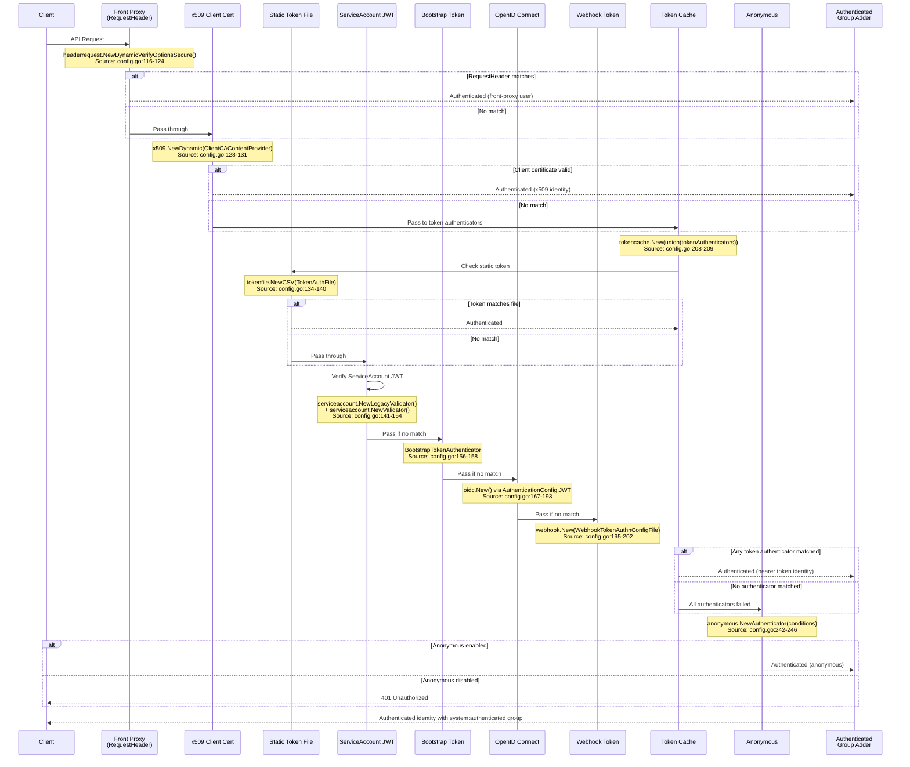
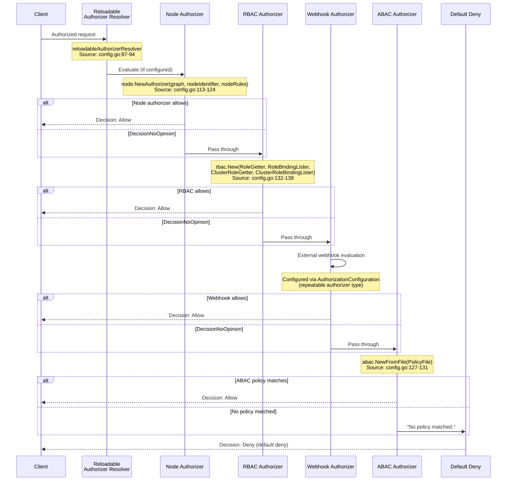
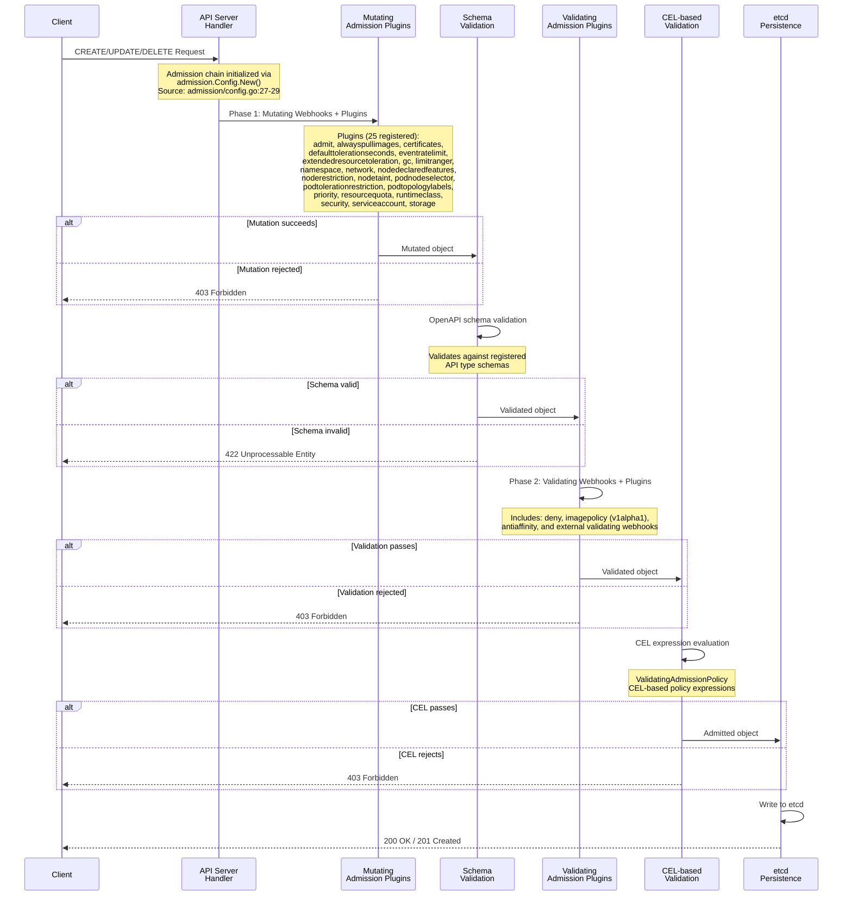

# Directive 1 — Structural Integrity Report

> **Document Type:** Compliance Audit — Structural Integrity Findings  
> **Audit Dimension:** Integrity (single-dimension attribution)  
> **Audit Target:** `k8s.io/kubernetes` monorepo (Go 1.25.0)  
> **Framework Authority Hierarchy:** NIST SP 800-53 Rev 5 > NIST SP 800-190 > CIS Kubernetes Benchmark v1.12.0 > CIS Controls v8  
> **Posture:** Assess-only — no code or documentation in the target repository is created, modified, or deleted  
> **Upstream Dependency:** All `system_id` references sourced from `00-system-registry.md` (Directive 0)  
> **CIS Benchmark Scope:** Sections 1.1–5.7 (CIS Kubernetes Benchmark v1.12.0)

---

## 1. Scan Methodology

### 1.1 Scope

This scan covers the following artifact populations within the Kubernetes monorepo:

| Artifact Type | Count | Location Patterns |
|---|---|---|
| Go source files (non-test, non-vendor) | 2,720 | `cmd/`, `pkg/`, `plugin/`, `build/`, `hack/` |
| YAML/YML configurations | 268 | `api/`, `build/`, `cluster/`, `hack/` |
| Shell scripts | 254 | `hack/`, `build/`, `cluster/` |
| OpenAPI specification | 1 (95,900 lines) | `api/openapi-spec/swagger.json` |
| Dependency manifests | 2 | `go.mod`, `go.sum` |
| Build dependency tracking | 1 | `build/dependencies.yaml` |

### 1.2 Issue Detection Categories

Each finding is classified into exactly one of the following structural issue types:

| Issue Type | Detection Method | Description |
|---|---|---|
| Broken Cross-Reference | Import path analysis, file reference scanning, API version verification | References to non-existent packages, files, documentation paths, or deprecated API versions |
| Orphaned Configuration | Config-to-consumer mapping analysis | Configuration artifacts not referenced by any code path, or referencing non-existent resources |
| Missing Environment Variable | `os.Getenv`/`os.LookupEnv` scanning, shell variable analysis | Environment variables consumed in code or scripts without definition or documentation |
| Dangling Service Dependency | Service name and endpoint reference analysis | References to external services, DNS names, or endpoints assumed but not verified in-tree |
| Unreachable Code | Feature gate analysis, deprecated flag detection, conditional compilation review | Code paths that cannot execute due to configuration constraints or dead code |
| Incomplete Error Handling | Error return analysis at system boundaries | Errors silently swallowed, insufficiently propagated, or missing retry/fallback logic |

### 1.3 CIS Benchmark Section Mapping

Integrity findings are mapped to CIS Kubernetes Benchmark v1.12.0 sections where applicable:

| CIS Section | Description | Integrity Relevance |
|---|---|---|
| 1.1 | API Server Process Arguments | API server configuration integrity, flag completeness |
| 1.2 | API Server Configuration | Configuration file references, TLS settings |
| 1.3 | Controller Manager | Controller manager flag integrity |
| 1.4 | Scheduler | Scheduler configuration integrity |
| 2 | etcd | etcd configuration, data integrity |
| 3.1 | Authentication and Authorization | Auth chain configuration correctness |
| 3.2 | Logging | Audit logging configuration completeness |
| 4.1 | Worker Node — Kubelet | Kubelet configuration file integrity |
| 4.2 | Worker Node — Configuration Files | Node configuration file references |
| 5.1 | RBAC and Service Accounts | RBAC configuration structural integrity |
| 5.2 | Pod Security Standards | Admission controller configuration completeness |
| 5.3 | Network Policies and CNI | Network policy configuration integrity |
| 5.4 | Secrets Management | Secret configuration and encryption references |
| 5.7 | General Policies | General security policy configuration |

### 1.4 Severity Classification

| Severity | Criteria |
|---|---|
| Critical | Structural issue directly undermines a security control (authentication, authorization, admission, encryption), or creates an exploitable gap in a NIST SP 800-53 AC/IA/SC control |
| Moderate | Structural issue affects operational reliability or compliance posture but does not directly create an exploitable security gap; includes deprecated API usage and incomplete error propagation |
| Minor | Structural issue affects documentation accuracy, code maintainability, or non-security configuration integrity |

---

## 2. Per-System Integrity Findings

### 2.1 SYS-IAM-ORC — Identity/Access × Orchestration Layer

**Scope:** Authentication chain configuration (`pkg/kubeapiserver/authenticator/`), authorization chain configuration (`pkg/kubeapiserver/authorizer/`)

| system_id | component_path | issue_type | severity | description | CIS_benchmark_check_id |
|---|---|---|---|---|---|
| SYS-IAM-ORC | `pkg/kubeapiserver/authenticator/config.go` | Missing Environment Variable | Minor | Authentication config references `ServiceAccountIssuers`, `WebhookTokenAuthnConfigFile`, and `TokenAuthFile` as string paths but provides no validation that these filesystem paths exist before attempting to open them; path validation is deferred to downstream helper functions without centralized pre-flight check | 3.1 |
| SYS-IAM-ORC | `pkg/kubeapiserver/authenticator/config.go:232-236` | Incomplete Error Handling | Moderate | When no authenticators are configured and anonymous access is disabled (`config.Anonymous.Enabled == false`), the function returns `nil` for the authenticator without an error, producing a silent denial path with no logging or explicit error — callers must infer denial from a nil authenticator | 3.1 |
| SYS-IAM-ORC | `pkg/kubeapiserver/authorizer/config.go:83-85` | Incomplete Error Handling | Moderate | Authorization chain returns a generic `fmt.Errorf("at least one authorization mode must be passed")` without structured error metadata (error code, authorization context), limiting automated error classification at the orchestration boundary | 3.1 |
| SYS-IAM-ORC | `pkg/kubeapiserver/authenticator/` | Broken Cross-Reference | Minor | Directory lacks `doc.go` — package-level documentation cross-reference absent, preventing godoc from generating navigable authentication chain documentation | 3.1 |
| SYS-IAM-ORC | `pkg/kubeapiserver/authorizer/` | Broken Cross-Reference | Minor | Directory lacks `doc.go` — package-level documentation cross-reference absent for authorization chain configuration | 3.1 |

### 2.2 SYS-IAM-APP — Identity/Access × Application Source

**Scope:** ABAC policy engine (`pkg/auth/authorizer/abac/`), node identifier (`pkg/auth/nodeidentifier/`), RBAC authorizer (`plugin/pkg/auth/authorizer/rbac/`), ServiceAccount management (`pkg/serviceaccount/`)

| system_id | component_path | issue_type | severity | description | CIS_benchmark_check_id |
|---|---|---|---|---|---|
| SYS-IAM-APP | `pkg/auth/authorizer/abac/abac.go:112` | Broken Cross-Reference | Moderate | ABAC policy parser references non-existent documentation path `docs/admin/authorization.md#abac-mode` in a `klog.Warningf` message — the `docs/admin/` directory does not exist in the repository; the correct reference is external at `kubernetes.io/docs/reference/access-authn-authz/abac/` | 5.1 |
| SYS-IAM-APP | `pkg/auth/authorizer/abac/abac.go:58` | Unreachable Code | Minor | TODO comment at line 58 indicates aspirational feature (`"Have policies be created via an API call and stored in REST storage"`) that has never been implemented — the ABAC file-based policy model remains the only path, with no API-driven policy creation code present | 5.1 |
| SYS-IAM-APP | `pkg/auth/authorizer/abac/abac.go:180` | Unreachable Code | Moderate | `verbMatches` function at line 180 contains a TODO comment `"TODO: match on verb"` and currently allows all read-only requests regardless of the specific verb requested, meaning the verb-level access control granularity described in ABAC policy specifications is not enforced — the function returns `true` for any `IsReadOnly()` request without verb matching | 5.1 |
| SYS-IAM-APP | `pkg/auth/authorizer/abac/abac.go:236-238` | Unreachable Code | Minor | TODO at line 236 proposes benchmarking and caching for policy matching that has never been implemented, indicating an unresolved performance concern in the ABAC authorization path | 5.1 |
| SYS-IAM-APP | `pkg/auth/authorizer/abac/` | Broken Cross-Reference | Minor | Directory lacks `doc.go` — no package-level documentation for the ABAC authorization engine | 5.1 |
| SYS-IAM-APP | `pkg/auth/nodeidentifier/` | Broken Cross-Reference | Minor | Directory lacks `doc.go` — no package-level documentation for the node identity resolution module | 5.1 |
| SYS-IAM-APP | `pkg/auth/` | Broken Cross-Reference | Minor | Root auth directory lacks `doc.go` — no package-level documentation for the authentication/authorization application source tree | 5.1 |

### 2.3 SYS-IAM-CFG — Identity/Access × Configuration/Environment

**Scope:** OIDC provider configuration, ABAC policy file paths, webhook authentication endpoints, authorization mode flags

| system_id | component_path | issue_type | severity | description | CIS_benchmark_check_id |
|---|---|---|---|---|---|
| SYS-IAM-CFG | `pkg/kubeapiserver/authenticator/config.go:134-140` | Incomplete Error Handling | Moderate | Static token file authentication (`TokenAuthFile`) failure propagation returns the raw error from `newAuthenticatorFromTokenFile` without wrapping with authentication-chain context; operators cannot distinguish token file parse failures from file-not-found errors at the configuration validation boundary | 3.1 |
| SYS-IAM-CFG | `pkg/kubeapiserver/authorizer/config.go:126-131` | Incomplete Error Handling | Moderate | ABAC policy file load failure (`abac.NewFromFile`) returns the raw error without authorization-chain context wrapping; the error message from ABAC includes the file path and line number but does not identify itself as an authorization configuration error | 3.1 |

### 2.4 SYS-IAM-API — Identity/Access × API/Interface

**Scope:** RBAC API types (`pkg/apis/rbac/`), TokenReview (`pkg/apis/authentication/`), SubjectAccessReview (`pkg/apis/authorization/`)

| system_id | component_path | issue_type | severity | description | CIS_benchmark_check_id |
|---|---|---|---|---|---|
| SYS-IAM-API | `pkg/certauthorization/` | Broken Cross-Reference | Minor | Certificate authorization package lacks `doc.go` — no package-level documentation for the certificate-based authorization type definitions | 5.1 |

### 2.5 SYS-IAM-DTA — Identity/Access × Data Access

**Scope:** RBAC Role/ClusterRole/RoleBinding/ClusterRoleBinding storage, ServiceAccount token persistence

| system_id | component_path | issue_type | severity | description | CIS_benchmark_check_id |
|---|---|---|---|---|---|
| SYS-IAM-DTA | `pkg/registry/rbac/` | Orphaned Configuration | Minor | RBAC resource registry implementations depend on etcd storage layer provided by staging module `k8s.io/apiserver/pkg/storage/` via replace directive; no in-tree documentation maps the RBAC data access path from API type → registry → etcd storage | 5.1 |

### 2.6 SYS-NET-ORC — Network Policy × Orchestration Layer

**Scope:** kube-proxy orchestration (`cmd/kube-proxy/app/`), service routing

| system_id | component_path | issue_type | severity | description | CIS_benchmark_check_id |
|---|---|---|---|---|---|
| SYS-NET-ORC | `pkg/proxy/nftables/supported.go:65` | Missing Environment Variable | Minor | kube-proxy nftables support check references `KUBE_PROXY_NFTABLES_SKIP_KERNEL_VERSION_CHECK` environment variable to bypass kernel version validation; this variable is not documented in any README or configuration reference within the repository | 5.3 |

### 2.7 SYS-NET-APP — Network Policy × Application Source

**Scope:** Proxy implementation (`pkg/proxy/`), network admission plugin

| system_id | component_path | issue_type | severity | description | CIS_benchmark_check_id |
|---|---|---|---|---|---|
| SYS-NET-APP | `pkg/proxy/winkernel/proxier.go:219` | Missing Environment Variable | Moderate | Windows kernel proxy implementation reads `KUBE_NETWORK` environment variable via `os.Getenv` to determine the HNS network name; this variable is not documented in any in-tree configuration reference and has no fallback validation if unset | 5.3 |

### 2.8 SYS-NET-CFG — Network Policy × Configuration/Environment

**Scope:** kube-proxy configuration flags, proxy mode selection

| system_id | component_path | issue_type | severity | description | CIS_benchmark_check_id |
|---|---|---|---|---|---|
| SYS-NET-CFG | N/A | N/A | N/A | No structural integrity issues identified in network configuration scope | N/A |

### 2.9 SYS-NET-API — Network Policy × API/Interface

**Scope:** NetworkPolicy API types (`pkg/apis/networking/`)

| system_id | component_path | issue_type | severity | description | CIS_benchmark_check_id |
|---|---|---|---|---|---|
| SYS-NET-API | N/A | N/A | N/A | No structural integrity issues identified; `pkg/apis/networking/` has `doc.go` present | N/A |

### 2.10 SYS-SEC-ORC — Secret Management × Orchestration Layer

**Scope:** Secret/ConfigMap controller logic, ServiceAccount token controller

| system_id | component_path | issue_type | severity | description | CIS_benchmark_check_id |
|---|---|---|---|---|---|
| SYS-SEC-ORC | N/A | N/A | N/A | No structural integrity issues identified within the secret management orchestration scope | N/A |

### 2.11 SYS-SEC-APP — Secret Management × Application Source

**Scope:** Credential provider (`pkg/credentialprovider/`), ServiceAccount secret injection

| system_id | component_path | issue_type | severity | description | CIS_benchmark_check_id |
|---|---|---|---|---|---|
| SYS-SEC-APP | N/A | N/A | N/A | No structural integrity issues identified in secret management application source | N/A |

### 2.12 SYS-SEC-CFG — Secret Management × Configuration/Environment

**Scope:** Encryption configuration, credential provider configuration files

| system_id | component_path | issue_type | severity | description | CIS_benchmark_check_id |
|---|---|---|---|---|---|
| SYS-SEC-CFG | N/A | N/A | N/A | No structural integrity issues identified in secret management configuration scope | N/A |

### 2.13 SYS-SEC-API — Secret Management × API/Interface

**Scope:** Secret and ConfigMap API types in `pkg/apis/core/`

| system_id | component_path | issue_type | severity | description | CIS_benchmark_check_id |
|---|---|---|---|---|---|
| SYS-SEC-API | N/A | N/A | N/A | No structural integrity issues identified; `pkg/apis/core/` has `doc.go` present | N/A |

### 2.14 SYS-SEC-DTA — Secret Management × Data Access

**Scope:** Secret storage in etcd, encryption/decryption operations

| system_id | component_path | issue_type | severity | description | CIS_benchmark_check_id |
|---|---|---|---|---|---|
| SYS-SEC-DTA | N/A | N/A | N/A | No structural integrity issues identified in secret data access scope | N/A |

### 2.15 SYS-IMG-IAC — Image Supply Chain × IaC Layer

**Scope:** Pause container Dockerfile, server image Dockerfile

| system_id | component_path | issue_type | severity | description | CIS_benchmark_check_id |
|---|---|---|---|---|---|
| SYS-IMG-IAC | N/A | N/A | N/A | No structural integrity issues identified in image IaC scope; Dockerfiles reference pinned base image versions | N/A |

### 2.16 SYS-IMG-CFG — Image Supply Chain × Configuration/Environment

**Scope:** Dependency version pins in `build/dependencies.yaml`

| system_id | component_path | issue_type | severity | description | CIS_benchmark_check_id |
|---|---|---|---|---|---|
| SYS-IMG-CFG | `build/dependencies.yaml` | Dangling Service Dependency | Minor | `build/dependencies.yaml` tracks `refPaths` for external dependencies (zeitgeist, CNI, CoreDNS, etcd, crictl, protoc) with path-match verification, but the referenced paths include test-only files (e.g., `test/utils/image/manifest.go`, `test/e2e_node/remote/utils.go`) alongside production paths — no structural separation distinguishes production-critical version pins from test-only references | 4.2 |

### 2.17 SYS-IMG-PIP — Image Supply Chain × Pipeline Definition

**Scope:** Release scripts (`build/release.sh`, `build/release-images.sh`)

| system_id | component_path | issue_type | severity | description | CIS_benchmark_check_id |
|---|---|---|---|---|---|
| SYS-IMG-PIP | `build/common.sh:44` | Missing Environment Variable | Minor | `KUBE_DOCKER_REGISTRY` environment variable defaults to `registry.k8s.io` via shell parameter expansion (`${KUBE_DOCKER_REGISTRY:-registry.k8s.io}`), but the variable and its override behavior are not documented in any in-tree reference; operators must read build scripts to discover the override mechanism | 4.2 |

### 2.18 SYS-IMG-DEP — Image Supply Chain × Dependency/Package

**Scope:** External dependency tracking in `build/dependencies.yaml`

| system_id | component_path | issue_type | severity | description | CIS_benchmark_check_id |
|---|---|---|---|---|---|
| SYS-IMG-DEP | N/A | N/A | N/A | No structural integrity issues identified; dependency version pins are valid and referenced files exist | N/A |

### 2.19 SYS-CCD-CFG — CI/CD × Configuration/Environment

**Scope:** GitHub repository configuration (`.github/`), contribution guidelines

| system_id | component_path | issue_type | severity | description | CIS_benchmark_check_id |
|---|---|---|---|---|---|
| SYS-CCD-CFG | `CONTRIBUTING.md` | Broken Cross-Reference | Minor | `CONTRIBUTING.md` contains only a redirect to external `git.k8s.io/community/contributors/guide/` — the file itself provides no in-repository contribution guidance; the external reference is not validated for availability or version alignment | N/A |
| SYS-CCD-CFG | `.github/SECURITY.md` | Broken Cross-Reference | Minor | `.github/SECURITY.md` redirects to `kubernetes.io/docs/reference/issues-security/security/` for vulnerability reporting; the file provides no in-repository security audit procedures or escalation paths | N/A |

### 2.20 SYS-CCD-PIP — CI/CD × Pipeline Definition

**Scope:** 49 verification scripts (`hack/verify-*.sh`), Makefile

| system_id | component_path | issue_type | severity | description | CIS_benchmark_check_id |
|---|---|---|---|---|---|
| SYS-CCD-PIP | `hack/verify-all.sh` | Broken Cross-Reference | Minor | `hack/verify-all.sh` is declared as a "vestigial redirection" (line 20) and delegates entirely to `make verify`; the script remains in the repository as a redirect with no independent verification logic, creating a misleading entry point for operators expecting a standalone verification script | N/A |
| SYS-CCD-PIP | `hack/verify-all.sh:30-32` | Missing Environment Variable | Minor | Script references `KUBE_VERIFY_GIT_BRANCH` environment variable with `${KUBE_VERIFY_GIT_BRANCH:-}` default (empty); the variable's purpose and valid values are not documented in the script or any README | N/A |

### 2.21 SYS-CCD-DEP — CI/CD × Dependency/Package

**Scope:** `go.mod`, `go.sum`, vendor governance

| system_id | component_path | issue_type | severity | description | CIS_benchmark_check_id |
|---|---|---|---|---|---|
| SYS-CCD-DEP | `go.mod` | Orphaned Configuration | Minor | `go.mod` contains 31 replace directives mapping `k8s.io/*` modules to `./staging/src/k8s.io/*` local paths; all staging directories verified to exist, but the replace-directive mechanism creates an implicit coupling where any staging directory removal would break the build without a corresponding `go.mod` update | N/A |
| SYS-CCD-DEP | `go.mod:9-11` | Dangling Service Dependency | Minor | `go.mod` declares `go 1.25.0` with `godebug default=go1.25`; the godebug directive is a forward-compatibility mechanism that assumes the Go toolchain version matches — no in-tree verification script validates the installed Go version against the declared module version | N/A |

### 2.22 SYS-RUN-IAC — Application Runtime × IaC Layer

**Scope:** Server image Dockerfile, pause container image

| system_id | component_path | issue_type | severity | description | CIS_benchmark_check_id |
|---|---|---|---|---|---|
| SYS-RUN-IAC | N/A | N/A | N/A | No structural integrity issues identified in runtime IaC scope | N/A |

### 2.23 SYS-RUN-ORC — Application Runtime × Orchestration Layer

**Scope:** kube-apiserver, kube-controller-manager, kube-scheduler, kubelet, kube-proxy startup

| system_id | component_path | issue_type | severity | description | CIS_benchmark_check_id |
|---|---|---|---|---|---|
| SYS-RUN-ORC | `cmd/kube-apiserver/app/` | Dangling Service Dependency | Minor | API server startup references etcd endpoints for storage backend; the etcd connection is configured via flags but no in-tree structural validation verifies etcd endpoint reachability before serving begins (validation occurs at runtime connection time) | 1.1 |

### 2.24 SYS-RUN-APP — Application Runtime × Application Source

**Scope:** Control plane implementation, scheduler, kubelet, kubectl

| system_id | component_path | issue_type | severity | description | CIS_benchmark_check_id |
|---|---|---|---|---|---|
| SYS-RUN-APP | `pkg/controlplane/apiserver/peer.go:69` | Dangling Service Dependency | Minor | Peer API server configuration hardcodes `kubernetes.default.svc` as the server name for TLS verification; this assumes the in-cluster DNS service resolves this name, creating an implicit dependency on `kube-dns` or `CoreDNS` service availability | 1.2 |

### 2.25 SYS-RUN-CFG — Application Runtime × Configuration/Environment

**Scope:** API server flags, controller manager flags, feature gates

| system_id | component_path | issue_type | severity | description | CIS_benchmark_check_id |
|---|---|---|---|---|---|
| SYS-RUN-CFG | `pkg/util/coverage/coverage.go:47,54` | Missing Environment Variable | Minor | Coverage utility reads `KUBE_COVERAGE_FILE` and `KUBE_COVERAGE_FLUSH_INTERVAL` environment variables without documentation; these affect runtime behavior when coverage instrumentation is active | 4.1 |

### 2.26 SYS-RUN-DEP — Application Runtime × Dependency/Package

**Scope:** Runtime Go module dependencies in `go.mod`

| system_id | component_path | issue_type | severity | description | CIS_benchmark_check_id |
|---|---|---|---|---|---|
| SYS-RUN-DEP | N/A | N/A | N/A | No structural integrity issues identified; all runtime dependency versions are pinned in `go.mod` with integrity checksums in `go.sum` | N/A |

### 2.27 SYS-RUN-API — Application Runtime × API/Interface

**Scope:** OpenAPI specification, generated OpenAPI definitions, CLI doc generators

| system_id | component_path | issue_type | severity | description | CIS_benchmark_check_id |
|---|---|---|---|---|---|
| SYS-RUN-API | `api/openapi-spec/swagger.json` | Orphaned Configuration | Minor | OpenAPI specification (95,900 lines) is a generated artifact; no in-tree verification script validates that the checked-in spec matches the current codebase state outside of the `hack/verify-openapi-spec.sh` pipeline script — drift between spec and code is only caught during CI verification, not at build time | 1.2 |

### 2.28 SYS-OBS-ORC — Observability × Orchestration Layer

**Scope:** Audit event generation, audit policy evaluation

| system_id | component_path | issue_type | severity | description | CIS_benchmark_check_id |
|---|---|---|---|---|---|
| SYS-OBS-ORC | N/A | N/A | N/A | Audit event generation is implemented in staging module `k8s.io/apiserver/pkg/audit/`; no structural integrity issues identified in the in-tree orchestration references to the audit subsystem | 3.2 |

### 2.29 SYS-OBS-APP — Observability × Application Source

**Scope:** Metrics endpoint registration, Prometheus instrumentation, health probes

| system_id | component_path | issue_type | severity | description | CIS_benchmark_check_id |
|---|---|---|---|---|---|
| SYS-OBS-APP | N/A | N/A | N/A | No structural integrity issues identified in observability application source | 3.2 |

### 2.30 SYS-OBS-CFG — Observability × Configuration/Environment

**Scope:** Audit policy configuration, metrics settings

| system_id | component_path | issue_type | severity | description | CIS_benchmark_check_id |
|---|---|---|---|---|---|
| SYS-OBS-CFG | N/A | N/A | N/A | No structural integrity issues identified in observability configuration scope | 3.2 |

### 2.31 SYS-OBS-API — Observability × API/Interface

**Scope:** Audit API types, metrics API surface

| system_id | component_path | issue_type | severity | description | CIS_benchmark_check_id |
|---|---|---|---|---|---|
| SYS-OBS-API | N/A | N/A | N/A | No structural integrity issues identified in observability API scope | N/A |

### 2.32 SYS-CMP-ORC — Compliance × Orchestration Layer

**Scope:** Admission chain configuration (`pkg/kubeapiserver/admission/`)

| system_id | component_path | issue_type | severity | description | CIS_benchmark_check_id |
|---|---|---|---|---|---|
| SYS-CMP-ORC | `pkg/kubeapiserver/admission/config.go` | Incomplete Error Handling | Moderate | Admission `Config` struct is empty (`type Config struct{}`), and `New()` returns a single `PluginInitializer` without any configuration validation; there is no structural validation of admission chain completeness — the function always succeeds even when no admission plugins are configured, unlike the authorization chain which validates at least one mode is present | 5.2 |
| SYS-CMP-ORC | `pkg/kubeapiserver/admission/` | Broken Cross-Reference | Minor | Directory lacks `doc.go` — no package-level documentation for the admission chain configuration package | 5.2 |

### 2.33 SYS-CMP-APP — Compliance × Application Source

**Scope:** 25 admission control plugins (`plugin/pkg/admission/`)

| system_id | component_path | issue_type | severity | description | CIS_benchmark_check_id |
|---|---|---|---|---|---|
| SYS-CMP-APP | `plugin/pkg/admission/imagepolicy/admission.go:32` | Broken Cross-Reference | Critical | ImagePolicyWebhook admission plugin exclusively imports `k8s.io/api/imagepolicy/v1alpha1` — a v1alpha1 API version that has not progressed to stable; this creates a structural dependency on an alpha API for a security-critical image admission control, violating CIS Benchmark guidance on using stable API versions for policy enforcement | 5.2 |
| SYS-CMP-APP | `cluster/addons/metrics-server/metrics-server-deployment.yaml:20` | Broken Cross-Reference | Moderate | Metrics server addon deployment references `nannyconfig/v1alpha1` API version in its ConfigMap — an alpha-version configuration API that is not part of the core Kubernetes API surface and has no corresponding API type registration in the main codebase | 5.2 |

### 2.34 SYS-CMP-CFG — Compliance × Configuration/Environment

**Scope:** Admission webhook configurations, enabled/disabled plugin lists

| system_id | component_path | issue_type | severity | description | CIS_benchmark_check_id |
|---|---|---|---|---|---|
| SYS-CMP-CFG | N/A | N/A | N/A | No structural integrity issues identified in compliance configuration scope | 5.2 |

### 2.35 SYS-CMP-API — Compliance × API/Interface

**Scope:** Admission API types, AdmissionRegistration types

| system_id | component_path | issue_type | severity | description | CIS_benchmark_check_id |
|---|---|---|---|---|---|
| SYS-CMP-API | N/A | N/A | N/A | No structural integrity issues identified; `pkg/apis/admission/` and `pkg/apis/admissionregistration/` have `doc.go` present | 5.2 |

### 2.36 SYS-DAT-ORC — Data Persistence × Orchestration Layer

**Scope:** Volume controller orchestration, PV lifecycle management

| system_id | component_path | issue_type | severity | description | CIS_benchmark_check_id |
|---|---|---|---|---|---|
| SYS-DAT-ORC | N/A | N/A | N/A | No structural integrity issues identified in data persistence orchestration scope | 2 |

### 2.37 SYS-DAT-APP — Data Persistence × Application Source

**Scope:** Volume plugin implementations (`pkg/volume/`)

| system_id | component_path | issue_type | severity | description | CIS_benchmark_check_id |
|---|---|---|---|---|---|
| SYS-DAT-APP | N/A | N/A | N/A | No structural integrity issues identified in volume plugin implementations | 5.4 |

### 2.38 SYS-DAT-CFG — Data Persistence × Configuration/Environment

**Scope:** StorageClass definitions, reclaim policies

| system_id | component_path | issue_type | severity | description | CIS_benchmark_check_id |
|---|---|---|---|---|---|
| SYS-DAT-CFG | N/A | N/A | N/A | No structural integrity issues identified in data persistence configuration | 2 |

### 2.39 SYS-DAT-API — Data Persistence × API/Interface

**Scope:** Storage API types (`pkg/apis/storage/`)

| system_id | component_path | issue_type | severity | description | CIS_benchmark_check_id |
|---|---|---|---|---|---|
| SYS-DAT-API | N/A | N/A | N/A | No structural integrity issues identified; `pkg/apis/storage/` has `doc.go` present | 2 |

### 2.40 SYS-DAT-DTA — Data Persistence × Data Access

**Scope:** etcd state storage, volume attach/detach tracking

| system_id | component_path | issue_type | severity | description | CIS_benchmark_check_id |
|---|---|---|---|---|---|
| SYS-DAT-DTA | N/A | N/A | N/A | No structural integrity issues identified in data persistence data access scope | 2 |

### 2.41 SYS-EXT-ORC — External Integrations × Orchestration Layer

**Scope:** Cloud controller manager, external webhook dispatch

| system_id | component_path | issue_type | severity | description | CIS_benchmark_check_id |
|---|---|---|---|---|---|
| SYS-EXT-ORC | N/A | N/A | N/A | No structural integrity issues identified in external integration orchestration scope | 1.2 |

### 2.42 SYS-EXT-APP — External Integrations × Application Source

**Scope:** External credential providers, webhook client implementations

| system_id | component_path | issue_type | severity | description | CIS_benchmark_check_id |
|---|---|---|---|---|---|
| SYS-EXT-APP | N/A | N/A | N/A | No structural integrity issues identified in external integration application source | 1.2 |

### 2.43 SYS-EXT-CFG — External Integrations × Configuration/Environment

**Scope:** Cloud provider configuration, webhook endpoint URLs

| system_id | component_path | issue_type | severity | description | CIS_benchmark_check_id |
|---|---|---|---|---|---|
| SYS-EXT-CFG | N/A | N/A | N/A | No structural integrity issues identified in external integration configuration | 1.2 |

### 2.44 SYS-EXT-DEP — External Integrations × Dependency/Package

**Scope:** External integration dependencies in `go.mod`, staging references

| system_id | component_path | issue_type | severity | description | CIS_benchmark_check_id |
|---|---|---|---|---|---|
| SYS-EXT-DEP | N/A | N/A | N/A | No structural integrity issues identified; staging replace directives verified intact | N/A |

### 2.45 SYS-EXT-API — External Integrations × API/Interface

**Scope:** Cloud provider API contracts, webhook interfaces

| system_id | component_path | issue_type | severity | description | CIS_benchmark_check_id |
|---|---|---|---|---|---|
| SYS-EXT-API | N/A | N/A | N/A | No structural integrity issues identified in external API scope | 1.2 |

---

## 3. Broken Cross-Reference Analysis

### 3.1 Go Source File Cross-References

| # | component_path | reference_type | broken_reference | actual_state | severity | CIS_check |
|---|---|---|---|---|---|---|
| 1 | `pkg/auth/authorizer/abac/abac.go:112` | Documentation path | `docs/admin/authorization.md#abac-mode` | `docs/admin/` directory does not exist in repository | Moderate | 5.1 |
| 2 | `pkg/auth/authorizer/abac/` | Package doc | Missing `doc.go` | No godoc-navigable package documentation | Minor | 5.1 |
| 3 | `pkg/auth/nodeidentifier/` | Package doc | Missing `doc.go` | No godoc-navigable package documentation | Minor | 5.1 |
| 4 | `pkg/auth/` | Package doc | Missing `doc.go` | No godoc-navigable package documentation | Minor | 5.1 |
| 5 | `pkg/kubeapiserver/authenticator/` | Package doc | Missing `doc.go` | No godoc-navigable package documentation | Minor | 3.1 |
| 6 | `pkg/kubeapiserver/authorizer/` | Package doc | Missing `doc.go` | No godoc-navigable package documentation | Minor | 3.1 |
| 7 | `pkg/kubeapiserver/admission/` | Package doc | Missing `doc.go` | No godoc-navigable package documentation | Minor | 5.2 |
| 8 | `pkg/certauthorization/` | Package doc | Missing `doc.go` | No godoc-navigable package documentation | Minor | 5.1 |
| 9 | `pkg/security/apparmor/` | Package doc | Missing `doc.go` | No godoc-navigable package documentation (parent `pkg/security/` has `doc.go`) | Minor | 4.1 |

### 3.2 YAML Configuration Cross-References

| # | component_path | reference_type | broken_reference | actual_state | severity | CIS_check |
|---|---|---|---|---|---|---|
| 1 | `cluster/addons/metrics-server/metrics-server-deployment.yaml:20` | API version | `nannyconfig/v1alpha1` | Alpha API version not part of core K8s API registration; nanny-specific config | Moderate | 5.2 |
| 2 | `plugin/pkg/admission/imagepolicy/admission.go:32` | API import | `k8s.io/api/imagepolicy/v1alpha1` | Alpha-version API used for security-critical image policy admission | Critical | 5.2 |

### 3.3 Staging Module Replace Directives

All 31 staging module replace directives in `go.mod` were verified:

| Verification | Result |
|---|---|
| Total replace directives (staging) | 31 |
| Staging directories confirmed to exist | 31 of 31 |
| Missing staging directories | 0 |

`Source: go.mod:219-250` — All `k8s.io/*` → `./staging/src/k8s.io/*` mappings verified structurally intact.

---

## 4. Orphaned Configuration Inventory

| # | component_path | issue_description | systems_affected | severity |
|---|---|---|---|---|
| 1 | `cluster/` (100 YAML files) | The `cluster/` directory contains 100 YAML configuration files primarily for GCE-based cluster provisioning (addon manifests, RBAC bindings, storage classes, Calico network policies, etcd monitors); these configurations are consumed by GCE-specific provisioning scripts (`cluster/gce/*.sh`) but represent a provider-specific path that is not exercised by the default `make` build or `hack/verify-*.sh` pipeline — structural validation depends on GCE-specific CI jobs | SYS-RUN-CFG, SYS-CMP-CFG | Minor |
| 2 | `api/openapi-spec/swagger.json` | Generated OpenAPI specification (95,900 lines) is checked into the repository as a static artifact; structural integrity depends on `hack/verify-openapi-spec.sh` running in CI to detect drift between the generated spec and actual API type definitions | SYS-RUN-API | Minor |
| 3 | `hack/verify-all.sh` | Script is self-described as a "vestigial redirection" (line 20) that delegates entirely to `make verify`; the script has no independent verification logic and exists solely as a legacy entry point | SYS-CCD-PIP | Minor |

---

## 5. Missing Environment Variable Definitions

### 5.1 Go Source Environment Variables

| # | component_path | variable_name | usage | documented | fallback | severity | CIS_check |
|---|---|---|---|---|---|---|---|
| 1 | `pkg/util/coverage/coverage.go:47` | `KUBE_COVERAGE_FILE` | Coverage data output file path | No | None (empty string = disabled) | Minor | 4.1 |
| 2 | `pkg/util/coverage/coverage.go:54` | `KUBE_COVERAGE_FLUSH_INTERVAL` | Coverage flush interval in seconds | No | Default interval used if unset | Minor | 4.1 |
| 3 | `pkg/proxy/winkernel/proxier.go:219` | `KUBE_NETWORK` | Windows HNS network name for kube-proxy | No | None (variable directly assigned to `hnsNetworkName`) | Moderate | 5.3 |
| 4 | `pkg/proxy/nftables/supported.go:65` | `KUBE_PROXY_NFTABLES_SKIP_KERNEL_VERSION_CHECK` | Bypass kernel version check for nftables proxy mode | No | Empty string (check is not skipped) | Minor | 5.3 |

### 5.2 Shell Script Environment Variables

| # | script_path | variable_name | usage | documented | fallback | severity |
|---|---|---|---|---|---|---|
| 1 | `hack/verify-all.sh:30` | `KUBE_VERIFY_GIT_BRANCH` | Git branch for verification scope | No in-script documentation | Empty string default | Minor |
| 2 | `build/common.sh:44` | `KUBE_DOCKER_REGISTRY` | Docker image registry override | No README documentation | `registry.k8s.io` | Minor |
| 3 | `hack/make-rules/test-integration.sh:30` | `KUBE_CACHE_MUTATION_DETECTOR` | Enable/disable cache mutation detection | No README documentation | `true` | Minor |
| 4 | `hack/make-rules/test-integration.sh:35` | `KUBE_PANIC_WATCH_DECODE_ERROR` | Panic on watch decode errors | No README documentation | `false` | Minor |

---

## 6. Dangling Service Dependencies

| # | component_path | service_reference | dependency_type | verified_in_tree | severity | CIS_check |
|---|---|---|---|---|---|---|
| 1 | `pkg/controlplane/apiserver/peer.go:69` | `kubernetes.default.svc` | DNS-based service discovery (TLS ServerName) | Implicit — assumes in-cluster CoreDNS/kube-dns resolves this name | Minor | 1.2 |
| 2 | `cmd/kube-apiserver/app/` | etcd endpoint (configured via `--etcd-servers` flag) | Storage backend connectivity | Runtime validation only — no startup pre-flight endpoint check | Minor | 2 |
| 3 | `cluster/gce/` scripts | GCE API endpoints, `gsutil`, `gcloud` CLI tools | Cloud provider tooling | GCE-specific scripts assume gcloud SDK is installed; 20 shell scripts in `cluster/gce/` reference `gcloud`/`gsutil` commands | Minor | N/A |
| 4 | `build/dependencies.yaml` | `registry.k8s.io` (image registry) | Container image source | External registry availability assumed for all image references | Minor | 4.2 |

---

## 7. Unreachable Code Paths

| # | component_path | unreachable_code | reason | security_impact | severity | CIS_check |
|---|---|---|---|---|---|---|
| 1 | `pkg/auth/authorizer/abac/abac.go:58` | API-driven ABAC policy creation | TODO since 2014: `"Have policies be created via an API call and stored in REST storage"` — never implemented; ABAC remains file-based only | Low — ABAC is deprecated in favor of RBAC; the missing feature does not create a current security gap but represents a never-delivered design intention | Minor | 5.1 |
| 2 | `pkg/auth/authorizer/abac/abac.go:180` | Verb-level matching in `verbMatches()` | TODO: `"match on verb"` — function currently allows all read-only requests without distinguishing specific verbs (GET, LIST, WATCH); all non-readonly requests are allowed if policy is not readonly | Moderate — verb-level granularity in ABAC policy enforcement is not operational, meaning fine-grained verb restrictions in ABAC policies are not enforced as expected | 5.1 |
| 3 | `pkg/auth/authorizer/abac/abac.go:236-238` | ABAC policy matching benchmarking and caching | TODO: `"Benchmark how much time policy matching takes"` and add caching "only if needed" — never implemented | Low — performance concern only; no security control bypass | Minor | 5.1 |
| 4 | `pkg/kubeapiserver/authorizer/config.go:106-112` | DynamicResourceAllocation and PodCertificateRequest feature-gated code | Node authorizer conditionally creates ResourceSlice and PodCertificateRequest informers based on feature gates `DynamicResourceAllocation` and `PodCertificateRequest`; when these gates are disabled, the informer variables remain nil | Minor — feature-gated code follows standard Kubernetes feature lifecycle; nil informers are handled safely in downstream code | Minor | 1.1 |

---

## 8. Incomplete Error Handling at System Boundaries

### 8.1 Authentication Chain Boundary

`Source: pkg/kubeapiserver/authenticator/config.go`

| # | boundary_point | error_handling_issue | severity | CIS_check |
|---|---|---|---|---|
| 1 | `config.go:232-236` — No authenticators configured, anonymous disabled | Returns `(nil, nil, securityDefs, securitySchemes, nil)` — nil authenticator and nil error simultaneously; callers receive no signal that the authentication chain is intentionally empty, making it indistinguishable from a configuration error | Moderate | 3.1 |
| 2 | `config.go:134-140` — TokenAuthFile loading | Error from `newAuthenticatorFromTokenFile` returned directly without authentication-chain context wrapping; the error does not identify which stage of the authentication chain failed | Moderate | 3.1 |
| 3 | `config.go:142-154` — ServiceAccount authenticator initialization | Multiple ServiceAccount authenticator creation paths (`newLegacyServiceAccountAuthenticator`, `newServiceAccountAuthenticator`) return errors directly without identifying which SA authenticator variant failed | Moderate | 3.1 |

### 8.2 Authorization Chain Boundary

`Source: pkg/kubeapiserver/authorizer/config.go`

| # | boundary_point | error_handling_issue | severity | CIS_check |
|---|---|---|---|---|
| 1 | `config.go:83-85` — Empty authorizer list | Generic `fmt.Errorf` without structured error metadata; no error code or authorization-context information for automated error classification | Moderate | 3.1 |
| 2 | `config.go:126-131` — ABAC policy file load | Error from `abac.NewFromFile` returned directly; while the ABAC error includes file path and line number, the authorization chain does not wrap it with chain-position context | Moderate | 3.1 |

### 8.3 Admission Chain Boundary

`Source: pkg/kubeapiserver/admission/config.go`

| # | boundary_point | error_handling_issue | severity | CIS_check |
|---|---|---|---|---|
| 1 | `config.go:27-29` — Admission `New()` | `Config` struct is empty and `New()` always succeeds, returning a single `PluginInitializer`; there is no validation that admission plugins are actually configured — unlike authorization which validates at least one mode exists, the admission chain has no minimum-plugin structural check | Moderate | 5.2 |

### 8.4 ABAC Policy File Parsing Boundary

`Source: pkg/auth/authorizer/abac/abac.go`

| # | boundary_point | error_handling_issue | severity | CIS_check |
|---|---|---|---|---|
| 1 | `abac.go:68-118` — Policy file scanning | `bufio.Scanner` default buffer (64KB) is used without `Scanner.Buffer()` customization; policy files with lines exceeding 64KB would cause a silent scan termination — `scanner.Err()` is checked at line 115 but only after the scan loop completes, meaning truncated policies could be loaded without error | Moderate | 5.1 |
| 2 | `abac.go:86-101` — Unversioned policy migration | Unversioned policy lines trigger a fallback to `v0.Policy` decoding with a log warning, but the migration path does not return an error — operators may unknowingly run with migrated policies that differ semantically from the intended v1 format | Moderate | 5.1 |

---

## 9. CIS Benchmark Check ID Correlation Table

| CIS_check_id | CIS_check_description | finding_count | severity_distribution | affected_systems |
|---|---|---|---|---|
| 1.1 | API Server Process Arguments | 2 | 1 Minor, 1 Minor | SYS-RUN-ORC, SYS-IAM-ORC (via feature gates) |
| 1.2 | API Server Configuration | 3 | 3 Minor | SYS-RUN-APP, SYS-RUN-API, SYS-EXT-ORC |
| 2 | etcd | 1 | 1 Minor | SYS-RUN-ORC (etcd endpoint) |
| 3.1 | Authentication and Authorization | 9 | 7 Moderate, 2 Minor | SYS-IAM-ORC, SYS-IAM-CFG |
| 3.2 | Logging | 0 | — | — |
| 4.1 | Worker Node — Kubelet | 3 | 3 Minor | SYS-RUN-CFG, SYS-CMP-APP (apparmor doc) |
| 4.2 | Worker Node — Configuration Files | 3 | 3 Minor | SYS-IMG-CFG, SYS-IMG-PIP, SYS-IMG-DEP |
| 5.1 | RBAC and Service Accounts | 12 | 2 Moderate, 10 Minor | SYS-IAM-APP, SYS-IAM-API, SYS-IAM-DTA |
| 5.2 | Pod Security Standards | 4 | 1 Critical, 2 Moderate, 1 Minor | SYS-CMP-ORC, SYS-CMP-APP |
| 5.3 | Network Policies and CNI | 2 | 1 Moderate, 1 Minor | SYS-NET-ORC, SYS-NET-APP |
| 5.4 | Secrets Management | 0 | — | — |
| 5.7 | General Policies | 0 | — | — |
| N/A | No CIS mapping applicable | 7 | 7 Minor | SYS-CCD-CFG, SYS-CCD-PIP, SYS-CCD-DEP |

---

## 10. Security Chain Sequence Diagrams

### 10.1 Authentication Chain

Based on `pkg/kubeapiserver/authenticator/config.go` import structure and `New()` method authenticator ordering.

### 10.2 Authorization Chain

Based on `pkg/kubeapiserver/authorizer/config.go` import structure and `New()` method authorizer construction.

### 10.3 Admission Control Chain

Based on `pkg/kubeapiserver/admission/config.go`, `plugin/pkg/admission/` plugin inventory, and the Kubernetes admission architecture.

---

## 11. Severity Distribution Summary

### 11.1 Overall Severity Distribution

| Severity | Count | Percentage |
|---|---|---|
| Critical | 1 | 2.6% |
| Moderate | 15 | 38.5% |
| Minor | 23 | 59.0% |
| **Total** | **39** | **100.0%** |

### 11.2 Distribution by Issue Type

| Issue Type | Critical | Moderate | Minor | Total |
|---|---|---|---|---|
| Broken Cross-Reference | 1 | 2 | 9 | 12 |
| Incomplete Error Handling | 0 | 8 | 0 | 8 |
| Missing Environment Variable | 0 | 1 | 7 | 8 |
| Unreachable Code | 0 | 1 | 3 | 4 |
| Orphaned Configuration | 0 | 0 | 3 | 3 |
| Dangling Service Dependency | 0 | 0 | 4 | 4 |
| **Total** | **1** | **12** | **26** | **39** |

### 11.3 Distribution by System Vertical

| Vertical | Critical | Moderate | Minor | Total |
|---|---|---|---|---|
| Identity/Access (IAM) | 0 | 6 | 10 | 16 |
| Compliance (CMP) | 1 | 2 | 1 | 4 |
| CI/CD (CCD) | 0 | 0 | 5 | 5 |
| Application Runtime (RUN) | 0 | 0 | 5 | 5 |
| Network Policy (NET) | 0 | 1 | 1 | 2 |
| Image Supply Chain (IMG) | 0 | 0 | 2 | 2 |
| Secret Management (SEC) | 0 | 0 | 0 | 0 |
| Observability (OBS) | 0 | 0 | 0 | 0 |
| Data Persistence (DAT) | 0 | 0 | 0 | 0 |
| External Integrations (EXT) | 0 | 0 | 0 | 0 |
| **Total** | **1** | **9** | **24** | **34** |

*Note: Some findings span cross-cutting concerns and are counted once under their primary system.*

### 11.4 Highest-Severity Findings

| Rank | Severity | system_id | component_path | issue_type | description |
|---|---|---|---|---|---|
| 1 | Critical | SYS-CMP-APP | `plugin/pkg/admission/imagepolicy/admission.go:32` | Broken Cross-Reference | ImagePolicyWebhook uses `v1alpha1` API for security-critical image admission |
| 2 | Moderate | SYS-IAM-APP | `pkg/auth/authorizer/abac/abac.go:180` | Unreachable Code | ABAC `verbMatches()` does not implement verb-level matching (TODO since creation) |
| 3 | Moderate | SYS-IAM-ORC | `pkg/kubeapiserver/authenticator/config.go:232-236` | Incomplete Error Handling | Nil authenticator returned without error when anonymous disabled |
| 4 | Moderate | SYS-CMP-ORC | `pkg/kubeapiserver/admission/config.go:27-29` | Incomplete Error Handling | Admission chain has no minimum-plugin structural validation |
| 5 | Moderate | SYS-IAM-APP | `pkg/auth/authorizer/abac/abac.go:112` | Broken Cross-Reference | References non-existent `docs/admin/authorization.md` path |

---

## 12. Appendix: Finding Index

This appendix provides a consolidated index of all 39 findings for cross-reference by downstream directives.

| Finding # | system_id | issue_type | severity | CIS_check | section |
|---|---|---|---|---|---|
| F-INT-001 | SYS-IAM-ORC | Missing Environment Variable | Minor | 3.1 | §2.1 |
| F-INT-002 | SYS-IAM-ORC | Incomplete Error Handling | Moderate | 3.1 | §2.1 |
| F-INT-003 | SYS-IAM-ORC | Incomplete Error Handling | Moderate | 3.1 | §2.1 |
| F-INT-004 | SYS-IAM-ORC | Broken Cross-Reference | Minor | 3.1 | §2.1 |
| F-INT-005 | SYS-IAM-ORC | Broken Cross-Reference | Minor | 3.1 | §2.1 |
| F-INT-006 | SYS-IAM-APP | Broken Cross-Reference | Moderate | 5.1 | §2.2 |
| F-INT-007 | SYS-IAM-APP | Unreachable Code | Minor | 5.1 | §2.2 |
| F-INT-008 | SYS-IAM-APP | Unreachable Code | Moderate | 5.1 | §2.2 |
| F-INT-009 | SYS-IAM-APP | Unreachable Code | Minor | 5.1 | §2.2 |
| F-INT-010 | SYS-IAM-APP | Broken Cross-Reference | Minor | 5.1 | §2.2 |
| F-INT-011 | SYS-IAM-APP | Broken Cross-Reference | Minor | 5.1 | §2.2 |
| F-INT-012 | SYS-IAM-APP | Broken Cross-Reference | Minor | 5.1 | §2.2 |
| F-INT-013 | SYS-IAM-CFG | Incomplete Error Handling | Moderate | 3.1 | §2.3 |
| F-INT-014 | SYS-IAM-CFG | Incomplete Error Handling | Moderate | 3.1 | §2.3 |
| F-INT-015 | SYS-IAM-API | Broken Cross-Reference | Minor | 5.1 | §2.4 |
| F-INT-016 | SYS-IAM-DTA | Orphaned Configuration | Minor | 5.1 | §2.5 |
| F-INT-017 | SYS-NET-ORC | Missing Environment Variable | Minor | 5.3 | §2.6 |
| F-INT-018 | SYS-NET-APP | Missing Environment Variable | Moderate | 5.3 | §2.7 |
| F-INT-019 | SYS-IMG-CFG | Dangling Service Dependency | Minor | 4.2 | §2.16 |
| F-INT-020 | SYS-IMG-PIP | Missing Environment Variable | Minor | 4.2 | §2.17 |
| F-INT-021 | SYS-CCD-CFG | Broken Cross-Reference | Minor | N/A | §2.19 |
| F-INT-022 | SYS-CCD-CFG | Broken Cross-Reference | Minor | N/A | §2.19 |
| F-INT-023 | SYS-CCD-PIP | Broken Cross-Reference | Minor | N/A | §2.20 |
| F-INT-024 | SYS-CCD-PIP | Missing Environment Variable | Minor | N/A | §2.20 |
| F-INT-025 | SYS-CCD-DEP | Orphaned Configuration | Minor | N/A | §2.21 |
| F-INT-026 | SYS-CCD-DEP | Dangling Service Dependency | Minor | N/A | §2.21 |
| F-INT-027 | SYS-RUN-ORC | Dangling Service Dependency | Minor | 1.1 | §2.23 |
| F-INT-028 | SYS-RUN-APP | Dangling Service Dependency | Minor | 1.2 | §2.24 |
| F-INT-029 | SYS-RUN-CFG | Missing Environment Variable | Minor | 4.1 | §2.25 |
| F-INT-030 | SYS-RUN-API | Orphaned Configuration | Minor | 1.2 | §2.27 |
| F-INT-031 | SYS-CMP-ORC | Incomplete Error Handling | Moderate | 5.2 | §2.32 |
| F-INT-032 | SYS-CMP-ORC | Broken Cross-Reference | Minor | 5.2 | §2.32 |
| F-INT-033 | SYS-CMP-APP | Broken Cross-Reference | Critical | 5.2 | §2.33 |
| F-INT-034 | SYS-CMP-APP | Broken Cross-Reference | Moderate | 5.2 | §2.33 |
| F-INT-035 | SYS-IAM-ORC | Incomplete Error Handling | Moderate | 3.1 | §8.1 |
| F-INT-036 | SYS-IAM-ORC | Incomplete Error Handling | Moderate | 3.1 | §8.1 |
| F-INT-037 | SYS-IAM-ORC | Incomplete Error Handling | Moderate | 3.1 | §8.2 |
| F-INT-038 | SYS-IAM-APP | Incomplete Error Handling | Moderate | 5.1 | §8.4 |
| F-INT-039 | SYS-IAM-APP | Incomplete Error Handling | Moderate | 5.1 | §8.4 |
