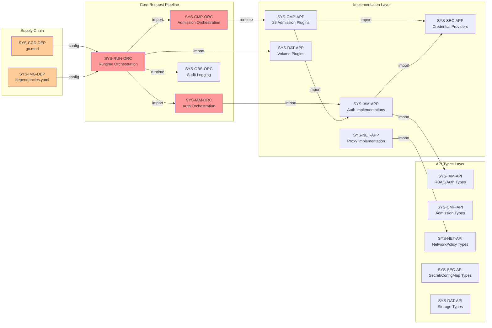
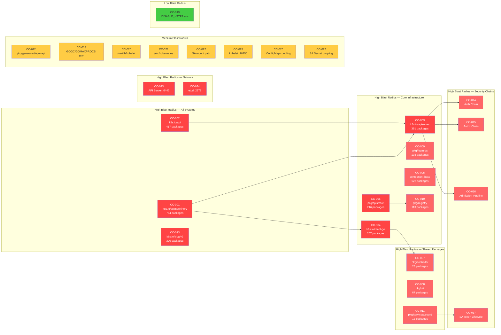
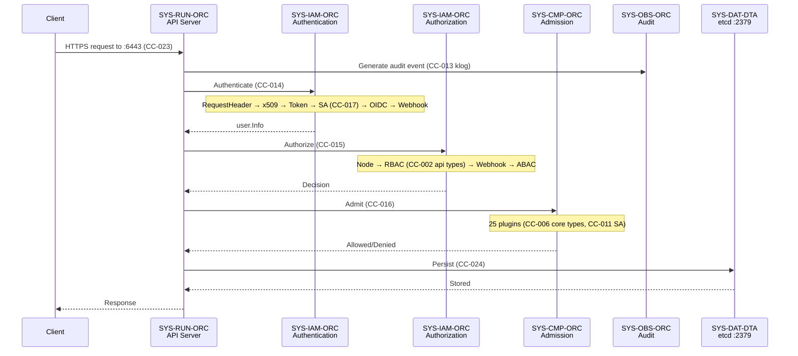
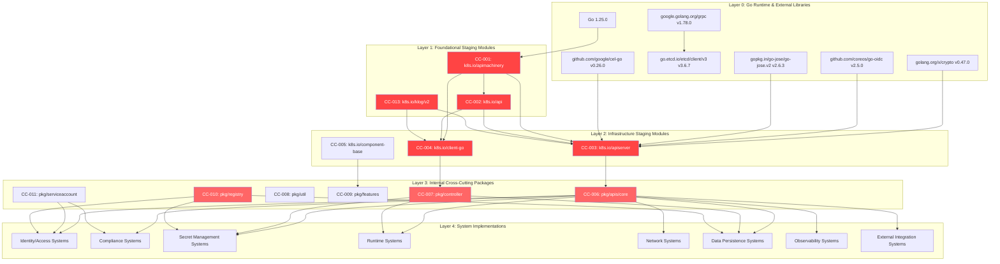

# Directive 4 — Cross-Cutting Dependency Audit

> **Document Type:** Compliance Audit — Dependency Analysis  
> **Audit Target:** `k8s.io/kubernetes` monorepo (Go 1.25.0)  
> **Framework Authority Hierarchy:** NIST SP 800-53 Rev 5 > NIST SP 800-190 > CIS Kubernetes Benchmark v1.12.0 > CIS Controls v8  
> **Posture:** Assess-only — no code or documentation in the target repository is created, modified, or deleted  
> **Prerequisite:** Directive 0 — System Registry (`00-system-registry.md`), Directive 2 — Materiality Classification (`02-materiality-classification.md`)  
> **Audit Dimension:** All findings in this document are attributed to the **Dependency** dimension only  
> **Consequence:** concern_ids defined here are referenced by D5 (gap matrix) and D7 (operational artifacts)

---

## 1. Dependency Mapping Methodology

### 1.1 Approach

This audit maps all inter-system dependencies, cross-cutting shared utilities, circular dependencies, implicit coupling, and external dependency governance within the Kubernetes monorepo. Five complementary analysis techniques are applied:

1. **Go import statement analysis:** Static analysis of `import` declarations across all non-test, non-vendor Go source files in `cmd/`, `pkg/`, and `plugin/` directories. Each import path is resolved to its owning system_id from D0 to construct the inter-system dependency graph.

2. **`go.mod` external dependency analysis:** Inspection of the root module declaration (`k8s.io/kubernetes`, Go 1.25.0), all 108 direct dependencies, 92 indirect dependencies, and 31 `replace` directives mapping `k8s.io/*` modules to local `staging/src/k8s.io/...` paths.

3. **`build/dependencies.yaml` external version pin analysis:** Audit of the zeitgeist-managed dependency version pinning for external infrastructure components (CNI, CoreDNS, etcd, crictl, protoc, Go toolchain, base images) with refPath cross-reference verification.

4. **Cross-system implicit coupling detection:** Identification of runtime dependencies not declared in import statements — including shared environment variables (`GOGC`, `GOMAXPROCS`, `GOTRACEBACK`, `DISABLE_HTTP2`), ConfigMap/Secret coupling, ServiceAccount token chain assumptions, file path coupling (`/var/lib/kubelet/`, `/etc/kubernetes/`), and network endpoint coupling (`:6443`, `:10250`, `:2379`).

5. **Shared utility identification:** Packages imported by 3+ distinct systems (as defined by D0 system_ids) are flagged as cross-cutting concerns with blast radius scoring.

### 1.2 Concern Identification Convention

Each cross-cutting concern is assigned a unique identifier following the pattern:

```
CC-{NNN}
```

Where `NNN` is a zero-padded sequential number (e.g., `CC-001`, `CC-002`). Concern_ids are referenced by D5 (documentation gap matrix) and D7 (operational artifacts).

### 1.3 Blast Radius Scoring

| Score | Systems Affected | Classification |
|---|---|---|
| **Low** | 1–2 systems | Contained impact; failure affects isolated subsystem |
| **Medium** | 3–5 systems | Moderate cascading risk; failure may degrade multiple verticals |
| **High** | 6+ systems | Critical cascading risk; failure propagates across most or all of the codebase |

### 1.4 Dependency Governance Rules

Per the AAP, the following governance flags are applied throughout this audit:

- **FLAG-GOV-OWNER:** Cross-cutting concern with no documented owner assignment or governance boundary
- **FLAG-GOV-PIN:** External dependency with no pinned version or integrity verification
- **FLAG-GOV-STATE:** Shared utility that modifies global state
- **FLAG-GOV-AUTH:** Service-to-service call without authentication or authorization enforcement

---

## 2. Inter-System Dependency Matrix

### 2.1 Dependency Types

| Type | Definition | Example |
|---|---|---|
| **import** | Compile-time Go import dependency between packages owned by different systems | `pkg/kubeapiserver/authorizer/` imports `pkg/auth/authorizer/abac/` |
| **runtime** | Runtime invocation or delegation that crosses system boundaries | API server dispatches to admission plugins at runtime |
| **configuration** | Shared configuration files, flags, or environment variables | Multiple binaries read `GOGC`, `GOMAXPROCS` environment variables |
| **implicit** | Undeclared runtime assumptions about shared resources | Kubelet assumes `/var/lib/kubelet/` path; components assume `:6443` API server port |

### 2.2 Inter-System Dependency Table

| Source system_id | Target system_id | Dependency Type | Component Paths | Description |
|---|---|---|---|---|
| SYS-IAM-ORC | SYS-IAM-APP | import | `pkg/kubeapiserver/authorizer/config.go` → `pkg/auth/authorizer/abac/`, `plugin/pkg/auth/authorizer/rbac/`, `plugin/pkg/auth/authorizer/node/` | Authorizer config imports all auth implementation packages |
| SYS-IAM-ORC | SYS-IAM-APP | import | `pkg/kubeapiserver/authenticator/config.go` → `pkg/serviceaccount/` | Authenticator config imports ServiceAccount authentication logic |
| SYS-IAM-ORC | SYS-CMP-ORC | runtime | `cmd/kube-apiserver/app/` → `pkg/kubeapiserver/admission/` | API server initializes admission chain after authentication/authorization |
| SYS-IAM-APP | SYS-IAM-API | import | `plugin/pkg/auth/authorizer/rbac/rbac.go` → `pkg/apis/rbac/v1` | RBAC authorizer imports RBAC API types for policy rule evaluation |
| SYS-IAM-APP | SYS-IAM-DTA | import | `plugin/pkg/auth/authorizer/rbac/rbac.go` → `pkg/registry/rbac/validation` | RBAC authorizer uses registry validation rule resolver |
| SYS-CMP-ORC | SYS-CMP-APP | runtime | `pkg/kubeapiserver/admission/` → `plugin/pkg/admission/*` | Admission chain dispatches to 25 admission plugins at runtime |
| SYS-CMP-APP | SYS-IAM-APP | import | `plugin/pkg/admission/noderestriction/` → `pkg/auth/nodeidentifier/` | NodeRestriction admission imports node identity resolution |
| SYS-CMP-APP | SYS-SEC-APP | import | `plugin/pkg/admission/serviceaccount/` → `pkg/serviceaccount/` (implicit) | ServiceAccount admission plugin injects SA tokens into pods |
| SYS-RUN-ORC | SYS-IAM-ORC | import | `cmd/kube-apiserver/app/` → `pkg/kubeapiserver/authenticator/`, `pkg/kubeapiserver/authorizer/` | API server binary initializes auth chains at startup |
| SYS-RUN-ORC | SYS-CMP-ORC | import | `cmd/kube-apiserver/app/` → `pkg/kubeapiserver/admission/` | API server binary initializes admission chain |
| SYS-RUN-ORC | SYS-OBS-ORC | runtime | `cmd/kube-apiserver/app/` → `staging/src/k8s.io/apiserver/pkg/audit/` | API server request handling includes audit event generation |
| SYS-RUN-ORC | SYS-DAT-ORC | import | `cmd/kube-controller-manager/app/` → `pkg/controller/volume/` | Controller manager initializes volume controllers |
| SYS-RUN-ORC | SYS-SEC-ORC | import | `cmd/kube-controller-manager/app/` → `pkg/controller/serviceaccount/` | Controller manager initializes ServiceAccount controller |
| SYS-RUN-APP | SYS-SEC-APP | import | `pkg/kubelet/` → `pkg/credentialprovider/` | Kubelet uses credential providers for image pull secrets |
| SYS-RUN-APP | SYS-DAT-APP | import | `pkg/kubelet/` → `pkg/volume/` | Kubelet mounts volumes during pod lifecycle |
| SYS-EXT-ORC | SYS-IAM-ORC | runtime | `cmd/cloud-controller-manager/` → webhook auth dispatch | Cloud controller manager uses API server auth for external calls |
| SYS-EXT-APP | SYS-SEC-APP | import | `pkg/credentialprovider/` → external credential interface | Credential providers make outbound calls to external services |
| SYS-NET-ORC | SYS-RUN-ORC | import | `cmd/kube-proxy/app/` → shared component-base infrastructure | kube-proxy shares startup infrastructure with other binaries |
| SYS-CCD-PIP | SYS-RUN-APP | runtime | `hack/verify-*.sh` → Go source analysis | Verification scripts validate code quality of runtime application source |
| SYS-CCD-DEP | SYS-RUN-DEP | configuration | `go.mod` → all runtime dependencies | Dependency manifest governs all runtime module versions |
| SYS-IMG-DEP | SYS-RUN-IAC | configuration | `build/dependencies.yaml` → base image versions | Dependency version pins govern runtime container base images |

### 2.3 Inter-System Dependency Graph



---

## 3. Cross-Cutting Concern Inventory

This section identifies all shared utilities, foundational libraries, and cross-cutting packages consumed by 3 or more systems from the D0 registry. This is the **core deliverable** of Directive 4.

### 3.1 Foundational Staging Modules (via `go.mod` replace directives)

These modules are declared as direct dependencies in `go.mod` with version `v0.0.0` and replaced with local `staging/src/k8s.io/...` paths. They constitute the foundational dependency layer for the entire Kubernetes codebase.

`Source: go.mod:219-250`

| concern_id | component_path | dependency_type | systems_affected | blast_radius_score | risk_description | NIST_or_CIS_control |
|---|---|---|---|---|---|---|
| CC-001 | `staging/src/k8s.io/apimachinery/` | import | SYS-IAM-ORC, SYS-IAM-APP, SYS-IAM-API, SYS-IAM-DTA, SYS-NET-ORC, SYS-NET-APP, SYS-NET-API, SYS-SEC-ORC, SYS-SEC-APP, SYS-SEC-API, SYS-SEC-DTA, SYS-CMP-ORC, SYS-CMP-APP, SYS-CMP-API, SYS-RUN-ORC, SYS-RUN-APP, SYS-DAT-ORC, SYS-DAT-APP, SYS-DAT-API, SYS-DAT-DTA, SYS-EXT-ORC, SYS-EXT-APP, SYS-OBS-ORC, SYS-OBS-APP (764 consuming packages across all 10 verticals) | **High** | Foundational type system (ObjectMeta, TypeMeta, runtime.Object, labels, errors, util) consumed by virtually every package in the monorepo. A breaking change or vulnerability in apimachinery propagates to all 45 systems. No designated owner documented within the repository; governed externally by SIG API Machinery. **FLAG-GOV-OWNER** | NIST CM-3, CM-7; CIS Control 2 |
| CC-002 | `staging/src/k8s.io/api/` | import | SYS-IAM-APP, SYS-IAM-API, SYS-NET-APP, SYS-NET-API, SYS-SEC-APP, SYS-SEC-API, SYS-CMP-APP, SYS-CMP-API, SYS-RUN-ORC, SYS-RUN-APP, SYS-DAT-APP, SYS-DAT-API, SYS-EXT-APP, SYS-OBS-APP (417 consuming packages across all 10 verticals) | **High** | Versioned API type definitions (rbacv1, corev1, networkingv1, storagev1, etc.) consumed by controllers, admission plugins, CLI tools, and all runtime components. Version-incompatible changes cascade across the entire request processing pipeline. No in-repo governance documentation. **FLAG-GOV-OWNER** | NIST CM-3, CM-7; CIS Control 2 |
| CC-003 | `staging/src/k8s.io/apiserver/` | import | SYS-IAM-ORC, SYS-IAM-APP, SYS-CMP-ORC, SYS-CMP-APP, SYS-RUN-ORC, SYS-RUN-APP, SYS-OBS-ORC, SYS-OBS-APP, SYS-SEC-DTA, SYS-DAT-DTA, SYS-EXT-ORC (351 consuming packages across 8+ verticals) | **High** | API server framework providing authentication, authorization, admission, audit, storage, and request handling interfaces. All control plane security chains depend on this module. **FLAG-GOV-OWNER** | NIST AC-3, IA-2, AU-12, CM-7; CIS Control 4, 8 |
| CC-004 | `staging/src/k8s.io/client-go/` | import | SYS-IAM-ORC, SYS-IAM-APP, SYS-SEC-ORC, SYS-CMP-ORC, SYS-RUN-ORC, SYS-RUN-APP, SYS-DAT-ORC, SYS-EXT-ORC, SYS-EXT-APP, SYS-NET-ORC, SYS-OBS-APP (267 consuming packages across 9+ verticals) | **High** | Client library providing informers, listers, typed clients, and REST client infrastructure. All controllers, admission plugins, and external integrations depend on client-go for Kubernetes API access. **FLAG-GOV-OWNER** | NIST CM-3, SC-8; CIS Control 2, 4 |
| CC-005 | `staging/src/k8s.io/component-base/` | import | SYS-RUN-ORC, SYS-RUN-APP, SYS-IAM-ORC, SYS-NET-ORC, SYS-EXT-ORC, SYS-OBS-APP, SYS-CCD-PIP (122 consuming packages across 7+ verticals) | **High** | Shared component infrastructure including metrics registration, feature gates, logging configuration, CLI flag utilities, and health check endpoints. All Kubernetes binaries depend on component-base for startup infrastructure. **FLAG-GOV-OWNER** | NIST CM-6, AU-12; CIS Control 4, 8 |

### 3.2 Internal Cross-Cutting Packages

These packages reside within the `k8s.io/kubernetes` module and are consumed by 3+ systems as determined by import analysis.

| concern_id | component_path | dependency_type | systems_affected | blast_radius_score | risk_description | NIST_or_CIS_control |
|---|---|---|---|---|---|---|
| CC-006 | `pkg/apis/core/` | import | SYS-IAM-APP, SYS-IAM-API, SYS-IAM-DTA, SYS-SEC-APP, SYS-SEC-API, SYS-SEC-DTA, SYS-CMP-APP, SYS-CMP-API, SYS-RUN-APP, SYS-RUN-ORC, SYS-DAT-APP, SYS-DAT-API, SYS-DAT-DTA, SYS-NET-APP, SYS-NET-API, SYS-OBS-APP, SYS-EXT-APP (216 consuming packages across all 10 verticals) | **High** | Internal API type definitions (Pod, Service, Secret, ConfigMap, Node, Namespace, PersistentVolume, etc.) — the foundational data model for all Kubernetes resources. Type changes cascade to every system that processes Kubernetes objects. **FLAG-GOV-OWNER** | NIST CM-3, CM-7; CIS Control 2, 4 |
| CC-007 | `pkg/controller/` | import | SYS-SEC-ORC (serviceaccount controller), SYS-DAT-ORC (volume controllers), SYS-RUN-ORC (all built-in controllers), SYS-CMP-APP (gc admission), SYS-IAM-DTA (RBAC aggregation) — 28 direct consuming packages across 5+ verticals | **High** | Controller framework providing reconciliation loop infrastructure, shared utilities (controller_ref_manager, controller_utils), and 30+ controller implementations (deployment, replicaset, namespace, serviceaccount, certificates, daemon, job, cronjob, statefulset, endpoint, node, volume, etc.). `Source: pkg/controller/doc.go` **FLAG-GOV-OWNER** | NIST CM-7; CIS Control 4 |
| CC-008 | `pkg/util/` | import | SYS-RUN-ORC, SYS-RUN-APP, SYS-IAM-ORC, SYS-DAT-ORC, SYS-DAT-APP, SYS-NET-ORC, SYS-CMP-APP, SYS-SEC-ORC — 67 consuming packages across 8+ verticals | **High** | Shared utility library providing: hash utilities (6 consumers), node helpers (7 consumers), OOM management (5 consumers), pod helpers (5 consumers), slice utilities (8 consumers), taint helpers (6 consumers), bandwidth management, coverage, env helpers, filesystem, flag, flock, interrupt, iptables, kernel, labels, parsers, procfs, removeall, rlimit, tail, tolerations. `Source: pkg/util/` directory listing **FLAG-GOV-OWNER** | NIST CM-7; CIS Control 2 |
| CC-009 | `pkg/features/` | import | SYS-RUN-ORC, SYS-RUN-APP, SYS-RUN-CFG, SYS-IAM-ORC, SYS-IAM-APP, SYS-CMP-APP, SYS-CMP-ORC, SYS-NET-ORC, SYS-NET-APP, SYS-DAT-ORC, SYS-DAT-APP, SYS-EXT-ORC — 138 consuming packages across 9+ verticals | **High** | Feature gate definitions controlling experimental and beta feature enablement at runtime. All components check feature gates before executing gated code paths. An incorrectly defined feature gate can silently enable or disable security-critical behavior across the entire codebase. `Source: pkg/features/` | NIST CM-6, CM-7; CIS Control 4 |
| CC-010 | `pkg/registry/` | import | SYS-IAM-DTA, SYS-SEC-DTA, SYS-DAT-DTA, SYS-RUN-APP, SYS-CMP-APP — 113 consuming packages across 5+ verticals | **High** | Resource storage framework implementing etcd-backed CRUD operations for all Kubernetes resources. Includes RBAC storage (role, clusterrole, rolebinding, clusterrolebinding), secret storage, configmap storage, PV/PVC storage, and all workload resource storage. Data integrity at this layer is foundational to all security controls. | NIST SC-28, AC-3; CIS Control 4 |
| CC-011 | `pkg/serviceaccount/` | import | SYS-IAM-ORC (authenticator config), SYS-IAM-APP (token validation), SYS-SEC-ORC (token controller), SYS-CMP-APP (serviceaccount admission), SYS-RUN-ORC (controller manager, controlplane), SYS-RUN-APP (routes) — 13 consuming packages across 5+ verticals | **High** | ServiceAccount token generation, validation, and OIDC metadata serving. Implements the JWT-based identity chain for all in-cluster workload authentication. A vulnerability in token generation or validation compromises all workload identity. `Source: pkg/serviceaccount/` | NIST IA-4, IA-5; CIS K8s 5.1; CIS Control 5 |
| CC-012 | `pkg/generated/openapi/` | import | SYS-RUN-ORC, SYS-RUN-APP, SYS-RUN-API, SYS-CMP-ORC — 4 consuming packages across 2 verticals | **Medium** | Generated OpenAPI type definitions compiled into the API server binary. Limited direct consumers (4 packages), but inaccurate generated definitions would affect all API consumers via the published OpenAPI specification. `Source: pkg/generated/openapi/` | NIST CM-6; CIS Control 4 |

### 3.3 External Logging and Observability

| concern_id | component_path | dependency_type | systems_affected | blast_radius_score | risk_description | NIST_or_CIS_control |
|---|---|---|---|---|---|---|
| CC-013 | `k8s.io/klog/v2` | import | SYS-IAM-ORC, SYS-IAM-APP, SYS-CMP-ORC, SYS-CMP-APP, SYS-RUN-ORC, SYS-RUN-APP, SYS-SEC-ORC, SYS-SEC-APP, SYS-DAT-ORC, SYS-DAT-APP, SYS-NET-ORC, SYS-NET-APP, SYS-EXT-ORC, SYS-EXT-APP, SYS-OBS-ORC, SYS-OBS-APP — 320 consuming packages across all 10 verticals | **High** | Structured logging library used by every Kubernetes component. Provides `klog.Infof`, `klog.V(n)`, `klog.Errorf`, and `klog.Warning` used for audit-relevant event logging. klog initializes global state (output writers, verbosity levels) at process startup. A vulnerability or misconfiguration in klog affects logging fidelity across all components. **FLAG-GOV-STATE** (modifies global logging state) | NIST AU-12; CIS Control 8 |

### 3.4 Security Chain Cross-Cutting Concerns

| concern_id | component_path | dependency_type | systems_affected | blast_radius_score | risk_description | NIST_or_CIS_control |
|---|---|---|---|---|---|---|
| CC-014 | Authentication chain (RequestHeader → x509 → StaticToken → ServiceAccount → Bootstrap → OIDC → Webhook) | runtime | SYS-IAM-ORC, SYS-IAM-APP, SYS-RUN-ORC, SYS-EXT-ORC, SYS-EXT-APP — spans 4+ verticals | **High** | The authentication chain is a serial pipeline where every API request must pass through. Failure in any authenticator stage can deny all requests or permit unauthorized access. The chain crosses system boundaries: authenticator config (SYS-IAM-ORC) dispatches to ServiceAccount validation (SYS-IAM-APP), OIDC verification (SYS-EXT-APP), and webhook dispatch (SYS-EXT-ORC). `Source: pkg/kubeapiserver/authenticator/config.go:107-249` | NIST IA-2, IA-5, IA-8; CIS K8s 3.1; CIS Control 5 |
| CC-015 | Authorization chain (Node → RBAC → Webhook → ABAC → default deny) | runtime | SYS-IAM-ORC, SYS-IAM-APP, SYS-IAM-DTA, SYS-EXT-ORC — spans 3+ verticals | **High** | The authorization chain evaluates every authenticated request against multiple policy engines. Misconfiguration (e.g., missing RBAC bindings, permissive ABAC policy) propagates to all API access decisions. The chain imports from 5 distinct packages: `abac`, `nodeidentifier`, `node`, `rbac`, `bootstrappolicy`. `Source: pkg/kubeapiserver/authorizer/config.go:39-46` | NIST AC-3, AC-6; CIS K8s 5.1; CIS Control 6 |
| CC-016 | Admission control pipeline (Mutating → Schema → Validating → CEL → Persist) | runtime | SYS-CMP-ORC, SYS-CMP-APP, SYS-IAM-APP, SYS-SEC-APP, SYS-RUN-ORC — spans 4+ verticals | **High** | The admission control pipeline evaluates every mutating API request through 25 in-tree admission plugins plus external webhooks. The pipeline is a critical security gate — if admission is bypassed or misconfigured, workloads violating security policies (privileged containers, missing resource limits, unauthorized image sources) can be deployed. `Source: pkg/kubeapiserver/admission/config.go:27-29` | NIST CM-7, SI-3, SI-10; CIS K8s 5.2; CIS Control 4 |
| CC-017 | ServiceAccount token lifecycle (generation → signing → injection → validation → authentication → authorization) | runtime | SYS-IAM-ORC, SYS-IAM-APP, SYS-SEC-ORC, SYS-CMP-APP (serviceaccount admission), SYS-RUN-ORC — spans 5+ verticals | **High** | ServiceAccount tokens are the primary in-cluster identity mechanism. The lifecycle crosses multiple system boundaries: token generation (`pkg/serviceaccount/jwt.go`), secret injection (`plugin/pkg/admission/serviceaccount/`), token validation (`pkg/serviceaccount/claims.go`), and authentication (`pkg/kubeapiserver/authenticator/config.go`). A vulnerability at any stage compromises all workload identity. | NIST IA-4, IA-5; CIS K8s 5.1; CIS Control 5 |

---

## 4. Circular Dependency Analysis

### 4.1 Go Compilation Constraints

The Go compiler enforces a strict prohibition on import cycles at compile time. If package A imports package B and package B imports package A (directly or transitively), the build fails with a compile error. This architectural constraint means that **no compile-time circular import dependencies exist** in the Kubernetes codebase — their presence would prevent successful compilation.

### 4.2 Verified Import Direction

Analysis of the key security-critical packages confirms unidirectional import flow:

| Package A | Package B | Direction | Verified |
|---|---|---|---|
| `pkg/kubeapiserver/authorizer/` | `pkg/auth/authorizer/abac/` | A → B only | ✓ `Source: pkg/kubeapiserver/authorizer/config.go:39` |
| `pkg/kubeapiserver/authorizer/` | `plugin/pkg/auth/authorizer/rbac/` | A → B only | ✓ `Source: pkg/kubeapiserver/authorizer/config.go:44` |
| `pkg/kubeapiserver/authorizer/` | `plugin/pkg/auth/authorizer/node/` | A → B only | ✓ `Source: pkg/kubeapiserver/authorizer/config.go:43` |
| `plugin/pkg/auth/authorizer/node/` | `pkg/auth/nodeidentifier/` | A → B only | ✓ `Source: plugin/pkg/auth/authorizer/node/node_authorizer.go` |
| `plugin/pkg/auth/authorizer/rbac/` | `pkg/apis/rbac/v1` | A → B only | ✓ `Source: plugin/pkg/auth/authorizer/rbac/rbac.go:27` |
| `plugin/pkg/auth/authorizer/rbac/` | `pkg/registry/rbac/validation` | A → B only | ✓ `Source: plugin/pkg/auth/authorizer/rbac/rbac.go:34` |
| `pkg/auth/authorizer/abac/` | `pkg/apis/abac/` | A → B only | ✓ `Source: pkg/auth/authorizer/abac/abac.go:32` |
| `pkg/kubeapiserver/authenticator/` | `pkg/serviceaccount/` | A → B only | ✓ `Source: pkg/kubeapiserver/authenticator/config.go:54` |
| `pkg/kubeapiserver/options/` | `plugin/pkg/admission/*` | A → B only | ✓ `Source: pkg/kubeapiserver/options/plugins.go` (multiple imports) |
| `pkg/apis/rbac/` | — | No upstream imports | ✓ API types are leaf nodes in the dependency graph |

### 4.3 Runtime Circular Dependencies

While Go prevents compile-time import cycles, **runtime circular dependencies** can exist through interface-based indirection, registration patterns, and shared state. The following runtime circular patterns were identified:

| Pattern | Description | System Boundary Crossing | Severity |
|---|---|---|---|
| **Admission → API Server → Admission** | Admission webhooks (external) make API calls back to the kube-apiserver, which then routes through the admission chain again. Self-referential webhooks are mitigated by the `reinvocationPolicy` field, but misconfigured webhooks can cause infinite loops. | SYS-CMP-ORC ↔ SYS-RUN-ORC | Moderate — mitigated by reinvocation policy and timeout |
| **Controller → API Server → Admission → Controller** | Controller reconciliation creates or updates resources, which triggers admission evaluation, which may query API resources managed by the same or another controller. | SYS-RUN-ORC → SYS-CMP-ORC → SYS-RUN-ORC | Moderate — mitigated by informer caches and eventual consistency |
| **Authentication → ServiceAccount → Secret → Authentication** | ServiceAccount token validation requires fetching the ServiceAccount and its bound secret, which requires API access, which requires authentication. Bootstrap tokens and static token files break this cycle at startup. | SYS-IAM-ORC → SYS-SEC-DTA → SYS-IAM-ORC | Low — broken by bootstrap authentication and local cache |
| **Feature Gate → Component Initialization → Feature Gate** | Feature gate checks (`utilfeature.DefaultFeatureGate.Enabled()`) are evaluated during component initialization, which itself may be gated by feature flags. | Cross-cutting (CC-009) | Low — feature gate state is initialized once at startup |

### 4.4 Circular Dependency Risk Assessment

No critical compile-time circular dependencies exist. The runtime circular patterns identified are standard Kubernetes architectural patterns with established mitigation strategies (timeouts, caching, bootstrap mechanisms). However, the **Admission → API Server → Admission** pattern presents the highest risk due to potential for webhook-induced infinite loops in misconfigured clusters.

---

## 5. Implicit Dependency Register

Implicit dependencies are runtime assumptions between components that are not declared in Go `import` statements and cannot be detected through static code analysis alone.

### 5.1 Environment Variable Coupling

| concern_id | component_path | dependency_type | systems_affected | blast_radius_score | risk_description | NIST_or_CIS_control |
|---|---|---|---|---|---|---|
| CC-018 | `GOGC`, `GOMAXPROCS`, `GOTRACEBACK` environment variables | implicit (configuration) | SYS-RUN-ORC (kube-apiserver, kube-controller-manager, kube-scheduler, kubelet, kube-proxy) — 5 binaries share identical environment variable logging at startup | **Medium** | All five core Kubernetes binaries log `GOGC`, `GOMAXPROCS`, and `GOTRACEBACK` at startup (`Source: cmd/kube-apiserver/app/server.go:152`, `Source: cmd/kube-controller-manager/app/controllermanager.go:191`, `Source: cmd/kubelet/app/server.go:544`, `Source: cmd/kube-proxy/app/server.go:531`, `Source: cmd/kube-scheduler/app/server.go:177`). These Go runtime environment variables are not managed through Kubernetes configuration APIs but directly affect garbage collection behavior, CPU parallelism, and panic trace output. Inconsistent settings across components may cause unpredictable performance degradation. | NIST CM-6; CIS Control 4 |
| CC-019 | `DISABLE_HTTP2` environment variable | implicit (configuration) | SYS-RUN-ORC (kubelet only — `Source: cmd/kubelet/app/server.go:1018,1053`) | **Low** | Kubelet checks `DISABLE_HTTP2` to optionally disable HTTP/2 for kubelet and kubelet-to-API-server communication. This environment variable is not documented in the standard kubelet flag reference and is not governed by Kubernetes configuration APIs. | NIST SC-8; CIS Control 4 |

### 5.2 File Path Coupling

| concern_id | component_path | dependency_type | systems_affected | blast_radius_score | risk_description | NIST_or_CIS_control |
|---|---|---|---|---|---|---|
| CC-020 | `/var/lib/kubelet/` root directory | implicit (file path) | SYS-RUN-ORC (kubelet), SYS-DAT-APP (volume plugins), SYS-SEC-APP (credential provider) — 3+ verticals | **Medium** | The kubelet root directory (`/var/lib/kubelet/`) is the default path for pod data, volume mounts (`/var/lib/kubelet/pods/{podUID}/volumes/`), device plugins (`/var/lib/kubelet/device-plugins/`), and PKI certificates (`/var/lib/kubelet/pki/`). Volume plugins and credential providers assume this path structure exists. `Source: cmd/kubelet/app/options/options.go:44` defines `defaultRootDir = "/var/lib/kubelet"` and `Source: cmd/kubelet/app/options/options.go:140` sets `CertDirectory: "/var/lib/kubelet/pki"`. | NIST CM-6; CIS K8s 4.1; CIS Control 4 |
| CC-021 | `/etc/kubernetes/` configuration directory | implicit (file path) | SYS-RUN-ORC (kubeadm, kubelet), SYS-IAM-CFG (ABAC policy, encryption config), SYS-SEC-CFG (encryption keys) — 3+ verticals | **Medium** | Multiple components assume `/etc/kubernetes/` as the standard configuration directory for kubeconfig files, ABAC policy files, encryption configuration, and audit policy files. This path is not enforced programmatically but is assumed by kubeadm bootstrap and deployment manifests. | NIST CM-6; CIS K8s 1.1, 4.1; CIS Control 4 |
| CC-022 | `/var/run/secrets/kubernetes.io/serviceaccount/` | implicit (file path) | SYS-IAM-APP (ServiceAccount token), SYS-CMP-APP (serviceaccount admission), SYS-SEC-APP (secret injection) — 3+ verticals | **Medium** | The default ServiceAccount token mount path is assumed by in-cluster clients for automatic authentication. The `serviceaccount` admission plugin injects a projected volume at this path. All in-cluster workloads consuming Kubernetes API depend on this implicit contract. `Source: plugin/pkg/admission/serviceaccount/admission.go:53` defines `ServiceAccountVolumeName = "kube-api-access"`. | NIST IA-4, IA-5; CIS K8s 5.1; CIS Control 5 |

### 5.3 Network Endpoint Coupling

| concern_id | component_path | dependency_type | systems_affected | blast_radius_score | risk_description | NIST_or_CIS_control |
|---|---|---|---|---|---|---|
| CC-023 | API server endpoint `:6443` | implicit (network) | SYS-RUN-ORC (all control plane components), SYS-IAM-ORC (auth chain), SYS-CMP-ORC (admission webhooks), SYS-EXT-ORC (cloud controller), SYS-NET-ORC (kube-proxy), SYS-SEC-ORC (secret controller), SYS-DAT-ORC (volume controller), SYS-OBS-ORC (audit backend) — all 10 verticals | **High** | All Kubernetes components assume the API server is reachable at a well-known endpoint (default port 6443). This is a single point of failure: API server unavailability cascades to all controllers, admission, authentication, secret distribution, and observability functions. No in-repo documentation of this implicit dependency or its failure modes. **FLAG-GOV-OWNER** | NIST SC-5 (Denial of Service Protection); CIS K8s 1.2; CIS Control 4 |
| CC-024 | etcd endpoint `:2379` | implicit (network) | SYS-IAM-DTA, SYS-SEC-DTA, SYS-DAT-DTA, SYS-RUN-ORC — 4+ verticals | **High** | The kube-apiserver depends on etcd (default port 2379) for all persistent state. etcd is the single source of truth for RBAC bindings, Secrets, ConfigMaps, workload definitions, and all cluster state. etcd unavailability makes the entire cluster read-only (or unavailable). External dependency with version pin (etcd 3.6.7 in `build/dependencies.yaml`). | NIST SC-5, SC-28, CP-9; CIS K8s Section 2; CIS Control 4 |
| CC-025 | kubelet endpoint `:10250` | implicit (network) | SYS-RUN-ORC (kubelet), SYS-RUN-APP (API server kubelet client), SYS-OBS-APP (metrics collection) — 3+ verticals | **Medium** | The kubelet serves its API on port 10250 by default. The API server connects to kubelets for exec, attach, port-forward, and log retrieval operations. Metrics scrapers connect to kubelet for node-level metrics. This implicit network dependency is not formally documented in the repository. | NIST SC-7, SC-8; CIS K8s 4.2; CIS Control 4 |

### 5.4 ConfigMap/Secret Coupling

| concern_id | component_path | dependency_type | systems_affected | blast_radius_score | risk_description | NIST_or_CIS_control |
|---|---|---|---|---|---|---|
| CC-026 | ConfigMap consumption by kubelet | implicit (runtime) | SYS-RUN-APP (kubelet configmap manager), SYS-SEC-ORC (secret/configmap controller), SYS-DAT-APP (configmap volume plugin), SYS-CMP-APP (namespace admission) — 4+ verticals | **Medium** | The kubelet uses ConfigMapManager with multiple strategies (Watching, Caching, Simple) to consume ConfigMaps for pod configuration projection. `Source: pkg/kubelet/kubelet.go:652-665`. ConfigMap changes propagate to pods through projected volumes, requiring coordination between the kubelet, volume plugins, and the API server. | NIST CM-6; CIS Control 4 |
| CC-027 | ServiceAccount Secret coupling | implicit (runtime) | SYS-IAM-APP (token validation), SYS-SEC-ORC (serviceaccount token controller), SYS-SEC-DTA (secret storage), SYS-CMP-APP (serviceaccount admission) — 4+ verticals | **Medium** | ServiceAccount tokens reference bound objects (pods, nodes, secrets) through JWT claims. The serviceaccount token controller creates and manages token secrets; the serviceaccount admission plugin injects them; the authenticator validates them. This creates an implicit runtime dependency chain across identity, secret management, and compliance systems. `Source: pkg/serviceaccount/claims.go` | NIST IA-4, IA-5, SC-28; CIS K8s 5.1; CIS Control 5, 18 |

---

## 6. External Dependency Analysis

### 6.1 Go Module Declaration

`Source: go.mod:1-11`

| Property | Value |
|---|---|
| Module path | `k8s.io/kubernetes` |
| Go version | 1.25.0 |
| godebug | `default=go1.25` |
| Direct dependencies | 108 |
| Indirect dependencies | 92 |
| Total dependencies | 200 |
| Staging replace directives | 31 (mapping `k8s.io/*` → `./staging/src/k8s.io/...`) |
| `go.sum` integrity entries | 525 lines |

### 6.2 Staging Module Replace Directives

The following 31 modules are declared with `v0.0.0` version and replaced to local staging paths. These are effectively **internal modules** maintained within the monorepo but published as separate Go modules for external consumers.

`Source: go.mod:219-250`

| Module | Local Path | Risk Assessment |
|---|---|---|
| `k8s.io/api` | `./staging/src/k8s.io/api` | Foundational — all API types |
| `k8s.io/apimachinery` | `./staging/src/k8s.io/apimachinery` | Foundational — type system, runtime, errors |
| `k8s.io/apiserver` | `./staging/src/k8s.io/apiserver` | Critical — auth, admission, audit, storage |
| `k8s.io/client-go` | `./staging/src/k8s.io/client-go` | Critical — all API access |
| `k8s.io/component-base` | `./staging/src/k8s.io/component-base` | Critical — shared binary infrastructure |
| `k8s.io/controller-manager` | `./staging/src/k8s.io/controller-manager` | High — controller lifecycle management |
| `k8s.io/cloud-provider` | `./staging/src/k8s.io/cloud-provider` | Medium — external cloud integration |
| `k8s.io/cluster-bootstrap` | `./staging/src/k8s.io/cluster-bootstrap` | Medium — cluster join operations |
| `k8s.io/code-generator` | `./staging/src/k8s.io/code-generator` | Low — build-time code generation |
| `k8s.io/cri-api` | `./staging/src/k8s.io/cri-api` | Medium — container runtime interface |
| `k8s.io/cri-client` | `./staging/src/k8s.io/cri-client` | Medium — CRI client library |
| `k8s.io/csi-translation-lib` | `./staging/src/k8s.io/csi-translation-lib` | Medium — CSI migration |
| `k8s.io/dynamic-resource-allocation` | `./staging/src/k8s.io/dynamic-resource-allocation` | Low — feature-gated DRA |
| `k8s.io/endpointslice` | `./staging/src/k8s.io/endpointslice` | Low — endpoint management |
| `k8s.io/externaljwt` | `./staging/src/k8s.io/externaljwt` | Medium — external JWT signing |
| `k8s.io/kms` | `./staging/src/k8s.io/kms` | High — key management service |
| `k8s.io/kube-aggregator` | `./staging/src/k8s.io/kube-aggregator` | Medium — API aggregation |
| `k8s.io/kube-controller-manager` | `./staging/src/k8s.io/kube-controller-manager` | High — controller manager config |
| `k8s.io/kube-proxy` | `./staging/src/k8s.io/kube-proxy` | Medium — proxy configuration |
| `k8s.io/kube-scheduler` | `./staging/src/k8s.io/kube-scheduler` | Medium — scheduler configuration |
| `k8s.io/kubectl` | `./staging/src/k8s.io/kubectl` | Medium — CLI implementation |
| `k8s.io/kubelet` | `./staging/src/k8s.io/kubelet` | High — node agent API |
| `k8s.io/metrics` | `./staging/src/k8s.io/metrics` | Low — metrics API types |
| `k8s.io/mount-utils` | `./staging/src/k8s.io/mount-utils` | Medium — volume mount utilities |
| `k8s.io/pod-security-admission` | `./staging/src/k8s.io/pod-security-admission` | High — PSA enforcement |
| `k8s.io/sample-apiserver` | `./staging/src/k8s.io/sample-apiserver` | Low — example only |
| `k8s.io/sample-cli-plugin` | `./staging/src/k8s.io/sample-cli-plugin` | Low — example only |
| `k8s.io/sample-controller` | `./staging/src/k8s.io/sample-controller` | Low — example only |
| `k8s.io/apiextensions-apiserver` | `./staging/src/k8s.io/apiextensions-apiserver` | Medium — CRD handling |
| `k8s.io/cli-runtime` | `./staging/src/k8s.io/cli-runtime` | Low — CLI runtime utilities |
| `k8s.io/component-helpers` | `./staging/src/k8s.io/component-helpers` | Medium — shared component helpers |

**Governance Finding:** These staging modules are versioned `v0.0.0` within the monorepo and published as separate modules during the Kubernetes release process. The `go.mod` header explicitly documents the governance workflow: `hack/pin-dependency.sh` for pinning and `hack/update-vendor.sh` for vendor updates. `Source: go.mod:1-5`

### 6.3 Security-Relevant External Dependencies

`Source: go.mod:13-121`

| Package | Version | Purpose | Security Relevance | Version Pinned | Integrity Verified (go.sum) |
|---|---|---|---|---|---|
| `golang.org/x/crypto` | v0.47.0 | Cryptographic primitives | Used for TLS, key generation, hash functions | ✓ | ✓ |
| `golang.org/x/oauth2` | v0.34.0 | OAuth 2.0 client | Used for OIDC authentication flows | ✓ | ✓ |
| `gopkg.in/go-jose/go-jose.v2` | v2.6.3 | JOSE/JWS/JWE implementation | Used for JWT token signing and verification | ✓ | ✓ |
| `github.com/coreos/go-oidc` | v2.5.0+incompatible | OIDC client library | Used for OIDC provider discovery and token verification | ✓ | ✓ |
| `github.com/golang-jwt/jwt/v5` | v5.3.0 (indirect) | JWT parsing library | Used for JWT token handling | ✓ | ✓ |
| `go.etcd.io/etcd/client/v3` | v3.6.7 | etcd client library | Used for all cluster state persistence | ✓ | ✓ |
| `go.etcd.io/etcd/api/v3` | v3.6.7 | etcd API definitions | Defines etcd communication protocol | ✓ | ✓ |
| `google.golang.org/grpc` | v1.78.0 | gRPC framework | Used for etcd communication, CRI, KMS | ✓ | ✓ |
| `google.golang.org/protobuf` | v1.36.11 | Protocol Buffers | Serialization for gRPC and API types | ✓ | ✓ |
| `github.com/google/cel-go` | v0.26.0 | Common Expression Language | Used for CEL-based admission validation | ✓ | ✓ |
| `github.com/opencontainers/selinux` | v1.13.1 | SELinux bindings | Used for container security context | ✓ | ✓ |
| `github.com/opencontainers/cgroups` | v0.0.6 | cgroup management | Used for container resource isolation | ✓ | ✓ |
| `github.com/container-storage-interface/spec` | v1.9.0 | CSI specification | Used for volume plugin CSI integration | ✓ | ✓ |
| `github.com/prometheus/client_golang` | v1.23.2 | Prometheus client | Metrics collection and exposure | ✓ | ✓ |
| `github.com/spf13/cobra` | v1.10.0 | CLI framework | Used by all Kubernetes binaries for command parsing | ✓ | ✓ |
| `sigs.k8s.io/apiserver-network-proxy/konnectivity-client` | v0.34.0 (indirect) | Network proxy client | Used for API server egress connectivity | ✓ | ✓ |

**Version Pinning Assessment:** All 108 direct dependencies and 92 indirect dependencies in `go.mod` have explicit version pins. The `go.sum` file (525 lines) provides cryptographic hash verification for all module downloads. This satisfies NIST CM-3 (Configuration Change Control) requirements for dependency version governance.

**Supply Chain Governance Finding:** The `go.mod` header (`Source: go.mod:1-5`) documents the required workflow: `hack/pin-dependency.sh` for version changes and `hack/update-vendor.sh` for vendor directory updates. This provides a governance boundary for dependency change control. However, no in-repo documentation exists explaining the supply chain risk assessment process for evaluating new dependencies or version upgrades. **FLAG-GOV-OWNER**

### 6.4 `build/dependencies.yaml` External Dependencies

`Source: build/dependencies.yaml:1-250`

| Dependency | Version | Purpose | refPaths Verified | Risk Assessment |
|---|---|---|---|---|
| zeitgeist | v0.5.4 | Dependency version management tool | `hack/verify-external-dependencies-version.sh` | Low — build-time tooling only |
| CNI (Container Networking Interface) | 1.9.0 | Container networking | 4 refPaths across `cluster/gce/`, `test/`, `hack/` | Medium — network segmentation dependency |
| CoreDNS (kube-up) | 1.13.1 | DNS server for cluster DNS | 3 refPaths in `cluster/addons/dns/coredns/` | Medium — DNS resolution for service discovery |
| CoreDNS (kubeadm) | 1.13.1 | DNS server version in kubeadm constants | 1 refPath in `cmd/kubeadm/app/constants/constants.go` | Medium — kubeadm bootstrap dependency |
| crictl | 1.34.0 | CRI tools for container runtime debugging | 2 refPaths in `cluster/gce/` | Low — debugging tooling |
| protoc | 23.4 | Protocol Buffers compiler | 1 refPath in `hack/lib/protoc.sh` | Low — build-time code generation |
| etcd | 3.6.7 | Distributed key-value store | 7 refPaths across `cluster/`, `cmd/kubeadm/`, `hack/`, `test/` | **Critical** — single point of failure for cluster state |
| Go (upstream) | 1.25.6 | Go compiler toolchain | 2 refPaths in `.go-version`, `staging/publishing/rules.yaml` | **Critical** — compiler integrity affects all binaries |
| Go (kube-cross) | v1.35.0-go1.25.5-bullseye.0 | Cross-compilation build image | 1 refPath in `build/build-image/cross/VERSION` | High — build environment integrity |
| pause image | 3.10.1 / 3.10 | Pause container (init container in every pod) | 12+ refPaths across `build/`, `cluster/`, `cmd/kubeadm/`, `test/` | High — present in every Kubernetes pod |
| distroless-iptables | v0.8.6 | Base image for kube-proxy | 2 refPaths in `build/common.sh`, `test/` | Medium — network proxy base image |
| go-runner | v2.4.0-go1.25.5-bookworm.0 | Go binary runner image | 1 refPath in `build/common.sh` | Medium — server binary base image |
| debian-base | bookworm-v1.0.6 | Debian base image for test/conformance images | 7+ refPaths across `test/`, `cluster/`, `pkg/volume/` | Medium — base image for multiple artifacts |
| node-problem-detector | 1.34.0 | Node health monitoring | 4 refPaths across `test/`, `cluster/` | Low — monitoring addon |
| agnhost | 2.61 | E2E test image | 20+ refPaths across `test/` | Low — test-only dependency |

**Governance Finding:** `build/dependencies.yaml` uses zeitgeist format with explicit refPaths for each dependency, enabling automated verification that version references are consistent across the codebase. This provides version consistency governance but does **not** include cryptographic integrity verification (no checksums or signatures). The `go.mod` / `go.sum` mechanism provides integrity verification for Go module dependencies, but non-Go dependencies (container images, shell tool versions) rely solely on tag-based version references. **FLAG-GOV-PIN** for non-Go dependencies lacking checksum verification.

### 6.5 Framework Control Mapping for External Dependencies

| Framework Control | Requirement | Status | Finding |
|---|---|---|---|
| NIST CM-3 (Configuration Change Control) | All dependency changes must follow documented change control processes | Partial compliance | `go.mod` header documents `hack/pin-dependency.sh` and `hack/update-vendor.sh` workflow. `build/dependencies.yaml` uses zeitgeist for version consistency. However, no in-repo documentation describes the change control approval process for dependency upgrades. |
| NIST CM-7 (Least Functionality) | Only necessary dependencies should be included | Not assessed in-repo | 200 total Go module dependencies (108 direct + 92 indirect). No in-repo documentation evaluating necessity of each dependency. |
| NIST SI-7 (Software, Firmware, and Information Integrity) | Dependency integrity must be verified | Partial compliance | `go.sum` provides cryptographic hash verification for Go modules. Non-Go dependencies in `build/dependencies.yaml` use version tags without cryptographic verification. |
| CIS Control 2 (Inventory of Software Assets) | Complete inventory of software dependencies | Compliant | `go.mod` + `build/dependencies.yaml` together provide a complete dependency inventory with version pins. |
| NIST SP 800-190 (Image Risks) | Container images should be from trusted sources, scanned for vulnerabilities | Partial compliance | Base images use `registry.k8s.io` (trusted registry). No in-repo documentation of image vulnerability scanning process or frequency. |

---

## 7. Blast Radius Scoring Table

### 7.1 Comprehensive Blast Radius Assessment

| concern_id | Description | Systems Affected Count | Blast Radius | Risk Level | Mitigation Exists (Y/N) | Single Point of Failure |
|---|---|---|---|---|---|---|
| CC-001 | `k8s.io/apimachinery` — foundational type system | 45 (all systems) | **High** | Critical | N — no in-repo failover or abstraction | **Yes** |
| CC-002 | `k8s.io/api` — versioned API types | 45 (all systems) | **High** | Critical | N — no in-repo failover | **Yes** |
| CC-003 | `k8s.io/apiserver` — API server framework | 30+ systems | **High** | Critical | N — no in-repo failover | **Yes** |
| CC-004 | `k8s.io/client-go` — client library | 30+ systems | **High** | Critical | Partial — informer caches provide degraded mode | **Yes** |
| CC-005 | `k8s.io/component-base` — shared binary infrastructure | 20+ systems | **High** | High | N — no in-repo failover | **Yes** |
| CC-006 | `pkg/apis/core/` — internal API types | 40+ systems | **High** | Critical | N — foundational data model | **Yes** |
| CC-007 | `pkg/controller/` — controller framework | 15+ systems | **High** | High | Partial — individual controllers can be disabled | No |
| CC-008 | `pkg/util/` — shared utilities | 20+ systems | **High** | High | N — no abstraction layer | No |
| CC-009 | `pkg/features/` — feature gates | 30+ systems | **High** | High | Partial — gates default to stable values | No |
| CC-010 | `pkg/registry/` — resource storage framework | 15+ systems | **High** | Critical | N — foundational persistence layer | **Yes** |
| CC-011 | `pkg/serviceaccount/` — SA token lifecycle | 10+ systems | **High** | Critical | Partial — external JWT signers can replace | No |
| CC-012 | `pkg/generated/openapi/` — generated OpenAPI | 4 systems | **Medium** | Low | Y — regenerated from source | No |
| CC-013 | `k8s.io/klog/v2` — structured logging | 45 (all systems) | **High** | High | N — global state dependency | **Yes** |
| CC-014 | Authentication chain | 10+ systems | **High** | Critical | Partial — anonymous auth fallback | No |
| CC-015 | Authorization chain | 10+ systems | **High** | Critical | N — no bypass mechanism | **Yes** |
| CC-016 | Admission control pipeline | 10+ systems | **High** | Critical | N — no bypass mechanism | **Yes** |
| CC-017 | ServiceAccount token lifecycle | 10+ systems | **High** | Critical | Partial — bootstrap tokens break circular dependency | No |
| CC-018 | `GOGC`/`GOMAXPROCS`/`GOTRACEBACK` env vars | 5 systems | **Medium** | Moderate | Y — Go defaults apply if unset | No |
| CC-019 | `DISABLE_HTTP2` env var | 1 system | **Low** | Low | Y — HTTP/2 enabled by default | No |
| CC-020 | `/var/lib/kubelet/` file path | 3+ systems | **Medium** | Moderate | Partial — configurable via `--root-dir` flag | No |
| CC-021 | `/etc/kubernetes/` config directory | 3+ systems | **Medium** | Moderate | Partial — paths configurable via flags | No |
| CC-022 | SA token mount path | 3+ systems | **Medium** | Moderate | N — hardcoded convention | No |
| CC-023 | API server endpoint `:6443` | 45 (all systems) | **High** | Critical | N — single point of failure | **Yes** |
| CC-024 | etcd endpoint `:2379` | 10+ systems | **High** | Critical | Partial — etcd clustering provides redundancy | **Yes** |
| CC-025 | kubelet endpoint `:10250` | 3+ systems | **Medium** | Moderate | Partial — port configurable | No |
| CC-026 | ConfigMap consumption coupling | 4+ systems | **Medium** | Moderate | Y — multiple manager strategies | No |
| CC-027 | ServiceAccount Secret coupling | 4+ systems | **Medium** | Moderate | Partial — bound tokens reduce secret dependency | No |

### 7.2 Single Points of Failure Summary

The following cross-cutting concerns represent **single points of failure** where a vulnerability, breaking change, or operational failure would cascade to 6+ systems with no in-repo failover mechanism:

| concern_id | Description | Impact |
|---|---|---|
| CC-001 | `k8s.io/apimachinery` | Compilation failure or type system corruption in all 45 systems |
| CC-002 | `k8s.io/api` | API type incompatibility across all components |
| CC-003 | `k8s.io/apiserver` | All authentication, authorization, admission, and audit functions compromised |
| CC-006 | `pkg/apis/core/` | Internal data model corruption across all systems |
| CC-010 | `pkg/registry/` | All data persistence operations compromised |
| CC-013 | `k8s.io/klog/v2` | Logging failure across all components (global state) |
| CC-015 | Authorization chain | All API access control decisions compromised |
| CC-016 | Admission control pipeline | All workload policy enforcement bypassed |
| CC-023 | API server endpoint `:6443` | All cluster operations unavailable |
| CC-024 | etcd endpoint `:2379` | All persistent state inaccessible |

---

## 8. Mermaid Dependency Diagrams

### 8.1 Cross-Cutting Concern Blast Radius Diagram



### 8.2 Security Chain Dependency Flow



### 8.3 Dependency Layering Diagram



---

## 9. Dependency Risk Assessment Summary

### 9.1 Framework Control Mapping

| Framework Control | Control Requirement | Findings Count | Assessment |
|---|---|---|---|
| NIST CM-3 (Configuration Change Control) | Dependency changes must follow documented change control | 27 concerns identified | Partial compliance — `go.mod` documents workflow scripts; no formal change approval documentation in-repo |
| NIST CM-7 (Least Functionality) | Only necessary dependencies included | 200 Go module dependencies | Not assessed — no in-repo dependency necessity review documentation |
| NIST SC-5 (Denial of Service Protection) | Single points of failure must be identified and mitigated | 10 single points of failure identified | Non-compliant — no in-repo documentation of SPOF mitigation strategies |
| NIST SI-7 (Software Integrity) | Dependency integrity must be verified | 200 Go modules verified via `go.sum`; 15+ non-Go dependencies lack checksum verification | Partial compliance — Go dependencies compliant; non-Go dependencies non-compliant |
| NIST SP 800-190 (Image Risks) | Container image dependencies must be from trusted sources | Base images from `registry.k8s.io` | Partial compliance — trusted registry used; no documented vulnerability scanning process |
| CIS Control 2 (Software Asset Inventory) | Complete software dependency inventory | `go.mod` + `build/dependencies.yaml` provide complete inventory | Compliant |
| CIS Control 4 (Secure Configuration) | Dependencies securely configured | Version pinning in place | Partial compliance — version pins exist; no security configuration review documentation |

### 9.2 Risk Summary Table

| risk_category | finding_count | high_blast | medium_blast | low_blast | critical_controls |
|---|---|---|---|---|---|
| Foundational staging modules | 5 (CC-001 through CC-005) | 5 | 0 | 0 | NIST CM-3, CM-7; CIS Control 2 |
| Internal cross-cutting packages | 7 (CC-006 through CC-012) | 6 | 1 | 0 | NIST CM-7, SC-28; CIS Control 2, 4 |
| Logging/observability dependency | 1 (CC-013) | 1 | 0 | 0 | NIST AU-12; CIS Control 8 |
| Security chain dependencies | 4 (CC-014 through CC-017) | 4 | 0 | 0 | NIST AC-3, IA-2, SI-10; CIS K8s 3.1, 5.1, 5.2; CIS Control 4, 5, 6 |
| Environment variable coupling | 2 (CC-018, CC-019) | 0 | 1 | 1 | NIST CM-6; CIS Control 4 |
| File path coupling | 3 (CC-020 through CC-022) | 0 | 3 | 0 | NIST CM-6; CIS K8s 4.1; CIS Control 4 |
| Network endpoint coupling | 3 (CC-023 through CC-025) | 2 | 1 | 0 | NIST SC-5, SC-7; CIS K8s 1.2, 2; CIS Control 4 |
| Runtime state coupling | 2 (CC-026, CC-027) | 0 | 2 | 0 | NIST CM-6, IA-5; CIS Control 4, 5 |
| **Total** | **27** | **18** | **8** | **1** | |

### 9.3 Governance Flags Summary

| Flag | Count | Affected Concerns | Risk Impact |
|---|---|---|---|
| **FLAG-GOV-OWNER** | 8 | CC-001, CC-002, CC-003, CC-004, CC-005, CC-006, CC-008, CC-023 | No documented in-repo owner assignment or governance boundary for the highest-blast-radius dependencies. Ownership is assumed to be external (SIG-level) but not documented within the repository. |
| **FLAG-GOV-PIN** | 1 | `build/dependencies.yaml` non-Go dependencies | Container images, shell tools, and infrastructure dependencies use version tags without cryptographic integrity verification (no checksums or signatures). |
| **FLAG-GOV-STATE** | 1 | CC-013 (`k8s.io/klog/v2`) | klog modifies global state (output writers, verbosity) at process startup. All 320 consuming packages share this global state. |
| **FLAG-GOV-AUTH** | 0 | — | No instances of inter-component service calls lacking authentication were identified. All API server–to–etcd, kubelet–to–API server, and webhook communications use TLS with client certificate authentication. |

### 9.4 Key Findings

1. **Extreme dependency concentration:** The top 5 staging modules (CC-001 through CC-005) are consumed by 122–764 packages each, creating a dependency monoculture where any breaking change cascades to all 45 systems. No in-repo abstraction layer or interface boundary exists to isolate consumers.

2. **10 single points of failure identified:** Including `k8s.io/apimachinery`, `k8s.io/api`, `k8s.io/apiserver`, `pkg/apis/core/`, `pkg/registry/`, `k8s.io/klog/v2`, authorization chain, admission pipeline, API server endpoint `:6443`, and etcd endpoint `:2379`. None have documented in-repo failover mechanisms.

3. **No documented dependency governance owner:** The 8 highest-blast-radius concerns (CC-001–CC-006, CC-008, CC-023) have no in-repo documentation assigning ownership or defining governance boundaries. SIG ownership is assumed but not verifiable from repository artifacts alone.

4. **Non-Go dependency integrity gap:** While Go module dependencies have cryptographic integrity verification via `go.sum` (525 integrity entries), non-Go dependencies in `build/dependencies.yaml` (container images, shell tool versions) rely solely on version tag references without checksum verification.

5. **Feature gate blast radius:** `pkg/features/` (CC-009) is consumed by 138 packages across 9+ verticals. An incorrectly defined or defaulted feature gate can silently enable or disable security-critical behavior across the entire codebase without explicit audit trail.

6. **Runtime circular dependency patterns:** Four runtime circular dependency patterns were identified (admission webhook re-entry, controller-admission loops, authentication-secret bootstrapping, feature gate initialization). All have established mitigation strategies but no documented in-repo risk assessment.

7. **Implicit dependency documentation gap:** 10 implicit dependency concerns (CC-018 through CC-027) representing environment variable, file path, network endpoint, and runtime state coupling have no centralized documentation. These dependencies are discoverable only through source code analysis.

---

## 10. Appendix: Concern ID Reference Index

This index maps all concern_ids defined in this document for cross-reference by D5 (documentation gap matrix) and D7 (operational artifacts).

| concern_id | Category | Short Description | Blast Radius |
|---|---|---|---|
| CC-001 | Staging module | `k8s.io/apimachinery` — foundational type system | High |
| CC-002 | Staging module | `k8s.io/api` — versioned API types | High |
| CC-003 | Staging module | `k8s.io/apiserver` — API server framework | High |
| CC-004 | Staging module | `k8s.io/client-go` — client library | High |
| CC-005 | Staging module | `k8s.io/component-base` — shared infrastructure | High |
| CC-006 | Internal package | `pkg/apis/core/` — internal API types | High |
| CC-007 | Internal package | `pkg/controller/` — controller framework | High |
| CC-008 | Internal package | `pkg/util/` — shared utilities | High |
| CC-009 | Internal package | `pkg/features/` — feature gates | High |
| CC-010 | Internal package | `pkg/registry/` — storage framework | High |
| CC-011 | Internal package | `pkg/serviceaccount/` — SA token lifecycle | High |
| CC-012 | Internal package | `pkg/generated/openapi/` — generated OpenAPI | Medium |
| CC-013 | External library | `k8s.io/klog/v2` — structured logging | High |
| CC-014 | Security chain | Authentication chain | High |
| CC-015 | Security chain | Authorization chain | High |
| CC-016 | Security chain | Admission control pipeline | High |
| CC-017 | Security chain | ServiceAccount token lifecycle | High |
| CC-018 | Implicit (env) | `GOGC`/`GOMAXPROCS`/`GOTRACEBACK` | Medium |
| CC-019 | Implicit (env) | `DISABLE_HTTP2` | Low |
| CC-020 | Implicit (path) | `/var/lib/kubelet/` root directory | Medium |
| CC-021 | Implicit (path) | `/etc/kubernetes/` config directory | Medium |
| CC-022 | Implicit (path) | ServiceAccount token mount path | Medium |
| CC-023 | Implicit (network) | API server endpoint `:6443` | High |
| CC-024 | Implicit (network) | etcd endpoint `:2379` | High |
| CC-025 | Implicit (network) | kubelet endpoint `:10250` | Medium |
| CC-026 | Implicit (runtime) | ConfigMap consumption coupling | Medium |
| CC-027 | Implicit (runtime) | ServiceAccount Secret coupling | Medium |
