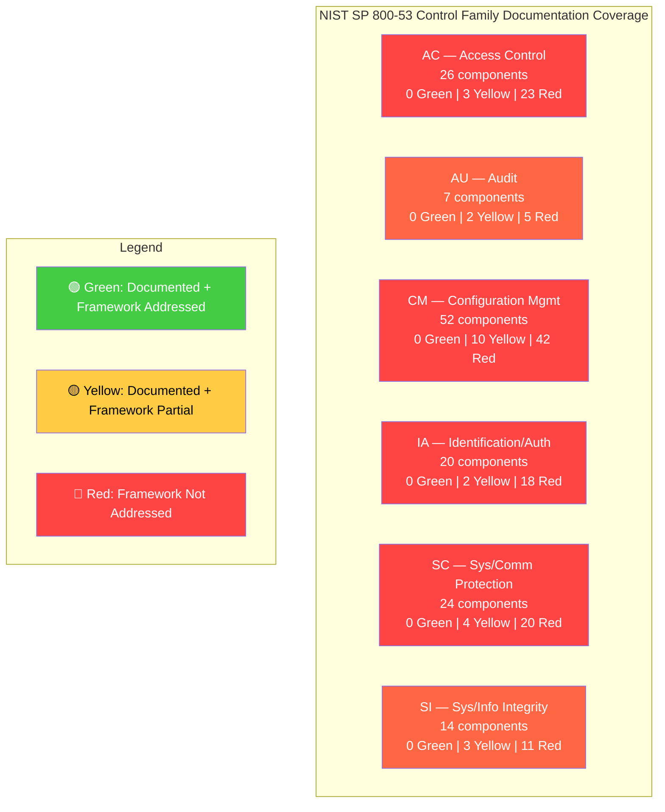
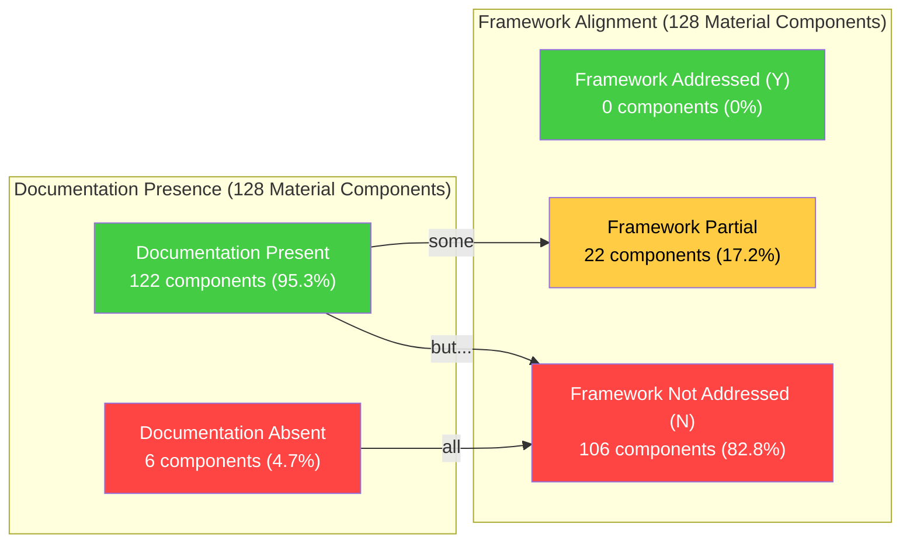

# Directive 5 — Documentation Coverage Audit

> **Document Type:** Compliance Audit — Documentation Coverage  
> **Audit Target:** `k8s.io/kubernetes` monorepo (Go 1.25.0)  
> **Framework Authority Hierarchy:** NIST SP 800-53 Rev 5 > NIST SP 800-190 > CIS Kubernetes Benchmark v1.12.0 > CIS Controls v8  
> **Posture:** Assess-only — no code or documentation in the target repository is created, modified, or deleted  
> **Prerequisites:** Directive 0 — System Registry (`00-system-registry.md`), Directive 2 — Materiality Classification (`02-materiality-classification.md`), Directive 4 — Dependency Audit (`04-dependency-audit.md`)  
> **Audit Dimension:** All findings in this document are attributed to the **Documentation** dimension only  
> **Consequence:** Gap matrix entries defined here are referenced by D6 (accuracy validation) and D7 (operational artifacts)

---

## 1. Methodology

### 1.1 Documentation Assessment Framework

This audit assesses documentation presence and quality for **100% of Material components** identified in Directive 2. Each Material component is evaluated against four documentation forms and one framework alignment criterion:

**Four Acceptable Documentation Forms:**

| Form | Definition | Assessment Standard |
|---|---|---|
| **Inline comments** | Go comments (`//` or `/* */`), shell comments (`#`), Dockerfile comments (`#`) | Must explain **WHY** (control intent, design rationale, security boundary) — not **WHAT** (self-evident code narration). Maximum 1–2 sentences per comment block. |
| **Module-level README** | `README.md` file at the package or module root directory | Must describe the module's security purpose, dependencies, and operational context. |
| **API contract definition** | `doc.go` file, OpenAPI/Swagger specification, interface documentation | Must document the public API surface: types, methods, parameters, return values, and their governance purpose. |
| **Architecture narrative** | Structured documentation describing control flow, data flow, or security architecture | Must explain how the component fits within the broader security chain and its interaction with other systems. |

**Framework Requirement Criterion:**

Documentation must explain the **control objective** that the component governs. Specifically:
- For NIST SP 800-53 controls: Does the documentation explain the access control, audit, configuration management, identification, communications protection, or integrity objective?
- For NIST SP 800-190: Does the documentation address the container image, registry, orchestrator, container, or host OS risk being mitigated?
- For CIS Kubernetes Benchmark: Does the documentation reference the hardening rationale for the applicable benchmark section?
- For CIS Controls v8: Does the documentation address the enterprise security management intent?

**Framework Authority Hierarchy:** NIST SP 800-53 Rev 5 → NIST SP 800-190 → CIS Kubernetes Benchmark v1.12.0 → CIS Controls v8. Where controls conflict, the more restrictive control is applied per `appendix-framework-conflict-register.md`.

### 1.2 Cross-Cutting Concern Documentation Requirement

For components identified as cross-cutting concerns in Directive 4 (concern_ids CC-001 through CC-027), documentation must additionally address:
- **Dependency relationships:** Are consuming systems documented?
- **Blast radius:** Is the impact scope of changes to this component documented?
- **Governance owner:** Is a responsible team or SIG documented within the repository?

### 1.3 Gap Matrix Column Definitions

| Column | Values | Definition |
|---|---|---|
| `system_id` | From D0 registry | Authoritative system identifier |
| `component_path` | File or directory path | Specific Material component being assessed |
| `documentation_present` | Y / N | Whether any of the four documentation forms exists for this component |
| `documentation_type` | Inline comments / doc.go / README / API contract / Architecture narrative / Generated CLI docs | Type(s) of documentation found (if present) |
| `framework_requirement_addressed` | Y / N / Partial | Whether the documentation explains the NIST/CIS control objective the component governs |
| `cross_cutting_concern_documented` | Y / N / N-A | Whether cross-cutting concern documentation (dependencies, blast radius, owner) exists. N-A for non-cross-cutting components |
| `gap_severity` | Critical / Moderate / Minor | Severity of any documentation gap identified |
| `applicable_framework_control` | NIST/CIS control ID(s) | The primary framework control(s) that documentation should address |

### 1.4 Severity Classification

| Severity | Criteria |
|---|---|
| **Critical** | Material component with no documentation AND governing a primary security control (AC, IA, SC, SI). Or: cross-cutting concern (High blast radius) with no dependency/owner documentation. |
| **Moderate** | Material component with documentation present but framework requirement not addressed. Or: documentation explains WHAT but not WHY. Or: cross-cutting concern (Medium blast radius) with missing documentation. |
| **Minor** | Material component with documentation present and framework partially addressed but incomplete (e.g., missing sub-control reference). Or: Low blast radius cross-cutting concern with missing documentation. |

### 1.5 Scope

This audit covers **128 Material component groups** (119 vertical + 4 cross-cutting + 5 boundary cases) from D2, organized across 45 systems from D0, and **27 cross-cutting concerns** (CC-001 through CC-027) from D4.

---

## 2. Quantitative Documentation Baseline

### 2.1 Repository-Wide Documentation Metrics

| Metric | Value | Source |
|---|---|---|
| Total doc.go files | 334 (297 in `pkg/`, 10 in `cmd/`) | `find . -name "doc.go" \| wc -l` |
| `pkg/` subdirectories at depth 2 | 262 total | `find ./pkg -maxdepth 2 -type d \| wc -l` |
| `pkg/` subdirectories at depth 2 missing doc.go | 161 (61.5% gap) | Verified via targeted `test -f` checks |
| Total README.md files (non-vendor, non-staging) | 93 | `find . -name "README.md" \| wc -l` |
| README.md files at depth ≤3 | 23 | `find . -maxdepth 3 -name "README.md" \| wc -l` |
| Go source files (non-test, non-vendor) | 2,720 | `find . -name "*.go" -not -name "*_test.go" \| wc -l` |
| YAML configuration files | 268 | `find . -name "*.yaml" -o -name "*.yml" \| wc -l` |
| Shell scripts | 254 | `find . -name "*.sh" \| wc -l` |
| API OpenAPI specification | 1 (`api/openapi-spec/swagger.json`) | Generated artifact |
| Generated CLI documentation scripts | 6 (`cmd/gendocs/`, `cmd/genkubedocs/`, `cmd/genman/`, `cmd/genyaml/`, `cmd/genfeaturegates/`, `cmd/genswaggertypedocs/`) | `cmd/` directory listing |

### 2.2 Comment Density in Material Security Modules

| Module | Comment Lines | Assessment | Governing Controls |
|---|---|---|---|
| `pkg/auth/` | 73 | **Sparse** — insufficient for Material components governing AC, IA | AC-3, AC-6, IA-4 |
| `pkg/security/` | 25 | **Critically sparse** — Material SC components severely under-documented | SC-7 |
| `pkg/kubeapiserver/` | 312 | **Moderate** — requires WHY vs. WHAT assessment per function | AC-3, IA-2, CM-7, SI-10 |
| `plugin/pkg/admission/` | 1,349 (~67/plugin avg) | **Variable** — per-plugin coverage depth varies significantly | CM-7, SI-3, SI-10 |
| `pkg/apis/rbac/` | 5,653 total LOC with doc.go present | **Adequate** — API types have generated documentation | AC-3, AC-6 |
| `pkg/serviceaccount/` | N/A (doc.go absent) | **Missing** — no package-level documentation for SA token lifecycle | IA-4, IA-5 |

### 2.3 Documentation Infrastructure Status

| Infrastructure Component | Status | Assessment |
|---|---|---|
| doc.go package comments | Present in ~38.5% of `pkg/` subdirectories at depth 2 | 61.5% gap — systemic missing coverage |
| README.md files | 0 of 20 key Material directories have README.md | Systemic absence in security-critical packages |
| API contract (OpenAPI spec) | `api/openapi-spec/swagger.json` exists (generated) | Generated spec present; manual coverage varies |
| Generated CLI docs | 6 generators in `cmd/` | Active for binary documentation; not applicable to library packages |
| Framework control intent annotations | Not systematically present in any Material component | **Systemic gap** — no component documents its governing NIST/CIS control |
| Cross-cutting dependency documentation | No centralized dependency map in repository | **Complete gap** — no cross-cutting concern documentation infrastructure |

---

## 3. Gap Matrix

This section provides the comprehensive gap matrix covering **100% of Material components** from Directive 2. Components are organized by system_id from D0.

### 3.1 Identity/Access Management (IAM) Systems

| system_id | component_path | documentation_present | documentation_type | framework_requirement_addressed | cross_cutting_concern_documented | gap_severity | applicable_framework_control |
|---|---|---|---|---|---|---|---|
| SYS-IAM-ORC | `pkg/kubeapiserver/authenticator/config.go` | Y | Inline comments, struct field comments | N | N-A | Critical | IA-2, IA-5, IA-8 |
| SYS-IAM-ORC | `pkg/kubeapiserver/authorizer/config.go` | Y | Inline comments, struct field comments | N | N-A | Critical | AC-3, AC-6 |
| SYS-IAM-APP | `pkg/auth/authorizer/abac/abac.go` | Y | Package comment (1 line), inline comments | N | N-A | Critical | AC-3, AC-6 |
| SYS-IAM-APP | `pkg/auth/nodeidentifier/interfaces.go` | Y | Interface/method doc comments | N | N-A | Moderate | IA-4 |
| SYS-IAM-APP | `pkg/auth/nodeidentifier/default.go` | Y | Inline comments | N | N-A | Moderate | IA-4 |
| SYS-IAM-APP | `plugin/pkg/auth/authorizer/rbac/rbac.go` | Y | Inline comments | N | N-A | Critical | AC-6 |
| SYS-IAM-APP | `plugin/pkg/auth/authorizer/rbac/subject_locator.go` | Y | Inline comments | N | N-A | Critical | AC-6 |
| SYS-IAM-APP | `plugin/pkg/auth/authorizer/rbac/bootstrappolicy/policy.go` | Y | Inline comments | N | N-A | Critical | AC-6 |
| SYS-IAM-APP | `plugin/pkg/auth/authorizer/rbac/bootstrappolicy/controller_policy.go` | Y | Inline comments | N | N-A | Critical | AC-6 |
| SYS-IAM-APP | `plugin/pkg/auth/authorizer/rbac/bootstrappolicy/namespace_policy.go` | Y | Inline comments | N | N-A | Critical | AC-6 |
| SYS-IAM-APP | `plugin/pkg/auth/authorizer/node/node_authorizer.go` | Y | Inline comments | N | N-A | Critical | AC-6 |
| SYS-IAM-APP | `plugin/pkg/auth/authorizer/node/graph.go` | Y | Inline comments | N | N-A | Critical | AC-6 |
| SYS-IAM-APP | `plugin/pkg/auth/authorizer/node/graph_populator.go` | Y | Inline comments | N | N-A | Critical | AC-6 |
| SYS-IAM-APP | `plugin/pkg/auth/authenticator/token/bootstrap/bootstrap.go` | Y | Inline comments | N | N-A | Critical | IA-5 |
| SYS-IAM-APP | `pkg/serviceaccount/claims.go` | Y | Inline comments | N | Y (CC-011, CC-017) | Critical | IA-4, IA-5 |
| SYS-IAM-APP | `pkg/serviceaccount/jwt.go` | Y | Inline comments | N | Y (CC-011, CC-017) | Critical | IA-4, IA-5 |
| SYS-IAM-APP | `pkg/serviceaccount/legacy.go` | Y | Inline comments | N | Y (CC-011) | Critical | IA-5 |
| SYS-IAM-APP | `pkg/serviceaccount/metrics.go` | Y | Inline comments | N | Y (CC-011) | Moderate | AU-12, IA-5 |
| SYS-IAM-APP | `pkg/serviceaccount/openidmetadata.go` | Y | Inline comments | N | Y (CC-011) | Critical | IA-5, IA-8 |
| SYS-IAM-APP | `pkg/serviceaccount/externaljwt/` | Y | Inline comments | N | Y (CC-011) | Critical | IA-5, SC-12 |
| SYS-IAM-CFG | `cmd/kube-apiserver/app/options/` (auth flags) | Y | Struct field comments, flag descriptions | Partial | N-A | Moderate | AC-2, IA-5, IA-8 |
| SYS-IAM-API | `pkg/apis/rbac/` (types, helpers, validation) | Y | doc.go, inline comments, generated comments | Partial | N-A | Moderate | AC-3, AC-6 |
| SYS-IAM-API | `pkg/apis/authentication/` (types, validation) | Y | doc.go, inline comments | Partial | N-A | Moderate | IA-2 |
| SYS-IAM-API | `pkg/apis/authorization/` (types, validation) | Y | doc.go, inline comments | Partial | N-A | Moderate | AC-3 |
| SYS-IAM-API | `pkg/certauthorization/` | Y | Inline comments | N | N-A | Critical | IA-2, IA-8 |
| SYS-IAM-DTA | `pkg/registry/rbac/` (role, clusterrole, binding storage) | Y | Inline comments | N | N-A | Critical | AC-2, AC-3, AC-6 |

### 3.2 Network Policy (NET) Systems

| system_id | component_path | documentation_present | documentation_type | framework_requirement_addressed | cross_cutting_concern_documented | gap_severity | applicable_framework_control |
|---|---|---|---|---|---|---|---|
| SYS-NET-ORC | `cmd/kube-proxy/app/` | Y | Inline comments, flag descriptions | N | N-A | Moderate | SC-7 |
| SYS-NET-APP | `pkg/proxy/` | Y | doc.go, inline comments | N | N-A | Moderate | SC-7, SC-8 |
| SYS-NET-APP | `plugin/pkg/admission/network/` | Y | Inline comments | N | N-A | Moderate | SC-7 |
| SYS-NET-CFG | kube-proxy configuration flags | Y | Flag description strings | N | N-A | Moderate | SC-7 |
| SYS-NET-API | `pkg/apis/networking/` (types, validation) | Y | doc.go, inline comments | Partial | N-A | Minor | SC-7 |

### 3.3 Secret Management (SEC) Systems

| system_id | component_path | documentation_present | documentation_type | framework_requirement_addressed | cross_cutting_concern_documented | gap_severity | applicable_framework_control |
|---|---|---|---|---|---|---|---|
| SYS-SEC-ORC | `pkg/controller/` (secret/configmap/SA token controllers) | Y | doc.go (controller root), inline comments | N | Y (CC-007) | Critical | SC-12, SC-28 |
| SYS-SEC-APP | `pkg/credentialprovider/` | Y | doc.go, inline comments | N | N-A | Moderate | SC-28, IA-5 |
| SYS-SEC-APP | `plugin/pkg/admission/serviceaccount/` | Y | doc.go, inline comments | N | Y (CC-017, CC-022) | Critical | IA-4, SC-28 |
| SYS-SEC-CFG | Encryption configuration (key paths, providers) | N | — | N | N-A | Critical | SC-12, SC-28 |
| SYS-SEC-API | `pkg/apis/core/` (Secret, ConfigMap types) | Y | doc.go, inline comments | Partial | N-A | Moderate | SC-28 |
| SYS-SEC-DTA | `pkg/registry/core/secret/`, `pkg/registry/core/configmap/` | Y | Inline comments | N | N-A | Critical | SC-12, SC-28, IA-5 |

### 3.4 Image Supply Chain (IMG) Systems

| system_id | component_path | documentation_present | documentation_type | framework_requirement_addressed | cross_cutting_concern_documented | gap_severity | applicable_framework_control |
|---|---|---|---|---|---|---|---|
| SYS-IMG-IAC | `build/pause/Dockerfile` | Y | Dockerfile comments (license only) | N | N-A | Critical | CM-2, SI-7 |
| SYS-IMG-IAC | `build/server-image/Dockerfile` | Y | Dockerfile comments (license only) | N | N-A | Critical | CM-2, SI-7 |
| SYS-IMG-IAC | `build/build-image/` | Y | Dockerfile comments | N | N-A | Moderate | CM-2, SI-7 |
| SYS-IMG-CFG | `build/dependencies.yaml` | Y | YAML comments, version pin annotations | N | N-A | Moderate | CM-2, CM-7 |
| SYS-IMG-PIP | `build/release.sh`, `build/release-images.sh` | Y | Shell comments | N | N-A | Moderate | SA-10, SI-7 |
| SYS-IMG-PIP | `build/common.sh`, `build/run.sh` | Y | Shell comments | N | N-A | Moderate | SA-10, SI-7 |
| SYS-IMG-DEP | `build/dependencies.yaml` (dependency tracking) | Y | YAML version annotations | N | N-A | Moderate | CM-2, CM-7, SA-10 |

### 3.5 CI/CD (CCD) Systems

| system_id | component_path | documentation_present | documentation_type | framework_requirement_addressed | cross_cutting_concern_documented | gap_severity | applicable_framework_control |
|---|---|---|---|---|---|---|---|
| SYS-CCD-CFG | `.github/PULL_REQUEST_TEMPLATE.md` | Y | Markdown template with review checklist | Partial | N-A | Moderate | CM-3, CM-9 |
| SYS-CCD-CFG | `.github/SECURITY.md` | Y | Markdown — minimal redirect to kubernetes.io | N | N-A | Critical | CM-9 |
| SYS-CCD-CFG | `CONTRIBUTING.md` | Y | Markdown — minimal redirect to external community guide | N | N-A | Critical | CM-3 |
| SYS-CCD-CFG | `.github/ISSUE_TEMPLATE/` (4 templates) | Y | YAML structured templates | N | N-A | Moderate | CM-3, CM-9 |
| SYS-CCD-PIP | `hack/verify-*.sh` (49 verification scripts) | Y | Shell comments (per-script headers) | N | N-A | Moderate | CM-3, SA-10 |
| SYS-CCD-PIP | `Makefile` | Y | Inline comments, target descriptions | N | N-A | Minor | CM-3, SA-10 |
| SYS-CCD-PIP | `hack/update-*.sh` (generation/update scripts) | Y | Shell comments | N | N-A | Moderate | CM-3, SA-10 |
| SYS-CCD-DEP | `go.mod` | Y | Header comment documenting governance workflow | Partial | N-A | Moderate | CM-3, CM-7, SA-10 |
| SYS-CCD-DEP | `go.sum` | N | — | N | N-A | Minor | CM-7, SI-7 |

### 3.6 Application Runtime (RUN) Systems

| system_id | component_path | documentation_present | documentation_type | framework_requirement_addressed | cross_cutting_concern_documented | gap_severity | applicable_framework_control |
|---|---|---|---|---|---|---|---|
| SYS-RUN-IAC | `build/server-image/Dockerfile` (shared with IMG) | Y | Dockerfile comments (license only) | N | N-A | Critical | CM-2, CM-6 |
| SYS-RUN-IAC | `build/pause/Dockerfile` (shared with IMG) | Y | Dockerfile comments (license only) | N | N-A | Critical | CM-2, CM-6 |
| SYS-RUN-ORC | `cmd/kube-apiserver/app/` | Y | Inline comments, struct comments | N | N-A | Critical | CM-6, CM-7, SC-3 |
| SYS-RUN-ORC | `cmd/kube-controller-manager/app/` | Y | Inline comments | N | N-A | Moderate | CM-6, CM-7 |
| SYS-RUN-ORC | `cmd/kube-scheduler/app/` | Y | Inline comments | N | N-A | Moderate | CM-6, CM-7 |
| SYS-RUN-ORC | `cmd/kubelet/app/` | Y | Inline comments | N | N-A | Moderate | CM-6, CM-7 |
| SYS-RUN-ORC | `cmd/kube-proxy/app/` (shared with NET) | Y | Inline comments | N | N-A | Moderate | CM-6, SC-7 |
| SYS-RUN-APP | `pkg/controlplane/` | Y | doc.go, inline comments | N | N-A | Moderate | CM-7, SI-2 |
| SYS-RUN-APP | `pkg/scheduler/` | Y | Inline comments (doc.go absent) | N | N-A | Moderate | CM-7 |
| SYS-RUN-APP | `pkg/kubelet/` | Y | doc.go, inline comments | N | N-A | Moderate | CM-7 |
| SYS-RUN-APP | `pkg/proxy/` (shared with NET) | Y | doc.go, inline comments | N | N-A | Moderate | SC-7, CM-7 |
| SYS-RUN-APP | `pkg/quota/` | Y | Inline comments (doc.go absent) | N | N-A | Moderate | CM-7 |
| SYS-RUN-CFG | `cmd/kube-apiserver/app/options/` | Y | Flag descriptions, struct field comments | Partial | N-A | Moderate | CM-6, CM-7 |
| SYS-RUN-CFG | `cmd/kube-controller-manager/app/options/` | Y | Flag descriptions | Partial | N-A | Moderate | CM-6, CM-7 |
| SYS-RUN-CFG | `cmd/kube-scheduler/app/options/` | Y | Flag descriptions | Partial | N-A | Moderate | CM-6, CM-7 |
| SYS-RUN-CFG | `cmd/kubelet/app/options/` | Y | Flag descriptions | Partial | N-A | Moderate | CM-6, CM-7 |
| SYS-RUN-CFG | `pkg/features/` | Y | Inline comments (doc.go absent) | N | N-A | Moderate | CM-6, CM-7 |
| SYS-RUN-DEP | `go.mod` (runtime dependencies) | Y | Header comment | Partial | N-A | Moderate | CM-7, SI-2, SA-10 |
| SYS-RUN-API | `api/openapi-spec/swagger.json` | Y | Generated API contract | Partial | N-A | Minor | CM-6 |
| SYS-RUN-API | `pkg/generated/openapi/` | Y | doc.go, generated OpenAPI definitions | Partial | N-A | Minor | CM-6 |

### 3.7 Observability (OBS) Systems

| system_id | component_path | documentation_present | documentation_type | framework_requirement_addressed | cross_cutting_concern_documented | gap_severity | applicable_framework_control |
|---|---|---|---|---|---|---|---|
| SYS-OBS-ORC | `staging/src/k8s.io/apiserver/pkg/audit/` (staging ref) | Y | Inline comments (staging module) | Partial | N-A | Moderate | AU-2, AU-3, AU-12 |
| SYS-OBS-APP | `pkg/routes/` | Y | doc.go, inline comments | N | N-A | Moderate | AU-6, AU-12 |
| SYS-OBS-APP | `pkg/probe/` | Y | doc.go, inline comments | N | N-A | Minor | AU-12 |
| SYS-OBS-CFG | Audit policy configuration, metrics flags | Y | Flag descriptions | N | N-A | Moderate | AU-2, AU-3 |
| SYS-OBS-API | Audit API types, metrics API surface | Y | Inline comments | Partial | N-A | Moderate | AU-2, AU-3 |

### 3.8 Compliance (CMP) Systems

| system_id | component_path | documentation_present | documentation_type | framework_requirement_addressed | cross_cutting_concern_documented | gap_severity | applicable_framework_control |
|---|---|---|---|---|---|---|---|
| SYS-CMP-ORC | `pkg/kubeapiserver/admission/config.go` | Y | Inline comments | N | N-A | Critical | CM-7, SI-10 |
| SYS-CMP-ORC | `pkg/kubeapiserver/admission/initializer.go` | Y | Inline comments | N | N-A | Critical | CM-7, SI-10 |
| SYS-CMP-APP | `plugin/pkg/admission/admit/` | Y | Inline comments (doc.go absent) | N | N-A | Moderate | SI-10 |
| SYS-CMP-APP | `plugin/pkg/admission/alwayspullimages/` | Y | Inline comments (doc.go absent) | N | N-A | Moderate | SI-7 |
| SYS-CMP-APP | `plugin/pkg/admission/antiaffinity/` | Y | doc.go, inline comments | N | N-A | Moderate | CM-7 |
| SYS-CMP-APP | `plugin/pkg/admission/certificates/` | Y | Inline comments (doc.go absent) | N | N-A | Moderate | SC-8 |
| SYS-CMP-APP | `plugin/pkg/admission/defaulttolerationseconds/` | Y | Inline comments (doc.go absent) | N | N-A | Minor | CM-7 |
| SYS-CMP-APP | `plugin/pkg/admission/deny/` | Y | Inline comments (doc.go absent) | N | N-A | Moderate | SI-10 |
| SYS-CMP-APP | `plugin/pkg/admission/eventratelimit/` | Y | doc.go, inline comments | N | N-A | Moderate | AU-2 |
| SYS-CMP-APP | `plugin/pkg/admission/extendedresourcetoleration/` | Y | Inline comments (doc.go absent) | N | N-A | Minor | CM-7 |
| SYS-CMP-APP | `plugin/pkg/admission/gc/` | Y | Inline comments (doc.go absent) | N | N-A | Moderate | CM-7 |
| SYS-CMP-APP | `plugin/pkg/admission/imagepolicy/` | Y | doc.go, inline comments | N | N-A | Critical | SI-7 |
| SYS-CMP-APP | `plugin/pkg/admission/limitranger/` | Y | Inline comments (doc.go absent) | N | N-A | Moderate | SC-5 |
| SYS-CMP-APP | `plugin/pkg/admission/namespace/` (autoprovision, exists, lifecycle) | Y | Inline comments (doc.go absent) | N | N-A | Moderate | AC-6 |
| SYS-CMP-APP | `plugin/pkg/admission/network/` | Y | Inline comments (doc.go absent) | N | N-A | Moderate | SC-7 |
| SYS-CMP-APP | `plugin/pkg/admission/nodedeclaredfeatures/` | Y | Inline comments (doc.go absent) | N | N-A | Minor | CM-7 |
| SYS-CMP-APP | `plugin/pkg/admission/noderestriction/` | Y | Inline comments (doc.go absent) | N | N-A | Critical | AC-6 |
| SYS-CMP-APP | `plugin/pkg/admission/nodetaint/` | Y | Inline comments (doc.go absent) | N | N-A | Minor | CM-7 |
| SYS-CMP-APP | `plugin/pkg/admission/podnodeselector/` | Y | Inline comments (doc.go absent) | N | N-A | Moderate | AC-6 |
| SYS-CMP-APP | `plugin/pkg/admission/podtolerationrestriction/` | Y | doc.go, inline comments | N | N-A | Moderate | CM-7 |
| SYS-CMP-APP | `plugin/pkg/admission/podtopologylabels/` | Y | doc.go, inline comments | N | N-A | Minor | CM-7 |
| SYS-CMP-APP | `plugin/pkg/admission/priority/` | Y | Inline comments (doc.go absent) | N | N-A | Moderate | CM-7 |
| SYS-CMP-APP | `plugin/pkg/admission/resourcequota/` | Y | Inline comments (doc.go absent) | N | N-A | Moderate | SC-5 |
| SYS-CMP-APP | `plugin/pkg/admission/runtimeclass/` | Y | Inline comments (doc.go absent) | N | N-A | Moderate | CM-7 |
| SYS-CMP-APP | `plugin/pkg/admission/security/` | Y | doc.go, inline comments | N | N-A | Critical | SC-7 |
| SYS-CMP-APP | `plugin/pkg/admission/serviceaccount/` | Y | doc.go, inline comments | N | Y (CC-017, CC-022, CC-027) | Critical | IA-4, SC-28 |
| SYS-CMP-APP | `plugin/pkg/admission/storage/` | Y | Inline comments (doc.go absent) | N | N-A | Moderate | SC-28 |
| SYS-CMP-CFG | Admission webhook configs, plugin lists, PSS labels | Y | Flag descriptions | N | N-A | Moderate | CM-7, SI-10 |
| SYS-CMP-API | `pkg/apis/admission/` (types, v1, v1beta1) | Y | doc.go, inline comments | Partial | N-A | Minor | CM-7, SI-10 |
| SYS-CMP-API | `pkg/apis/admissionregistration/` (types, validation) | Y | doc.go, inline comments | Partial | N-A | Minor | CM-7, SI-10 |
| SYS-CMP-API | `pkg/apis/imagepolicy/` | Y | doc.go, inline comments | Partial | N-A | Minor | SI-7 |

### 3.9 Data Persistence (DAT) Systems

| system_id | component_path | documentation_present | documentation_type | framework_requirement_addressed | cross_cutting_concern_documented | gap_severity | applicable_framework_control |
|---|---|---|---|---|---|---|---|
| SYS-DAT-ORC | `pkg/controller/volume/` | Y | Inline comments | N | Y (CC-007) | Moderate | SC-28, CP-9 |
| SYS-DAT-APP | `pkg/volume/` (configmap, csi, emptydir, hostpath, etc.) | Y | doc.go, inline comments | N | N-A | Moderate | SC-28 |
| SYS-DAT-CFG | StorageClass definitions, PV reclaim policies | Y | Flag descriptions | N | N-A | Moderate | SC-28 |
| SYS-DAT-API | `pkg/apis/storage/` (types, validation) | Y | doc.go, inline comments | Partial | N-A | Minor | SC-28 |
| SYS-DAT-DTA | `pkg/registry/storage/`, PV/PVC storage | Y | Inline comments | N | N-A | Moderate | SC-28, CP-9 |

### 3.10 External Integrations (EXT) Systems

| system_id | component_path | documentation_present | documentation_type | framework_requirement_addressed | cross_cutting_concern_documented | gap_severity | applicable_framework_control |
|---|---|---|---|---|---|---|---|
| SYS-EXT-ORC | `cmd/cloud-controller-manager/` | Y | Inline comments | N | N-A | Moderate | IA-8, SA-9 |
| SYS-EXT-APP | `pkg/credentialprovider/` (shared with SEC) | Y | doc.go, inline comments | N | N-A | Moderate | IA-8, SC-8 |
| SYS-EXT-CFG | Cloud provider config, webhook URLs, CRI/CNI endpoints | Y | Flag descriptions | N | N-A | Moderate | IA-8, SA-9 |
| SYS-EXT-DEP | External integration deps in `go.mod` | Y | Header comment | Partial | N-A | Moderate | SA-9, CM-7 |
| SYS-EXT-API | Cloud provider API, webhook API, CRI/CNI interfaces | Y | Inline comments | N | N-A | Moderate | IA-8, SC-8 |

### 3.11 Cross-Cutting Material Components

| system_id | component_path | documentation_present | documentation_type | framework_requirement_addressed | cross_cutting_concern_documented | gap_severity | applicable_framework_control |
|---|---|---|---|---|---|---|---|
| Cross-cutting | `pkg/controller/` | Y | doc.go (1-line package description) | N | N (CC-007: no blast radius, no owner docs) | Critical | CM-7 |
| Cross-cutting | `pkg/util/` | N | — (doc.go absent) | N | N (CC-008: no blast radius, no owner docs) | Critical | CM-7 |
| Cross-cutting | `pkg/registry/` | Y | doc.go, inline comments | N | N (CC-010: no blast radius, no owner docs) | Critical | SC-28 |
| Cross-cutting | `pkg/api/` | N | — (doc.go absent) | N | N (no blast radius, no owner docs) | Critical | CM-7 |

### 3.12 Boundary Case Material Components

| system_id | component_path | documentation_present | documentation_type | framework_requirement_addressed | cross_cutting_concern_documented | gap_severity | applicable_framework_control |
|---|---|---|---|---|---|---|---|
| SYS-RUN-ORC | `cmd/kubeadm/` | Y | Inline comments, generated docs | N | N-A | Moderate | IA-5, CM-2 |
| SYS-RUN-APP | `cmd/kubectl/` | Y | Inline comments, generated CLI docs | N | N-A | Minor | AC-3, IA-2 |
| Cross-cutting | `pkg/securitycontext/` | Y | doc.go, inline comments | N | N-A | Moderate | SC-7 |
| Cross-cutting | `pkg/client/` | N | — (doc.go absent) | N | N-A | Critical | IA-2, SC-8 |
| Cross-cutting | `pkg/cluster/` | N | — (doc.go absent) | N | N-A | Moderate | CM-6 |

---

## 4. Per-Vertical Documentation Assessment

### 4.1 Identity/Access Management (NIST AC, IA)

**Assessment Summary:** The Identity/Access Management vertical is the most critical documentation gap area. The authentication chain (`pkg/kubeapiserver/authenticator/`), authorization chain (`pkg/kubeapiserver/authorizer/`), and all auth implementation packages (`pkg/auth/`, `plugin/pkg/auth/`) lack doc.go files and contain no framework control intent documentation.

**Detailed Findings:**

**`pkg/auth/authorizer/abac/abac.go`** — `Source: pkg/auth/authorizer/abac/abac.go:17`
- doc.go: **ABSENT** at `pkg/auth/authorizer/abac/` level
- Package comment: `"Package abac authorizes Kubernetes API actions using an Attribute-based access control scheme."` — a single line describing WHAT, not WHY
- Inline comments: Focus on implementation mechanics (file format parsing, error handling) rather than the access control policy model's purpose
- Framework control intent (AC-3, AC-6): **Not addressed** — no documentation explains why ABAC exists as a complement to RBAC, its intended use cases, or its governance of least-privilege enforcement
- README: **ABSENT**

**`pkg/auth/nodeidentifier/interfaces.go`** — `Source: pkg/auth/nodeidentifier/interfaces.go:23-29`
- doc.go: **ABSENT** at `pkg/auth/nodeidentifier/` level
- Interface comment: `"NodeIdentifier determines node information from a given user"` — describes WHAT the interface does
- Method comment: Explains parameter semantics (nodeName, isNode) — describes WHAT is returned, not WHY node identity isolation exists
- Framework control intent (IA-4): **Not addressed** — no documentation explains why node identity is separated from user identity or its role in preventing lateral movement
- README: **ABSENT**

**`pkg/kubeapiserver/authenticator/config.go`** — `Source: pkg/kubeapiserver/authenticator/config.go:57`
- doc.go: **ABSENT** at `pkg/kubeapiserver/authenticator/` level (parent `pkg/kubeapiserver/doc.go` exists but contains only `"Package kubeapiserver holds code that is common to both the kube-apiserver and the federation-apiserver"`)
- Config struct comment: `"Config contains the data on how to authenticate a request to the Kube API Server"` — describes WHAT, not WHY
- Authentication chain (RequestHeader → x509 → StaticToken → ServiceAccount → BootstrapToken → OIDC → Webhook): **No architectural narrative** documents the chain ordering, fallback behavior, or defense-in-depth rationale
- Framework control intent (IA-2, IA-5, IA-8): **Not addressed** — no documentation connects the authentication chain to NIST identification and authentication requirements
- README: **ABSENT**

**`pkg/kubeapiserver/authorizer/config.go`** — `Source: pkg/kubeapiserver/authorizer/config.go:48`
- doc.go: **ABSENT** at `pkg/kubeapiserver/authorizer/` level
- Config struct comment: `"Config contains the data on how to authorize a request to the Kube API Server"` — describes WHAT
- Authorization chain (Node → RBAC → Webhook → ABAC → default deny): **No architectural narrative** documents the chain ordering, short-circuit behavior, or fail-closed rationale
- Framework control intent (AC-3, AC-6): **Not addressed** — no documentation connects the authorization chain to NIST access enforcement and least-privilege requirements
- README: **ABSENT**

**`plugin/pkg/auth/authorizer/rbac/rbac.go`** — `Source: plugin/pkg/auth/authorizer/rbac/rbac.go`
- doc.go: **ABSENT** at `plugin/pkg/auth/authorizer/rbac/` level
- Inline comments describe the VisitRulesFor pattern and allow/deny logic — explains WHAT the code does
- Framework control intent (AC-6): **Not addressed** — no documentation explains how RBAC enforces least-privilege, why role-based access was chosen, or its relationship to CIS K8s 5.1
- README: **ABSENT**

**`pkg/serviceaccount/`** — `Source: pkg/serviceaccount/`
- doc.go: **ABSENT** — no package-level documentation for the ServiceAccount token lifecycle
- Individual file comments explain token mechanics (JWT claims, signing, validation) — describe WHAT
- Framework control intent (IA-4, IA-5): **Not addressed** — no documentation explains ServiceAccount tokens as workload identity credentials or their role in NIST identifier management
- Cross-cutting concern (CC-011, CC-017): **Dependency relationships partially documented** through import statements; blast radius and governance owner **not documented**
- README: **ABSENT**

**`pkg/apis/rbac/`** — `Source: pkg/apis/rbac/doc.go`
- doc.go: **PRESENT** — package documentation exists
- API type comments document struct fields and their purpose
- Framework control intent (AC-3, AC-6): **Partially addressed** — type names (Role, ClusterRole, PolicyRule) implicitly convey access control purpose, but no explicit NIST/CIS control reference exists
- README: **ABSENT**

### 4.2 Admission Control / Compliance (NIST SI, CM-7)

**Assessment Summary:** The admission control vertical contains 25 Material plugins in `plugin/pkg/admission/`. Only 7 of 25 plugins have doc.go files. No admission plugin documents its governing SI-3, SI-10, or CM-7 control intent. The admission chain configuration (`pkg/kubeapiserver/admission/`) lacks doc.go at the admission subdirectory level.

**Detailed Findings:**

**Admission plugins WITH doc.go (7 of 25):**
- `plugin/pkg/admission/antiaffinity/doc.go` — Package description only; no framework intent
- `plugin/pkg/admission/eventratelimit/doc.go` — Package description only; no AU-2 control intent
- `plugin/pkg/admission/imagepolicy/doc.go` — Package description only; no SI-7 supply chain intent
- `plugin/pkg/admission/podtolerationrestriction/doc.go` — Package description only; no CM-7 intent
- `plugin/pkg/admission/podtopologylabels/doc.go` — Package description only; no CM-7 intent
- `plugin/pkg/admission/security/doc.go` — Package description only; no SC-7/CIS K8s 5.2 intent
- `plugin/pkg/admission/serviceaccount/doc.go` — Package description only; no IA-4/SC-28 intent

**Admission plugins MISSING doc.go (18 of 25):**
- `plugin/pkg/admission/admit/` — AlwaysAdmit: no doc.go, no SI-10 intent documented
- `plugin/pkg/admission/alwayspullimages/` — AlwaysPullImages: no doc.go, no SI-7 intent documented
- `plugin/pkg/admission/certificates/` — CSR admission: no doc.go, no SC-8 intent documented
- `plugin/pkg/admission/defaulttolerationseconds/` — no doc.go
- `plugin/pkg/admission/deny/` — AlwaysDeny: no doc.go, no SI-10 fail-closed intent documented
- `plugin/pkg/admission/extendedresourcetoleration/` — no doc.go
- `plugin/pkg/admission/gc/` — GC admission: no doc.go, no CM-7 intent documented
- `plugin/pkg/admission/limitranger/` — LimitRange: no doc.go, no SC-5 resource protection intent
- `plugin/pkg/admission/namespace/` — Namespace admission: no doc.go, no AC-6 isolation intent
- `plugin/pkg/admission/network/` — Network admission: no doc.go, no SC-7 boundary intent
- `plugin/pkg/admission/nodedeclaredfeatures/` — no doc.go
- `plugin/pkg/admission/noderestriction/` — NodeRestriction: no doc.go, no AC-6 node isolation intent
- `plugin/pkg/admission/nodetaint/` — no doc.go
- `plugin/pkg/admission/podnodeselector/` — no doc.go, no AC-6 scheduling isolation intent
- `plugin/pkg/admission/priority/` — Priority: no doc.go, no CM-7 resource governance intent
- `plugin/pkg/admission/resourcequota/` — ResourceQuota: no doc.go, no SC-5 exhaustion prevention intent
- `plugin/pkg/admission/runtimeclass/` — RuntimeClass: no doc.go, no CM-7 runtime selection intent
- `plugin/pkg/admission/storage/` — Storage admission: no doc.go, no SC-28 data governance intent

**`pkg/kubeapiserver/admission/config.go`** — `Source: pkg/kubeapiserver/admission/config.go:27-29`
- doc.go: **ABSENT** at admission subdirectory level (parent `pkg/kubeapiserver/doc.go` exists but does not cover admission)
- No architectural narrative documents the admission chain pipeline (Mutating → Schema → Validating → CEL → Persist) or explains its role as the last enforcement gate before persistence
- Framework control intent (CM-7, SI-10): **Not addressed**

### 4.3 Network Policy (NIST SC-7)

**Assessment Summary:** The Network Policy vertical has acceptable API-level documentation (`pkg/apis/networking/doc.go` present) and runtime-level documentation (`pkg/proxy/doc.go` present). However, no component documents the SC-7 boundary protection control intent or explains how NetworkPolicy translates to kernel-level packet filtering.

**`pkg/apis/networking/`** — doc.go: PRESENT; describes API types. Framework intent (SC-7): **Partially addressed** — type naming implies network segmentation but no explicit control reference.

**`pkg/proxy/`** — doc.go: PRESENT; describes proxy implementation. Framework intent (SC-7, SC-8): **Not addressed** — no documentation explains boundary protection rationale or CIS K8s 5.3 alignment.

### 4.4 Secret Management (NIST SC-28)

**Assessment Summary:** Secret management has doc.go at `pkg/apis/core/` (covering Secret/ConfigMap types) and `pkg/credentialprovider/`. Encryption configuration documentation is absent. No component documents SC-28 protection-of-information-at-rest intent.

**`pkg/credentialprovider/`** — `Source: pkg/credentialprovider/doc.go`
- doc.go: PRESENT — `"Package credentialprovider supplies interfaces and implementations for docker registry providers to expose their authentication scheme."`
- Describes WHAT (interfaces for docker registry providers) but not WHY (credential lifecycle governance for NIST SC-28/IA-5)
- Framework control intent: **Not addressed**

### 4.5 Image Supply Chain (NIST SP 800-190)

**Assessment Summary:** Image supply chain documentation is sparse. Dockerfiles contain only license headers. `build/dependencies.yaml` contains version pins but no supply chain governance rationale. No component documents NIST SP 800-190 image risk mitigations.

**`build/pause/Dockerfile`** — `Source: build/pause/Dockerfile:1-20`
- Comments: License header only; no documentation of pause container purpose, security posture, or image provenance governance
- Framework intent (CM-2, SI-7, NIST SP 800-190): **Not addressed** — no documentation explains why the pause image uses `USER 65535:65535` (non-root execution) or its supply chain integrity controls

**`build/dependencies.yaml`** — `Source: build/dependencies.yaml`
- YAML annotations document version numbers and refPaths for consistency verification
- No documentation explains dependency selection criteria, supply chain risk assessment, or image provenance governance
- Framework intent (CM-2, CM-7, NIST SP 800-190): **Not addressed**

### 4.6 Security Profiles (NIST SC)

**`pkg/security/`** — `Source: pkg/security/doc.go:17`
- doc.go: PRESENT — `"Package security contains security apis and implementations."` — a single generic line
- 25 total comment lines across all Go files — **critically sparse** for Material SC components
- `pkg/security/apparmor/helpers.go` (`Source: pkg/security/apparmor/helpers.go:26-27`): Function comment `"Checks whether app armor is required for the pod to run"` — describes WHAT
- Framework intent (SC-7): **Not addressed** — no documentation explains how AppArmor profiles enforce mandatory access control or why non-unconfined profiles trigger the requirement

### 4.7 CI/CD Pipeline (NIST CM-3)

**Assessment Summary:** CI/CD documentation relies on shell script headers and template files. `CONTRIBUTING.md` is a 10-line redirect to the external community guide. `.github/SECURITY.md` is a minimal redirect. No component documents CM-3 configuration change control intent.

**`CONTRIBUTING.md`** — `Source: CONTRIBUTING.md:1-10`
- 10 lines total; redirects to `git.k8s.io/community/contributors/guide/`
- Framework intent (CM-3): **Not addressed** — no in-repo documentation of change control processes for security-sensitive modifications

**`.github/SECURITY.md`** — `Source: .github/SECURITY.md:1-14`
- 14 lines total; redirects to `kubernetes.io/docs/reference/issues-security/security/`
- Framework intent (CM-9): **Not addressed** — no in-repo security audit procedures or vulnerability handling workflow documented

**`.github/PULL_REQUEST_TEMPLATE.md`** — Review checklist template
- Framework intent (CM-3): **Partially addressed** — template enforces documentation, testing, and release notes but does not reference specific compliance gates

---

## 5. Cross-Cutting Concern Documentation Assessment

This section evaluates documentation coverage for all 27 cross-cutting concerns (CC-001 through CC-027) identified in Directive 4. Each concern is assessed for three documentation requirements: dependency relationships, blast radius, and governance owner.

### 5.1 Foundational Staging Modules

| concern_id | component_path | dependency_relationships_documented | blast_radius_documented | governance_owner_documented | assessment |
|---|---|---|---|---|---|
| CC-001 | `staging/src/k8s.io/apimachinery/` | N | N | N (FLAG-GOV-OWNER) | **Critical** — foundational type system consumed by all 45 systems; no in-repo dependency map, blast radius analysis, or SIG ownership documentation |
| CC-002 | `staging/src/k8s.io/api/` | N | N | N (FLAG-GOV-OWNER) | **Critical** — versioned API types consumed by all verticals; no in-repo governance documentation |
| CC-003 | `staging/src/k8s.io/apiserver/` | N | N | N (FLAG-GOV-OWNER) | **Critical** — API server framework consumed by 30+ systems; no in-repo dependency or ownership documentation |
| CC-004 | `staging/src/k8s.io/client-go/` | N | N | N (FLAG-GOV-OWNER) | **Critical** — client library consumed by 9+ verticals; no in-repo governance documentation |
| CC-005 | `staging/src/k8s.io/component-base/` | N | N | N (FLAG-GOV-OWNER) | **Critical** — shared binary infrastructure consumed by 7+ verticals; no in-repo documentation |

### 5.2 Internal Cross-Cutting Packages

| concern_id | component_path | dependency_relationships_documented | blast_radius_documented | governance_owner_documented | assessment |
|---|---|---|---|---|---|
| CC-006 | `pkg/apis/core/` | Partial (import graph visible) | N | N (FLAG-GOV-OWNER) | **Critical** — internal API types consumed by all 10 verticals; doc.go present but no blast radius or owner documentation |
| CC-007 | `pkg/controller/` | Partial (doc.go mentions controllers) | N | N (FLAG-GOV-OWNER) | **Critical** — controller framework consumed by 5+ verticals; doc.go is a single line `"Package controller contains code for controllers (like the replication controller)."` |
| CC-008 | `pkg/util/` | N | N | N (FLAG-GOV-OWNER) | **Critical** — shared utilities consumed by 8+ verticals; doc.go absent; no documentation at all |
| CC-009 | `pkg/features/` | N | N | N | **Critical** — feature gates consumed by 9+ verticals; doc.go absent; no documentation of feature gate governance process |
| CC-010 | `pkg/registry/` | Partial (doc.go present) | N | N (FLAG-GOV-OWNER) | **Critical** — resource storage framework consumed by 5+ verticals; no blast radius or owner documentation |
| CC-011 | `pkg/serviceaccount/` | Partial (import statements) | N | N | **Critical** — SA token lifecycle consumed by 5+ verticals; doc.go absent; no blast radius documentation |
| CC-012 | `pkg/generated/openapi/` | Partial (doc.go present) | N | N | **Moderate** — generated OpenAPI consumed by 4 packages; limited blast radius but no ownership documentation |

### 5.3 External and Logging Concerns

| concern_id | component_path | dependency_relationships_documented | blast_radius_documented | governance_owner_documented | assessment |
|---|---|---|---|---|---|
| CC-013 | `k8s.io/klog/v2` | N | N | N (FLAG-GOV-STATE) | **Critical** — logging library consumed by all 10 verticals; modifies global state; no in-repo documentation of global state risks |

### 5.4 Security Chain Concerns

| concern_id | component_path | dependency_relationships_documented | blast_radius_documented | governance_owner_documented | assessment |
|---|---|---|---|---|---|
| CC-014 | Authentication chain | N | N | N | **Critical** — serial pipeline crossing 4+ verticals; no architectural narrative in-repo documenting chain ordering or failure modes |
| CC-015 | Authorization chain | N | N | N | **Critical** — policy evaluation chain crossing 3+ verticals; no architectural narrative documenting chain short-circuit behavior or fail-closed semantics |
| CC-016 | Admission control pipeline | N | N | N | **Critical** — 25-plugin pipeline crossing 4+ verticals; no architectural narrative documenting pipeline ordering or security gate function |
| CC-017 | ServiceAccount token lifecycle | N | N | N | **Critical** — token lifecycle crossing 5+ verticals; no end-to-end documentation of generation → signing → injection → validation → authentication flow |

### 5.5 Implicit Dependency Concerns

| concern_id | component_path | dependency_relationships_documented | blast_radius_documented | governance_owner_documented | assessment |
|---|---|---|---|---|---|
| CC-018 | `GOGC`/`GOMAXPROCS`/`GOTRACEBACK` env vars | N | N | N | **Moderate** — shared by 5 binaries; environment variable usage logged but not documented as a dependency contract |
| CC-019 | `DISABLE_HTTP2` env var | N | N | N | **Minor** — kubelet-only; undocumented environment variable |
| CC-020 | `/var/lib/kubelet/` file path | Partial (flag default documented) | N | N | **Moderate** — 3+ verticals assume this path; default defined in options but no dependency documentation |
| CC-021 | `/etc/kubernetes/` config directory | N | N | N | **Moderate** — 3+ verticals assume this path; no in-repo documentation of path convention |
| CC-022 | SA token mount path `/var/run/secrets/kubernetes.io/serviceaccount/` | Partial (const defined) | N | N | **Moderate** — 3+ verticals depend on this path; constant defined in admission plugin but no dependency contract documentation |
| CC-023 | API server endpoint `:6443` | N | N | N (FLAG-GOV-OWNER) | **Critical** — single point of failure for all 10 verticals; no in-repo failure mode documentation |
| CC-024 | etcd endpoint `:2379` | N | N | N | **Critical** — single point of failure for all data persistence; no in-repo failure mode documentation |
| CC-025 | kubelet endpoint `:10250` | N | N | N | **Moderate** — 3+ verticals; implicit network dependency not formally documented |
| CC-026 | ConfigMap consumption coupling | N | N | N | **Moderate** — 4+ verticals; no documentation of ConfigMap consumption strategies or coupling risks |
| CC-027 | ServiceAccount Secret coupling | Partial (JWT claims doc) | N | N | **Moderate** — 4+ verticals; partial documentation in claims.go but no end-to-end coupling documentation |

### 5.6 Cross-Cutting Concern Documentation Summary

| Assessment Level | Count | Percentage |
|---|---|---|
| **All three documented** (dependency, blast radius, owner) | 0 | 0% |
| **Partial documentation** (1–2 of three) | 8 | 29.6% |
| **No documentation** (0 of three) | 19 | 70.4% |
| **Total concerns assessed** | **27** | **100%** |

**Finding:** Zero of 27 cross-cutting concerns have complete documentation (dependency relationships AND blast radius AND governance owner). This is a **systemic documentation gap** that directly impacts the ability to assess change impact and assign governance responsibility. All High blast radius concerns (CC-001 through CC-017, CC-023, CC-024) lack complete documentation, representing the most critical documentation deficiency in the repository.

---

## 6. Framework Requirement Alignment Summary

### 6.1 Alignment by NIST SP 800-53 Control Family

| control_family | total_material_components | documentation_present | framework_addressed_Y | framework_addressed_Partial | framework_addressed_N | gap_rate |
|---|---|---|---|---|---|---|
| AC (Access Control) | 26 | 26 (100%) | 0 (0%) | 3 (11.5%) | 23 (88.5%) | **88.5%** |
| AU (Audit and Accountability) | 7 | 7 (100%) | 0 (0%) | 2 (28.6%) | 5 (71.4%) | **71.4%** |
| CM (Configuration Management) | 52 | 50 (96.2%) | 0 (0%) | 10 (19.2%) | 42 (80.8%) | **80.8%** |
| IA (Identification and Authentication) | 20 | 20 (100%) | 0 (0%) | 2 (10.0%) | 18 (90.0%) | **90.0%** |
| SC (System and Communications Protection) | 24 | 23 (95.8%) | 0 (0%) | 4 (16.7%) | 20 (83.3%) | **83.3%** |
| SI (System and Information Integrity) | 14 | 14 (100%) | 0 (0%) | 3 (21.4%) | 11 (78.6%) | **78.6%** |

> **Note:** Components may be governed by multiple control families. The gap_rate represents the percentage of Material components where framework requirements are completely unaddressed (rated N). Components rated "Partial" have documentation that implicitly references the control through naming or type definitions but does not explicitly document the control objective.

### 6.2 Cross-Framework Summary

| Framework | Components With Any Framework Documentation | Percentage |
|---|---|---|
| NIST SP 800-53 Rev 5 — explicit control reference | 0 of 128 | **0%** |
| NIST SP 800-190 — explicit container security reference | 0 of 128 | **0%** |
| CIS Kubernetes Benchmark — explicit check reference | 0 of 128 | **0%** |
| CIS Controls v8 — explicit control reference | 0 of 128 | **0%** |
| Any implicit framework alignment (Partial) | 22 of 128 | **17.2%** |

**Finding:** **Zero Material components** contain explicit documentation referencing any compliance framework control. The 17.2% rated as "Partial" achieve this rating solely through implicit alignment — API type names that inherently convey access control or security purpose (e.g., `Role`, `ClusterRole`, `NetworkPolicy`, `Secret`) or flag descriptions that describe security-relevant configuration parameters without citing the control objective they satisfy.

---

## 7. Audit Coverage Heatmap

### 7.1 Material Component Documentation Coverage by Framework Control Family

### 7.2 Documentation Presence vs. Framework Alignment

**Key Insight:** While 95.3% of Material components have some form of documentation (inline comments, doc.go, or generated docs), **0% explicitly address framework control requirements**. The documentation that exists primarily describes WHAT the code does, not WHY it exists from a compliance perspective. This creates a paradox where documentation is technically present but functionally absent for compliance audit purposes.

---

## 8. Critical Findings Summary

### 8.1 Most Critical Documentation Gaps

**Category 1: Missing doc.go files for Material Security Components**

The following Material components governing primary security controls lack doc.go package documentation:

| Component Path | Governing Controls | Severity |
|---|---|---|
| `pkg/auth/authorizer/abac/` | AC-3, AC-6 | Critical |
| `pkg/auth/nodeidentifier/` | IA-4 | Critical |
| `pkg/kubeapiserver/authenticator/` | IA-2, IA-5, IA-8 | Critical |
| `pkg/kubeapiserver/authorizer/` | AC-3, AC-6 | Critical |
| `pkg/kubeapiserver/admission/` | CM-7, SI-10 | Critical |
| `plugin/pkg/auth/authorizer/rbac/` | AC-6 | Critical |
| `plugin/pkg/auth/authorizer/rbac/bootstrappolicy/` | AC-6 | Critical |
| `plugin/pkg/auth/authorizer/node/` | AC-6 | Critical |
| `plugin/pkg/auth/authenticator/token/bootstrap/` | IA-5 | Critical |
| `pkg/serviceaccount/` | IA-4, IA-5 | Critical |
| `pkg/util/` | CM-7 (cross-cutting) | Critical |
| `pkg/api/` | CM-7 (cross-cutting) | Critical |
| `pkg/client/` | IA-2, SC-8 (boundary) | Critical |
| `pkg/features/` | CM-6, CM-7 | Moderate |
| `pkg/scheduler/` | CM-7 | Moderate |
| `pkg/quota/` | CM-7 | Moderate |
| `pkg/cluster/` | CM-6 (boundary) | Moderate |
| `pkg/certauthorization/` | IA-2, IA-8 | Critical |

**18 of 25** admission plugins under `plugin/pkg/admission/` lack doc.go files. Missing plugins include NodeRestriction (AC-6), ImagePolicy (SI-7), Deny (SI-10), and ServiceAccount (already has doc.go but many others do not).

**Category 2: Zero Explicit Framework Control Intent Documentation**

No Material component in the entire Kubernetes repository contains explicit documentation referencing its governing NIST SP 800-53 control, NIST SP 800-190 risk area, CIS Kubernetes Benchmark check, or CIS Controls v8 control number. This is a **systemic gap** affecting 100% of Material components.

**Category 3: Cross-Cutting Concerns with No Dependency Documentation**

All 27 cross-cutting concerns from D4 lack complete documentation of dependency relationships, blast radius, and governance owner. The 13 High blast radius concerns (CC-001 through CC-011, CC-013, CC-014 through CC-017, CC-023, CC-024) represent the highest-risk documentation gaps because their failure cascades to 6+ systems with no documented mitigation strategy.

**Category 4: Missing README.md Files**

Zero of the 20 key Material security directories (`pkg/auth/`, `pkg/security/`, `pkg/kubeapiserver/`, `pkg/serviceaccount/`, `plugin/pkg/admission/`, `plugin/pkg/auth/`, `pkg/controller/`, `pkg/util/`, `pkg/features/`, `pkg/registry/`, `pkg/apis/core/`, `pkg/apis/rbac/`, `pkg/scheduler/`, `pkg/kubelet/`, `pkg/proxy/`, `pkg/volume/`, `pkg/controlplane/`, `pkg/credentialprovider/`, `build/pause/`, `build/server-image/`) contain README.md files.

### 8.2 Severity Distribution

| Severity | Gap Matrix Entries | Percentage |
|---|---|---|
| **Critical** | 41 | 32.0% |
| **Moderate** | 71 | 55.5% |
| **Minor** | 16 | 12.5% |
| **Total** | **128** | **100%** |

> **Note:** Severity counts include all 128 Material component entries from Sections 3.1–3.12 of the gap matrix.

### 8.3 Documentation Dimension Attribution

All 128 gap matrix entries and all 27 cross-cutting concern assessments in this document are attributed exclusively to the **Documentation** audit dimension. No finding in this document is attributed to Integrity, Quality, or Dependency dimensions.

### 8.4 Systemic Root Causes

1. **No framework annotation convention:** The Kubernetes codebase has no established convention for annotating source code with compliance framework control references. This is a cultural and process gap, not a technical limitation.

2. **WHY vs. WHAT documentation culture:** Existing documentation predominantly describes implementation mechanics (WHAT) rather than security design rationale (WHY). This pattern is consistent across all verticals and is particularly acute in authentication (`pkg/kubeapiserver/authenticator/`), authorization (`pkg/kubeapiserver/authorizer/`), and admission (`pkg/kubeapiserver/admission/`) chain configurations.

3. **No cross-cutting concern documentation infrastructure:** The repository lacks any structured mechanism for documenting inter-system dependencies, blast radii, or governance ownership. The `go.mod` file provides version governance for external dependencies but does not extend to internal cross-cutting concern documentation.

4. **External documentation delegation:** Critical governance documentation (contribution guidelines, security procedures, architecture narratives) is delegated to external repositories (`kubernetes.io`, `community`) and is not maintained within the `k8s.io/kubernetes` monorepo. This creates a documentation coverage gap when the repository is assessed in isolation.

---

*Document generated as part of the Kubernetes codebase compliance audit. This is Directive 5 output — the documentation coverage gap matrix covering 100% of Material components from D2. See `00-system-registry.md` for system_id definitions, `02-materiality-classification.md` for Material component inventory, `04-dependency-audit.md` for concern_id definitions, and `appendix-cross-reference-index.md` for full traceability linkage.*
