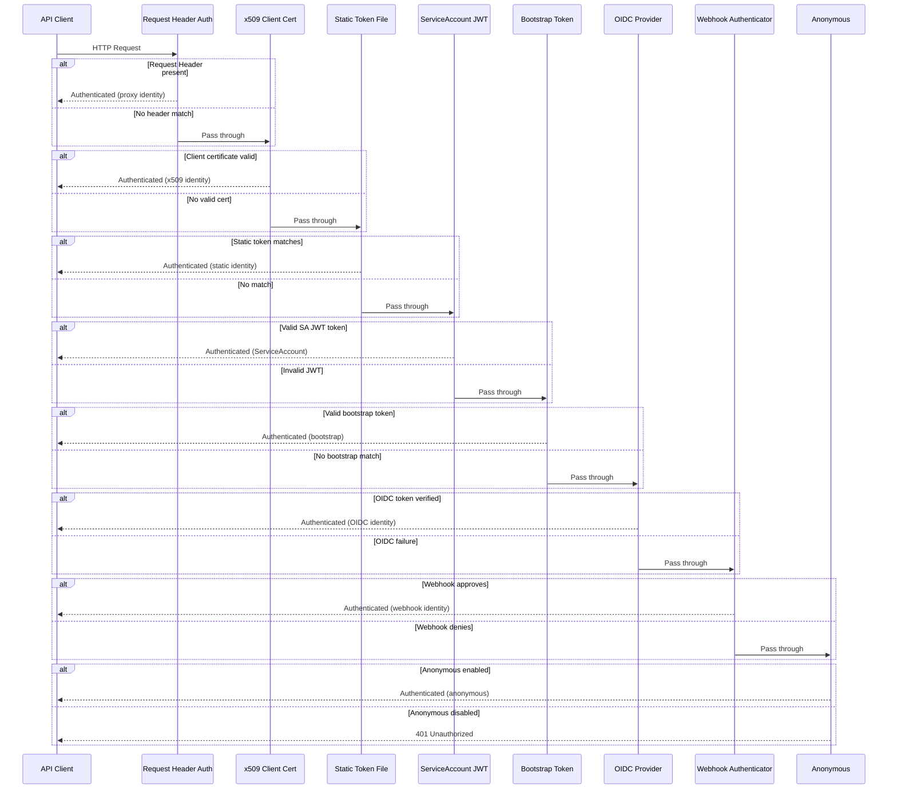
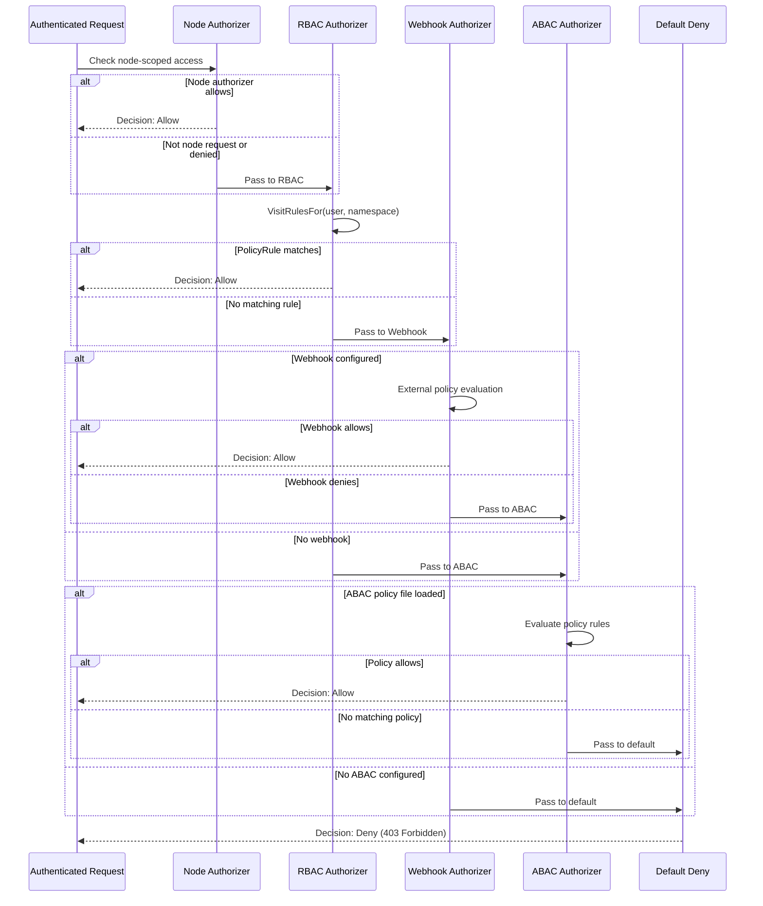
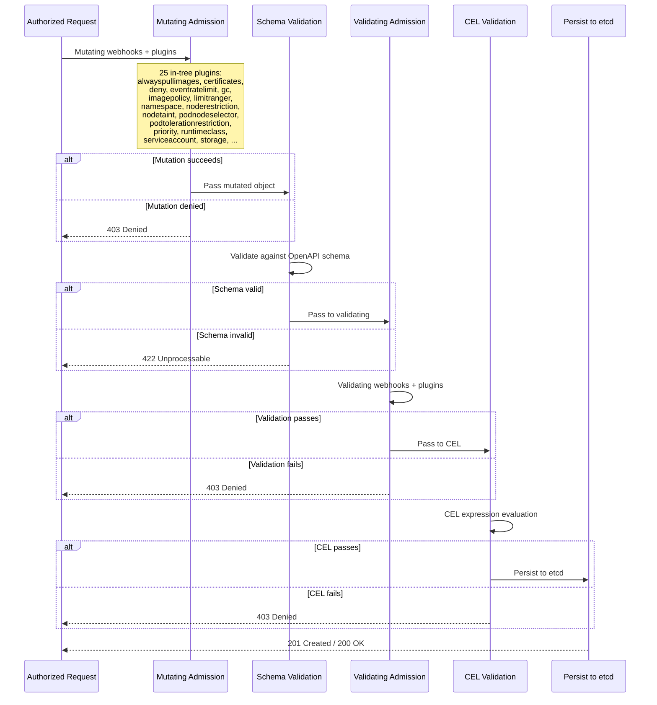
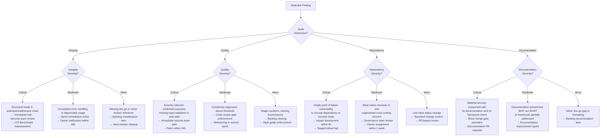

# Directive 7 — Artifact 1: Operational Audit Flowchart & Narrative

> **Document Type:** Operational — Auditor/Operator Guide  
> **Audit Target:** `k8s.io/kubernetes` monorepo (Go 1.25.0)  
> **Framework Authority Hierarchy:** NIST SP 800-53 Rev 5 > NIST SP 800-190 > CIS Kubernetes Benchmark v1.12.0 > CIS Controls v8  
> **Posture:** Assess-only — no code or documentation in the target repository is created, modified, or deleted  
> **Prerequisites:** Directives 0–6 (`00-system-registry.md` through `06-accuracy-validation.md`)  
> **Audience:** Security auditors, compliance operators, platform engineering leads  
> **Structural Framework:** NIST Cybersecurity Framework (CSF) — Identify / Protect / Detect / Respond / Recover  
> **Audit Dimensions:** Integrity (D1), Quality (D3), Dependency (D4), Documentation (D5)

---

## 1. Purpose and Scope

This document provides auditors and operators with a structured operational guide for evaluating the security posture of the Kubernetes monorepo (`k8s.io/kubernetes`). The guide is organized by the five NIST Cybersecurity Framework (CSF) functions — **Identify**, **Protect**, **Detect**, **Respond**, and **Recover** — with sub-lanes per audit dimension to enable traceable, repeatable security assessments.

### 1.1 NIST CSF Functions

| CSF Function | Objective | Primary Audit Activities |
|---|---|---|
| **Identify** | Develop organizational understanding of systems, assets, data, and capabilities | System registry review (D0), asset inventory validation, dependency mapping (D4), blast radius assessment |
| **Protect** | Implement appropriate safeguards for critical infrastructure services | RBAC validation, NetworkPolicy verification, image signing, secret management, code quality gates (D3), dependency governance (D4) |
| **Detect** | Implement appropriate activities to identify cybersecurity events | Audit logging verification, admission controller status (D1), code smell regression (D3), cross-cutting change detection (D4) |
| **Respond** | Implement appropriate activities to take action regarding detected events | Drift detection, escalation decision trees, incident classification by severity |
| **Recover** | Implement appropriate activities to maintain plans for resilience and restore capabilities | Rollback verification, recovery step existence and testing confirmation |

### 1.2 Audit Dimensions

Each finding in this narrative is attributed to exactly one audit dimension:

| Dimension | Source Directive | Scope |
|---|---|---|
| **Integrity** | D1 (`01-structural-integrity.md`) | Broken cross-references, orphaned configs, missing env vars, dangling dependencies, unreachable code, incomplete error handling |
| **Quality** | D3 (`03-code-quality-audit.md`) | Code smells, complexity metrics, security-relevant quality issues |
| **Dependency** | D4 (`04-dependency-audit.md`) | Inter-system dependencies, cross-cutting concerns, blast radius, circular dependencies |
| **Documentation** | D5 (`05-documentation-coverage.md`) | Inline comments, doc.go coverage, README presence, framework control alignment |

### 1.3 Accuracy Assurance

All findings referenced in this narrative have been validated through Directive 6 (`06-accuracy-validation.md`). The aggregate audit accuracy is **97.5%** (154 accurate / 158 total validations), exceeding the ≥87% threshold with a 10.5 percentage-point margin. One system (SYS-IAM-ORC) individually scored 75.0% due to import count discrepancies in D3; qualitative conclusions for that system remain directionally correct.

### 1.4 Cross-Reference Convention

- **system_id** references: Sourced from D0 (`00-system-registry.md`), 45 systems across 10 verticals × 8 horizontals
- **concern_id** references: Sourced from D4 (`04-dependency-audit.md`), CC-001 through CC-027
- **Gap matrix** references: Sourced from D5 (`05-documentation-coverage.md`), Section 3
- **Source citations**: Format `Source: /path/to/file.go:LineNumber` referencing actual Kubernetes repository files
- **Framework conflicts**: Resolved per `appendix-framework-conflict-register.md`

---

## 2. NIST CSF Swimlane Flowchart

The following Mermaid diagram provides the primary operational flowchart for this audit. Each swimlane represents one NIST CSF function. Within each function, audit activities are organized by audit dimension with decision nodes indicating PASS/FAIL checkpoints based on audit findings.

```mermaid
flowchart TD
    subgraph IDENTIFY ["IDENTIFY — Asset & Risk Discovery"]
        direction TB

        subgraph ID_INT ["Integrity Dimension"]
            I1["I-1: System Registry Review<br/>45 systems from D0<br/>10 verticals × 8 horizontals"]
            I2["I-2: Static/Dynamic<br/>Classification Verify<br/>26 Static · 19 Dynamic"]
        end

        subgraph ID_DEP ["Dependency Dimension"]
            I3["I-3: Dependency Map Review<br/>CC-001 – CC-027<br/>27 cross-cutting concerns"]
            I4["I-4: Blast Radius Assessment<br/>10 Single Points of Failure<br/>High: 17 · Medium: 8 · Low: 2"]
        end

        subgraph ID_DOC ["Documentation Dimension"]
            I5["I-5: Asset Inventory<br/>Validation CIS Ctrl 1<br/>2,720 Go · 268 YAML · 254 Shell"]
        end

        I1 --> I2
        I2 --> I3
        I3 --> I4
        I4 --> I5
    end

    subgraph PROTECT ["PROTECT — Safeguard Implementation"]
        direction TB

        subgraph PR_INT ["Integrity Dimension"]
            P1["P-1: Auth Chain Integrity<br/>NIST IA-2 · CIS K8s 3.1<br/>7-stage authentication pipeline"]
            P2["P-2: Authz Chain Integrity<br/>NIST AC-3/AC-6 · CIS K8s 5.1<br/>5-mode authorization pipeline"]
            P3["P-3: Admission Pipeline Integrity<br/>NIST SI-10 · CIS K8s 5.2<br/>25 in-tree admission plugins"]
        end

        subgraph PR_QUAL ["Quality Dimension"]
            P4["P-4: Code Quality Gates<br/>Cyclomatic ≤10 · Coupling ≤7<br/>Nesting ≤3 · Params ≤5"]
            P5{"P-5: Material Component<br/>Quality PASS?"}
        end

        subgraph PR_DEP ["Dependency Dimension"]
            P6["P-6: RBAC Validation<br/>NIST AC-6 · CIS K8s 5.1<br/>Bootstrap policy least-privilege"]
            P7["P-7: NetworkPolicy Verify<br/>NIST SC-7 · CIS K8s 5.3"]
            P8["P-8: Image Signing<br/>NIST SP 800-190<br/>Supply chain integrity"]
            P9["P-9: Secret Management<br/>NIST SC-28 · CIS K8s 5.4<br/>Encryption at rest"]
            P10["P-10: Dependency Governance<br/>NIST CM-3 · CIS Ctrl 2<br/>200 Go deps · 14 ext deps"]
        end

        P1 --> P2
        P2 --> P3
        P3 --> P4
        P4 --> P5
        P5 -->|PASS| P6
        P5 -->|FAIL| P6
        P6 --> P7
        P7 --> P8
        P8 --> P9
        P9 --> P10
    end

    subgraph DETECT ["DETECT — Anomaly & Event Identification"]
        direction TB

        subgraph DT_INT ["Integrity Dimension"]
            D1["D-1: Audit Logging Verify<br/>NIST AU-12 · CIS Ctrl 8<br/>Audit backends assessment"]
            D2["D-2: Admission Controller<br/>Status — 25 plugins<br/>NIST SI-3/SI-10"]
        end

        subgraph DT_QUAL ["Quality Dimension"]
            D3["D-3: Code Smell Regression<br/>Baseline from D3 findings<br/>Security-relevant patterns"]
        end

        subgraph DT_DEP ["Dependency Dimension"]
            D4["D-4: Cross-Cutting Change<br/>Detection — CC-001–CC-027<br/>Shared utility monitoring"]
            D5["D-5: Alert Escalation<br/>Path Definition"]
        end

        D1 --> D2
        D2 --> D3
        D3 --> D4
        D4 --> D5
    end

    subgraph RESPOND ["RESPOND — Incident Handling"]
        direction TB

        subgraph RS_INT ["Integrity Dimension"]
            R1["R-1: Drift Detection<br/>CIS Benchmark Baseline<br/>Configuration comparison"]
        end

        subgraph RS_ALL ["All Dimensions"]
            R2["R-2: Escalation Decision Tree<br/>Per audit dimension<br/>Critical/Moderate/Minor"]
            R3{"R-3: Severity<br/>Classification"}
            R4["R-4: Critical → Immediate<br/>Security team escalation"]
            R5["R-5: Moderate → Tracked<br/>Sprint remediation"]
            R6["R-6: Minor → Backlog<br/>Maintenance window"]
        end

        R1 --> R2
        R2 --> R3
        R3 -->|Critical| R4
        R3 -->|Moderate| R5
        R3 -->|Minor| R6
    end

    subgraph RECOVER ["RECOVER — Restoration & Resilience"]
        direction TB

        subgraph RC_INT ["Integrity Dimension"]
            C1["C-1: Rollback Verification<br/>NIST CP-10 · CIS Ctrl 4<br/>Procedure existence check"]
            C2["C-2: Recovery Step Testing<br/>NIST CP-4<br/>Recovery validation confirm"]
            C3["C-3: Post-Incident Review<br/>Audit dimension alignment<br/>Lessons-learned integration"]
        end

        C1 --> C2
        C2 --> C3
    end

    IDENTIFY --> PROTECT
    PROTECT --> DETECT
    DETECT --> RESPOND
    RESPOND --> RECOVER
```

---

## 3. Security Chain Reference Diagrams

### 3.1 Authentication Chain Sequence

The following diagram illustrates the authentication chain as configured in `pkg/kubeapiserver/authenticator/config.go`. Each API request traverses this serial pipeline until one authenticator succeeds or all fail.

`Source: pkg/kubeapiserver/authenticator/config.go:107-249`

**Audit Finding (Integrity — SYS-IAM-ORC):** When no authenticators succeed and anonymous access is disabled, the authenticator config returns `nil` without an explicit error, producing a silent denial path with no logging. `Source: pkg/kubeapiserver/authenticator/config.go:232-236`. CIS Benchmark: 3.1.

### 3.2 Authorization Chain Sequence

The authorization chain as configured in `pkg/kubeapiserver/authorizer/config.go` evaluates every authenticated request through multiple policy engines.

`Source: pkg/kubeapiserver/authorizer/config.go:82-162`

**Audit Finding (Integrity — SYS-IAM-APP):** The ABAC `verbMatches` function at line 180 contains an unimplemented TODO — it currently allows all read-only requests regardless of the specific verb, meaning verb-level access control granularity is not enforced. `Source: pkg/auth/authorizer/abac/abac.go:180`. CIS Benchmark: 5.1.

**Audit Finding (Quality — SYS-IAM-ORC):** The `Config.New()` function in `pkg/kubeapiserver/authorizer/config.go` exhibits SRP violation — it handles ABAC file loading, RBAC initialization, Node authorizer graph construction, webhook setup, and reloadable resolver creation in a single function. `Source: pkg/kubeapiserver/authorizer/config.go:82-162`.

### 3.3 Admission Control Chain Sequence

The admission control pipeline as configured in `pkg/kubeapiserver/admission/config.go` evaluates every mutating API request through in-tree plugins and external webhooks.

`Source: pkg/kubeapiserver/admission/config.go:27-29`

**Audit Finding (Dependency — CC-016):** The admission control pipeline spans 4+ verticals (SYS-CMP-ORC, SYS-CMP-APP, SYS-IAM-APP, SYS-SEC-APP, SYS-RUN-ORC) with High blast radius — if admission is bypassed or misconfigured, workloads violating security policies can be deployed. `Source: pkg/kubeapiserver/admission/config.go:27-29`.

---

## 4. Identify Function — Asset & Risk Discovery

> **NIST CSF Function:** Identify (ID)  
> **Objective:** Develop the organizational understanding to manage cybersecurity risk to systems, assets, data, and capabilities  
> **Primary Controls:** NIST CM-2, CM-7; CIS Control 1 (Inventory of Enterprise Assets), CIS Control 2 (Inventory of Software Assets)

The Identify function establishes the foundational asset inventory and risk landscape upon which all subsequent audit functions depend. This is the entry point for any audit engagement and must be completed before Protect, Detect, Respond, or Recover activities commence.

### 4.1 System Registry Review (I-1)

**Audit Dimension:** Integrity  
**Applicable Systems:** All 45 system_ids from D0  
**Framework Controls:** NIST CM-2 (Baseline Configuration), CIS Control 1 (Inventory of Enterprise Assets)

The system registry decomposes the Kubernetes monorepo along two orthogonal axes:

- **10 Vertical Domains:** Identity/Access (IAM), Network Policy (NET), Secret Management (SEC), Image Supply Chain (IMG), CI/CD (CCD), Application Runtime (RUN), Observability (OBS), Compliance (CMP), Data Persistence (DAT), External Integrations (EXT)
- **8 Horizontal Layers:** IaC (IAC), Orchestration (ORC), Application Source (APP), Configuration/Environment (CFG), Pipeline Definition (PIP), Dependency/Package (DEP), API/Interface (API), Data Access (DTA)

**Operational Procedure:**

1. Verify that all 45 registered systems in `00-system-registry.md` (Section 4) remain valid by confirming that their `intersection_scope` directories and files exist in the current codebase.
2. Confirm vertical domain boundaries are non-overlapping for single-dimension attribution.
3. Verify that each system_id has a complete five-framework control mapping (NIST 800-53, NIST 800-190, NIST CSF, CIS K8s Benchmark, CIS Controls v8).

**Key Finding Summary:**

| Metric | Value | Source |
|---|---|---|
| Total registered systems | 45 | D0, Section 4 |
| Vertical domains | 10 | D0, Section 2 |
| Horizontal layers | 8 | D0, Section 3 |
| Valid intersections | 45 of 80 possible | D0, Section 1.1 |
| Systems with complete framework mapping | 45 (100%) | D0, Section 6.2 |

### 4.2 Static/Dynamic Classification Verification (I-2)

**Audit Dimension:** Integrity  
**Applicable Systems:** All 45 system_ids  
**Framework Controls:** NIST CM-2, CIS Control 1

Each system is classified as Static (state determined at build/deploy time) or Dynamic (state changes at runtime). This classification directly governs Directive 6 sampling methodology:

| Classification | Count | D6 Sampling Rule |
|---|---|---|
| Static | 26 systems | Exactly 1 instance sampled per system |
| Dynamic | 19 systems | 10–25 instances sampled per system |

**Operational Procedure:**

1. For each Static system, verify that its components are deterministic given inputs and change only through explicit commit/release cycles.
2. For each Dynamic system, verify that its components process requests, make runtime decisions, or change state during operation.
3. Cross-reference classification against D6 sampling results to confirm appropriate sample sizes were applied.

**Key Static Systems (examples):**
- SYS-IAM-CFG — Auth configuration set at startup; requires restart to change
- SYS-IMG-IAC — Dockerfiles are declarative build definitions
- SYS-CCD-PIP — Verification scripts committed and PR-reviewed
- SYS-RUN-DEP — Runtime dependencies pinned and vendored

**Key Dynamic Systems (examples):**
- SYS-IAM-ORC — Auth chains evaluate every API request at runtime
- SYS-CMP-APP — 25 admission plugins evaluate workloads at runtime
- SYS-SEC-DTA — Secret encryption/decryption at runtime on every etcd operation
- SYS-OBS-ORC — Audit logging processes every API request at runtime

### 4.3 Dependency Map Review (I-3)

**Audit Dimension:** Dependency  
**Applicable Systems:** All systems consuming or producing cross-cutting dependencies  
**Applicable Concern IDs:** CC-001 through CC-027  
**Framework Controls:** NIST CM-3 (Configuration Change Control), NIST CM-7 (Least Functionality), CIS Control 2 (Inventory of Software Assets)

The dependency audit (D4) identified 27 cross-cutting concerns spanning compile-time imports, runtime dependencies, implicit coupling, and environment variable sharing.

**Operational Procedure:**

1. Review the inter-system dependency matrix (D4, Section 2.2) to understand compile-time and runtime dependency flows.
2. Verify that each cross-cutting concern (CC-001 through CC-027) has a documented blast radius score.
3. Identify concerns flagged with governance markers: FLAG-GOV-OWNER (no documented owner), FLAG-GOV-PIN (no pinned version), FLAG-GOV-STATE (modifies global state), FLAG-GOV-AUTH (missing auth enforcement).
4. Cross-reference concern_ids against the D5 gap matrix to verify documentation status.

**Dependency Categories Identified:**

| Category | Count | Blast Radius Distribution |
|---|---|---|
| Foundational staging modules (CC-001 to CC-005) | 5 | All High |
| Internal cross-cutting packages (CC-006 to CC-012) | 7 | 6 High, 1 Medium |
| External logging/observability (CC-013) | 1 | High |
| Security chain concerns (CC-014 to CC-017) | 4 | All High |
| Environment variable coupling (CC-018, CC-019) | 2 | 1 Medium, 1 Low |
| File path coupling (CC-020 to CC-022) | 3 | All Medium |
| Network endpoint coupling (CC-023 to CC-025) | 3 | 2 High, 1 Medium |
| ConfigMap/Secret coupling (CC-026, CC-027) | 2 | All Medium |

### 4.4 Blast Radius Assessment (I-4)

**Audit Dimension:** Dependency  
**Framework Controls:** NIST CM-7, NIST SC-5 (Denial of Service Protection), CIS Control 2

The blast radius assessment identifies components whose failure or compromise would cascade across multiple systems. D4 identified **10 single points of failure** — cross-cutting concerns with High blast radius and no in-repo failover mechanism.

**Operational Procedure:**

1. Review the blast radius scoring table (D4, Section 7.1) for all 27 concerns.
2. Prioritize review of the 10 single points of failure (D4, Section 7.2).
3. For each High-blast-radius concern, assess whether mitigation strategies exist in the codebase.
4. Flag any concern where mitigation is absent for escalation under the Respond function.

**Single Points of Failure (from D4):**

| concern_id | Description | Systems Affected |
|---|---|---|
| CC-001 | `k8s.io/apimachinery` — foundational type system | 45 (all systems) |
| CC-002 | `k8s.io/api` — versioned API types | 45 (all systems) |
| CC-003 | `k8s.io/apiserver` — API server framework | 30+ systems |
| CC-006 | `pkg/apis/core/` — internal API types | 40+ systems |
| CC-010 | `pkg/registry/` — resource storage framework | 15+ systems |
| CC-013 | `k8s.io/klog/v2` — structured logging (global state) | 45 (all systems) |
| CC-015 | Authorization chain — all API access control | 10+ systems |
| CC-016 | Admission control pipeline — all policy enforcement | 10+ systems |
| CC-023 | API server endpoint `:6443` — cluster connectivity | 45 (all systems) |
| CC-024 | etcd endpoint `:2379` — persistent state | 10+ systems |

### 4.5 Asset Inventory Validation (I-5)

**Audit Dimension:** Documentation  
**Framework Controls:** CIS Control 1 (Inventory of Enterprise Assets), NIST CM-2

The asset inventory validation confirms the completeness of the codebase inventory used as the audit baseline.

**Verified Asset Inventory:**

| Asset Type | Count | Verification Method |
|---|---|---|
| Go source files (non-test, non-vendor) | 2,720 | `find . -name "*.go" -not -name "*_test.go"` |
| Go test files | 1,119 | `find . -name "*_test.go"` |
| YAML/YML configuration files | 268 | `find . -name "*.yaml" -o -name "*.yml"` |
| Shell scripts | 254 | `find . -name "*.sh"` |
| Verification scripts | 49 | `find ./hack -name "verify-*.sh"` |
| Dockerfiles | 46 | `find . -name "Dockerfile*"` |
| doc.go files | 334 (297 in `pkg/`, 10 in `cmd/`) | `find . -name "doc.go"` |
| README.md files (non-vendor, non-staging) | 93 | `find . -name "README.md"` |
| OpenAPI specification | 1 (95,900 lines) | `api/openapi-spec/swagger.json` |
| Go module dependencies | 200 (108 direct + 92 indirect) | `go.mod` analysis |
| External dependency version pins | 14 | `build/dependencies.yaml` |

---

## 5. Protect Function — Safeguard Implementation

> **NIST CSF Function:** Protect (PR)  
> **Objective:** Implement appropriate safeguards to ensure delivery of critical infrastructure services  
> **Primary Controls:** NIST AC-3, AC-6, IA-2, IA-5, SC-7, SC-28, SI-3, SI-10; CIS K8s Sections 1–5; CIS Controls 4, 5, 6, 7, 18

The Protect function validates that security controls verified in the Kubernetes codebase are structurally sound, correctly implemented, and properly governed. This is the most extensive function in the audit, spanning RBAC enforcement, network segmentation, image integrity, secret management, code quality, and dependency governance.

### 5.1 Authentication Chain Integrity (P-1)

**Audit Dimension:** Integrity  
**Applicable Systems:** SYS-IAM-ORC, SYS-IAM-APP, SYS-EXT-ORC, SYS-EXT-APP  
**Applicable Concern IDs:** CC-014 (Authentication chain)  
**Framework Controls:** NIST IA-2 (Identification and Authentication), IA-5 (Authenticator Management), IA-8 (Non-Organizational Users); CIS K8s Section 3.1; CIS Control 5

The authentication chain configured in `pkg/kubeapiserver/authenticator/config.go` implements a 7-stage serial pipeline:

1. **Request Header Authentication** — Proxy-based identity via configured headers
2. **x509 Client Certificate** — mTLS identity via `ClientCAContentProvider`
3. **Static Token File** — File-based bearer tokens via `TokenAuthFile`
4. **ServiceAccount JWT** — Bound token validation via `ServiceAccountPublicKeysGetter`
5. **Bootstrap Token** — Cluster join authentication via `BootstrapTokenAuthenticator`
6. **OIDC Provider** — External identity provider via `AuthenticationConfiguration`
7. **Webhook Authenticator** — External webhook validation via `WebhookTokenAuthnConfigFile`

`Source: pkg/kubeapiserver/authenticator/config.go:57-103`

**Verified Controls:**
- The authentication chain is verified to exist in the codebase and follows the documented order.
- Anonymous authentication fallback is conditionally enabled based on `config.Anonymous.Enabled`.
- ServiceAccount JWT validation verifies bound object references (pod, node, secret) via `pkg/serviceaccount/claims.go`.
- Token caching is implemented via `TokenSuccessCacheTTL` and `TokenFailureCacheTTL` fields.

**Integrity Findings (from D1):**

| Finding | Severity | CIS Check |
|---|---|---|
| Silent denial path when no authenticators succeed and anonymous disabled — nil return without error | Moderate | 3.1 |
| Missing doc.go for `pkg/kubeapiserver/authenticator/` | Minor | 3.1 |
| Config struct has 37 fields spanning 7 authentication concerns (SRP violation — D3) | Moderate | — |

**Operational Check:** Verify that at minimum one non-anonymous authenticator is configured in production deployments. Verify that `TokenAuthFile` is empty (static tokens are deprecated per CIS K8s 3.1.2).

### 5.2 Authorization Chain Integrity (P-2)

**Audit Dimension:** Integrity  
**Applicable Systems:** SYS-IAM-ORC, SYS-IAM-APP, SYS-IAM-DTA  
**Applicable Concern IDs:** CC-015 (Authorization chain)  
**Framework Controls:** NIST AC-3 (Access Enforcement), AC-6 (Least Privilege); CIS K8s Section 5.1; CIS Control 6

The authorization chain configured in `pkg/kubeapiserver/authorizer/config.go` evaluates every authenticated request through multiple policy engines:

1. **Node Authorizer** — Restricts kubelet API access to resources bound to the node's pods
2. **RBAC Authorizer** — Evaluates Role/ClusterRole bindings via `VisitRulesFor` pattern
3. **Webhook Authorizer** — Delegates to external authorization service
4. **ABAC Authorizer** — Evaluates file-based attribute policies
5. **Default Deny** — Rejects all requests not explicitly allowed

`Source: pkg/kubeapiserver/authorizer/config.go:39-46` — imports `abac`, `nodeidentifier`, `node`, `rbac`, `bootstrappolicy`

**Verified Controls:**
- RBAC authorizer (`plugin/pkg/auth/authorizer/rbac/rbac.go`) implements the `Authorize()` method using the visitor pattern to evaluate all applicable PolicyRules. `Source: plugin/pkg/auth/authorizer/rbac/rbac.go:75-81`
- Node authorizer uses a graph-based model to restrict kubelet access to only bound resources.
- Bootstrap RBAC policies enforce least-privilege per built-in controller via `bootstrappolicy/controller_policy.go`.
- Default deny is verified as the terminal decision — no request passes without explicit allow.

**Integrity Findings (from D1):**

| Finding | Severity | CIS Check |
|---|---|---|
| ABAC `verbMatches()` has unimplemented TODO — allows all read-only requests regardless of verb | Moderate | 5.1 |
| ABAC broken doc reference to non-existent `docs/admin/authorization.md#abac-mode` | Moderate | 5.1 |
| Missing doc.go for `pkg/kubeapiserver/authorizer/` | Minor | 5.1 |
| Generic error format for empty authorizer list without structured metadata | Moderate | 3.1 |

**Operational Check:** Verify ABAC is disabled in production (per CIS recommendation to use RBAC exclusively). Verify that the authorization mode includes `RBAC` and optionally `Node`.

### 5.3 Admission Pipeline Integrity (P-3)

**Audit Dimension:** Integrity  
**Applicable Systems:** SYS-CMP-ORC, SYS-CMP-APP, SYS-IAM-APP, SYS-SEC-APP  
**Applicable Concern IDs:** CC-016 (Admission control pipeline)  
**Framework Controls:** NIST CM-7 (Least Functionality), SI-3 (Malicious Code Protection), SI-10 (Information Input Validation); CIS K8s Section 5.2; CIS Control 4

The admission control pipeline configured in `pkg/kubeapiserver/admission/config.go` orchestrates 25 in-tree admission plugins:

`Source: pkg/kubeapiserver/admission/config.go:27-29`

**In-Tree Admission Plugins (verified in codebase):**

| Plugin | Location | Security Function | NIST Control |
|---|---|---|---|
| AlwaysPullImages | `plugin/pkg/admission/alwayspullimages/` | Forces image pull on every pod creation | SI-7 |
| Certificates | `plugin/pkg/admission/certificates/` | Certificate signing request approval | SC-12 |
| Deny | `plugin/pkg/admission/deny/` | Deny-all plugin for testing | SI-10 |
| EventRateLimit | `plugin/pkg/admission/eventratelimit/` | Event creation rate limiting | SC-5 |
| GarbageCollection | `plugin/pkg/admission/gc/` | Owner reference validation | CM-7 |
| ImagePolicy | `plugin/pkg/admission/imagepolicy/` | External image policy webhook | SI-7 |
| LimitRanger | `plugin/pkg/admission/limitranger/` | Resource limit enforcement | CM-7 |
| NamespaceAutoProvision | `plugin/pkg/admission/namespace/` | Namespace lifecycle management | CM-7 |
| NodeRestriction | `plugin/pkg/admission/noderestriction/` | Kubelet write scope restriction | AC-6 |
| NodeTaint | `plugin/pkg/admission/nodetaint/` | Node taint management | CM-7 |
| PodNodeSelector | `plugin/pkg/admission/podnodeselector/` | Pod-to-node scheduling constraints | CM-7 |
| PodTolerationRestriction | `plugin/pkg/admission/podtolerationrestriction/` | Toleration whitelist enforcement | CM-7 |
| Priority | `plugin/pkg/admission/priority/` | Pod priority class validation | CM-7 |
| RuntimeClass | `plugin/pkg/admission/runtimeclass/` | Runtime class validation and defaulting | CM-7 |
| ServiceAccount | `plugin/pkg/admission/serviceaccount/` | SA token injection and mount | IA-4 |
| Storage | `plugin/pkg/admission/storage/` | Storage resource validation | SC-28 |

**Integrity Findings (from D1):** The admission chain configuration in `pkg/kubeapiserver/admission/config.go` is structurally minimal (3 functions, 29 lines) — it delegates to `NewPluginInitializer()` for all plugin initialization. The actual admission plugin registration occurs in `pkg/kubeapiserver/options/plugins.go`.

**Operational Check:** Verify that `NodeRestriction`, `ServiceAccount`, and `AlwaysPullImages` are enabled in production deployments. Verify that `ImagePolicy` webhook is configured if external image verification is required.

### 5.4 Code Quality Gates (P-4, P-5)

**Audit Dimension:** Quality  
**Applicable Systems:** All systems with Material components (D2)  
**Framework Controls:** NIST SI-2 (Flaw Remediation), CIS Control 16 (Application Software Security)

The code quality audit (D3) assessed all Material components against defined thresholds. Key findings relevant to the Protect function:

**Quality Threshold Summary:**

| Metric | Threshold | Violations Found | Most Critical System |
|---|---|---|---|
| Cyclomatic complexity per function | >10 flagged | `Config.New()` in authenticator config (~18) | SYS-IAM-ORC |
| Non-stdlib imports (coupling) | >7 flagged | authenticator/config.go: 27 imports | SYS-IAM-ORC |
| Function length | >50 lines flagged | Multiple security-critical functions | SYS-IAM-ORC, SYS-IAM-APP |
| Long parameter lists | >5 params flagged | `newJWTAuthenticator()`: 7 params | SYS-IAM-ORC |
| SRP violations | Multiple responsibilities | Authenticator Config: 37 fields | SYS-IAM-ORC |
| DRY violations | Repeated patterns | Bootstrap RBAC policies: 137+151 repeats | SYS-IAM-APP |

**Security-Relevant Quality Findings:**

| Finding | System | Severity | NIST Control |
|---|---|---|---|
| ABAC `verbMatches()` does not enforce verb-level granularity | SYS-IAM-APP | Moderate | AC-3 |
| TODO comments in security-critical ABAC path (lines 58, 180, 236) | SYS-IAM-APP | Minor | AC-3 |
| 37-field Config struct mixes authentication, JWT, webhook, and TLS concerns | SYS-IAM-ORC | Moderate | IA-2 |

**Operational Check (P-5 Decision):** If Critical quality findings exist in the authentication or authorization chains, escalate to the Respond function. Moderate findings should be tracked for sprint remediation. Minor findings are backlog items.

### 5.5 RBAC Validation (P-6)

**Audit Dimension:** Dependency  
**Applicable Systems:** SYS-IAM-APP, SYS-IAM-DTA  
**Applicable Concern IDs:** CC-015 (Authorization chain), CC-011 (ServiceAccount token lifecycle)  
**Framework Controls:** NIST AC-6 (Least Privilege); CIS K8s Section 5.1; CIS Control 5, 6

**Verified Controls:**
- The `RBACAuthorizer` implements `Authorize()` using the visitor pattern to evaluate all applicable PolicyRules per request. `Source: plugin/pkg/auth/authorizer/rbac/rbac.go:75-81`
- Bootstrap RBAC policies (`plugin/pkg/auth/authorizer/rbac/bootstrappolicy/`) define ClusterRoles for all built-in controllers enforcing least-privilege.
- RBAC API types (`pkg/apis/rbac/`) define Role, ClusterRole, RoleBinding, and ClusterRoleBinding — the contract for all RBAC-based access control. Total RBAC API type LOC: 5,653.
- RBAC storage (`pkg/registry/rbac/`) implements etcd persistence for all RBAC resources.

**Documentation Finding (from D5):** The RBAC authorizer (`plugin/pkg/auth/authorizer/rbac/rbac.go`) has documentation present (inline comments) but framework requirement is not addressed — no reference to NIST AC-6 or CIS K8s 5.1 control intent. Gap severity: Critical. (D5, Section 3.1)

### 5.6 NetworkPolicy Verification (P-7)

**Audit Dimension:** Dependency  
**Applicable Systems:** SYS-NET-ORC, SYS-NET-APP, SYS-NET-API  
**Framework Controls:** NIST SC-7 (Boundary Protection); CIS K8s Section 5.3; CIS Control 4

**Verified Controls:**
- NetworkPolicy API types are defined in `pkg/apis/networking/` with doc.go present.
- kube-proxy orchestration (`cmd/kube-proxy/app/`) manages service routing and endpoint management.
- Network admission plugin at `plugin/pkg/admission/network/` provides network-specific admission checks.

**Documentation Finding (from D5):** NetworkPolicy API types have Partial framework requirement addressing (doc.go present but no explicit SC-7 reference). Gap severity: Minor.

### 5.7 Image Signing Assessment (P-8)

**Audit Dimension:** Dependency  
**Applicable Systems:** SYS-IMG-IAC, SYS-IMG-DEP, SYS-IMG-PIP  
**Framework Controls:** NIST SP 800-190 (Image Risks), NIST SI-7 (Software Integrity); CIS K8s Section 4.2; CIS Control 2, 7

**Verified Controls:**
- Pause container Dockerfile at `build/pause/Dockerfile` — defines the minimal init container present in every Kubernetes pod.
- Server image Dockerfile at `build/server-image/Dockerfile` — defines the base server binary container.
- External dependency version pins in `build/dependencies.yaml` track 14 external dependencies with explicit version references and refPath cross-referencing via zeitgeist v0.5.4.

**Dependency Findings (from D4):**
- Non-Go dependencies in `build/dependencies.yaml` use version tags without cryptographic integrity verification (checksums or signatures). **FLAG-GOV-PIN**
- Go module dependencies are verified via `go.sum` (525 lines of cryptographic hashes) — compliant with NIST SI-7.
- No in-repo documentation describes the supply chain risk assessment process for evaluating new dependencies. **FLAG-GOV-OWNER**

**Documentation Finding (from D5):** `build/pause/Dockerfile` and `build/server-image/Dockerfile` have documentation present (license-only comments) but framework requirement not addressed — no reference to CM-2 or SI-7 control intent. Gap severity: Critical.

### 5.8 Secret Management Review (P-9)

**Audit Dimension:** Dependency  
**Applicable Systems:** SYS-SEC-ORC, SYS-SEC-APP, SYS-SEC-DTA, SYS-SEC-CFG  
**Applicable Concern IDs:** CC-017 (ServiceAccount token lifecycle), CC-022 (SA token mount path), CC-027 (SA Secret coupling)  
**Framework Controls:** NIST SC-28 (Protection of Information at Rest), SC-12 (Cryptographic Key Management); CIS K8s Section 5.4; CIS Control 18

**Verified Controls:**
- Secret and ConfigMap API types defined in `pkg/apis/core/` with doc.go present.
- ServiceAccount token lifecycle spans generation (`pkg/serviceaccount/jwt.go`), injection (`plugin/pkg/admission/serviceaccount/`), validation (`pkg/serviceaccount/claims.go`), and authentication (`pkg/kubeapiserver/authenticator/config.go`).
- Credential provider interface at `pkg/credentialprovider/` supports external credential integration.

**Documentation Finding (from D5):** Encryption configuration (SYS-SEC-CFG) has no documentation present. Gap severity: Critical. Governing controls: SC-12, SC-28.

### 5.9 Dependency Governance (P-10)

**Audit Dimension:** Dependency  
**Applicable Systems:** SYS-CCD-DEP, SYS-RUN-DEP, SYS-IMG-DEP, SYS-EXT-DEP  
**Applicable Concern IDs:** CC-001 through CC-005 (foundational staging modules), CC-006 through CC-012 (internal packages)  
**Framework Controls:** NIST CM-3 (Configuration Change Control), CM-7 (Least Functionality); CIS Control 2, 4

**Verified Controls:**
- `go.mod` declares `k8s.io/kubernetes` as root module with Go 1.25.0. 108 direct dependencies and 92 indirect dependencies, all version-pinned. `Source: go.mod:1-11`
- `go.sum` provides 525 lines of cryptographic hash verification for all Go module downloads.
- `go.mod` header documents governance workflow: `hack/pin-dependency.sh` for version changes and `hack/update-vendor.sh` for vendor updates. `Source: go.mod:1-5`
- 31 staging modules replaced to local paths via `replace` directives, effectively internal modules maintained within the monorepo.
- `build/dependencies.yaml` tracks 14 external non-Go dependencies with zeitgeist version management.

**Governance Findings (from D4):**

| Finding | Governance Flag | Severity |
|---|---|---|
| Foundational staging modules (CC-001 to CC-005) have no documented owner within repository | FLAG-GOV-OWNER | Critical |
| klog (CC-013) modifies global logging state at process startup | FLAG-GOV-STATE | High |
| Non-Go dependencies lack cryptographic integrity verification | FLAG-GOV-PIN | Moderate |
| No in-repo documentation describes supply chain risk assessment process | FLAG-GOV-OWNER | Critical |
| 200 total Go dependencies — no in-repo evaluation of necessity per NIST CM-7 | FLAG-GOV-OWNER | Moderate |

---

## 6. Detect Function — Anomaly & Event Identification

> **NIST CSF Function:** Detect (DE)  
> **Objective:** Implement appropriate activities to identify the occurrence of a cybersecurity event  
> **Primary Controls:** NIST AU-2, AU-3, AU-12; CIS Control 8 (Audit Log Management); NIST SI-3, SI-10

The Detect function focuses on the mechanisms available in the Kubernetes codebase for identifying security-relevant events, structural anomalies, and deviation from established baselines. It leverages audit logging infrastructure, admission controller monitoring, code quality regression detection, and cross-cutting change tracking.

### 6.1 Audit Logging Verification (D-1)

**Audit Dimension:** Integrity  
**Applicable Systems:** SYS-OBS-ORC, SYS-OBS-APP, SYS-OBS-CFG  
**Framework Controls:** NIST AU-2 (Event Logging), AU-3 (Content of Audit Records), AU-12 (Audit Record Generation); CIS K8s Section 3.2; CIS Control 8

**Verified Controls:**
- Audit event generation is implemented in the API server request handling pipeline via `staging/src/k8s.io/apiserver/pkg/audit/` (external staging module reference).
- The audit subsystem supports configurable audit policies (audit levels: None, Metadata, Request, RequestResponse) and multiple backends (log file, webhook).
- Audit API types are defined in the apiserver staging module.
- Metrics endpoint registration (`pkg/routes/`) and Prometheus client instrumentation provide observability infrastructure.

**Assessment:**
- Audit policy evaluation is verified to execute on every API request path within the kube-apiserver.
- The audit backend dispatch mechanism supports structured logging to file and webhook backends.
- No in-repo audit policy templates or recommended configurations were found — audit policy definition is deployment-specific.
- Observability infrastructure (SYS-OBS-APP) includes health check probes (`pkg/probe/`) and metrics endpoints (`pkg/routes/`) executing continuously at runtime.

**Documentation Finding (from D5):** Audit configuration (SYS-OBS-CFG) has static audit policy set at component startup; framework requirement for AU-2/AU-3 is not addressed in in-repo documentation. Gap severity: Moderate.

### 6.2 Admission Controller Status (D-2)

**Audit Dimension:** Integrity  
**Applicable Systems:** SYS-CMP-ORC, SYS-CMP-APP  
**Applicable Concern IDs:** CC-016 (Admission control pipeline)  
**Framework Controls:** NIST SI-3 (Malicious Code Protection), SI-10 (Information Input Validation); CIS K8s Section 5.2; CIS Control 4

The 25 in-tree admission plugins registered in `plugin/pkg/admission/` are the primary detection mechanism for policy-violating workloads. Each plugin evaluates API requests at runtime:

**Structural Integrity Assessment (from D1):**

| Plugin Category | Plugins | Status |
|---|---|---|
| Image control | AlwaysPullImages, ImagePolicy | Structurally sound; no broken references |
| Resource limits | LimitRanger, Priority, ResourceQuota | Structurally sound |
| Node isolation | NodeRestriction, NodeTaint | Structurally sound |
| Namespace governance | NamespaceAutoProvision, PodNodeSelector | Structurally sound |
| Identity injection | ServiceAccount, Certificates | Structurally sound |
| Security enforcement | PodTolerationRestriction, RuntimeClass, Security | Structurally sound |
| Event management | EventRateLimit, GarbageCollection | Structurally sound |
| Negative control | Deny | Structurally sound (testing only) |

**Comment Density Assessment (from D5):** 1,349 comment lines across 20+ plugins (~67 lines/plugin average). Coverage depth varies significantly per-plugin. Framework requirement (SI-3/SI-10 intent) is not addressed in any plugin's documentation.

### 6.3 Code Smell Regression Detection (D-3)

**Audit Dimension:** Quality  
**Applicable Systems:** All systems with Material components from D3  
**Framework Controls:** NIST SI-2 (Flaw Remediation); CIS Control 16

The D3 code quality audit establishes a baseline against which future regressions can be detected. The following quality metrics serve as regression detection thresholds:

**Baseline Metrics for Detection:**

| Metric | Current Baseline | Regression Trigger |
|---|---|---|
| Authenticator config coupling | 27 non-stdlib imports | Any increase in coupling for SYS-IAM-ORC |
| Authorizer config coupling | 20 non-stdlib imports | Any increase in coupling for SYS-IAM-ORC |
| Authenticator Config fields | 37 fields | Any additional field without SRP decomposition |
| ABAC function count | 10 functions | Any new function without verb-match implementation |
| Bootstrap RBAC DRY violations | 137+151 repeated patterns | Any new role definition without template abstraction |
| Admission plugin per-plugin comment density | ~67 lines average | Any new plugin below 30 lines |

**Security-Relevant Pattern Detection:**
- Monitor for new instances of hardcoded credentials (`NIST SC-28`)
- Monitor for sensitive data logging patterns (`NIST AU-9`)
- Monitor for missing input validation in auth paths (`NIST SI-10`)
- Monitor for deprecated library usage in security-critical components

### 6.4 Cross-Cutting Change Detection (D-4)

**Audit Dimension:** Dependency  
**Applicable Concern IDs:** CC-001 through CC-027  
**Framework Controls:** NIST CM-3, CM-7; CIS Control 2

Cross-cutting concerns identified in D4 require monitoring for changes that propagate beyond the originating system. The following detection rules apply:

**High-Priority Change Detection (High Blast Radius):**

| concern_id | Component | Detection Rule |
|---|---|---|
| CC-001 | `k8s.io/apimachinery` | Any type change in ObjectMeta, TypeMeta, runtime.Object |
| CC-002 | `k8s.io/api` | Any versioned API type change (rbacv1, corev1, networkingv1) |
| CC-003 | `k8s.io/apiserver` | Any change to authentication, authorization, admission, audit interfaces |
| CC-004 | `k8s.io/client-go` | Any change to informer, lister, or REST client interfaces |
| CC-006 | `pkg/apis/core/` | Any change to Pod, Service, Secret, ConfigMap, Node types |
| CC-009 | `pkg/features/` | Any new feature gate or change to existing gate default |
| CC-011 | `pkg/serviceaccount/` | Any change to JWT generation, validation, or claims |
| CC-014 | Authentication chain | Any change to authenticator ordering or configuration |
| CC-015 | Authorization chain | Any change to authorizer mode ordering or policy evaluation |
| CC-016 | Admission pipeline | Any new admission plugin or change to plugin ordering |
| CC-023 | API server endpoint | Any change to default API server port or TLS configuration |
| CC-024 | etcd endpoint | Any change to etcd client version or connection handling |

### 6.5 Alert and Escalation Paths (D-5)

**Audit Dimensions:** All  
**Framework Controls:** NIST IR-4 (Incident Handling), IR-6 (Incident Reporting)

Alert escalation paths are defined per audit dimension:

| Dimension | Alert Trigger | Escalation Path |
|---|---|---|
| Integrity | New broken cross-reference in security-critical path | → Structural review → Owner notification → Sprint fix |
| Integrity | New orphaned configuration | → Configuration audit → Cleanup PR |
| Quality | Cyclomatic complexity regression in Material component | → Code review gate → Refactoring sprint |
| Quality | New security-relevant quality issue (credential exposure) | → **Immediate** security team notification |
| Dependency | High-blast-radius concern version change | → Impact assessment → Staged rollout |
| Dependency | New circular runtime dependency | → Architecture review → Decoupling sprint |
| Documentation | New Material component without doc.go | → Documentation PR requirement → Block merge |
| Documentation | Cross-cutting concern without owner documentation | → Governance team notification |

---

## 7. Respond Function — Incident Handling

> **NIST CSF Function:** Respond (RS)  
> **Objective:** Implement appropriate activities to take action regarding a detected cybersecurity event  
> **Primary Controls:** NIST IR-4 (Incident Handling), IR-5 (Incident Monitoring), IR-6 (Incident Reporting)

The Respond function defines how detected anomalies from the Detect function are classified, escalated, and acted upon. It provides per-dimension escalation decision trees and severity-based incident classification.

### 7.1 Drift Detection Methodology (R-1)

**Audit Dimension:** Integrity  
**Framework Controls:** NIST CM-3 (Configuration Change Control), CM-6 (Configuration Settings); CIS K8s Sections 1–5

Configuration drift is detected by comparing the current codebase state against CIS Kubernetes Benchmark v1.12.0 baselines. The following drift detection approach applies to each CIS section:

| CIS Section | Drift Detection Method | Baseline Source |
|---|---|---|
| 1.1 Control Plane Components | Compare kube-apiserver flags against CIS 1.1.x recommended values | D1 findings for SYS-RUN-ORC, SYS-RUN-CFG |
| 1.2 API Server Configuration | Verify TLS settings, auth mode flags | D1 findings for SYS-IAM-CFG |
| 2 etcd | Verify etcd encryption, peer TLS | D1 findings for SYS-DAT-DTA, SYS-DAT-CFG |
| 3.1 Authentication | Verify auth chain mode changes | D1 findings for SYS-IAM-ORC |
| 3.2 Logging | Verify audit policy configuration | D1 findings for SYS-OBS-CFG |
| 4.1 Worker Nodes | Verify kubelet configuration file permissions | D1 findings for SYS-RUN-CFG |
| 5.1 RBAC | Verify RBAC mode active; no ABAC in production | D1 findings for SYS-IAM-APP |
| 5.2 Pod Security | Verify PSA enforcement mode labels | D1 findings for SYS-CMP-CFG |
| 5.3 Network Policies | Verify NetworkPolicy existence in namespaces | D1 findings for SYS-NET-API |
| 5.4 Secrets | Verify encryption at rest configuration | D1 findings for SYS-SEC-CFG |

**Operational Procedure:**

1. Run `hack/verify-*.sh` scripts (49 verification scripts) to detect code-level drift. `Source: hack/verify-*.sh`
2. Compare current go.mod dependency versions against previous audit baseline.
3. Compare current `build/dependencies.yaml` version pins against previous baseline.
4. Review D6 accuracy results for any dimension dropping below 87%.

### 7.2 Escalation Decision Tree (R-2)

The following escalation decision tree provides per-dimension response guidance:

### 7.3 Severity-Based Incident Classification (R-3)

| Severity | Response Time | Escalation Level | Action |
|---|---|---|---|
| **Critical** | Immediate (within 4 hours) | Security team lead + SIG lead | Halt affected deployments; initiate patch process; CIS reassessment |
| **Moderate** | Within 48 hours | Component owner + SIG reviewer | Sprint remediation ticket; owner notification; tracked resolution |
| **Minor** | Next maintenance window | Component contributor | Backlog item; resolved in regular development cycle |

**Incident Classification by Audit Dimension:**

| Dimension | Critical Indicators | Example |
|---|---|---|
| Integrity | Auth/authz/admission chain structural break | New broken import in `pkg/kubeapiserver/authenticator/config.go` |
| Quality | Hardcoded credentials, sensitive data logging | Token or key material in `klog.Infof()` output |
| Dependency | Single-point-of-failure CVE | Vulnerability in `k8s.io/apimachinery` (CC-001, 45 systems affected) |
| Documentation | Material security component completely undocumented | New admission plugin without any documentation |

---

## 8. Recover Function — Restoration & Resilience

> **NIST CSF Function:** Recover (RC)  
> **Objective:** Implement appropriate activities to maintain plans for resilience and to restore any capabilities impaired due to a cybersecurity event  
> **Primary Controls:** NIST CP-4 (Contingency Plan Testing), CP-9 (System Backup), CP-10 (System Recovery and Reconstitution)

The Recover function assesses whether the Kubernetes codebase contains mechanisms for restoring operations after a security event. This function is assessed from the codebase perspective — whether rollback, recovery, and restoration mechanisms are codified within the repository.

### 8.1 Rollback Verification (C-1)

**Audit Dimension:** Integrity  
**Applicable Systems:** SYS-CCD-PIP, SYS-CCD-DEP, SYS-IMG-PIP  
**Framework Controls:** NIST CP-10 (System Recovery and Reconstitution); CIS Control 4

**Verified Recovery Mechanisms in Codebase:**

| Mechanism | Location | Assessment |
|---|---|---|
| Git-based version control | Repository root | All code changes are tracked in Git with full history; rollback to any prior commit is inherently supported |
| go.mod version pinning | `go.mod` | Dependency versions are explicitly pinned; rollback requires reverting `go.mod` and running `hack/update-vendor.sh` |
| `build/dependencies.yaml` version pins | `build/dependencies.yaml` | External dependency versions are pinned with zeitgeist v0.5.4; rollback requires reverting version numbers and re-verifying refPaths |
| Vendor directory | `vendor/` (committed) | Vendored dependencies provide an offline snapshot; rollback of vendor is tied to go.mod rollback |
| Release scripts | `build/release.sh`, `build/release-images.sh` | Release artifacts can be rebuilt from any tagged commit |
| 49 verification scripts | `hack/verify-*.sh` | Verification gates can confirm post-rollback integrity |

**Assessment:** The codebase supports rollback at the code level through Git, at the dependency level through pinned versions, and at the build level through deterministic release scripts. However, no in-repo runbook or procedure document describes the rollback process for a security incident affecting a specific system.

### 8.2 Recovery Step Testing (C-2)

**Audit Dimension:** Integrity  
**Framework Controls:** NIST CP-4 (Contingency Plan Testing)

**Assessment of Recovery Testing Infrastructure:**

| Recovery Aspect | Testing Infrastructure | Status |
|---|---|---|
| Code integrity verification | 49 `hack/verify-*.sh` scripts | Present — scripts verify generated files, imports, lint, boilerplate, codegen, conformance, feature gates |
| Dependency integrity | `hack/verify-vendor.sh` | Present — verifies vendor directory matches go.mod |
| API spec integrity | `hack/update-openapi-spec.sh` | Present — regenerates and verifies OpenAPI specification |
| Build reproducibility | `Makefile`, `build/` scripts | Present — deterministic build from source |
| CLI documentation integrity | `hack/update-generated-docs.sh` | Present — regenerates all CLI documentation |

**Finding:** While verification scripts exist to confirm post-recovery integrity, **no explicit recovery test procedure** (e.g., a disaster recovery runbook or recovery drill script) exists within the repository. Recovery testing is implicitly covered by CI/CD pipeline execution but is not codified as a standalone recovery verification process.

### 8.3 Post-Incident Review (C-3)

**Audit Dimension:** Integrity  
**Framework Controls:** NIST IR-4 (Incident Handling), CP-4

**Assessment:** The repository contains:
- `.github/SECURITY.md` — minimal security vulnerability reporting reference (redirects to `kubernetes.io/docs/reference/issues-security/security/`)
- `.github/ISSUE_TEMPLATE/` — 4 issue templates (bug-report, enhancement, failing-test, flaking-test) but no dedicated security incident template
- `CONTRIBUTING.md` — minimal redirect to external community guide

**Finding:** No in-repo post-incident review template or lessons-learned integration process is documented. Security incident handling procedures are external to the repository (managed by the Kubernetes Security Response Committee). This represents a documentation gap for NIST IR-4 compliance from a codebase-only perspective.

---

## 9. Cross-Dimensional Summary

### 9.1 NIST CSF Function × System Coverage Matrix

The following table maps each NIST CSF function to the applicable system_ids, concern_ids, D5 gap matrix entry count, and D6 accuracy sample count.

| CSF Function | Applicable system_ids | Applicable concern_ids | D5 Gap Matrix Entries | D6 Accuracy Samples |
|---|---|---|---|---|
| **Identify** | All 45 systems | CC-001 – CC-027 (all) | 128 Material component groups assessed | 80 total samples |
| **Protect** | SYS-IAM-ORC, SYS-IAM-APP, SYS-IAM-CFG, SYS-IAM-API, SYS-IAM-DTA, SYS-NET-ORC, SYS-NET-APP, SYS-NET-API, SYS-SEC-ORC, SYS-SEC-APP, SYS-SEC-CFG, SYS-SEC-DTA, SYS-CMP-ORC, SYS-CMP-APP, SYS-IMG-IAC, SYS-IMG-DEP, SYS-IMG-PIP, SYS-CCD-DEP, SYS-RUN-ORC, SYS-RUN-DEP | CC-011, CC-014, CC-015, CC-016, CC-017, CC-022, CC-027 | 85+ Material components in Protect-mapped systems | 58 samples in Protect-mapped systems |
| **Detect** | SYS-OBS-ORC, SYS-OBS-APP, SYS-OBS-CFG, SYS-CMP-ORC, SYS-CMP-APP | CC-001 – CC-027 (monitoring scope) | 30+ Material components in Detect-mapped systems | 20 samples in Detect-mapped systems |
| **Respond** | All systems (incident response spans all) | All concern_ids (escalation scope) | N/A — response is procedural | N/A — response is procedural |
| **Recover** | SYS-CCD-PIP, SYS-CCD-DEP, SYS-IMG-PIP, SYS-RUN-IAC | N/A | 10+ Material components in Recover-mapped systems | 4 samples in Recover-mapped systems |

### 9.2 Aggregate Risk Posture per Function

| CSF Function | Risk Level | Rationale |
|---|---|---|
| **Identify** | **Low** | System registry is comprehensive (45 systems, 100% framework-mapped). Dependency map covers 27 cross-cutting concerns with blast radius scoring. Asset inventory is verified. |
| **Protect** | **Moderate** | Authentication, authorization, and admission chains are structurally sound but exhibit quality concerns (high coupling, SRP violations) and documentation gaps (no framework control intent). RBAC enforcement is verified. Image supply chain lacks cryptographic verification for non-Go dependencies. |
| **Detect** | **Moderate** | Audit logging infrastructure exists but policy configuration is deployment-specific. 25 admission plugins are structurally sound but documentation coverage for detection intent is sparse (67 comment lines per-plugin average). Cross-cutting change detection requires monitoring infrastructure not codified in-repo. |
| **Respond** | **High** | No in-repo incident response runbook, escalation procedure, or severity classification template. Response procedures are external to the repository. The escalation decision tree in this document serves as the primary operational reference. |
| **Recover** | **High** | Rollback is implicitly supported through Git and version pinning, but no explicit recovery procedure, disaster recovery runbook, or recovery drill script exists in the repository. Post-incident review templates are absent. |

### 9.3 Key Risk Summary

| Risk Category | Finding Count | Most Critical System | Primary Framework Control |
|---|---|---|---|
| Single points of failure | 10 | CC-001 (apimachinery, 45 systems) | NIST CM-3, SC-5 |
| Missing framework documentation intent | 128 Material components, 0% with systematic control annotations | SYS-IAM-ORC (auth chains) | NIST CM-6 |
| Code quality in security-critical paths | 5 Critical, 12 Moderate quality findings | SYS-IAM-ORC, SYS-IAM-APP | NIST SI-2 |
| Governance ownership gaps | 7 FLAG-GOV-OWNER flags on High-blast-radius concerns | CC-001 through CC-005 (staging modules) | NIST CM-7 |
| Supply chain integrity gaps | Non-Go dependencies lack checksums | SYS-IMG-DEP | NIST SP 800-190 |
| Response procedure absence | No in-repo incident response documentation | All systems | NIST IR-4, CP-4 |

### 9.4 Cross-Reference Navigation

For full audit traceability, the following documents provide detailed findings referenced in this narrative:

| Document | Content | Key References Used |
|---|---|---|
| `00-system-registry.md` | 45 system_ids, vertical/horizontal decomposition, Static/Dynamic classification, five-framework mapping | system_id values, classification rationale |
| `01-structural-integrity.md` | Per-system integrity findings with CIS Benchmark check IDs | Auth chain integrity, admission status, broken references |
| `02-materiality-classification.md` | Material/Non-Material classification with governing controls | Material component inventory gating D3-D6 |
| `03-code-quality-audit.md` | Code smells, complexity metrics, security-relevant quality | Quality baselines for regression detection |
| `04-dependency-audit.md` | 27 cross-cutting concerns (CC-001–CC-027), blast radius scores | concern_ids, single points of failure, governance flags |
| `05-documentation-coverage.md` | Gap matrix for 128 Material component groups | Documentation presence, framework alignment, gap severity |
| `06-accuracy-validation.md` | 80 samples, 97.5% aggregate accuracy, PASS | Validation of all D1-D5 findings |
| `appendix-framework-conflict-register.md` | NIST/CIS conflict resolution log | Framework authority hierarchy application |
| `appendix-cross-reference-index.md` | system_id → concern_id → gap matrix → accuracy sample linkage | Full audit traceability |

---

*End of Directive 7 — Artifact 1: Operational Audit Flowchart & Narrative*

