# Directive 7 — Artifact 2: Developer Contribution Guide

> **Document Type:** Operational — Developer Contribution Guide  
> **Audit Target:** `k8s.io/kubernetes` monorepo (Go 1.25.0)  
> **Framework Authority Hierarchy:** NIST SP 800-53 Rev 5 > NIST SP 800-190 > CIS Kubernetes Benchmark v1.12.0 > CIS Controls v8  
> **Posture:** Assess-only — no code or documentation in the target repository is created, modified, or deleted  
> **Prerequisites:** Directives 0–6 (`00-system-registry.md` through `06-accuracy-validation.md`)  
> **Audience:** Developers contributing to security-sensitive Kubernetes components  
> **Tone:** Prescriptive, concise, and actionable — every gate yields a binary PASS or FAIL

---

## 1. Overview

### 1.1 Purpose

This guide defines a **9-gate contribution pipeline** that every pull request targeting security-sensitive Kubernetes components must clear before merge. Each gate has explicit, binary PASS/FAIL criteria mapped to one or more compliance framework controls. Gates are evaluated sequentially; a FAIL at any gate blocks progression.

The pipeline distills audit findings from Directives 0–6 into enforceable, developer-facing checkpoints. Where automated verification exists (via `hack/verify-*.sh` or Prow CI), it is referenced. Where manual review is required, the responsible reviewer role is identified.

### 1.2 Existing Contribution Infrastructure

The Kubernetes repository provides the following existing contribution governance mechanisms:

- **PR Template:** `.github/PULL_REQUEST_TEMPLATE.md` — structured checklist requiring kind labels (`/kind bug`, `/kind feature`, `/kind api-change`, etc.), release notes, KEP references, and reviewer notes.  
  `Source: .github/PULL_REQUEST_TEMPLATE.md`
- **Contribution Guide:** `CONTRIBUTING.md` — minimal in-repo document that redirects to the external Kubernetes community contributor guide at `git.k8s.io/community/contributors/guide/` and requires CLA signing.  
  `Source: CONTRIBUTING.md`
- **Security Disclosure:** `.github/SECURITY.md` — directs vulnerability reports to the Kubernetes Security and Disclosure process at `kubernetes.io/docs/reference/issues-security/security/`.  
  `Source: .github/SECURITY.md`
- **Prow CI/CD:** External, Prow-based CI system (not configured within this repository) executing quality gates: verification (`make verify`), unit tests, integration tests, golangci-lint, CLA verification, and conformance tests.
- **Verification Scripts:** 49 `hack/verify-*.sh` scripts executing automated checks for boilerplate, code generation, imports, OpenAPI spec, golangci-lint, external dependency versions, vendor cycles, feature gates, and more. Master entry point: `hack/verify-all.sh` (delegates to `make verify`).  
  `Source: hack/verify-all.sh`

### 1.3 Gate Pipeline

Every contribution passes through the following 9 gates in sequence:

```mermaid
flowchart LR
    A[Gate 1: Branch Controls] -->|PASS/FAIL| B[Gate 2: Security Scans]
    B -->|PASS/FAIL| C[Gate 3: Code Quality]
    C -->|PASS/FAIL| D[Gate 4: Dependency Gov]
    D -->|PASS/FAIL| E[Gate 5: RBAC Review]
    E -->|PASS/FAIL| F[Gate 6: Image Signing]
    F -->|PASS/FAIL| G[Gate 7: Prohibited Patterns]
    G -->|PASS/FAIL| H[Gate 8: Material Review]
    H -->|PASS/FAIL| I[Gate 9: Doc Gap Check]
    I -->|PASS| J[✅ Merge Approved]
```

A FAIL at any gate requires remediation before the contribution advances. Gates 1–4 apply to **all contributions**. Gates 5–9 apply specifically to contributions that touch **Material components** as classified in D2 (`02-materiality-classification.md`), though developers should evaluate applicability for every PR.

---

## 2. Gate 1 — Branch Controls

### 2.1 Framework Mapping

| Framework | Control | Description |
|---|---|---|
| NIST SP 800-53 Rev 5 | CM-9 | Configuration Management Plan — requires a documented process for managing configuration baselines and changes |
| CIS Controls v8 | Control 4 | Secure Configuration of Enterprise Assets and Software — requires a secure baseline and change tracking process |

### 2.2 PASS Criteria

A contribution **PASSES** Gate 1 when ALL of the following are true:

1. **Feature branch origin:** The PR is submitted from a feature branch — not directly from `main`, `master`, or any release branch.
2. **Signed commits (DCO):** All commits in the PR carry a valid `Signed-off-by` line per the Developer Certificate of Origin, verified by the CLA bot.  
   `Source: CONTRIBUTING.md` — CLA signing requirement.
3. **Branch protection enforced:** The target branch has branch protection rules active — requiring status checks to pass and at least one approving review before merge.
4. **PR template completed:** The PR description includes all sections from the PR template: type label, description, related issues, release notes, and documentation references.  
   `Source: .github/PULL_REQUEST_TEMPLATE.md`
5. **Verification scripts pass:** `make verify` (equivalent to `hack/verify-all.sh`) completes with exit code 0, confirming that all 49 `hack/verify-*.sh` checks pass.  
   `Source: hack/verify-all.sh`

### 2.3 FAIL Criteria

A contribution **FAILS** Gate 1 if ANY of the following are true:

- Direct commits to protected branches (main, master, release-*)
- Unsigned commits or missing DCO sign-off
- Bypassed branch protection rules
- Incomplete PR template (missing kind label, release note block, or issue linkage)
- `make verify` exits with non-zero status

### 2.4 Verification Scripts Relevant to Gate 1

The 49 `hack/verify-*.sh` scripts enforce configuration management baselines. Key scripts include:

| Script | Purpose |
|---|---|
| `hack/verify-boilerplate.sh` | Verifies Apache 2.0 license header on all files |
| `hack/verify-codegen.sh` | Verifies generated code matches current source |
| `hack/verify-gofmt.sh` | Verifies Go source code formatting |
| `hack/verify-imports.sh` | Verifies import statement ordering and grouping |
| `hack/verify-vendor.sh` | Verifies vendored dependencies match `go.mod` |
| `hack/verify-openapi-spec.sh` | Verifies OpenAPI spec matches generated output |
| `hack/verify-featuregates.sh` | Verifies feature gate registration consistency |
| `hack/verify-spelling.sh` | Verifies no common spelling errors in source |
| `hack/verify-shellcheck.sh` | Verifies shell script quality |
| `hack/verify-typecheck.sh` | Verifies Go type checking passes |

`Source: hack/verify-boilerplate.sh`, `Source: hack/verify-codegen.sh`

### 2.5 Automation Status

**Automated.** Branch protection is enforced by GitHub. CLA/DCO is verified by the Prow `cla` bot. `make verify` is executed by the Prow `pull-kubernetes-verify` job. No manual intervention is required for this gate.

---

## 3. Gate 2 — Security Scan Gates

### 3.1 Framework Mapping

| Framework | Control | Description |
|---|---|---|
| NIST SP 800-53 Rev 5 | SI-3 | Malicious Code Protection — requires scanning for malicious code in software components |
| NIST SP 800-53 Rev 5 | SI-7 | Software, Firmware, and Information Integrity — requires integrity verification of software components |
| NIST SP 800-190 | Image/Supply Chain | Image vulnerability scanning and supply chain integrity verification |
| CIS Controls v8 | Control 7 | Continuous Vulnerability Management — requires scanning for and remediating known vulnerabilities |

### 3.2 PASS Criteria

A contribution **PASSES** Gate 2 when ALL of the following are true:

1. **govulncheck clean:** `govulncheck ./...` reports no known vulnerabilities in direct dependencies introduced or affected by the PR.  
   `Source: hack/verify-govulncheck.sh`
2. **Static analysis passes:** `golangci-lint run` (via `hack/verify-golangci-lint.sh`) completes with zero errors using the repository's `hack/golangci.yaml` configuration.  
   `Source: hack/verify-golangci-lint.sh`
3. **No new CVEs introduced:** Dependency changes do not introduce packages with known CVEs in the National Vulnerability Database (NVD).
4. **No netparse CVE regression:** `hack/verify-netparse-cve.sh` passes, confirming no regression of known network parsing vulnerabilities.  
   `Source: hack/verify-netparse-cve.sh`

### 3.3 FAIL Criteria

A contribution **FAILS** Gate 2 if ANY of the following are true:

- `govulncheck` reports one or more known vulnerabilities in direct dependencies
- `golangci-lint` reports one or more errors (per `hack/golangci.yaml` configuration)
- New dependencies introduce packages with unresolved CVEs
- `hack/verify-netparse-cve.sh` fails

### 3.4 Automation Status

**Automated.** `hack/verify-golangci-lint.sh` and `hack/verify-govulncheck.sh` are executed as part of `make verify` in Prow CI. The `golangci-lint` configuration is maintained at `hack/golangci.yaml` with an optional stricter configuration at `hack/golangci-hints.yaml` for PR-level hints (`-n` flag).  
`Source: hack/verify-golangci-lint.sh:53` — configuration file reference.

---

## 4. Gate 3 — Code Quality Gates

### 4.1 Framework Mapping

| Framework | Control | Description |
|---|---|---|
| NIST SP 800-53 Rev 5 | SI-10 | Information Input Validation — code quality ensures proper input handling prevents injection and data corruption |
| CIS Controls v8 | Control 16 | Application Software Security — requires secure development practices including code quality standards |

### 4.2 PASS Criteria

A contribution **PASSES** Gate 3 when ALL of the following are true. These thresholds are derived from the D3 Code Quality Audit (`03-code-quality-audit.md`, Section 1.2):

1. **Cyclomatic complexity:** No function in the changed files has cyclomatic complexity exceeding **10**.
2. **No DRY violations:** No duplicated logic blocks across changed files or between changed files and existing modules.
3. **No deep nesting:** No conditional nesting exceeding **3 levels** within any function.
4. **No magic numbers:** All numeric literals (other than 0, 1, and well-known constants) are replaced with named constants.
5. **No long parameter lists:** No function accepts more than **5 parameters** without struct encapsulation.
6. **No commented-out code:** No commented-out code blocks in changed files.
7. **No oversized functions:** No function exceeds **50 lines** without documented decomposition justification.
8. **No SRP violations:** Each function and module has a single, well-defined responsibility.
9. **Input validation present:** All external inputs (API request fields, file paths, environment variables, user-supplied strings) are validated before processing.

### 4.3 FAIL Criteria

A contribution **FAILS** Gate 3 if ANY of the above thresholds are exceeded in the changed files.

**Examples of existing D3 findings that would trigger a FAIL:**
- `pkg/kubeapiserver/authenticator/config.go` — `Config` struct with 37 fields (SRP violation), `Config.New()` at estimated cyclomatic complexity ~18 (exceeds threshold of 10).  
  `Source: pkg/kubeapiserver/authenticator/config.go:57-103`
- `plugin/pkg/admission/noderestriction/admission.go` — 29 functions spanning 6 resource types in a single plugin (SRP violation), 35 direct imports (coupling >7).  
  `Source: plugin/pkg/admission/noderestriction/admission.go`
- `plugin/pkg/admission/serviceaccount/admission.go` — `numAttempts = 10` and `rand.Int63n(100)+int64(100)` as magic numbers.  
  `Source: plugin/pkg/admission/serviceaccount/admission.go:296-298`

### 4.4 Automation Status

**Partially automated.** `golangci-lint` (via `hack/verify-golangci-lint.sh`) catches a subset of these issues (formatting, import ordering, some complexity). Cyclomatic complexity, DRY violations, SRP violations, and magic number detection require **manual code review** during PR approval.

---

## 5. Gate 4 — Dependency Governance

### 5.1 Framework Mapping

| Framework | Control | Description |
|---|---|---|
| NIST SP 800-53 Rev 5 | CM-3 | Configuration Change Control — requires formal change tracking for configuration items including dependencies |
| CIS Controls v8 | Control 2 | Inventory and Control of Software Assets — requires maintaining an accurate inventory of all software dependencies |

### 5.2 PASS Criteria

A contribution **PASSES** Gate 4 when ALL of the following are true:

1. **Pinned versions:** All new or changed dependencies in `go.mod` are pinned to exact versions (no floating version constraints).  
   `Source: go.mod`
2. **Vendor directory updated:** All dependency changes are reflected in the `vendor/` directory. `hack/verify-vendor.sh` passes.  
   `Source: hack/verify-vendor.sh`
3. **External dependency tracking:** External infrastructure dependencies (CNI, CoreDNS, etcd, Go toolchain, base images) changed in `build/dependencies.yaml` are tracked with zeitgeist refPath cross-references. `hack/verify-external-dependencies-version.sh` passes.  
   `Source: hack/verify-external-dependencies-version.sh` — installs zeitgeist v0.5.4 and validates against `build/dependencies.yaml`.  
   `Source: build/dependencies.yaml` — current pins: zeitgeist v0.5.4, CNI 1.9.0, CoreDNS 1.13.1, etcd 3.6.7, crictl 1.34.0, protoc 23.4, Go 1.25.6.
4. **No new circular dependencies:** The contribution does not introduce compile-time import cycles (enforced by Go compiler) or new runtime circular dependency patterns as cataloged in D4 (`04-dependency-audit.md`, Section 4).
5. **No vendor cycles:** `hack/verify-no-vendor-cycles.sh` passes.  
   `Source: hack/verify-no-vendor-cycles.sh`
6. **Internal module consistency:** `hack/verify-internal-modules.sh` passes.  
   `Source: hack/verify-internal-modules.sh`

### 5.3 FAIL Criteria

A contribution **FAILS** Gate 4 if ANY of the following are true:

- Unpinned or floating version dependencies added to `go.mod`
- `vendor/` directory not updated to match `go.mod` changes
- External dependency version changes not reflected in `build/dependencies.yaml` refPaths
- `hack/verify-external-dependencies-version.sh` fails (zeitgeist validation error)
- New circular import dependencies detected by Go compiler
- `hack/verify-no-vendor-cycles.sh` or `hack/verify-internal-modules.sh` fails

### 5.4 Automation Status

**Automated.** `hack/verify-vendor.sh`, `hack/verify-external-dependencies-version.sh`, `hack/verify-no-vendor-cycles.sh`, and `hack/verify-internal-modules.sh` are all executed by `make verify` in Prow CI. Compile-time circular imports are caught by the Go compiler during the build phase.

---

## 6. Gate 5 — RBAC Change Process

### 6.1 Framework Mapping

| Framework | Control | Description |
|---|---|---|
| NIST SP 800-53 Rev 5 | AC-6 | Least Privilege — requires that users and processes operate with the minimum permissions necessary |
| CIS Kubernetes Benchmark v1.12.0 | Section 5.1 | RBAC and Service Accounts — requires that RBAC is configured to enforce least-privilege access |
| CIS Controls v8 | Control 5 | Account Management — requires formal account creation, modification, and deletion processes |
| CIS Controls v8 | Control 6 | Access Control Management — requires authorization based on least-privilege principles |

### 6.2 PASS Criteria

A contribution **PASSES** Gate 5 when ALL of the following are true:

1. **Security reviewer sign-off:** Any PR modifying the following paths requires explicit approval from at least one designated security reviewer:
   - `pkg/apis/rbac/` — RBAC API types (Role, ClusterRole, RoleBinding, ClusterRoleBinding); 5,653 LOC.  
     `Source: pkg/apis/rbac/`
   - `plugin/pkg/auth/authorizer/rbac/` — RBAC authorizer implementation.  
     `Source: plugin/pkg/auth/authorizer/rbac/rbac.go`
   - `plugin/pkg/auth/authorizer/rbac/bootstrappolicy/` — Bootstrap RBAC policies (policy.go: 137 rule definitions, controller_policy.go: 151 rule definitions, namespace_policy.go).  
     `Source: plugin/pkg/auth/authorizer/rbac/bootstrappolicy/policy.go`
   - `plugin/pkg/auth/authorizer/node/` — Node authorizer implementation.  
     `Source: plugin/pkg/auth/authorizer/node/node_authorizer.go`
   - `pkg/serviceaccount/` — ServiceAccount token lifecycle.  
     `Source: pkg/serviceaccount/`
2. **No undocumented privilege escalation:** New or expanded ClusterRole or ClusterRoleBinding definitions include documented justification (in the PR description or linked KEP) for each verb/resource combination.
3. **No wildcard permissions:** No `*` (wildcard) verbs or resources are added to ClusterRoles without documented justification and security review.
4. **ServiceAccount least-privilege:** Changes to ServiceAccount controllers, token generation, or secret injection are reviewed against the principle of least privilege — ServiceAccounts should have the minimum permissions required for their workload.
5. **Bootstrap policy traceability:** Changes to bootstrap RBAC policies in `plugin/pkg/auth/authorizer/rbac/bootstrappolicy/` are traced to a KEP or issue number.

### 6.3 FAIL Criteria

A contribution **FAILS** Gate 5 if ANY of the following are true:

- RBAC-related file changes merged without security reviewer approval
- New ClusterRole or ClusterRoleBinding with undocumented privilege grants
- Wildcard (`*`) permissions added without explicit justification
- ServiceAccount permission expansion without least-privilege analysis
- Bootstrap policy changes not traced to a KEP or issue

### 6.4 Automation Status

**Manual.** RBAC changes require human security review. GitHub CODEOWNERS can enforce reviewer assignment for RBAC paths, but the semantic review of privilege escalation, wildcard permissions, and least-privilege compliance requires manual assessment. The PR template (`Source: .github/PULL_REQUEST_TEMPLATE.md`) provides structure for KEP linkage and issue tracing.

---

## 7. Gate 6 — Image Signing Requirements

### 7.1 Framework Mapping

| Framework | Control | Description |
|---|---|---|
| NIST SP 800-190 | Image Risks / Registry Risks | Container image integrity verification, prevention of embedded secrets, base image provenance |
| CIS Kubernetes Benchmark v1.12.0 | Section 4.2 | Worker Node Configuration Files — includes container image security policies |

### 7.2 PASS Criteria

A contribution **PASSES** Gate 6 when ALL of the following are true:

1. **Base images pinned by digest:** Container image changes in Dockerfiles reference base images by immutable digest (e.g., `FROM registry.k8s.io/build-image/debian-base@sha256:...`), not by mutable tag. Applies to:
   - `build/pause/Dockerfile` — Pause container image (current: registry.k8s.io/pause:3.10.1).  
     `Source: build/pause/Dockerfile`
   - `build/server-image/Dockerfile` — Server container image for kube-apiserver, kube-controller-manager, kube-scheduler, kube-proxy.  
     `Source: build/server-image/Dockerfile`
   - `build/build-image/` — Build environment container image.
2. **No cleartext secrets in image layers:** Dockerfile changes do not embed credentials, tokens, private keys, or other secrets in image layers via `COPY`, `ADD`, or `ENV` instructions.
3. **Image signing artifacts present:** Container image builds that produce release artifacts include signing metadata compatible with the Kubernetes release signing infrastructure.
4. **Base image version tracking:** Base image version changes are reflected in `build/dependencies.yaml` with appropriate refPath cross-references. Current tracked base images include:
   - `registry.k8s.io/pause`: 3.10.1 / 3.10  
   - `registry.k8s.io/debian-base`: bookworm-v1.0.6  
   - `registry.k8s.io/distroless-iptables`: v0.8.6  
   - `registry.k8s.io/go-runner`: v2.4.0-go1.25.5-bookworm.0  
   `Source: build/dependencies.yaml`

### 7.3 FAIL Criteria

A contribution **FAILS** Gate 6 if ANY of the following are true:

- Base images referenced by mutable tag (e.g., `FROM debian:latest`) without digest pinning
- Credentials, tokens, or private keys embedded in Dockerfile instructions
- Missing image signing artifacts for release-targeted image changes
- Base image version changes not tracked in `build/dependencies.yaml`

### 7.4 Automation Status

**Partially automated.** `hack/verify-external-dependencies-version.sh` validates version pin consistency via zeitgeist. Dockerfile secret detection and digest-vs-tag verification require **manual review** during PR approval. Image signing is handled by the release pipeline (`build/release.sh`, `build/release-images.sh`), which is external to per-PR CI.

---

## 8. Gate 7 — Prohibited Patterns

### 8.1 Framework Mapping

| Framework | Control | Description |
|---|---|---|
| NIST SP 800-53 Rev 5 | SC-28 | Protection of Information at Rest — requires protection of sensitive data stored in code, configuration, or logs |
| CIS Controls v8 | Control 18 | Penetration Testing / Application Software Security — requires elimination of common security anti-patterns |
| CIS Kubernetes Benchmark v1.12.0 | Section 4 | Worker Nodes — includes prohibitions on hardcoded secrets and insecure runtime configurations |

### 8.2 PASS Criteria

A contribution **PASSES** Gate 7 when ALL of the following are true:

1. **No hardcoded credentials:** Changed files contain no hardcoded passwords, tokens, API keys, private keys, or certificate material as string literals.
2. **No exposed internal state:** Public APIs do not expose internal data structures that bypass access control or leak implementation details.
3. **No sensitive data logging:** Log statements (via `klog.Infof`, `klog.V(n).Infof`, `klog.Errorf`, `fmt.Printf`, etc.) do not include tokens, passwords, private keys, bearer tokens, or other credential material.
4. **No deprecated library usage:** Changed files do not introduce new usage of deprecated Kubernetes APIs or libraries. Existing deprecated references (e.g., `DeprecatedAppArmorBeta*` constants in `pkg/security/apparmor/helpers.go`, as identified in D3) are not expanded.  
   `Source: pkg/security/apparmor/helpers.go:46-89` — 7 existing deprecated AppArmor Beta API references.
5. **No `os.Exit()` in library code:** Library packages (`pkg/`, `plugin/pkg/`) do not call `os.Exit()` directly — process termination is managed by the binary entry point (`cmd/`).
6. **No unsafe type assertions:** Type assertions include error-checking (two-value form `val, ok := x.(Type)`) to prevent runtime panics in security-critical paths.

### 8.3 FAIL Criteria

A contribution **FAILS** Gate 7 if ANY of the following are true:

- Hardcoded credential or secret material in source code
- Internal state exposed through public API surface
- Sensitive data (tokens, passwords, keys) appearing in log output
- New usage of deprecated APIs or libraries
- Direct `os.Exit()` calls in library packages
- Unsafe (single-value) type assertions in security-critical code paths

### 8.4 Automation Status

**Partially automated.** `golangci-lint` (via `hack/verify-golangci-lint.sh`) detects some deprecated API usage, unused variables, and type assertion issues. Hardcoded credential detection, sensitive data logging verification, and exposed internal state analysis require **manual code review**. Secret scanning tools (e.g., `trufflehog`, `gitleaks`) can supplement but are not configured in the repository's CI.

---

## 9. Gate 8 — Material Component Review

### 9.1 Framework Mapping

| Framework | Control | Description |
|---|---|---|
| NIST SP 800-53 Rev 5 | CM-3 | Configuration Change Control — requires formal review and approval for changes to security-critical configuration items |
| CIS Controls v8 | Control 4 | Secure Configuration of Enterprise Assets and Software — requires change approval for security-sensitive components |

### 9.2 Material Component Scope

This gate applies to any PR that modifies **Material components** as classified in D2 (`02-materiality-classification.md`). Material components govern access control, audit logging, configuration state, network segmentation, system integrity, secret management, deployment integrity, or cross-cutting concerns.

**Key Material component paths requiring enhanced review:**

| System Vertical | Material Component Paths | Governing NIST Control |
|---|---|---|
| Identity/Access | `pkg/auth/`, `pkg/kubeapiserver/authenticator/`, `pkg/kubeapiserver/authorizer/`, `plugin/pkg/auth/`, `pkg/serviceaccount/` | AC-3, AC-6, IA-2, IA-4, IA-5 |
| Compliance (Admission) | `plugin/pkg/admission/` (25 plugins), `pkg/kubeapiserver/admission/` | CM-7, SI-3, SI-10 |
| Secret Management | `pkg/credentialprovider/`, `pkg/security/apparmor/`, `pkg/apis/core/` (Secret/ConfigMap types) | SC-12, SC-28 |
| Network Policy | `pkg/apis/networking/`, `pkg/proxy/` | SC-7 |
| Image Supply Chain | `build/pause/Dockerfile`, `build/server-image/Dockerfile`, `build/dependencies.yaml` | CM-2, SI-7 |
| Application Runtime | `cmd/kube-apiserver/app/`, `cmd/kube-controller-manager/app/`, `cmd/kube-scheduler/app/`, `cmd/kubelet/app/` | CM-6, CM-7 |
| Observability | `pkg/routes/`, `pkg/probe/` | AU-2, AU-12 |
| Cross-Cutting | `pkg/controller/`, `pkg/util/`, `pkg/registry/`, `pkg/features/` | CM-7 |

### 9.3 PASS Criteria

A contribution **PASSES** Gate 8 when ALL of the following are true:

1. **Enhanced reviewer count:** PRs modifying Material components have at least **2 approving reviewers**, at least one of whom has security domain expertise for the affected control family.
2. **Framework control impact assessment:** The PR description includes a brief impact assessment documenting which NIST/CIS control is affected by the change and whether the change strengthens, weakens, or is neutral to that control.
3. **Change traceability:** The change is traced to a KEP, issue, or documented requirement via the PR template's issue linkage section.  
   `Source: .github/PULL_REQUEST_TEMPLATE.md` — "Which issue(s) this PR is related to" section with KEP reference format.
4. **Admission plugin compliance:** Changes to admission plugins (`plugin/pkg/admission/`) are reviewed for continued compliance with SI-3 (malicious code protection) and SI-10 (input validation) — the admission plugin must still correctly validate, mutate, or reject requests per its documented purpose.
5. **Cross-cutting impact awareness:** Changes to cross-cutting components (CC-001 through CC-017 from D4) include an assessment of blast radius impact. For High blast radius concerns (6+ affected systems), reviewers verify that the change does not degrade dependent systems.

### 9.4 FAIL Criteria

A contribution **FAILS** Gate 8 if ANY of the following are true:

- Material component changes approved by fewer than 2 reviewers
- No documented framework control impact assessment in the PR
- Change is untraced (no linked KEP, issue, or requirement)
- Admission plugin changes that break SI-3/SI-10 compliance
- Cross-cutting changes to High blast radius components without impact assessment

### 9.5 Automation Status

**Manual.** Material component identification can be automated via path matching (using the Material component paths listed above), but the semantic review — framework control impact assessment, blast radius analysis, and security compliance verification — requires **human judgment**. GitHub CODEOWNERS and Prow label-based review assignment can enforce reviewer routing.

---

## 10. Gate 9 — Documentation Gap Check

### 10.1 Framework Mapping

| Framework | Control | Description |
|---|---|---|
| NIST SP 800-53 Rev 5 | CM-6 | Configuration Settings — requires documentation of security-relevant configuration parameters and their intended behavior |
| CIS Controls v8 | Control 4 | Secure Configuration of Enterprise Assets and Software — requires documented security configuration baselines |

### 10.2 PASS Criteria

A contribution **PASSES** Gate 9 when ALL of the following are true:

1. **Material component documentation updated:** Changes to Material components include corresponding documentation updates:
   - **doc.go files:** New packages include a `doc.go` file with package-level documentation explaining the security purpose and governing framework control.
   - **Inline comments (WHY not WHAT):** Security-relevant logic changes include inline comments explaining the control intent — not narrating self-evident code. Maximum 1–2 sentences per comment block.
   - **README.md updates:** Module-level changes include README updates if the module's purpose, dependencies, or operational context changes.
   `Source: 05-documentation-coverage.md` — D5 identified 161 of 262 `pkg/` subdirectories at depth 2 missing `doc.go` files (61.5% gap).
2. **API spec updates:** API changes (new fields, modified validation, new resource types) include regenerated OpenAPI specification updates (`api/openapi-spec/swagger.json`). `hack/verify-openapi-spec.sh` and `hack/verify-generated-docs.sh` pass.  
   `Source: hack/verify-openapi-spec.sh`, `Source: hack/verify-generated-docs.sh`
3. **New packages have doc.go:** Every new Go package introduced by the PR includes a `doc.go` file. The D5 audit found that only 38.5% of `pkg/` subdirectories at depth 2 have `doc.go` files — new code should not expand this gap.
4. **Cross-cutting concern documentation:** Changes to cross-cutting components (as identified in D4, concern_ids CC-001 through CC-017) include documentation of dependency relationships, blast radius, and governance owner.
5. **Generated docs consistency:** `hack/verify-generated-docs.sh` passes, confirming that generated CLI documentation (kubectl, kube-apiserver, kube-controller-manager, kube-scheduler, kubelet, kube-proxy, kubeadm) matches current source.  
   `Source: hack/verify-generated-docs.sh`

### 10.3 FAIL Criteria

A contribution **FAILS** Gate 9 if ANY of the following are true:

- Material component changes with no corresponding documentation update
- API changes without regenerated OpenAPI spec (`hack/verify-openapi-spec.sh` fails)
- New Go packages without `doc.go` files
- Cross-cutting component changes without dependency/blast radius documentation
- `hack/verify-generated-docs.sh` fails

### 10.4 Automation Status

**Partially automated.** `hack/verify-openapi-spec.sh`, `hack/verify-generated-docs.sh`, and `hack/verify-codegen.sh` verify generated documentation consistency. The presence of `doc.go` files, inline comment quality (WHY vs. WHAT), and cross-cutting concern documentation require **manual review**. A path-based check for `doc.go` presence in new packages can be scripted but is not currently part of the CI pipeline.

---

## 11. Summary Pipeline Table

The following table summarizes all 9 gates with their framework mappings, PASS criteria summaries, and automation status.

| Gate # | Gate Name | NIST Control | CIS Control | PASS Criteria Summary | Automated? |
|---|---|---|---|---|---|
| 1 | Branch Controls | CM-9 | CIS Control 4 | Feature branch, signed commits (DCO), branch protection enforced, PR template completed, `make verify` passes | Yes — Prow CI + GitHub branch protection |
| 2 | Security Scans | SI-3, SI-7 | CIS Control 7 | govulncheck clean, golangci-lint passes, no new CVEs, netparse CVE check passes | Yes — `hack/verify-golangci-lint.sh`, `hack/verify-govulncheck.sh` |
| 3 | Code Quality | SI-10 | CIS Control 16 | Cyclomatic ≤10, no DRY/SRP violations, nesting ≤3, no magic numbers, params ≤5, no commented-out code, functions ≤50 lines, input validation present | Partial — golangci-lint catches subset; manual review for complexity, DRY, SRP |
| 4 | Dependency Governance | CM-3 | CIS Control 2 | Pinned versions, vendor updated, `build/dependencies.yaml` tracked, no circular deps, vendor cycle check passes | Yes — `hack/verify-vendor.sh`, `hack/verify-external-dependencies-version.sh` |
| 5 | RBAC Change Process | AC-6 | CIS K8s 5.1; CIS Control 5, 6 | Security reviewer sign-off for RBAC paths, no undocumented privilege escalation, no wildcard permissions, SA least-privilege, bootstrap policy traced | No — Manual security review required |
| 6 | Image Signing | NIST SP 800-190 | CIS K8s 4.2 | Base images pinned by digest, no cleartext secrets in layers, signing artifacts present, base image versions tracked | Partial — zeitgeist validates versions; manual review for secrets/digest |
| 7 | Prohibited Patterns | SC-28 | CIS Control 18; CIS K8s Section 4 | No hardcoded credentials, no exposed internal state, no sensitive data logging, no deprecated APIs, no `os.Exit()` in libraries, no unsafe type assertions | Partial — golangci-lint catches subset; manual review for secrets/logging |
| 8 | Material Review | CM-3 | CIS Control 4 | 2+ reviewers, framework control impact assessment, change traced to KEP/issue, admission plugin SI-3/SI-10 compliance, cross-cutting blast radius assessed | No — Manual enhanced review required |
| 9 | Doc Gap Check | CM-6 | CIS Control 4 | Documentation updated for Material changes, API spec regenerated, new packages have doc.go, cross-cutting concerns documented, generated docs consistent | Partial — `hack/verify-openapi-spec.sh`, `hack/verify-generated-docs.sh`; manual for doc.go/comments |

---

## 12. Cross-Reference to Audit Directives

This developer guide is derived from findings across all seven audit directives:

| Directive | Key Findings Informing Gates | Affected Gates |
|---|---|---|
| D0 — System Registry (`00-system-registry.md`) | 45 systems across 10 verticals × 8 horizontals; system_id identifiers | Gates 5, 8 (Material component identification) |
| D1 — Structural Integrity (`01-structural-integrity.md`) | Broken cross-references, orphaned configs, missing env vars, CIS Benchmark check IDs | Gates 1, 2 (verification script coverage) |
| D2 — Materiality Classification (`02-materiality-classification.md`) | 119+ Material components across all verticals; governing NIST/CIS control per component | Gates 5, 8, 9 (Material component scope) |
| D3 — Code Quality Audit (`03-code-quality-audit.md`) | Cyclomatic complexity >10, 35-import coupling, DRY violations, magic numbers, SRP violations, deprecated API usage | Gates 3, 7 (quality thresholds and prohibited patterns) |
| D4 — Dependency Audit (`04-dependency-audit.md`) | 17 cross-cutting concerns (CC-001 through CC-017), High blast radius staging modules, runtime circular dependencies | Gates 4, 8, 9 (dependency governance and blast radius) |
| D5 — Documentation Coverage (`05-documentation-coverage.md`) | 61.5% `doc.go` gap at `pkg/` depth 2, sparse comment density in `pkg/auth/` (73 lines) and `pkg/security/` (25 lines) | Gate 9 (documentation requirements) |
| D6 — Accuracy Validation (`06-accuracy-validation.md`) | ≥87% accuracy threshold validated across 4 audit dimensions with system-type-aware sampling | All gates (audit reliability confirmation) |

---

## 13. Appendix: Quick-Reference Gate Checklist for PR Authors

Use this checklist before submitting a PR that touches security-sensitive or Material components:

- [ ] **Gate 1:** PR from feature branch, commits signed (DCO), PR template complete, `make verify` passes
- [ ] **Gate 2:** `govulncheck` clean, `golangci-lint` passes, no new CVEs
- [ ] **Gate 3:** No function >10 cyclomatic complexity, no nesting >3, no magic numbers, no params >5, no commented-out code, no functions >50 lines, input validation present
- [ ] **Gate 4:** Dependencies pinned in `go.mod`, `vendor/` updated, `build/dependencies.yaml` updated if external deps changed, no circular deps
- [ ] **Gate 5:** RBAC changes have security reviewer sign-off, no wildcard permissions, no undocumented privilege escalation
- [ ] **Gate 6:** Dockerfile base images pinned by digest, no secrets in image layers, base image versions tracked in `build/dependencies.yaml`
- [ ] **Gate 7:** No hardcoded credentials, no sensitive data in logs, no deprecated API expansion, no `os.Exit()` in library code
- [ ] **Gate 8:** Material component changes have 2+ reviewers, framework control impact documented, change traced to KEP/issue
- [ ] **Gate 9:** Documentation updated (doc.go for new packages, inline WHY comments, API spec regenerated), generated docs consistent
