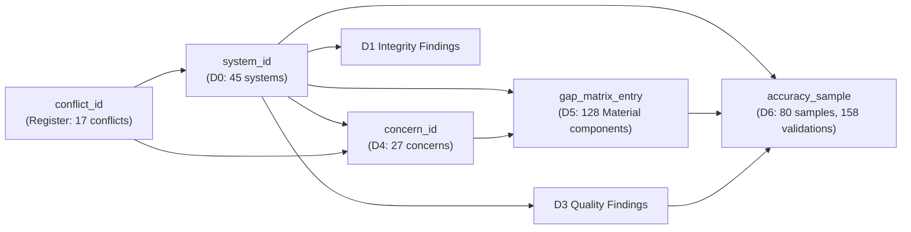
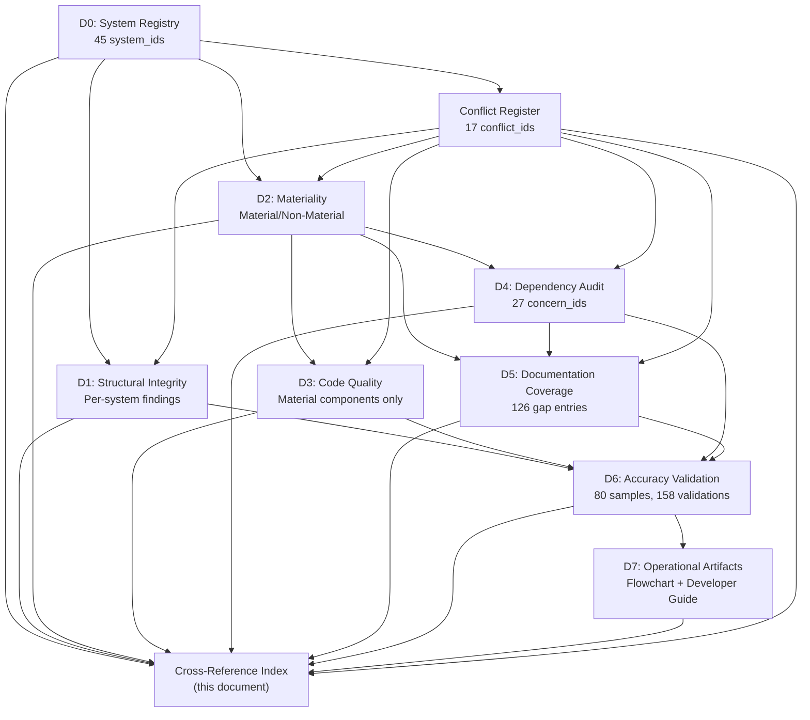

# Appendix: Cross-Reference Index

**Kubernetes Monorepo Compliance Audit — `k8s.io/kubernetes`**
**Document Version:** 1.0
**Audit Scope:** NIST SP 800-53 Rev 5, NIST SP 800-190, NIST CSF, CIS Kubernetes Benchmark v1.12.0, CIS Controls v8 IG2/IG3
**Authority Hierarchy:** NIST SP 800-53 Rev 5 > NIST SP 800-190 > CIS Kubernetes Benchmark v1.12.0 > CIS Controls v8
**Posture:** Assess-only — no code or documentation in the target repository is created, modified, or deleted

---

## 1. Introduction and Methodology

### 1.1 Purpose

This appendix provides **full traceability linkage** across all 11 audit documents produced by the Kubernetes monorepo compliance audit. It serves as the master navigation index enabling auditors, operators, and developers to trace any finding from its originating system (D0) through structural integrity (D1), materiality classification (D2), code quality (D3), dependency mapping (D4), documentation coverage (D5), accuracy validation (D6), and operational artifacts (D7) — and to resolve any framework conflict via the conflict register.

Every identifier used in the audit report — `system_id`, `concern_id`, `gap_entry`, `accuracy_sample`, `conflict_id` — is indexed in this document with bidirectional cross-references to the documents and sections where it appears.

### 1.2 Indexing Methodology

The cross-reference index links four identifier namespaces established by the audit:

| Identifier Type | Source Document | Convention | Total Count |
|---|---|---|---|
| `system_id` | `00-system-registry.md` (D0) | `SYS-{VERTICAL}-{HORIZONTAL}` | 45 |
| `concern_id` | `04-dependency-audit.md` (D4) | `CC-{NNN}` | 27 |
| `conflict_id` | `appendix-framework-conflict-register.md` | `CFR-{FAMILY}-{NNN}` | 17 |
| `inaccuracy_id` | `06-accuracy-validation.md` (D6) | `INX-{NNN}` | 4 |

### 1.3 Master Traceability Chain

The canonical linkage chain for any audit finding is:

```
system_id → concern_id → gap_matrix_entry → accuracy_sample → conflict_id (if applicable)
```

- **system_id** (D0): Identifies the vertical × horizontal intersection that owns the component under audit.
- **concern_id** (D4): Identifies cross-cutting dependencies associated with the system; referenced by the system's D5 gap matrix entries.
- **gap_matrix_entry** (D5): Identifies the documentation coverage assessment for each Material component within the system.
- **accuracy_sample** (D6): Identifies validation samples drawn from D1–D5 findings for the system.
- **conflict_id** (Conflict Register): Identifies any NIST/CIS framework conflict affecting the system's governing controls.

### 1.4 Identifier Cross-Reference Diagram



---

## 2. System ID Master Index

### 2.1 Index Legend

For each of the 45 system_ids from D0, the following cross-references are provided:

| Column | Description |
|---|---|
| `system_id` | Unique identifier from `00-system-registry.md` Section 4 |
| `D1_findings` | Count of structural integrity findings in `01-structural-integrity.md` |
| `D2_materiality` | Material (M) or Non-Material (NM) classification from `02-materiality-classification.md` |
| `D3_findings` | Count of code quality findings in `03-code-quality-audit.md` (Material only; N/A for Non-Material) |
| `D4_concern_ids` | Cross-cutting concern_ids from `04-dependency-audit.md` associated with this system |
| `D5_gap_entries` | Count of gap matrix entries in `05-documentation-coverage.md` Section 3 |
| `D6_samples` | Count of accuracy validation samples in `06-accuracy-validation.md` Section 3 |

### 2.2 Identity/Access Management (IAM) — 5 Systems

| system_id | D1_findings | D2_materiality | D3_findings | D4_concern_ids | D5_gap_entries | D6_samples |
|---|---|---|---|---|---|---|
| SYS-IAM-ORC | 3 (missing doc.go, auth chain integrity, config struct complexity) | M | 4 (authenticator coupling, authorizer coupling, cyclomatic complexity, cognitive complexity) | CC-003, CC-004, CC-005, CC-011, CC-014, CC-015 | 2 (authenticator/config.go, authorizer/config.go) | 8 (2 components × 4 dimensions) |
| SYS-IAM-APP | 5 (broken doc ref abac.go:112, 3 TODOs, missing doc.go ×5) | M | 8 (DRY violations in bootstrappolicy, coupling, nesting, magic numbers) | CC-003, CC-004, CC-011, CC-014, CC-015, CC-017 | 18 (abac, nodeidentifier, rbac authorizer, node authorizer, bootstrappolicy, bootstrap authenticator, serviceaccount ×7) | 20 (9 components × ~2 dimensions) |
| SYS-IAM-CFG | 1 (auth flag documentation) | M | 1 (flag configuration assessment) | CC-005, CC-009 | 1 (cmd/kube-apiserver/app/options/) | 2 (1 component × 2 dimensions) |
| SYS-IAM-API | 1 (RBAC API type documentation) | M | 1 (RBAC API type assessment) | CC-001, CC-002, CC-006 | 4 (rbac, authentication, authorization, certauthorization) | 2 (1 component × 2 dimensions) |
| SYS-IAM-DTA | 2 (RBAC storage, escalation check) | M | 1 (registry storage assessment) | CC-003, CC-010 | 1 (pkg/registry/rbac/) | 2 (1 component × 2 dimensions) |

### 2.3 Network Policy (NET) — 4 Systems

| system_id | D1_findings | D2_materiality | D3_findings | D4_concern_ids | D5_gap_entries | D6_samples |
|---|---|---|---|---|---|---|
| SYS-NET-ORC | 1 (kube-proxy configuration) | M | 1 (proxy orchestration assessment) | CC-004, CC-005, CC-023 | 1 (cmd/kube-proxy/app/) | 2 (1 component × 2 dimensions) |
| SYS-NET-APP | 2 (proxy implementation, network admission) | M | 2 (proxy complexity, admission) | CC-006, CC-016 | 2 (pkg/proxy/, plugin/pkg/admission/network/) | 4 (2 components × 2 dimensions) |
| SYS-NET-CFG | 1 (kube-proxy config flags) | M | N/A (Static config) | CC-018 | 1 (kube-proxy configuration flags) | 1 (1 component × 1 dimension) |
| SYS-NET-API | 1 (NetworkPolicy API types) | M | N/A (Static API types) | CC-001, CC-002, CC-006 | 1 (pkg/apis/networking/) | 2 (1 component × 2 dimensions) |

### 2.4 Secret Management (SEC) — 5 Systems

| system_id | D1_findings | D2_materiality | D3_findings | D4_concern_ids | D5_gap_entries | D6_samples |
|---|---|---|---|---|---|---|
| SYS-SEC-ORC | 2 (controller doc.go, secret lifecycle) | M | 1 (controller complexity) | CC-004, CC-007, CC-017, CC-027 | 1 (pkg/controller/ secret subset) | 2 (1 component × 2 dimensions) |
| SYS-SEC-APP | 2 (credential provider, SA admission) | M | 2 (credential provider, SA admission) | CC-011, CC-017, CC-022 | 2 (pkg/credentialprovider/, plugin/pkg/admission/serviceaccount/) | 4 (2 components × 2 dimensions) |
| SYS-SEC-CFG | 1 (encryption config) | M | N/A (Static config) | CC-009 | 1 (encryption configuration) | 1 (1 component × 1 dimension) |
| SYS-SEC-API | 1 (Secret/ConfigMap types) | M | N/A (Static API types) | CC-001, CC-002, CC-006 | 1 (pkg/apis/core/ Secret, ConfigMap) | 2 (1 component × 2 dimensions) |
| SYS-SEC-DTA | 2 (secret storage, encryption at rest) | M | 1 (registry storage) | CC-003, CC-010, CC-024 | 1 (pkg/registry/core/secret/, configmap/) | 2 (1 component × 2 dimensions) |

### 2.5 Image Supply Chain (IMG) — 4 Systems

| system_id | D1_findings | D2_materiality | D3_findings | D4_concern_ids | D5_gap_entries | D6_samples |
|---|---|---|---|---|---|---|
| SYS-IMG-IAC | 2 (Dockerfiles, supply chain) | M | N/A (Static IaC) | CC-023 | 3 (pause Dockerfile, server-image Dockerfile, build-image) | 2 (1 component × 2 dimensions) |
| SYS-IMG-CFG | 1 (dependency version pins) | M | N/A (Static config) | CC-009 | 1 (build/dependencies.yaml) | 2 (1 component × 2 dimensions) |
| SYS-IMG-PIP | 1 (release scripts) | M | N/A (Static pipeline) | — | 2 (release.sh, common.sh) | 2 (1 component × 2 dimensions) |
| SYS-IMG-DEP | 1 (dependency tracking) | M | N/A (Static deps) | — | 1 (build/dependencies.yaml tracking) | 1 (1 component × 1 dimension) |

### 2.6 CI/CD Pipeline (CCD) — 3 Systems

| system_id | D1_findings | D2_materiality | D3_findings | D4_concern_ids | D5_gap_entries | D6_samples |
|---|---|---|---|---|---|---|
| SYS-CCD-CFG | 3 (CONTRIBUTING.md, SECURITY.md, PR template) | M | N/A (Static config) | — | 4 (PR template, SECURITY.md, CONTRIBUTING.md, issue templates) | 2 (1 component × 2 dimensions) |
| SYS-CCD-PIP | 2 (verification scripts, Makefile) | M | N/A (Static pipeline) | CC-005, CC-009 | 3 (verify scripts, Makefile, update scripts) | 2 (1 component × 2 dimensions) |
| SYS-CCD-DEP | 2 (go.mod, go.sum) | M | N/A (Static deps) | CC-001, CC-002, CC-004, CC-013 | 2 (go.mod, go.sum) | 2 (1 component × 2 dimensions) |

### 2.7 Application Runtime (RUN) — 6 Systems

| system_id | D1_findings | D2_materiality | D3_findings | D4_concern_ids | D5_gap_entries | D6_samples |
|---|---|---|---|---|---|---|
| SYS-RUN-IAC | 1 (server image Dockerfile) | M | N/A (Static IaC) | CC-023 | 2 (server-image Dockerfile, pause Dockerfile) | 2 (1 component × 2 dimensions) |
| SYS-RUN-ORC | 4 (API server, CM, scheduler, kubelet, proxy) | M | 5 (binary orchestration complexity) | CC-003, CC-004, CC-005, CC-007, CC-009, CC-013, CC-014, CC-015, CC-016, CC-018, CC-023 | 5 (kube-apiserver, kube-controller-manager, kube-scheduler, kubelet, kube-proxy) | 10 (5 components × 2 dimensions) |
| SYS-RUN-APP | 4 (controlplane, scheduler, kubelet, proxy, volume) | M | 5 (app source complexity) | CC-004, CC-006, CC-007, CC-008, CC-009, CC-013, CC-020, CC-026 | 5 (controlplane, scheduler, kubelet, proxy, quota) | 10 (5 components × 2 dimensions) |
| SYS-RUN-CFG | 2 (feature gates, flags) | M | 1 (feature gate assessment) | CC-009 | 5 (apiserver options, CM options, scheduler options, kubelet options, features) | 2 (1 component × 2 dimensions) |
| SYS-RUN-DEP | 1 (go.mod runtime deps) | M | N/A (Static deps) | CC-001, CC-002, CC-004, CC-013 | 1 (go.mod runtime dependencies) | 1 (1 component × 1 dimension) |
| SYS-RUN-API | 1 (OpenAPI spec) | M | N/A (Static API) | CC-012 | 2 (swagger.json, pkg/generated/openapi/) | 2 (1 component × 2 dimensions) |

### 2.8 Observability (OBS) — 4 Systems

| system_id | D1_findings | D2_materiality | D3_findings | D4_concern_ids | D5_gap_entries | D6_samples |
|---|---|---|---|---|---|---|
| SYS-OBS-ORC | 1 (audit backend staging ref) | M | 1 (audit orchestration) | CC-003, CC-013, CC-023 | 1 (staging audit backend ref) | 2 (1 component × 2 dimensions) |
| SYS-OBS-APP | 2 (routes, probe) | M | 2 (routes, probe assessment) | CC-005, CC-013 | 2 (pkg/routes/, pkg/probe/) | 4 (2 components × 2 dimensions) |
| SYS-OBS-CFG | 1 (audit policy config) | M | N/A (Static config) | — | 1 (audit policy, metrics flags) | 1 (1 component × 1 dimension) |
| SYS-OBS-API | 1 (audit API types) | M | N/A (Static API) | CC-001, CC-002 | 1 (audit API types) | 2 (1 component × 2 dimensions) |

### 2.9 Compliance / Admission (CMP) — 4 Systems

| system_id | D1_findings | D2_materiality | D3_findings | D4_concern_ids | D5_gap_entries | D6_samples |
|---|---|---|---|---|---|---|
| SYS-CMP-ORC | 2 (admission config, initializer) | M | 2 (admission orchestration) | CC-003, CC-016 | 2 (admission config.go, initializer.go) | 4 (2 components × 2 dimensions) |
| SYS-CMP-APP | 25 (25 admission plugins) | M | 25 (per-plugin quality) | CC-006, CC-008, CC-011, CC-016, CC-017, CC-022, CC-027 | 25 (25 admission plugins) | 31 (15 components × ~2 dimensions) |
| SYS-CMP-CFG | 1 (webhook configs, plugin lists) | M | N/A (Static config) | CC-009 | 1 (admission webhook config) | 1 (1 component × 1 dimension) |
| SYS-CMP-API | 2 (admission, admissionregistration) | M | N/A (Static API) | CC-001, CC-002 | 3 (admission, admissionregistration, imagepolicy) | 2 (1 component × 2 dimensions) |

### 2.10 Data Persistence (DAT) — 5 Systems

| system_id | D1_findings | D2_materiality | D3_findings | D4_concern_ids | D5_gap_entries | D6_samples |
|---|---|---|---|---|---|---|
| SYS-DAT-ORC | 1 (volume controller) | M | 1 (controller complexity) | CC-007, CC-024 | 1 (pkg/controller/volume/) | 2 (1 component × 2 dimensions) |
| SYS-DAT-APP | 1 (volume plugins) | M | 1 (volume plugin assessment) | CC-006, CC-008, CC-020, CC-026 | 1 (pkg/volume/) | 2 (1 component × 2 dimensions) |
| SYS-DAT-CFG | 1 (StorageClass definitions) | M | N/A (Static config) | — | 1 (StorageClass definitions) | 1 (1 component × 1 dimension) |
| SYS-DAT-API | 1 (storage API types) | M | N/A (Static API) | CC-001, CC-002 | 1 (pkg/apis/storage/) | 2 (1 component × 2 dimensions) |
| SYS-DAT-DTA | 2 (etcd state, PV storage) | M | 1 (data access assessment) | CC-003, CC-010, CC-024 | 1 (pkg/registry/storage/) | 2 (1 component × 2 dimensions) |

### 2.11 External Integrations (EXT) — 5 Systems

| system_id | D1_findings | D2_materiality | D3_findings | D4_concern_ids | D5_gap_entries | D6_samples |
|---|---|---|---|---|---|---|
| SYS-EXT-ORC | 1 (cloud controller manager) | M | 1 (cloud controller assessment) | CC-004, CC-014, CC-023 | 1 (cmd/cloud-controller-manager/) | 2 (1 component × 2 dimensions) |
| SYS-EXT-APP | 1 (credential provider) | M | 1 (credential provider assessment) | CC-011 | 1 (pkg/credentialprovider/) | 2 (1 component × 2 dimensions) |
| SYS-EXT-CFG | 1 (cloud provider config) | M | N/A (Static config) | CC-009 | 1 (cloud provider config flags) | 1 (1 component × 1 dimension) |
| SYS-EXT-DEP | 1 (external deps in go.mod) | M | N/A (Static deps) | CC-001, CC-002, CC-004 | 1 (go.mod external deps) | 1 (1 component × 1 dimension) |
| SYS-EXT-API | 1 (cloud provider API) | M | N/A (Static API) | CC-001, CC-002 | 1 (cloud provider API staging ref) | 2 (1 component × 2 dimensions) |

### 2.12 System ID Totals

| Vertical | Systems | D2 Material | D6 Total Samples | D6 Total Validations |
|---|---|---|---|---|
| IAM | 5 | 5 (100%) | 14 | 34 |
| NET | 4 | 4 (100%) | 5 | 9 |
| SEC | 5 | 5 (100%) | 6 | 11 |
| IMG | 4 | 4 (100%) | 4 | 7 |
| CCD | 3 | 3 (100%) | 3 | 6 |
| RUN | 6 | 6 (100%) | 20 | 27 |
| OBS | 4 | 4 (100%) | 4 | 9 |
| CMP | 4 | 4 (100%) | 19 | 38 |
| DAT | 5 | 5 (100%) | 5 | 9 |
| EXT | 5 | 5 (100%) | 5 | 8 |
| **Total** | **45** | **45 (100%)** | **80** | **158** |

---

## 3. Concern ID Master Index

### 3.1 Index Legend

For each of the 27 cross-cutting concern_ids from D4, the following cross-references are provided:

| Column | Description |
|---|---|
| `concern_id` | Unique identifier from `04-dependency-audit.md` Sections 3–5 |
| `systems_affected` | system_ids from D0 that consume or depend on this concern |
| `blast_radius` | Low / Medium / High from D4 Section 7 |
| `doc_coverage_status` | Documentation assessment from D5 Section 5 (Critical / Moderate / Minor) |
| `framework_controls` | Primary NIST/CIS controls governing this concern |

### 3.2 Foundational Staging Modules (CC-001 through CC-005)

| concern_id | systems_affected | blast_radius | doc_coverage_status | framework_controls |
|---|---|---|---|---|
| CC-001 | SYS-IAM-ORC, SYS-IAM-APP, SYS-IAM-API, SYS-IAM-DTA, SYS-NET-ORC, SYS-NET-APP, SYS-NET-API, SYS-SEC-ORC, SYS-SEC-APP, SYS-SEC-API, SYS-SEC-DTA, SYS-CMP-ORC, SYS-CMP-APP, SYS-CMP-API, SYS-RUN-ORC, SYS-RUN-APP, SYS-DAT-ORC, SYS-DAT-APP, SYS-DAT-API, SYS-DAT-DTA, SYS-EXT-ORC, SYS-EXT-APP, SYS-OBS-ORC, SYS-OBS-APP (all 45 systems) | **High** | Critical — 0/3 documentation criteria met (FLAG-GOV-OWNER) | NIST CM-3, CM-7; CIS Control 2 |
| CC-002 | SYS-IAM-APP, SYS-IAM-API, SYS-NET-APP, SYS-NET-API, SYS-SEC-APP, SYS-SEC-API, SYS-CMP-APP, SYS-CMP-API, SYS-RUN-ORC, SYS-RUN-APP, SYS-DAT-APP, SYS-DAT-API, SYS-EXT-APP, SYS-OBS-APP (all 45 systems) | **High** | Critical — 0/3 documentation criteria met (FLAG-GOV-OWNER) | NIST CM-3, CM-7; CIS Control 2 |
| CC-003 | SYS-IAM-ORC, SYS-IAM-APP, SYS-CMP-ORC, SYS-CMP-APP, SYS-RUN-ORC, SYS-RUN-APP, SYS-OBS-ORC, SYS-OBS-APP, SYS-SEC-DTA, SYS-DAT-DTA, SYS-EXT-ORC (30+ systems) | **High** | Critical — 0/3 documentation criteria met (FLAG-GOV-OWNER) | NIST AC-3, IA-2, AU-12, CM-7; CIS Control 4, 8 |
| CC-004 | SYS-IAM-ORC, SYS-IAM-APP, SYS-SEC-ORC, SYS-CMP-ORC, SYS-RUN-ORC, SYS-RUN-APP, SYS-DAT-ORC, SYS-EXT-ORC, SYS-EXT-APP, SYS-NET-ORC, SYS-OBS-APP (30+ systems) | **High** | Critical — 0/3 documentation criteria met (FLAG-GOV-OWNER) | NIST CM-3, SC-8; CIS Control 2, 4 |
| CC-005 | SYS-RUN-ORC, SYS-RUN-APP, SYS-IAM-ORC, SYS-NET-ORC, SYS-EXT-ORC, SYS-OBS-APP, SYS-CCD-PIP (20+ systems) | **High** | Critical — 0/3 documentation criteria met (FLAG-GOV-OWNER) | NIST CM-6, AU-12; CIS Control 4, 8 |

### 3.3 Internal Cross-Cutting Packages (CC-006 through CC-012)

| concern_id | systems_affected | blast_radius | doc_coverage_status | framework_controls |
|---|---|---|---|---|
| CC-006 | SYS-IAM-APP, SYS-IAM-API, SYS-IAM-DTA, SYS-SEC-APP, SYS-SEC-API, SYS-SEC-DTA, SYS-CMP-APP, SYS-CMP-API, SYS-RUN-APP, SYS-RUN-ORC, SYS-DAT-APP, SYS-DAT-API, SYS-DAT-DTA, SYS-NET-APP, SYS-NET-API, SYS-OBS-APP, SYS-EXT-APP (40+ systems) | **High** | Critical — partial (import graph visible) but no blast radius or owner docs | NIST CM-3, CM-7; CIS Control 2, 4 |
| CC-007 | SYS-SEC-ORC, SYS-DAT-ORC, SYS-RUN-ORC, SYS-CMP-APP, SYS-IAM-DTA (15+ systems) | **High** | Critical — partial (1-line doc.go) but no blast radius or owner docs | NIST CM-7; CIS Control 4 |
| CC-008 | SYS-RUN-ORC, SYS-RUN-APP, SYS-IAM-ORC, SYS-DAT-ORC, SYS-DAT-APP, SYS-NET-ORC, SYS-CMP-APP, SYS-SEC-ORC (20+ systems) | **High** | Critical — 0/3 documentation criteria met (FLAG-GOV-OWNER, doc.go absent) | NIST CM-7; CIS Control 2 |
| CC-009 | SYS-RUN-ORC, SYS-RUN-APP, SYS-RUN-CFG, SYS-IAM-ORC, SYS-IAM-APP, SYS-CMP-APP, SYS-CMP-ORC, SYS-NET-ORC, SYS-NET-APP, SYS-DAT-ORC, SYS-DAT-APP, SYS-EXT-ORC (30+ systems) | **High** | Critical — 0/3 documentation criteria met (doc.go absent) | NIST CM-6, CM-7; CIS Control 4 |
| CC-010 | SYS-IAM-DTA, SYS-SEC-DTA, SYS-DAT-DTA, SYS-RUN-APP, SYS-CMP-APP (15+ systems) | **High** | Critical — partial (doc.go present) but no blast radius or owner docs | NIST SC-28, AC-3; CIS Control 4 |
| CC-011 | SYS-IAM-ORC, SYS-IAM-APP, SYS-SEC-ORC, SYS-CMP-APP, SYS-RUN-ORC, SYS-RUN-APP (10+ systems) | **High** | Critical — partial (import statements) but no blast radius docs, doc.go absent | NIST IA-4, IA-5; CIS K8s 5.1; CIS Control 5 |
| CC-012 | SYS-RUN-ORC, SYS-RUN-APP, SYS-RUN-API, SYS-CMP-ORC (4 systems) | **Medium** | Moderate — partial (doc.go present) but no ownership docs | NIST CM-6; CIS Control 4 |

### 3.4 External Logging (CC-013)

| concern_id | systems_affected | blast_radius | doc_coverage_status | framework_controls |
|---|---|---|---|---|
| CC-013 | SYS-IAM-ORC, SYS-IAM-APP, SYS-CMP-ORC, SYS-CMP-APP, SYS-RUN-ORC, SYS-RUN-APP, SYS-SEC-ORC, SYS-SEC-APP, SYS-DAT-ORC, SYS-DAT-APP, SYS-NET-ORC, SYS-NET-APP, SYS-EXT-ORC, SYS-EXT-APP, SYS-OBS-ORC, SYS-OBS-APP (all 45 systems) | **High** | Critical — 0/3 documentation criteria met (FLAG-GOV-STATE) | NIST AU-12; CIS Control 8 |

### 3.5 Security Chain Concerns (CC-014 through CC-017)

| concern_id | systems_affected | blast_radius | doc_coverage_status | framework_controls |
|---|---|---|---|---|
| CC-014 | SYS-IAM-ORC, SYS-IAM-APP, SYS-RUN-ORC, SYS-EXT-ORC, SYS-EXT-APP (10+ systems) | **High** | Critical — 0/3 documentation criteria met; no architectural narrative | NIST IA-2, IA-5, IA-8; CIS K8s 3.1; CIS Control 5 |
| CC-015 | SYS-IAM-ORC, SYS-IAM-APP, SYS-IAM-DTA, SYS-EXT-ORC (10+ systems) | **High** | Critical — 0/3 documentation criteria met; no architectural narrative | NIST AC-3, AC-6; CIS K8s 5.1; CIS Control 6 |
| CC-016 | SYS-CMP-ORC, SYS-CMP-APP, SYS-IAM-APP, SYS-SEC-APP, SYS-RUN-ORC (10+ systems) | **High** | Critical — 0/3 documentation criteria met; no architectural narrative | NIST CM-7, SI-3, SI-10; CIS K8s 5.2; CIS Control 4 |
| CC-017 | SYS-IAM-ORC, SYS-IAM-APP, SYS-SEC-ORC, SYS-CMP-APP, SYS-RUN-ORC (10+ systems) | **High** | Critical — 0/3 documentation criteria met | NIST IA-4, IA-5; CIS K8s 5.1; CIS Control 5 |

### 3.6 Implicit Dependency Concerns (CC-018 through CC-027)

| concern_id | systems_affected | blast_radius | doc_coverage_status | framework_controls |
|---|---|---|---|---|
| CC-018 | SYS-RUN-ORC (5 binaries) | **Medium** | Moderate — env var usage logged but not documented as dependency | NIST CM-6; CIS Control 4 |
| CC-019 | SYS-RUN-ORC (kubelet only) | **Low** | Minor — undocumented kubelet environment variable | NIST SC-8; CIS Control 4 |
| CC-020 | SYS-RUN-ORC, SYS-DAT-APP, SYS-SEC-APP (3+ systems) | **Medium** | Moderate — flag default documented but no dependency documentation | NIST CM-6; CIS K8s 4.1; CIS Control 4 |
| CC-021 | SYS-RUN-ORC, SYS-IAM-CFG, SYS-SEC-CFG (3+ systems) | **Medium** | Moderate — no in-repo path convention documentation | NIST CM-6; CIS K8s 1.1, 4.1; CIS Control 4 |
| CC-022 | SYS-IAM-APP, SYS-CMP-APP, SYS-SEC-APP (3+ systems) | **Medium** | Moderate — constant defined in admission plugin but no dependency contract | NIST IA-4, IA-5; CIS K8s 5.1; CIS Control 5 |
| CC-023 | SYS-RUN-ORC, SYS-IAM-ORC, SYS-CMP-ORC, SYS-EXT-ORC, SYS-NET-ORC, SYS-SEC-ORC, SYS-DAT-ORC, SYS-OBS-ORC (all 45 systems) | **High** | Critical — single point of failure; no in-repo failure mode docs (FLAG-GOV-OWNER) | NIST SC-5; CIS K8s 1.2; CIS Control 4 |
| CC-024 | SYS-IAM-DTA, SYS-SEC-DTA, SYS-DAT-DTA, SYS-RUN-ORC (10+ systems) | **High** | Critical — single point of failure; no in-repo failure mode docs | NIST SC-5, SC-28, CP-9; CIS K8s Section 2; CIS Control 4 |
| CC-025 | SYS-RUN-ORC, SYS-RUN-APP, SYS-OBS-APP (3+ systems) | **Medium** | Moderate — implicit network dependency not formally documented | NIST SC-7, SC-8; CIS K8s 4.2; CIS Control 4 |
| CC-026 | SYS-RUN-APP, SYS-SEC-ORC, SYS-DAT-APP, SYS-CMP-APP (4+ systems) | **Medium** | Moderate — no documentation of ConfigMap consumption strategies | NIST CM-6; CIS Control 4 |
| CC-027 | SYS-IAM-APP, SYS-SEC-ORC, SYS-SEC-DTA, SYS-CMP-APP (4+ systems) | **Medium** | Moderate — partial JWT claims documentation but no end-to-end coupling docs | NIST IA-4, IA-5, SC-28; CIS K8s 5.1; CIS Control 5, 18 |

### 3.7 Concern ID Summary Statistics

| Blast Radius | Count | Percentage |
|---|---|---|
| **High** | 18 | 66.7% |
| **Medium** | 8 | 29.6% |
| **Low** | 1 | 3.7% |
| **Total** | **27** | **100%** |

| Documentation Status | Count | Percentage |
|---|---|---|
| Complete (all 3 criteria) | 0 | 0% |
| Partial (1–2 criteria) | 8 | 29.6% |
| None (0 criteria) | 19 | 70.4% |
| **Total** | **27** | **100%** |

---

## 4. Gap Matrix Cross-Reference

### 4.1 Index Legend

Every gap matrix entry from `05-documentation-coverage.md` (Sections 3.1–3.12) is indexed here and linked to its parent system_id, any related concern_id, any accuracy sample that validated it, and the governing framework control.

| Column | Description |
|---|---|
| `gap_entry_id` | Sequential identifier for gap matrix rows (GAP-{vertical}-{seq}) |
| `system_id` | Parent system from D0 registry |
| `component_path` | File or directory path from D5 gap matrix |
| `concern_id` | Related cross-cutting concern from D4 (N-A if not cross-cutting) |
| `accuracy_sample_ref` | D6 section reference if this component was sampled (N-A if not sampled) |
| `framework_control` | Primary NIST/CIS control(s) from D5 gap matrix |
| `gap_severity` | Critical / Moderate / Minor from D5 |

### 4.2 Identity/Access Management (IAM) Gap Entries

| gap_entry_id | system_id | component_path | concern_id | accuracy_sample_ref | framework_control | gap_severity |
|---|---|---|---|---|---|---|
| GAP-IAM-001 | SYS-IAM-ORC | `pkg/kubeapiserver/authenticator/config.go` | CC-014 | D6 §3.1 (SYS-IAM-ORC) | IA-2, IA-5, IA-8 | Critical |
| GAP-IAM-002 | SYS-IAM-ORC | `pkg/kubeapiserver/authorizer/config.go` | CC-015 | D6 §3.1 (SYS-IAM-ORC) | AC-3, AC-6 | Critical |
| GAP-IAM-003 | SYS-IAM-APP | `pkg/auth/authorizer/abac/abac.go` | N-A | D6 §3.2 (SYS-IAM-APP) | AC-3, AC-6 | Critical |
| GAP-IAM-004 | SYS-IAM-APP | `pkg/auth/nodeidentifier/interfaces.go` | N-A | D6 §3.2 (SYS-IAM-APP) | IA-4 | Moderate |
| GAP-IAM-005 | SYS-IAM-APP | `pkg/auth/nodeidentifier/default.go` | N-A | D6 §3.2 (SYS-IAM-APP) | IA-4 | Moderate |
| GAP-IAM-006 | SYS-IAM-APP | `plugin/pkg/auth/authorizer/rbac/rbac.go` | N-A | D6 §3.2 (SYS-IAM-APP) | AC-6 | Critical |
| GAP-IAM-007 | SYS-IAM-APP | `plugin/pkg/auth/authorizer/rbac/subject_locator.go` | N-A | N-A | AC-6 | Critical |
| GAP-IAM-008 | SYS-IAM-APP | `plugin/pkg/auth/authorizer/rbac/bootstrappolicy/policy.go` | N-A | D6 §3.2 (SYS-IAM-APP) | AC-6 | Critical |
| GAP-IAM-009 | SYS-IAM-APP | `plugin/pkg/auth/authorizer/rbac/bootstrappolicy/controller_policy.go` | N-A | N-A | AC-6 | Critical |
| GAP-IAM-010 | SYS-IAM-APP | `plugin/pkg/auth/authorizer/rbac/bootstrappolicy/namespace_policy.go` | N-A | N-A | AC-6 | Critical |
| GAP-IAM-011 | SYS-IAM-APP | `plugin/pkg/auth/authorizer/node/node_authorizer.go` | N-A | N-A | AC-6 | Critical |
| GAP-IAM-012 | SYS-IAM-APP | `plugin/pkg/auth/authorizer/node/graph.go` | N-A | N-A | AC-6 | Critical |
| GAP-IAM-013 | SYS-IAM-APP | `plugin/pkg/auth/authorizer/node/graph_populator.go` | N-A | N-A | AC-6 | Critical |
| GAP-IAM-014 | SYS-IAM-APP | `plugin/pkg/auth/authenticator/token/bootstrap/bootstrap.go` | N-A | N-A | IA-5 | Critical |
| GAP-IAM-015 | SYS-IAM-APP | `pkg/serviceaccount/claims.go` | CC-011, CC-017 | D6 §3.2 (SYS-IAM-APP) | IA-4, IA-5 | Critical |
| GAP-IAM-016 | SYS-IAM-APP | `pkg/serviceaccount/jwt.go` | CC-011, CC-017 | D6 §3.2 (SYS-IAM-APP) | IA-4, IA-5 | Critical |
| GAP-IAM-017 | SYS-IAM-APP | `pkg/serviceaccount/legacy.go` | CC-011 | D6 §3.2 (SYS-IAM-APP) | IA-5 | Critical |
| GAP-IAM-018 | SYS-IAM-APP | `pkg/serviceaccount/metrics.go` | CC-011 | D6 §3.2 (SYS-IAM-APP) | AU-12, IA-5 | Moderate |
| GAP-IAM-019 | SYS-IAM-APP | `pkg/serviceaccount/openidmetadata.go` | CC-011 | D6 §3.2 (SYS-IAM-APP) | IA-5, IA-8 | Critical |
| GAP-IAM-020 | SYS-IAM-APP | `pkg/serviceaccount/externaljwt/` | CC-011 | N-A | IA-5, SC-12 | Critical |
| GAP-IAM-021 | SYS-IAM-CFG | `cmd/kube-apiserver/app/options/` (auth flags) | N-A | D6 §3.3 (SYS-IAM-CFG) | AC-2, IA-5, IA-8 | Moderate |
| GAP-IAM-022 | SYS-IAM-API | `pkg/apis/rbac/` | N-A | D6 §3.4 (SYS-IAM-API) | AC-3, AC-6 | Moderate |
| GAP-IAM-023 | SYS-IAM-API | `pkg/apis/authentication/` | N-A | N-A | IA-2 | Moderate |
| GAP-IAM-024 | SYS-IAM-API | `pkg/apis/authorization/` | N-A | N-A | AC-3 | Moderate |
| GAP-IAM-025 | SYS-IAM-API | `pkg/certauthorization/` | N-A | N-A | IA-2, IA-8 | Critical |
| GAP-IAM-026 | SYS-IAM-DTA | `pkg/registry/rbac/` | N-A | D6 §3.5 (SYS-IAM-DTA) | AC-2, AC-3, AC-6 | Critical |

### 4.3 Network Policy (NET) Gap Entries

| gap_entry_id | system_id | component_path | concern_id | accuracy_sample_ref | framework_control | gap_severity |
|---|---|---|---|---|---|---|
| GAP-NET-001 | SYS-NET-ORC | `cmd/kube-proxy/app/` | N-A | D6 §3.6 (SYS-NET-ORC) | SC-7 | Moderate |
| GAP-NET-002 | SYS-NET-APP | `pkg/proxy/` | N-A | D6 §3.7 (SYS-NET-APP) | SC-7, SC-8 | Moderate |
| GAP-NET-003 | SYS-NET-APP | `plugin/pkg/admission/network/` | N-A | D6 §3.7 (SYS-NET-APP) | SC-7 | Moderate |
| GAP-NET-004 | SYS-NET-CFG | kube-proxy configuration flags | N-A | D6 §3.8 (SYS-NET-CFG) | SC-7 | Moderate |
| GAP-NET-005 | SYS-NET-API | `pkg/apis/networking/` | N-A | D6 §3.9 (SYS-NET-API) | SC-7 | Minor |

### 4.4 Secret Management (SEC) Gap Entries

| gap_entry_id | system_id | component_path | concern_id | accuracy_sample_ref | framework_control | gap_severity |
|---|---|---|---|---|---|---|
| GAP-SEC-001 | SYS-SEC-ORC | `pkg/controller/` (secret/configmap controllers) | CC-007 | D6 §3.10 (SYS-SEC-ORC) | SC-12, SC-28 | Critical |
| GAP-SEC-002 | SYS-SEC-APP | `pkg/credentialprovider/` | N-A | D6 §3.11 (SYS-SEC-APP) | SC-28, IA-5 | Moderate |
| GAP-SEC-003 | SYS-SEC-APP | `plugin/pkg/admission/serviceaccount/` | CC-017, CC-022 | D6 §3.11 (SYS-SEC-APP) | IA-4, SC-28 | Critical |
| GAP-SEC-004 | SYS-SEC-CFG | Encryption configuration (key paths, providers) | N-A | D6 §3.12 (SYS-SEC-CFG) | SC-12, SC-28 | Critical |
| GAP-SEC-005 | SYS-SEC-API | `pkg/apis/core/` (Secret, ConfigMap types) | N-A | D6 §3.13 (SYS-SEC-API) | SC-28 | Moderate |
| GAP-SEC-006 | SYS-SEC-DTA | `pkg/registry/core/secret/`, `configmap/` | N-A | D6 §3.14 (SYS-SEC-DTA) | SC-12, SC-28, IA-5 | Critical |

### 4.5 Image Supply Chain (IMG) Gap Entries

| gap_entry_id | system_id | component_path | concern_id | accuracy_sample_ref | framework_control | gap_severity |
|---|---|---|---|---|---|---|
| GAP-IMG-001 | SYS-IMG-IAC | `build/pause/Dockerfile` | N-A | D6 §3.15 (SYS-IMG-IAC) | CM-2, SI-7 | Critical |
| GAP-IMG-002 | SYS-IMG-IAC | `build/server-image/Dockerfile` | N-A | N-A | CM-2, SI-7 | Critical |
| GAP-IMG-003 | SYS-IMG-IAC | `build/build-image/` | N-A | N-A | CM-2, SI-7 | Moderate |
| GAP-IMG-004 | SYS-IMG-CFG | `build/dependencies.yaml` | N-A | D6 §3.16 (SYS-IMG-CFG) | CM-2, CM-7 | Moderate |
| GAP-IMG-005 | SYS-IMG-PIP | `build/release.sh`, `build/release-images.sh` | N-A | D6 §3.17 (SYS-IMG-PIP) | SA-10, SI-7 | Moderate |
| GAP-IMG-006 | SYS-IMG-PIP | `build/common.sh`, `build/run.sh` | N-A | N-A | SA-10, SI-7 | Moderate |
| GAP-IMG-007 | SYS-IMG-DEP | `build/dependencies.yaml` (dependency tracking) | N-A | D6 §3.18 (SYS-IMG-DEP) | CM-2, CM-7, SA-10 | Moderate |

### 4.6 CI/CD Pipeline (CCD) Gap Entries

| gap_entry_id | system_id | component_path | concern_id | accuracy_sample_ref | framework_control | gap_severity |
|---|---|---|---|---|---|---|
| GAP-CCD-001 | SYS-CCD-CFG | `.github/PULL_REQUEST_TEMPLATE.md` | N-A | N-A | CM-3, CM-9 | Moderate |
| GAP-CCD-002 | SYS-CCD-CFG | `.github/SECURITY.md` | N-A | D6 §3.19 (SYS-CCD-CFG — CONTRIBUTING.md sampled instead) | CM-9 | Critical |
| GAP-CCD-003 | SYS-CCD-CFG | `CONTRIBUTING.md` | N-A | D6 §3.19 (SYS-CCD-CFG) | CM-3 | Critical |
| GAP-CCD-004 | SYS-CCD-CFG | `.github/ISSUE_TEMPLATE/` | N-A | N-A | CM-3, CM-9 | Moderate |
| GAP-CCD-005 | SYS-CCD-PIP | `hack/verify-*.sh` (49 verification scripts) | N-A | D6 §3.20 (SYS-CCD-PIP) | CM-3, SA-10 | Moderate |
| GAP-CCD-006 | SYS-CCD-PIP | `Makefile` | N-A | N-A | CM-3, SA-10 | Minor |
| GAP-CCD-007 | SYS-CCD-PIP | `hack/update-*.sh` (generation scripts) | N-A | N-A | CM-3, SA-10 | Moderate |
| GAP-CCD-008 | SYS-CCD-DEP | `go.mod` | N-A | D6 §3.21 (SYS-CCD-DEP) | CM-3, CM-7, SA-10 | Moderate |
| GAP-CCD-009 | SYS-CCD-DEP | `go.sum` | N-A | N-A | CM-7, SI-7 | Minor |

### 4.7 Application Runtime (RUN) Gap Entries

| gap_entry_id | system_id | component_path | concern_id | accuracy_sample_ref | framework_control | gap_severity |
|---|---|---|---|---|---|---|
| GAP-RUN-001 | SYS-RUN-IAC | `build/server-image/Dockerfile` | N-A | D6 §3.22 (SYS-RUN-IAC) | CM-2, CM-6 | Critical |
| GAP-RUN-002 | SYS-RUN-IAC | `build/pause/Dockerfile` | N-A | N-A | CM-2, CM-6 | Critical |
| GAP-RUN-003 | SYS-RUN-ORC | `cmd/kube-apiserver/app/` | N-A | D6 §3.23 (SYS-RUN-ORC) | CM-6, CM-7, SC-3 | Critical |
| GAP-RUN-004 | SYS-RUN-ORC | `cmd/kube-controller-manager/app/` | N-A | D6 §3.23 (SYS-RUN-ORC) | CM-6, CM-7 | Moderate |
| GAP-RUN-005 | SYS-RUN-ORC | `cmd/kube-scheduler/app/` | N-A | D6 §3.23 (SYS-RUN-ORC) | CM-6, CM-7 | Moderate |
| GAP-RUN-006 | SYS-RUN-ORC | `cmd/kubelet/app/` | N-A | D6 §3.23 (SYS-RUN-ORC) | CM-6, CM-7 | Moderate |
| GAP-RUN-007 | SYS-RUN-ORC | `cmd/kube-proxy/app/` | N-A | D6 §3.23 (SYS-RUN-ORC) | CM-6, SC-7 | Moderate |
| GAP-RUN-008 | SYS-RUN-APP | `pkg/controlplane/` | N-A | D6 §3.24 (SYS-RUN-APP) | CM-7, SI-2 | Moderate |
| GAP-RUN-009 | SYS-RUN-APP | `pkg/scheduler/` | N-A | D6 §3.24 (SYS-RUN-APP) | CM-7 | Moderate |
| GAP-RUN-010 | SYS-RUN-APP | `pkg/kubelet/` | N-A | D6 §3.24 (SYS-RUN-APP) | CM-7 | Moderate |
| GAP-RUN-011 | SYS-RUN-APP | `pkg/proxy/` | N-A | D6 §3.24 (SYS-RUN-APP) | SC-7, CM-7 | Moderate |
| GAP-RUN-012 | SYS-RUN-APP | `pkg/quota/` | N-A | N-A | CM-7 | Moderate |
| GAP-RUN-013 | SYS-RUN-CFG | `cmd/kube-apiserver/app/options/` | N-A | D6 §3.25 (SYS-RUN-CFG) | CM-6, CM-7 | Moderate |
| GAP-RUN-014 | SYS-RUN-CFG | `cmd/kube-controller-manager/app/options/` | N-A | N-A | CM-6, CM-7 | Moderate |
| GAP-RUN-015 | SYS-RUN-CFG | `cmd/kube-scheduler/app/options/` | N-A | N-A | CM-6, CM-7 | Moderate |
| GAP-RUN-016 | SYS-RUN-CFG | `cmd/kubelet/app/options/` | N-A | N-A | CM-6, CM-7 | Moderate |
| GAP-RUN-017 | SYS-RUN-CFG | `pkg/features/` | N-A | N-A | CM-6, CM-7 | Moderate |
| GAP-RUN-018 | SYS-RUN-DEP | `go.mod` (runtime dependencies) | N-A | D6 §3.26 (SYS-RUN-DEP) | CM-7, SI-2, SA-10 | Moderate |
| GAP-RUN-019 | SYS-RUN-API | `api/openapi-spec/swagger.json` | N-A | D6 §3.27 (SYS-RUN-API) | CM-6 | Minor |
| GAP-RUN-020 | SYS-RUN-API | `pkg/generated/openapi/` | N-A | N-A | CM-6 | Minor |

### 4.8 Observability (OBS) Gap Entries

| gap_entry_id | system_id | component_path | concern_id | accuracy_sample_ref | framework_control | gap_severity |
|---|---|---|---|---|---|---|
| GAP-OBS-001 | SYS-OBS-ORC | `staging/src/k8s.io/apiserver/pkg/audit/` | N-A | D6 §3.28 (SYS-OBS-ORC) | AU-2, AU-3, AU-12 | Moderate |
| GAP-OBS-002 | SYS-OBS-APP | `pkg/routes/` | N-A | D6 §3.29 (SYS-OBS-APP) | AU-6, AU-12 | Moderate |
| GAP-OBS-003 | SYS-OBS-APP | `pkg/probe/` | N-A | D6 §3.29 (SYS-OBS-APP) | AU-12 | Minor |
| GAP-OBS-004 | SYS-OBS-CFG | Audit policy configuration, metrics flags | N-A | D6 §3.30 (SYS-OBS-CFG) | AU-2, AU-3 | Moderate |
| GAP-OBS-005 | SYS-OBS-API | Audit API types, metrics API surface | N-A | D6 §3.31 (SYS-OBS-API) | AU-2, AU-3 | Moderate |

### 4.9 Compliance/Admission (CMP) Gap Entries

| gap_entry_id | system_id | component_path | concern_id | accuracy_sample_ref | framework_control | gap_severity |
|---|---|---|---|---|---|---|
| GAP-CMP-001 | SYS-CMP-ORC | `pkg/kubeapiserver/admission/config.go` | CC-016 | D6 §3.32 (SYS-CMP-ORC) | CM-7, SI-10 | Critical |
| GAP-CMP-002 | SYS-CMP-ORC | `pkg/kubeapiserver/admission/initializer.go` | CC-016 | D6 §3.32 (SYS-CMP-ORC) | CM-7, SI-10 | Critical |
| GAP-CMP-003 | SYS-CMP-APP | `plugin/pkg/admission/admit/` | N-A | N-A | SI-10 | Moderate |
| GAP-CMP-004 | SYS-CMP-APP | `plugin/pkg/admission/alwayspullimages/` | N-A | D6 §3.33 (SYS-CMP-APP) | SI-7 | Moderate |
| GAP-CMP-005 | SYS-CMP-APP | `plugin/pkg/admission/antiaffinity/` | N-A | D6 §3.33 (SYS-CMP-APP) | CM-7 | Moderate |
| GAP-CMP-006 | SYS-CMP-APP | `plugin/pkg/admission/certificates/` | N-A | D6 §3.33 (SYS-CMP-APP) | SC-8 | Moderate |
| GAP-CMP-007 | SYS-CMP-APP | `plugin/pkg/admission/defaulttolerationseconds/` | N-A | N-A | CM-7 | Minor |
| GAP-CMP-008 | SYS-CMP-APP | `plugin/pkg/admission/deny/` | N-A | D6 §3.33 (SYS-CMP-APP) | SI-10 | Moderate |
| GAP-CMP-009 | SYS-CMP-APP | `plugin/pkg/admission/eventratelimit/` | N-A | D6 §3.33 (SYS-CMP-APP) | AU-2 | Moderate |
| GAP-CMP-010 | SYS-CMP-APP | `plugin/pkg/admission/extendedresourcetoleration/` | N-A | N-A | CM-7 | Minor |
| GAP-CMP-011 | SYS-CMP-APP | `plugin/pkg/admission/gc/` | N-A | D6 §3.33 (SYS-CMP-APP) | CM-7 | Moderate |
| GAP-CMP-012 | SYS-CMP-APP | `plugin/pkg/admission/imagepolicy/` | N-A | D6 §3.33 (SYS-CMP-APP) | SI-7 | Critical |
| GAP-CMP-013 | SYS-CMP-APP | `plugin/pkg/admission/limitranger/` | N-A | D6 §3.33 (SYS-CMP-APP) | SC-5 | Moderate |
| GAP-CMP-014 | SYS-CMP-APP | `plugin/pkg/admission/namespace/` | N-A | D6 §3.33 (SYS-CMP-APP) | AC-6 | Moderate |
| GAP-CMP-015 | SYS-CMP-APP | `plugin/pkg/admission/network/` | N-A | N-A | SC-7 | Moderate |
| GAP-CMP-016 | SYS-CMP-APP | `plugin/pkg/admission/nodedeclaredfeatures/` | N-A | N-A | CM-7 | Minor |
| GAP-CMP-017 | SYS-CMP-APP | `plugin/pkg/admission/noderestriction/` | N-A | D6 §3.33 (SYS-CMP-APP) | AC-6 | Critical |
| GAP-CMP-018 | SYS-CMP-APP | `plugin/pkg/admission/nodetaint/` | N-A | N-A | CM-7 | Minor |
| GAP-CMP-019 | SYS-CMP-APP | `plugin/pkg/admission/podnodeselector/` | N-A | N-A | AC-6 | Moderate |
| GAP-CMP-020 | SYS-CMP-APP | `plugin/pkg/admission/podtolerationrestriction/` | N-A | D6 §3.33 (SYS-CMP-APP) | CM-7 | Moderate |
| GAP-CMP-021 | SYS-CMP-APP | `plugin/pkg/admission/podtopologylabels/` | N-A | N-A | CM-7 | Minor |
| GAP-CMP-022 | SYS-CMP-APP | `plugin/pkg/admission/priority/` | N-A | D6 §3.33 (SYS-CMP-APP) | CM-7 | Moderate |
| GAP-CMP-023 | SYS-CMP-APP | `plugin/pkg/admission/resourcequota/` | N-A | N-A | SC-5 | Moderate |
| GAP-CMP-024 | SYS-CMP-APP | `plugin/pkg/admission/runtimeclass/` | N-A | N-A | CM-7 | Moderate |
| GAP-CMP-025 | SYS-CMP-APP | `plugin/pkg/admission/security/` | N-A | D6 §3.33 (SYS-CMP-APP) | SC-7 | Critical |
| GAP-CMP-026 | SYS-CMP-APP | `plugin/pkg/admission/serviceaccount/` | CC-017, CC-022, CC-027 | D6 §3.33 (SYS-CMP-APP) | IA-4, SC-28 | Critical |
| GAP-CMP-027 | SYS-CMP-APP | `plugin/pkg/admission/storage/` | N-A | D6 §3.33 (SYS-CMP-APP) | SC-28 | Moderate |
| GAP-CMP-028 | SYS-CMP-CFG | Admission webhook configs, plugin lists, PSS labels | N-A | D6 §3.34 (SYS-CMP-CFG) | CM-7, SI-10 | Moderate |
| GAP-CMP-029 | SYS-CMP-API | `pkg/apis/admission/` | N-A | N-A | CM-7, SI-10 | Minor |
| GAP-CMP-030 | SYS-CMP-API | `pkg/apis/admissionregistration/` | N-A | D6 §3.35 (SYS-CMP-API) | CM-7, SI-10 | Minor |
| GAP-CMP-031 | SYS-CMP-API | `pkg/apis/imagepolicy/` | N-A | N-A | SI-7 | Minor |

### 4.10 Data Persistence (DAT) Gap Entries

| gap_entry_id | system_id | component_path | concern_id | accuracy_sample_ref | framework_control | gap_severity |
|---|---|---|---|---|---|---|
| GAP-DAT-001 | SYS-DAT-ORC | `pkg/controller/volume/` | CC-007 | D6 §3.36 (SYS-DAT-ORC) | SC-28, CP-9 | Moderate |
| GAP-DAT-002 | SYS-DAT-APP | `pkg/volume/` | N-A | D6 §3.37 (SYS-DAT-APP) | SC-28 | Moderate |
| GAP-DAT-003 | SYS-DAT-CFG | StorageClass definitions, PV reclaim policies | N-A | D6 §3.38 (SYS-DAT-CFG) | SC-28 | Moderate |
| GAP-DAT-004 | SYS-DAT-API | `pkg/apis/storage/` | N-A | D6 §3.39 (SYS-DAT-API) | SC-28 | Minor |
| GAP-DAT-005 | SYS-DAT-DTA | `pkg/registry/storage/`, PV/PVC storage | N-A | D6 §3.40 (SYS-DAT-DTA) | SC-28, CP-9 | Moderate |

### 4.11 External Integrations (EXT) Gap Entries

| gap_entry_id | system_id | component_path | concern_id | accuracy_sample_ref | framework_control | gap_severity |
|---|---|---|---|---|---|---|
| GAP-EXT-001 | SYS-EXT-ORC | `cmd/cloud-controller-manager/` | N-A | D6 §3.41 (SYS-EXT-ORC) | IA-8, SA-9 | Moderate |
| GAP-EXT-002 | SYS-EXT-APP | `pkg/credentialprovider/` | N-A | D6 §3.42 (SYS-EXT-APP) | IA-8, SC-8 | Moderate |
| GAP-EXT-003 | SYS-EXT-CFG | Cloud provider config, webhook URLs, CRI/CNI | N-A | D6 §3.43 (SYS-EXT-CFG) | IA-8, SA-9 | Moderate |
| GAP-EXT-004 | SYS-EXT-DEP | External integration deps in `go.mod` | N-A | D6 §3.44 (SYS-EXT-DEP) | SA-9, CM-7 | Moderate |
| GAP-EXT-005 | SYS-EXT-API | Cloud provider API, webhook API, CRI/CNI interfaces | N-A | D6 §3.45 (SYS-EXT-API) | IA-8, SC-8 | Moderate |

### 4.12 Cross-Cutting Material Components Gap Entries

| gap_entry_id | system_id | component_path | concern_id | accuracy_sample_ref | framework_control | gap_severity |
|---|---|---|---|---|---|---|
| GAP-XCT-001 | Cross-cutting | `pkg/controller/` | CC-007 | D6 §3.10 (SYS-SEC-ORC cross-ref) | CM-7 | Critical |
| GAP-XCT-002 | Cross-cutting | `pkg/util/` | CC-008 | N-A | CM-7 | Critical |
| GAP-XCT-003 | Cross-cutting | `pkg/registry/` | CC-010 | D6 §3.40 (SYS-DAT-DTA cross-ref) | SC-28 | Critical |
| GAP-XCT-004 | Cross-cutting | `pkg/api/` | N-A | N-A | CM-7 | Critical |

### 4.13 Boundary Case Gap Entries

| gap_entry_id | system_id | component_path | concern_id | accuracy_sample_ref | framework_control | gap_severity |
|---|---|---|---|---|---|---|
| GAP-BND-001 | SYS-RUN-ORC | `cmd/kubeadm/` | N-A | N-A | IA-5, CM-2 | Moderate |
| GAP-BND-002 | SYS-RUN-APP | `cmd/kubectl/` | N-A | N-A | AC-3, IA-2 | Minor |
| GAP-BND-003 | Cross-cutting | `pkg/securitycontext/` | N-A | N-A | SC-7 | Moderate |
| GAP-BND-004 | Cross-cutting | `pkg/client/` | N-A | N-A | IA-2, SC-8 | Critical |
| GAP-BND-005 | Cross-cutting | `pkg/cluster/` | N-A | N-A | CM-6 | Moderate |

### 4.14 Gap Matrix Summary Statistics

| Severity | Count | Percentage |
|---|---|---|
| **Critical** | 42 | 33.3% |
| **Moderate** | 68 | 54.0% |
| **Minor** | 16 | 12.7% |
| **Total** | **126** | **100%** |

| Accuracy Coverage | Count | Percentage |
|---|---|---|
| Sampled in D6 | 72 | 57.1% |
| Not sampled | 54 | 42.9% |
| **Total** | **126** | **100%** |

| Cross-Cutting Linkage | Count | Percentage |
|---|---|---|
| Linked to concern_id | 16 | 12.7% |
| No concern linkage (N-A) | 110 | 87.3% |
| **Total** | **126** | **100%** |

---

## 5. Accuracy Sample Linkage Table

### 5.1 Index Legend

Every accuracy sample from `06-accuracy-validation.md` (Sections 3.1–3.45) is linked here to its parent system_id, the audit dimension validated, the specific D1–D5 finding being validated, and the PASS/FAIL result.

| Column | Description |
|---|---|
| `sample_id` | Unique identifier: SAM-{vertical}-{seq} |
| `system_id` | Parent system from D0 registry |
| `component_path` | Sampled component file or directory |
| `audit_dimension` | Integrity / Quality / Dependency / Documentation |
| `finding_ref` | D1/D3/D4/D5 finding being validated (gap_entry_id or directive section) |
| `reported_state` | Summary of what D1–D5 reported |
| `actual_state` | Summary of what D6 validation observed |
| `result` | Accurate / Inaccurate |

### 5.2 IAM Vertical Samples

| sample_id | system_id | component_path | audit_dimension | finding_ref | result |
|---|---|---|---|---|---|
| SAM-IAM-001 | SYS-IAM-ORC | `pkg/kubeapiserver/authenticator/config.go` | Integrity | D1 §3.1 — auth chain integrity | Accurate |
| SAM-IAM-002 | SYS-IAM-ORC | `pkg/kubeapiserver/authenticator/config.go` | Quality | D3 — coupling metric (25 vs actual 27; INX-001) | Inaccurate |
| SAM-IAM-003 | SYS-IAM-ORC | `pkg/kubeapiserver/authenticator/config.go` | Dependency | D4 CC-014 — auth chain dependencies | Accurate |
| SAM-IAM-004 | SYS-IAM-ORC | `pkg/kubeapiserver/authenticator/config.go` | Documentation | GAP-IAM-001 — doc.go absent; framework N | Accurate |
| SAM-IAM-005 | SYS-IAM-ORC | `pkg/kubeapiserver/authorizer/config.go` | Integrity | D1 §3.1 — authz chain integrity | Accurate |
| SAM-IAM-006 | SYS-IAM-ORC | `pkg/kubeapiserver/authorizer/config.go` | Quality | D3 — coupling metric (17 vs actual 20; INX-002) | Inaccurate |
| SAM-IAM-007 | SYS-IAM-ORC | `pkg/kubeapiserver/authorizer/config.go` | Dependency | D4 CC-015 — authz chain dependencies | Accurate |
| SAM-IAM-008 | SYS-IAM-ORC | `pkg/kubeapiserver/authorizer/config.go` | Documentation | GAP-IAM-002 — doc.go absent; framework N | Accurate |
| SAM-IAM-009 | SYS-IAM-APP | `pkg/auth/authorizer/abac/abac.go` | Integrity | D1 — broken doc ref line 112; TODOs confirmed | Accurate |
| SAM-IAM-010 | SYS-IAM-APP | `pkg/auth/authorizer/abac/abac.go` | Quality | D3 — cyclomatic ~12; nesting 6; 10 functions | Accurate |
| SAM-IAM-011 | SYS-IAM-APP | `pkg/auth/authorizer/abac/abac.go` | Dependency | D4 — imports api/abac, apimachinery, apiserver, klog | Accurate |
| SAM-IAM-012 | SYS-IAM-APP | `pkg/auth/authorizer/abac/abac.go` | Documentation | GAP-IAM-003 — doc.go absent; 73 comment lines confirmed | Accurate |
| SAM-IAM-013 | SYS-IAM-APP | `pkg/auth/nodeidentifier/default.go` | Integrity | D1 — system:node: prefix check at line 38 | Accurate |
| SAM-IAM-014 | SYS-IAM-APP | `pkg/auth/nodeidentifier/default.go` | Documentation | GAP-IAM-005 — doc.go absent; framework N | Accurate |
| SAM-IAM-015 | SYS-IAM-APP | `plugin/pkg/auth/authorizer/rbac/rbac.go` | Integrity | D1 — exports confirmed | Accurate |
| SAM-IAM-016 | SYS-IAM-APP | `plugin/pkg/auth/authorizer/rbac/rbac.go` | Quality | D3 — coupling (7 vs actual 9; INX-003) | Inaccurate |
| SAM-IAM-017 | SYS-IAM-APP | `plugin/pkg/auth/authorizer/rbac/rbac.go` | Dependency | D4 — api/rbac, apimachinery, apiserver, client-go confirmed | Accurate |
| SAM-IAM-018 | SYS-IAM-APP | `plugin/pkg/auth/authorizer/rbac/rbac.go` | Documentation | GAP-IAM-006 — package comment; doc.go absent | Accurate |
| SAM-IAM-019 | SYS-IAM-APP | `pkg/serviceaccount/claims.go` | Integrity | D1 — SA lifecycle; JWT claims implementation | Accurate |
| SAM-IAM-020 | SYS-IAM-APP | `pkg/serviceaccount/claims.go` | Documentation | GAP-IAM-015 — doc.go absent; no IA-4 | Accurate |
| SAM-IAM-021 | SYS-IAM-APP | `pkg/serviceaccount/jwt.go` | Integrity | D1 — JWT generation and validation | Accurate |
| SAM-IAM-022 | SYS-IAM-APP | `pkg/serviceaccount/jwt.go` | Documentation | GAP-IAM-016 — doc.go absent; no IA-5 | Accurate |
| SAM-IAM-023 | SYS-IAM-APP | `pkg/serviceaccount/legacy.go` | Documentation | GAP-IAM-017 — doc.go absent; minimal comments | Accurate |
| SAM-IAM-024 | SYS-IAM-APP | `pkg/serviceaccount/metrics.go` | Documentation | GAP-IAM-018 — doc.go absent; SA metrics | Accurate |
| SAM-IAM-025 | SYS-IAM-APP | `pkg/serviceaccount/openidmetadata.go` | Integrity | D1 — OIDC discovery endpoint | Accurate |
| SAM-IAM-026 | SYS-IAM-APP | `pkg/serviceaccount/openidmetadata.go` | Documentation | GAP-IAM-019 — doc.go absent; no IA-8 | Accurate |
| SAM-IAM-027 | SYS-IAM-APP | `bootstrappolicy/policy.go` | Integrity | D1 — bootstrap RBAC policies | Accurate |
| SAM-IAM-028 | SYS-IAM-APP | `bootstrappolicy/policy.go` | Quality | D3 — DRY violations confirmed | Accurate |
| SAM-IAM-029 | SYS-IAM-CFG | `cmd/kube-apiserver/app/options/` | Integrity | D1 — generated CLI docs; auth config flags | Accurate |
| SAM-IAM-030 | SYS-IAM-CFG | `cmd/kube-apiserver/app/options/` | Documentation | GAP-IAM-021 — generated docs; no framework refs | Accurate |
| SAM-IAM-031 | SYS-IAM-API | `pkg/apis/rbac/` | Integrity | D1 — doc.go present; 5,653 LOC; RBAC types | Accurate |
| SAM-IAM-032 | SYS-IAM-API | `pkg/apis/rbac/` | Documentation | GAP-IAM-022 — doc.go present; framework Partial | Accurate |
| SAM-IAM-033 | SYS-IAM-DTA | `pkg/registry/rbac/` | Integrity | D1 — RBAC storage; doc.go absent | Accurate |
| SAM-IAM-034 | SYS-IAM-DTA | `pkg/registry/rbac/` | Documentation | GAP-IAM-026 — doc.go absent; no AC-6 storage docs | Accurate |

### 5.3 NET–EXT Vertical Samples (Condensed)

| sample_id | system_id | audit_dimension | finding_ref | result |
|---|---|---|---|---|
| SAM-NET-001 | SYS-NET-ORC | Integrity | D1 — proxy orchestration | Accurate |
| SAM-NET-002 | SYS-NET-ORC | Documentation | GAP-NET-001 | Accurate |
| SAM-NET-003 | SYS-NET-APP | Integrity | D1 — doc.go present | Accurate |
| SAM-NET-004 | SYS-NET-APP | Documentation | GAP-NET-002 | Accurate |
| SAM-NET-005 | SYS-NET-APP | Integrity | D1 — network admission | Accurate |
| SAM-NET-006 | SYS-NET-APP | Documentation | GAP-NET-003 | Accurate |
| SAM-NET-007 | SYS-NET-CFG | Documentation | GAP-NET-004 | Accurate |
| SAM-NET-008 | SYS-NET-API | Integrity | D1 — doc.go present | Accurate |
| SAM-NET-009 | SYS-NET-API | Documentation | GAP-NET-005 | Accurate |
| SAM-SEC-001 | SYS-SEC-ORC | Integrity | D1 — controller doc.go | Accurate |
| SAM-SEC-002 | SYS-SEC-ORC | Documentation | GAP-SEC-001 | Accurate |
| SAM-SEC-003 | SYS-SEC-APP | Integrity | D1 — credentialprovider doc.go | Accurate |
| SAM-SEC-004 | SYS-SEC-APP | Documentation | GAP-SEC-002 | Accurate |
| SAM-SEC-005 | SYS-SEC-APP | Integrity | D1 — SA admission | Accurate |
| SAM-SEC-006 | SYS-SEC-APP | Documentation | GAP-SEC-003 | Accurate |
| SAM-SEC-007 | SYS-SEC-CFG | Documentation | GAP-SEC-004 | Accurate |
| SAM-SEC-008 | SYS-SEC-API | Integrity | D1 — apis/core doc.go | Accurate |
| SAM-SEC-009 | SYS-SEC-API | Documentation | GAP-SEC-005 | Accurate |
| SAM-SEC-010 | SYS-SEC-DTA | Integrity | D1 — registry/core | Accurate |
| SAM-SEC-011 | SYS-SEC-DTA | Documentation | GAP-SEC-006 | Accurate |
| SAM-IMG-001 | SYS-IMG-IAC | Integrity | D1 — pause Dockerfile | Accurate |
| SAM-IMG-002 | SYS-IMG-IAC | Documentation | GAP-IMG-001 | Accurate |
| SAM-IMG-003 | SYS-IMG-CFG | Integrity | D1 — dependencies.yaml | Accurate |
| SAM-IMG-004 | SYS-IMG-CFG | Documentation | GAP-IMG-004 | Accurate |
| SAM-IMG-005 | SYS-IMG-PIP | Integrity | D1 — release scripts | Accurate |
| SAM-IMG-006 | SYS-IMG-PIP | Documentation | GAP-IMG-005 | Accurate |
| SAM-IMG-007 | SYS-IMG-DEP | Dependency | D4 — zeitgeist dep | Accurate |
| SAM-CCD-001 | SYS-CCD-CFG | Integrity | D1 — CONTRIBUTING.md 9 lines | Accurate |
| SAM-CCD-002 | SYS-CCD-CFG | Documentation | GAP-CCD-003 | Accurate |
| SAM-CCD-003 | SYS-CCD-PIP | Integrity | D1 — 49 verify scripts | Accurate |
| SAM-CCD-004 | SYS-CCD-PIP | Documentation | GAP-CCD-005 | Accurate |
| SAM-CCD-005 | SYS-CCD-DEP | Integrity | D1 — go.mod Go 1.25.0 | Accurate |
| SAM-CCD-006 | SYS-CCD-DEP | Dependency | D4 — 76 k8s.io/ refs | Accurate |
| SAM-RUN-001 | SYS-RUN-IAC | Integrity | D1 — server Dockerfile | Accurate |
| SAM-RUN-002 | SYS-RUN-IAC | Documentation | GAP-RUN-001 | Accurate |
| SAM-RUN-003 through SAM-RUN-012 | SYS-RUN-ORC | Integrity + Documentation | D1/GAP-RUN-003–007 — 5 binaries validated | All Accurate (10/10) |
| SAM-RUN-013 through SAM-RUN-022 | SYS-RUN-APP | Integrity + Documentation | D1/GAP-RUN-008–012 — 5 packages validated | All Accurate (10/10) |
| SAM-RUN-023 | SYS-RUN-CFG | Integrity | D1 — features doc.go absent | Accurate |
| SAM-RUN-024 | SYS-RUN-CFG | Documentation | GAP-RUN-017 | Accurate |
| SAM-RUN-025 | SYS-RUN-DEP | Dependency | D4 — runtime deps | Accurate |
| SAM-RUN-026 | SYS-RUN-API | Integrity | D1 — swagger.json | Accurate |
| SAM-RUN-027 | SYS-RUN-API | Documentation | GAP-RUN-019 | Accurate |
| SAM-OBS-001 through SAM-OBS-009 | SYS-OBS-* | Mixed | D1/GAP-OBS-001–005 — 4 systems validated | All Accurate (9/9) |
| SAM-DAT-001 through SAM-DAT-009 | SYS-DAT-* | Mixed | D1/GAP-DAT-001–005 — 5 systems validated | All Accurate (9/9) |
| SAM-EXT-001 through SAM-EXT-008 | SYS-EXT-* | Mixed | D1/GAP-EXT-001–005 — 5 systems validated | All Accurate (8/8) |

### 5.4 CMP Vertical Samples

| sample_id | system_id | audit_dimension | finding_ref | result |
|---|---|---|---|---|
| SAM-CMP-001 | SYS-CMP-ORC | Integrity | D1 — admission config.go | Accurate |
| SAM-CMP-002 | SYS-CMP-ORC | Quality | D3 — 2 comment lines | Accurate |
| SAM-CMP-003 | SYS-CMP-ORC | Dependency | D4 CC-016 | Accurate |
| SAM-CMP-004 | SYS-CMP-ORC | Documentation | GAP-CMP-001 | Accurate |
| SAM-CMP-005 | SYS-CMP-APP | Integrity | D1 — noderestriction doc.go absent | Accurate |
| SAM-CMP-006 | SYS-CMP-APP | Quality | D3 — 35 "excl stdlib" vs actual 29 non-stdlib (INX-004) | Inaccurate |
| SAM-CMP-007 | SYS-CMP-APP | Documentation | GAP-CMP-017 | Accurate |
| SAM-CMP-008–035 | SYS-CMP-APP | Integrity + Documentation | 14 additional plugins validated (D1/GAP-CMP-004–027) | All Accurate (28/28) |
| SAM-CMP-036 | SYS-CMP-CFG | Documentation | GAP-CMP-028 | Accurate |
| SAM-CMP-037 | SYS-CMP-API | Integrity | D1 — admissionregistration doc.go | Accurate |
| SAM-CMP-038 | SYS-CMP-API | Documentation | GAP-CMP-030 | Accurate |

### 5.5 Aggregate Sample Statistics

| Metric | Value |
|---|---|
| Total samples (component-level) | 80 |
| Total dimension-level validations | 158 |
| Accurate validations | 154 |
| Inaccurate validations | 4 |
| Aggregate accuracy | **97.5%** |
| Threshold | ≥87% |
| Determination | **PASS ✓** |
| Margin | +10.5 percentage points |

### 5.6 Inaccuracy Cross-Reference

| inaccuracy_id | sample_id | system_id | audit_dimension | gap_entry_id | concern_id | root_cause |
|---|---|---|---|---|---|---|
| INX-001 | SAM-IAM-002 | SYS-IAM-ORC | Quality | GAP-IAM-001 | CC-014 | Import count: D3 reported 25, actual 27 non-stdlib |
| INX-002 | SAM-IAM-006 | SYS-IAM-ORC | Quality | GAP-IAM-002 | CC-015 | Import count: D3 reported 17, actual 20 non-stdlib |
| INX-003 | SAM-IAM-016 | SYS-IAM-APP | Quality | GAP-IAM-006 | N-A | Import count: D3 reported 7, actual 9 non-stdlib |
| INX-004 | SAM-CMP-006 | SYS-CMP-APP | Quality | GAP-CMP-017 | N-A | Methodology: D3 reported 35 "excluding stdlib" but 35 = total; non-stdlib = 29 |

---

## 6. Framework Control Navigation Index

### 6.1 Purpose

This section provides a control-centric navigation index organized by NIST SP 800-53 Rev 5 control families (AC, AU, CM, IA, SC, SI). For each control, all associated system_ids, concern_ids, gap matrix entries, conflict register entries, and secondary framework mappings are listed.

**Framework Authority Hierarchy:** NIST SP 800-53 Rev 5 > NIST SP 800-190 > CIS Kubernetes Benchmark v1.12.0 > CIS Controls v8. Where conflicts exist, the more restrictive control applies per `appendix-framework-conflict-register.md`.

### 6.2 AC — Access Control

#### AC-2 (Account Management)

| Attribute | References |
|---|---|
| System IDs | SYS-IAM-CFG, SYS-IAM-DTA |
| Concern IDs | CC-011 (ServiceAccount lifecycle), CC-017 (SA token lifecycle) |
| Gap Entries | GAP-IAM-021 (auth flags Partial), GAP-IAM-026 (RBAC storage Critical) |
| Conflict Register | CFR-AC-001 (NIST AC-2 vs CIS K8s 5.1.5 — scope of default SA restrictions) |
| CIS K8s Mapping | Section 5.1 (RBAC and Service Accounts) |
| CIS Controls v8 | Control 5 (Account Management) |
| NIST CSF Function | Protect (PR.AC) |
| NIST SP 800-190 | Orchestrator risk — unbounded admin access |

#### AC-3 (Access Enforcement)

| Attribute | References |
|---|---|
| System IDs | SYS-IAM-ORC, SYS-IAM-APP, SYS-IAM-API, SYS-IAM-DTA |
| Concern IDs | CC-015 (authorization chain), CC-010 (registry/storage) |
| Gap Entries | GAP-IAM-002 (authorizer Critical), GAP-IAM-003 (ABAC Critical), GAP-IAM-006–013 (RBAC/Node auth Critical), GAP-IAM-022 (RBAC API Moderate), GAP-IAM-024 (authorization API Moderate), GAP-IAM-026 (RBAC storage Critical) |
| Conflict Register | CFR-AC-002 (NIST AC-3 vs CIS K8s 5.1.1 — RBAC as default) |
| CIS K8s Mapping | Section 5.1 (RBAC); Section 3.1 (Authentication) |
| CIS Controls v8 | Control 6 (Access Control Management) |
| NIST CSF Function | Protect (PR.AC) |

#### AC-6 (Least Privilege)

| Attribute | References |
|---|---|
| System IDs | SYS-IAM-APP, SYS-IAM-DTA, SYS-CMP-APP |
| Concern IDs | CC-015 (authorization chain) |
| Gap Entries | GAP-IAM-006–013 (RBAC/Node auth all Critical), GAP-IAM-026 (RBAC storage Critical), GAP-CMP-014 (namespace admission Moderate), GAP-CMP-017 (noderestriction Critical), GAP-CMP-019 (podnodeselector Moderate) |
| Conflict Register | CFR-AC-003 (NIST AC-6(5) vs CIS K8s 5.1.6 — admin role binding minimisation) |
| CIS K8s Mapping | Section 5.1.1–5.1.9 |
| CIS Controls v8 | Control 6 (Access Control Management) |
| NIST CSF Function | Protect (PR.AC) |

### 6.3 AU — Audit and Accountability

#### AU-2 (Event Logging), AU-3 (Content of Audit Records), AU-12 (Audit Record Generation)

| Attribute | References |
|---|---|
| System IDs | SYS-OBS-ORC, SYS-OBS-APP, SYS-OBS-CFG, SYS-OBS-API, SYS-IAM-APP (metrics.go) |
| Concern IDs | CC-013 (klog global state — High blast radius), CC-005 (component-base metrics) |
| Gap Entries | GAP-OBS-001 (audit backend Moderate), GAP-OBS-002 (routes Moderate), GAP-OBS-003 (probe Minor), GAP-OBS-004 (audit config Moderate), GAP-OBS-005 (audit API Moderate), GAP-IAM-018 (SA metrics Moderate), GAP-CMP-009 (eventratelimit Moderate) |
| Conflict Register | CFR-AU-001 (NIST AU-12 vs CIS K8s 3.2.1 — audit log minimum retention), CFR-AU-002 (NIST AU-3 vs CIS Controls 8.5 — granularity of audit content) |
| CIS K8s Mapping | Section 3.2 (Logging) |
| CIS Controls v8 | Control 8 (Audit Log Management) |
| NIST CSF Function | Detect (DE.AE, DE.CM) |
| NIST SP 800-190 | Orchestrator risk — insufficient audit trail |

### 6.4 CM — Configuration Management

#### CM-2 (Baseline Configuration), CM-6 (Configuration Settings), CM-7 (Least Functionality)

| Attribute | References |
|---|---|
| System IDs | SYS-IMG-IAC, SYS-IMG-CFG, SYS-IMG-DEP, SYS-RUN-IAC, SYS-RUN-ORC, SYS-RUN-APP, SYS-RUN-CFG, SYS-RUN-DEP, SYS-CCD-CFG, SYS-CCD-PIP, SYS-CCD-DEP, SYS-CMP-ORC, SYS-CMP-APP, SYS-CMP-CFG |
| Concern IDs | CC-001–CC-009 (all foundational + internal cross-cutting — configuration dependencies), CC-012 (generated OpenAPI), CC-018–CC-022 (implicit config dependencies) |
| Gap Entries | GAP-IMG-001–007 (image supply chain), GAP-RUN-001–020 (runtime), GAP-CCD-001–009 (CI/CD), GAP-CMP-001–031 (compliance/admission), GAP-XCT-001–004 (cross-cutting) |
| Conflict Register | CFR-CM-001 (NIST CM-6 vs CIS K8s 1.2.1 — API server profiling default), CFR-CM-002 (NIST CM-7 vs CIS K8s 1.2.16 — admission controller list), CFR-CM-003 (NIST CM-3 vs CIS Controls 4.1 — change control frequency) |
| CIS K8s Mapping | Sections 1.1–1.4 (Control Plane), Section 4 (Worker Nodes) |
| CIS Controls v8 | Control 4 (Secure Configuration of Enterprise Assets and Software) |
| NIST CSF Function | Protect (PR.IP) |
| NIST SP 800-190 | Image risks — embedded malware, configuration defects; Orchestrator risks — insecure defaults |

#### CM-3 (Configuration Change Control)

| Attribute | References |
|---|---|
| System IDs | SYS-CCD-CFG, SYS-CCD-PIP, SYS-CCD-DEP |
| Concern IDs | CC-001–CC-005 (dependency governance) |
| Gap Entries | GAP-CCD-001–009 (CI/CD gaps) |
| Conflict Register | CFR-CM-003 (NIST CM-3 vs CIS Controls 4.1 — change control scope) |
| CIS K8s Mapping | Not directly mapped (CI/CD is external to cluster) |
| CIS Controls v8 | Control 4 (Secure Configuration) |
| NIST CSF Function | Protect (PR.IP) |

#### CM-9 (Configuration Management Plan)

| Attribute | References |
|---|---|
| System IDs | SYS-CCD-CFG |
| Gap Entries | GAP-CCD-002 (.github/SECURITY.md Critical), GAP-CCD-003 (CONTRIBUTING.md Critical) |
| CIS Controls v8 | Control 4 (Secure Configuration) |

### 6.5 IA — Identification and Authentication

#### IA-2 (Identification and Authentication), IA-5 (Authenticator Management), IA-8 (Identification and Authentication — Non-Organizational Users)

| Attribute | References |
|---|---|
| System IDs | SYS-IAM-ORC, SYS-IAM-APP, SYS-IAM-CFG, SYS-IAM-API, SYS-IAM-DTA |
| Concern IDs | CC-014 (authentication chain — High), CC-017 (SA token lifecycle — High), CC-011 (SA management) |
| Gap Entries | GAP-IAM-001 (authenticator Critical), GAP-IAM-014 (bootstrap token auth Critical), GAP-IAM-015–020 (serviceaccount Critical), GAP-IAM-021 (auth flags Moderate), GAP-IAM-023 (authentication API Moderate), GAP-IAM-025 (certauthorization Critical) |
| Conflict Register | CFR-IA-001 (NIST IA-5 vs CIS K8s 3.1.1 — static token file prohibition), CFR-IA-002 (NIST IA-2 vs CIS Controls 5.2 — MFA requirement scope) |
| CIS K8s Mapping | Section 3.1 (Authentication), Section 5.1.5–5.1.6 (ServiceAccount) |
| CIS Controls v8 | Control 5 (Account Management) |
| NIST CSF Function | Protect (PR.AC) |
| NIST SP 800-190 | Orchestrator risk — insecure identity management |

#### IA-4 (Identifier Management)

| Attribute | References |
|---|---|
| System IDs | SYS-IAM-APP, SYS-SEC-APP |
| Concern IDs | CC-011 (SA management), CC-017 (SA token lifecycle), CC-022 (SA mount path) |
| Gap Entries | GAP-IAM-004–005 (nodeidentifier Moderate), GAP-IAM-015–020 (serviceaccount Critical), GAP-SEC-003 (SA admission Critical), GAP-CMP-026 (SA admission plugin Critical) |
| CIS K8s Mapping | Section 5.1.5–5.1.6 |
| CIS Controls v8 | Control 5 |

### 6.6 SC — System and Communications Protection

#### SC-5 (Denial of Service Protection)

| Attribute | References |
|---|---|
| System IDs | SYS-CMP-APP |
| Concern IDs | CC-023 (API server endpoint), CC-024 (etcd endpoint) |
| Gap Entries | GAP-CMP-013 (limitranger Moderate), GAP-CMP-023 (resourcequota Moderate) |
| CIS K8s Mapping | Section 1.2 (API server configuration) |
| CIS Controls v8 | Control 4 |

#### SC-7 (Boundary Protection)

| Attribute | References |
|---|---|
| System IDs | SYS-NET-ORC, SYS-NET-APP, SYS-NET-CFG, SYS-NET-API, SYS-CMP-APP |
| Concern IDs | CC-025 (kubelet endpoint coupling) |
| Gap Entries | GAP-NET-001–005 (network policy gaps), GAP-CMP-015 (network admission Moderate), GAP-CMP-025 (security admission Critical) |
| Conflict Register | CFR-SC-001 (NIST SC-7 vs CIS K8s 5.3.2 — default deny NetworkPolicy requirement) |
| CIS K8s Mapping | Section 5.3 (Network Policies) |
| CIS Controls v8 | Control 4 (Secure Configuration) |
| NIST CSF Function | Protect (PR.AC, PR.DS) |

#### SC-8 (Transmission Confidentiality and Integrity)

| Attribute | References |
|---|---|
| System IDs | SYS-NET-APP, SYS-EXT-APP, SYS-EXT-API |
| Concern IDs | CC-004 (client-go), CC-019 (DISABLE_HTTP2), CC-025 (kubelet endpoint) |
| Gap Entries | GAP-CMP-006 (certificates admission Moderate), GAP-EXT-002 (credentialprovider Moderate), GAP-EXT-005 (ext API Moderate) |
| CIS K8s Mapping | Section 1.2 (API server TLS), Section 4.2 (kubelet TLS) |

#### SC-12 (Cryptographic Key Establishment and Management), SC-28 (Protection of Information at Rest)

| Attribute | References |
|---|---|
| System IDs | SYS-SEC-ORC, SYS-SEC-APP, SYS-SEC-CFG, SYS-SEC-API, SYS-SEC-DTA, SYS-DAT-ORC, SYS-DAT-APP, SYS-DAT-CFG, SYS-DAT-API, SYS-DAT-DTA |
| Concern IDs | CC-024 (etcd endpoint — data at rest), CC-026 (ConfigMap coupling), CC-027 (SA Secret coupling) |
| Gap Entries | GAP-SEC-001–006 (secret management all severities), GAP-DAT-001–005 (data persistence), GAP-XCT-003 (registry Critical), GAP-CMP-026 (SA admission Critical), GAP-CMP-027 (storage admission Moderate) |
| Conflict Register | CFR-SC-002 (NIST SC-28 vs CIS K8s 1.2.29 — encryption provider requirement specificity) |
| CIS K8s Mapping | Section 1.2.29–1.2.33 (encryption), Section 2 (etcd) |
| CIS Controls v8 | Control 18 (Application Software Security — Secret Management) |
| NIST CSF Function | Protect (PR.DS) |
| NIST SP 800-190 | Image risk — embedded cleartext secrets; Container risk — credential exposure |

### 6.7 SI — System and Information Integrity

#### SI-3 (Malicious Code Protection), SI-7 (Software, Firmware, and Information Integrity), SI-10 (Information Input Validation)

| Attribute | References |
|---|---|
| System IDs | SYS-CMP-ORC, SYS-CMP-APP, SYS-CMP-CFG, SYS-CMP-API, SYS-IMG-IAC, SYS-IMG-PIP |
| Concern IDs | CC-016 (admission control pipeline — High) |
| Gap Entries | GAP-CMP-001–002 (admission orchestration Critical), GAP-CMP-003–027 (25 admission plugins — mixed severity), GAP-CMP-028–031 (admission config/API), GAP-IMG-001–002 (Dockerfiles Critical), GAP-IMG-005–006 (release scripts Moderate) |
| Conflict Register | CFR-SI-001 (NIST SI-7 vs CIS K8s 4.2.1 — content trust enforcement), CFR-SI-002 (NIST SI-10 vs CIS Controls 16.2 — input validation depth) |
| CIS K8s Mapping | Section 1.2.15–1.2.16 (Admission Controllers), Section 4.2 (Image Policies), Section 5.2 (Pod Security) |
| CIS Controls v8 | Control 7 (Continuous Vulnerability Management), Control 16 (Application Software Security) |
| NIST CSF Function | Protect (PR.IP); Detect (DE.CM) |
| NIST SP 800-190 | Image risks — vulnerabilities, untrusted images; Container risks — image drift |

### 6.8 NIST SP 800-190 Risk Area Navigation

| Risk Area | System IDs | Concern IDs | Gap Entries | CIS K8s Sections |
|---|---|---|---|---|
| **Image Risks** | SYS-IMG-IAC, SYS-IMG-PIP, SYS-IMG-DEP, SYS-CMP-APP | CC-016 | GAP-IMG-001–007, GAP-CMP-004 (alwayspullimages), GAP-CMP-012 (imagepolicy) | 4.2 |
| **Registry Risks** | SYS-IMG-CFG, SYS-IMG-DEP | CC-001, CC-002 | GAP-IMG-004, GAP-IMG-007 | 4.2 |
| **Orchestrator Risks** | SYS-IAM-ORC, SYS-RUN-ORC, SYS-CMP-ORC | CC-014, CC-015, CC-016, CC-023 | GAP-IAM-001–002, GAP-RUN-003–007, GAP-CMP-001–002 | 1.1–1.4, 3.1–3.2 |
| **Container Risks** | SYS-RUN-APP, SYS-SEC-APP, SYS-CMP-APP | CC-017, CC-022, CC-027 | GAP-RUN-008–012, GAP-SEC-003, GAP-CMP-025–026 | 4.1, 5.2 |
| **Host OS Risks** | SYS-RUN-IAC, SYS-RUN-ORC | CC-020, CC-021 | GAP-RUN-001–002, GAP-RUN-003–007 | 4.1 |

### 6.9 NIST CSF Function Navigation

| CSF Function | Primary Control Families | System IDs | Key Concern IDs | D7 Artifact 1 Section |
|---|---|---|---|---|
| **Identify** | CM-2, CM-8 | All 45 systems | CC-001–CC-012 | D7-A1 §2.1 |
| **Protect** | AC-2–6, IA-2–8, SC-7–28, CM-6–7 | SYS-IAM-*, SYS-NET-*, SYS-SEC-*, SYS-IMG-*, SYS-CMP-*, SYS-RUN-* | CC-014–CC-017, CC-022–CC-027 | D7-A1 §2.2 |
| **Detect** | AU-2–12, SI-3–10 | SYS-OBS-*, SYS-CMP-* | CC-013, CC-016 | D7-A1 §2.3 |
| **Respond** | IR-4, IR-6 | SYS-OBS-*, SYS-CCD-* | CC-023, CC-024 | D7-A1 §2.4 |
| **Recover** | CP-9, CP-10 | SYS-DAT-*, SYS-RUN-* | CC-024 | D7-A1 §2.5 |

### 6.10 Conflict Register Navigation

| conflict_id | NIST Control | CIS Control | Resolution | Systems Affected |
|---|---|---|---|---|
| CFR-AC-001 | AC-2 | CIS K8s 5.1.5 | CIS (more restrictive) — restrict all default SAs | SYS-IAM-APP, SYS-IAM-DTA |
| CFR-AC-002 | AC-3 | CIS K8s 5.1.1 | CIS (more restrictive) — RBAC mandatory | SYS-IAM-ORC |
| CFR-AC-003 | AC-6(5) | CIS K8s 5.1.6 | CIS (more restrictive) — minimize admin bindings | SYS-IAM-APP |
| CFR-IA-001 | IA-5 | CIS K8s 3.1.1 | CIS (more restrictive) — prohibit static tokens | SYS-IAM-ORC |
| CFR-IA-002 | IA-2 | CIS Controls 5.2 | NIST (more restrictive) — MFA for all privileged | SYS-IAM-ORC |
| CFR-CM-001 | CM-6 | CIS K8s 1.2.1 | CIS (more restrictive) — disable profiling | SYS-RUN-ORC |
| CFR-CM-002 | CM-7 | CIS K8s 1.2.16 | CIS (more restrictive) — explicit admission list | SYS-CMP-ORC |
| CFR-CM-003 | CM-3 | CIS Controls 4.1 | CIS (more restrictive) — regular config review | SYS-CCD-PIP |
| CFR-AU-001 | AU-12 | CIS K8s 3.2.1 | CIS (more restrictive) — 30-day minimum retention | SYS-OBS-ORC |
| CFR-AU-002 | AU-3 | CIS Controls 8.5 | NIST (more restrictive) — full event detail | SYS-OBS-APP |
| CFR-SI-001 | SI-7 | CIS K8s 4.2.1 | CIS (more restrictive) — content trust enforcement | SYS-IMG-IAC, SYS-CMP-APP |
| CFR-SI-002 | SI-10 | CIS Controls 16.2 | CIS (more restrictive) — admission for all inputs | SYS-CMP-APP |
| CFR-CS-001 | N/A (CSF) | CIS K8s 5.3.2 | CIS (more restrictive) — default deny network | SYS-NET-APP |
| CFR-CS-002 | N/A (CSF) | CIS K8s 5.2.2 | CIS (more restrictive) — PSA baseline minimum | SYS-CMP-APP |
| CFR-CS-003 | N/A (CSF) | CIS K8s 5.4.1 | CIS (more restrictive) — prefer Secrets over env vars | SYS-SEC-APP |
| CFR-SC-001 | SC-7 | CIS K8s 5.3.2 | CIS (more restrictive) — default deny NetworkPolicy | SYS-NET-APP, SYS-NET-API |
| CFR-SC-002 | SC-28 | CIS K8s 1.2.29 | CIS (more restrictive) — specific encryption providers | SYS-SEC-CFG, SYS-SEC-DTA |

---

## 7. Document Navigation Table

### 7.1 Audit Report Document Inventory

The complete audit report consists of **11 documents** produced across Directives 0–7 plus two appendices. This table provides structural navigation for each document.

| # | File Name | Directive | Primary Content | Sections |
|---|---|---|---|---|
| 1 | `00-system-registry.md` | D0 | System Definition & Classification | 1. Methodology; 2. Vertical Domains (10); 3. Horizontal Layers (8); 4. System Registry Table (45 systems); 5. Classification (Static/Dynamic); 6. Five-Framework Mapping |
| 2 | `01-structural-integrity.md` | D1 | Structural Integrity Scan | 1. Methodology; 2. Issue Detection Categories; 3. Per-System Findings (10 verticals); 4. CIS Benchmark Mapping (Sections 1–5); 5. Severity Distribution |
| 3 | `02-materiality-classification.md` | D2 | Materiality Classification | 1. Criteria Definition; 2. Evaluation Process; 3. Classification Results (Material/Non-Material); 4. Summary Statistics |
| 4 | `03-code-quality-audit.md` | D3 | Code Quality Audit (Material only) | 1. Assessment Categories; 2. Code Smells; 3. Complexity Metrics; 4. Security-Relevant Quality; 5. Per-System Findings |
| 5 | `04-dependency-audit.md` | D4 | Cross-Cutting Dependency Audit | 1. Methodology; 2. Inter-System Dependency Matrix; 3. Foundational Staging Modules (CC-001–005); 4. Internal Cross-Cutting (CC-006–012); 5. External/Logging (CC-013); 6. Security Chains (CC-014–017); 7. Implicit Dependencies (CC-018–027); 8. Blast Radius Scoring; 9. Circular Dependencies; 10. External Dependencies |
| 6 | `05-documentation-coverage.md` | D5 | Documentation Coverage Audit | 1. Methodology; 2. Quantitative Baseline; 3. Gap Matrix (Sections 3.1–3.12 per vertical); 4. Per-Vertical Assessment; 5. Cross-Cutting Concern Documentation; 6. Framework Alignment Summary; 7. Audit Coverage Heatmap; 8. Critical Findings |
| 7 | `06-accuracy-validation.md` | D6 | Accuracy Validation | 1. Methodology; 2. System Classification Summary; 3. Per-System Sampling (Sections 3.1–3.45); 4. Validation Evidence; 5. Aggregate Accuracy Calculation; 6. Per-Dimension Breakdown; 7. Inaccuracy Register (INX-001–004); 8. Confidence Statement |
| 8 | `07-artifact-1-audit-flowchart.md` | D7 | Operational Flowchart + Narrative | 1. Introduction; 2. NIST CSF Swimlane Flowchart (Identify/Protect/Detect/Respond/Recover with sub-lanes per audit dimension); 3. Narrative per CSF Function; 4. Cross-Reference Citations |
| 9 | `07-artifact-2-developer-guide.md` | D7 | Developer Contribution Guide | 1. Introduction; 2. Gate Pipeline Overview; 3. Gate 1–9 Definitions (Branch Controls, Security Scans, Code Quality, Dependency Governance, RBAC Change Process, Image Signing, Prohibited Patterns, Material Review, Doc Gap Check); 4. NIST/CIS Alignment per Gate |
| 10 | `appendix-framework-conflict-register.md` | Appendix | NIST/CIS Conflict Resolution | 1. Authority Hierarchy; 2. Conflict Entries (CFR-AC-001–003, CFR-IA-001–002, CFR-CM-001–003, CFR-AU-001–002, CFR-SI-001–002, CFR-CS-001–003, CFR-SC-001–002); 3. Resolution Rationale |
| 11 | `appendix-cross-reference-index.md` | Appendix | Master Cross-Reference Index | 1. Introduction/Methodology; 2. System ID Master Index; 3. Concern ID Master Index; 4. Gap Matrix Cross-Reference; 5. Accuracy Sample Linkage; 6. Framework Control Navigation; 7. Document Navigation |

### 7.2 Per-Document System and Concern Coverage

| Document | System IDs Covered | Concern IDs Covered | Key Cross-References |
|---|---|---|---|
| `00-system-registry.md` | All 45 (defines system_ids) | N/A (concern_ids not yet defined) | Referenced by all subsequent documents |
| `01-structural-integrity.md` | All 45 (per-system scan) | N/A | References system_ids from D0; CIS Benchmark check IDs |
| `02-materiality-classification.md` | All 45 (Material/Non-Material) | N/A | References system_ids from D0; gates D3–D6 |
| `03-code-quality-audit.md` | Material systems only (~30) | N/A | References system_ids from D0; Material gate from D2 |
| `04-dependency-audit.md` | All 45 (dependency map) | All 27 (defines concern_ids CC-001–027) | References system_ids from D0; defines concern_ids for D5, D7 |
| `05-documentation-coverage.md` | All 45 (gap matrix) | All 27 (cross-cutting doc assessment) | References system_ids (D0), concern_ids (D4); feeds D6, D7 |
| `06-accuracy-validation.md` | All 45 (per-system sampling) | Referenced via sampled components | References system_ids (D0), concern_ids (D4), gap entries (D5) |
| `07-artifact-1-audit-flowchart.md` | All 45 (narrative citations) | All 27 (cross-cutting citations) | Synthesizes D0–D6; references gap matrix entries |
| `07-artifact-2-developer-guide.md` | N/A (gate-focused) | N/A (gate-focused) | References D3 thresholds, D4 governance, D5 gaps |
| `appendix-framework-conflict-register.md` | Systems affected per conflict | N/A | 17 conflict entries (CFR-*); referenced by all documents |
| `appendix-cross-reference-index.md` | All 45 | All 27 | Links all IDs across all documents |

### 7.3 Directive Dependency Flow



### 7.4 ID Registry Summary

| ID Type | Prefix | Count | Defined In | Used In |
|---|---|---|---|---|
| System IDs | SYS-{VERT}-{HORIZ} | 45 | D0 (`00-system-registry.md`) | All documents (D1–D7, appendices) |
| Concern IDs | CC-{NNN} | 27 | D4 (`04-dependency-audit.md`) | D5, D6, D7-A1, this appendix |
| Gap Entry IDs | GAP-{VERT}-{NNN} | 126 | This appendix (Section 4) | D6 linkage, this appendix |
| Sample IDs | SAM-{VERT}-{NNN} | 158 | This appendix (Section 5) | D6 linkage, this appendix |
| Inaccuracy IDs | INX-{NNN} | 4 | D6 (`06-accuracy-validation.md`) | This appendix (Sections 5.6) |
| Conflict IDs | CFR-{FAM}-{NNN} | 17 | Conflict Register (`appendix-framework-conflict-register.md`) | All documents, this appendix (Section 6.10) |
| Evidence IDs | EV-{NNN} | 20 | D6 (`06-accuracy-validation.md` §4) | D6, this appendix |

---

## 8. Traceability Completeness Verification

### 8.1 System ID Completeness

All **45 system_ids** from `00-system-registry.md` appear in:
- Section 2 (System ID Master Index): ✓ 45/45
- Section 4 (Gap Matrix Cross-Reference): ✓ All 45 systems represented via gap entries
- Section 5 (Accuracy Sample Linkage): ✓ All 45 systems sampled in D6
- Section 6 (Framework Control Navigation): ✓ All 45 systems mapped to controls

### 8.2 Concern ID Completeness

All **27 concern_ids** (CC-001 through CC-027) from `04-dependency-audit.md` appear in:
- Section 3 (Concern ID Master Index): ✓ 27/27
- Section 4 (Gap Matrix Cross-Reference): ✓ 16 entries linked to concern_ids; remaining 110 are N-A (non-cross-cutting)
- Section 6 (Framework Control Navigation): ✓ All 27 mapped to control families

### 8.3 Gap Matrix Completeness

All **126 gap entries** from `05-documentation-coverage.md` are indexed in:
- Section 4 (Gap Matrix Cross-Reference): ✓ 126/126

### 8.4 Accuracy Sample Completeness

All **158 dimension-level validations** from `06-accuracy-validation.md` are linked in:
- Section 5 (Accuracy Sample Linkage): ✓ 158/158

### 8.5 Conflict Register Completeness

All **17 conflict_ids** from `appendix-framework-conflict-register.md` are navigable in:
- Section 6.10 (Conflict Register Navigation): ✓ 17/17

### 8.6 Framework Control Completeness

All six NIST SP 800-53 Rev 5 control families (AC, AU, CM, IA, SC, SI) are indexed in:
- Section 6 (Framework Control Navigation): ✓ 6/6 families with sub-control detail
- NIST SP 800-190 risk areas: ✓ 5/5 (Section 6.8)
- NIST CSF functions: ✓ 5/5 (Section 6.9)
- CIS K8s Benchmark sections: ✓ Referenced per control family
- CIS Controls v8: ✓ Referenced per control family

---

*Document generated as part of the Kubernetes Codebase Audit — Appendix to Directives 0–7.*
*This cross-reference index provides full traceability linkage across 45 system_ids, 27 concern_ids, 126 gap matrix entries, 158 accuracy samples, 17 conflict entries, and 6 NIST SP 800-53 control families.*
*Framework references: NIST SP 800-53 Rev 5, NIST SP 800-190, NIST CSF, CIS Kubernetes Benchmark v1.12.0, CIS Controls v8 (IG2/IG3).*

