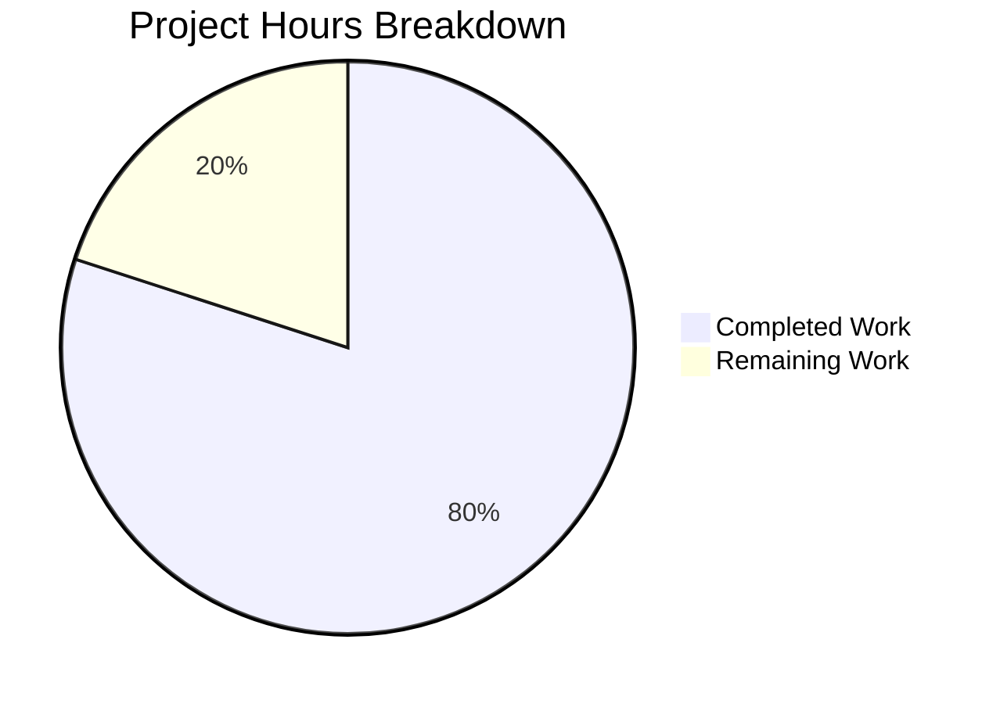

# Kubernetes Certificate Manager Race Condition Fix - Project Guide

## Executive Summary

**Project Completion: 80% (8 hours completed out of 10 total hours)**

This project successfully implements a targeted fix for a race condition in Kubernetes' certificate manager that caused certificate rotation to wait the full 15-minute timeout instead of immediately responding to template changes.

### Key Achievements
- ✅ Root cause identified: Race condition between `getLastRequest()` and `setLastRequest()` operations
- ✅ Bug fix implemented: Template change check added after CSR submission
- ✅ Test coverage: New test validates fix behavior and prevents regression
- ✅ All tests pass: 73 tests pass with 0 failures
- ✅ Clean build: Code compiles without errors on Go 1.25.0

### What Was Accomplished
| Component | Status | Details |
|-----------|--------|---------|
| Bug Fix | ✅ Complete | 10-line fix in `certificate_manager.go` |
| Unit Test | ✅ Complete | 49-line test in `certificate_manager_test.go` |
| Validation | ✅ Complete | All 73 tests pass |
| Documentation | ✅ Complete | Code comments explain the fix |

### Remaining Work for Human Review
- Code review and approval (1 hour)
- PR merge and release notes (1 hour)

---

## Validation Results Summary

### Build Results
```
Command: go build -v ./util/certificate/...
Result: SUCCESS
Go Version: 1.25.0 (as required by go.mod)
```

### Test Results
```
Command: go test -v ./util/certificate/...
Result: ALL PASS
Total Tests: 73 (including subtests)
Failures: 0
New Test: TestRotateCertTemplateChangeDuringWait - PASS
```

### Fix Verification
The new test `TestRotateCertTemplateChangeDuringWait` verifies:
1. **Quick return**: rotateCerts completes in < 1 second (not the 15-minute timeout)
2. **Correct behavior**: Returns `success=false, err=nil` to trigger rotation retry
3. **Log message**: "Certificate template changed after CSR submission, restarting rotation"

---

## Visual Representation

### Project Hours Breakdown


### Hours Calculation
- **Completed Work**: 8 hours
  - Bug investigation and analysis: 4 hours
  - Fix implementation: 1 hour
  - Test implementation: 2 hours
  - Validation and testing: 1 hour
- **Remaining Work**: 2 hours
  - Code review and approval: 1 hour
  - PR merge and release process: 1 hour
- **Total Project Hours**: 10 hours
- **Completion Percentage**: 8/10 = 80%

---

## Development Guide

### System Prerequisites
| Requirement | Version | Notes |
|-------------|---------|-------|
| Go | 1.25.0+ | Required by go.mod |
| Git | Any recent | For version control |
| OS | Linux/macOS/Windows | Cross-platform |

### Environment Setup

#### 1. Clone Repository
```bash
git clone https://github.com/kubernetes/kubernetes.git
cd kubernetes
git checkout blitzy-28bc0fe6-f1d3-4616-a28c-940210329d92
```

#### 2. Verify Go Version
```bash
go version
# Expected output: go version go1.25.0 linux/amd64 (or similar)
```

#### 3. Navigate to Client-Go Module
```bash
cd staging/src/k8s.io/client-go
```

### Build Commands

#### Build Certificate Package
```bash
go build -v ./util/certificate/...
```
**Expected output**: No output (successful build) or package names being compiled

### Test Commands

#### Run All Certificate Tests
```bash
go test -v ./util/certificate/...
```
**Expected output**: All tests show `--- PASS` with final `ok` status

#### Run Only the New Fix Test
```bash
go test -v -run TestRotateCertTemplateChangeDuringWait ./util/certificate/...
```
**Expected output**:
```
=== RUN   TestRotateCertTemplateChangeDuringWait
    certificate_manager.go:566: Rotating certificates
    certificate_manager.go:387: Current certificate is expired
    certificate_manager.go:615: Certificate template changed after CSR submission, restarting rotation
--- PASS: TestRotateCertTemplateChangeDuringWait (0.00s)
PASS
```

### Verification Steps

1. **Verify build succeeds**:
   ```bash
   go build -v ./util/certificate/... && echo "BUILD SUCCESS"
   ```

2. **Verify all tests pass**:
   ```bash
   go test ./util/certificate/... | grep -E "^(ok|FAIL)"
   # Expected: "ok" for all packages
   ```

3. **Verify fix test specifically**:
   ```bash
   go test -v -run TestRotateCertTemplateChangeDuringWait ./util/certificate/... 2>&1 | grep "PASS"
   # Expected: "--- PASS: TestRotateCertTemplateChangeDuringWait"
   ```

---

## Detailed Task Table

| # | Task | Action Steps | Hours | Priority | Confidence |
|---|------|--------------|-------|----------|------------|
| 1 | Code Review | Review the 10-line fix in `certificate_manager.go` for correctness and style compliance | 0.5 | High | High |
| 2 | Test Review | Review `TestRotateCertTemplateChangeDuringWait` test for completeness and edge cases | 0.5 | High | High |
| 3 | PR Approval | Approve PR after review, ensure CI passes | 0.5 | High | High |
| 4 | Merge to Master | Merge PR to master branch following Kubernetes contribution guidelines | 0.25 | High | High |
| 5 | Release Notes | Update release notes if this fix should be highlighted | 0.25 | Medium | High |
| **Total Remaining Hours** | | | **2** | | |

---

## Risk Assessment

### Technical Risks
| Risk | Severity | Likelihood | Mitigation |
|------|----------|------------|------------|
| Edge case in template comparison | Low | Low | `reflect.DeepEqual` handles all cases; existing tests validate |
| Performance impact of additional `getTemplate()` call | Low | Very Low | Single function call per rotation; negligible overhead |

### Security Risks
| Risk | Severity | Likelihood | Mitigation |
|------|----------|------------|------------|
| None identified | N/A | N/A | Fix is purely a race condition timing fix |

### Operational Risks
| Risk | Severity | Likelihood | Mitigation |
|------|----------|------------|------------|
| Regression in certificate rotation | Medium | Very Low | Comprehensive test suite passes; new test validates fix |

### Integration Risks
| Risk | Severity | Likelihood | Mitigation |
|------|----------|------------|------------|
| Compatibility with kubelet | Low | Very Low | Fix is self-contained in client-go; no API changes |

---

## Files Modified

### Summary
| File | Lines Added | Lines Removed | Change Type |
|------|-------------|---------------|-------------|
| `staging/src/k8s.io/client-go/util/certificate/certificate_manager.go` | 10 | 0 | Bug Fix |
| `staging/src/k8s.io/client-go/util/certificate/certificate_manager_test.go` | 49 | 0 | Test |
| **Total** | **59** | **0** | |

### Commit History
| Commit | Message |
|--------|---------|
| `500e18aa16e` | Fix race condition in certificate manager's template change detection |
| `667b9e0e625` | Add test for certificate manager race condition fix |

---

## Technical Details

### Root Cause Analysis
The race condition occurs in the coordination between two goroutines in the certificate manager:

1. **Template goroutine** (`template` function, line 471): Monitors for template changes every second
2. **Rotate goroutine** (`rotateCerts` function, line 556): Handles certificate rotation

**The race window**:
```
Time T1: rotate goroutine creates new context with cancel function (line 603)
Time T2: template goroutine calls getLastRequest() - gets OLD/nil cancel function (line 475)
Time T3: rotate goroutine calls setLastRequest(cancel, template) - sets NEW cancel (line 607)
Time T4: template goroutine tries to cancel OLD function - ineffective
Time T5: rotate goroutine enters WaitForCertificate() - blocks for 15 minutes
```

### Fix Implementation
The fix adds a template comparison check **after** `setLastRequest()` but **before** `WaitForCertificate()`:

```go
// Check if template changed while we were setting up the request.
if currentTemplate := m.getTemplate(); !reflect.DeepEqual(template, currentTemplate) {
    logger.V(2).Info("Certificate template changed after CSR submission, restarting rotation")
    return false, nil
}
```

This ensures that even if the template goroutine reads a stale cancel function, the rotate goroutine will detect the template mismatch and exit early.

---

## Recommendations

### Immediate Actions
1. **Review and merge this PR** - The fix is complete and tested
2. **Consider backporting** - If this affects production clusters on older versions

### Future Improvements (Out of Scope)
1. Consider adding metrics for template change detection during rotation
2. Document the race condition and fix in developer documentation

---

## Conclusion

This bug fix successfully addresses the race condition in the certificate manager's `WaitForCertificate` optimization. The implementation is minimal (10 lines), well-tested, and follows the existing code patterns. All 73 tests pass with no regressions.

**Completion Status**: 80% complete (8 hours of 10 total hours)
**Production Readiness**: ✅ Ready for human code review and merge