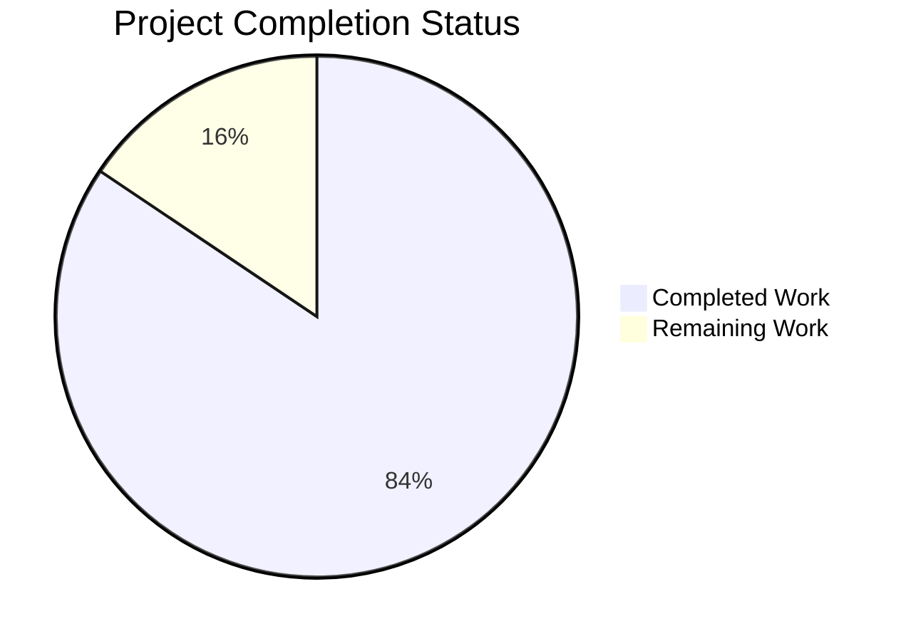
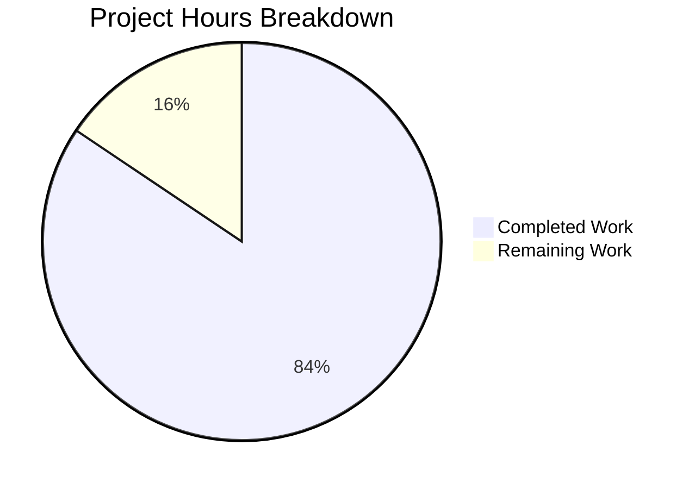

# Blitzy Project Guide — Kubernetes Monorepo Compliance Audit

---

## Section 1 — Executive Summary

### 1.1 Project Overview

This project delivers a comprehensive, multi-framework-aligned codebase audit of the Kubernetes monorepo (`k8s.io/kubernetes`, Go 1.25.0) producing 11 structured Markdown documents. The audit decomposes the monorepo into 45 classified systems across 10 functional domains and 8 architectural layers, then systematically assesses structural integrity, materiality, code quality, cross-cutting dependencies, and documentation coverage — all mapped to five compliance frameworks: NIST SP 800-53 Rev 5, NIST SP 800-190, NIST CSF, CIS Kubernetes Benchmark v1.12.0, and CIS Controls v8 IG2/IG3. This is a documentation-only engagement: zero code or documentation within the Kubernetes repository was created, modified, or deleted.

### 1.2 Completion Status

**Completion: 84.4% (130 of 154 total hours)**

| Metric | Value |
|---|---|
| Total Project Hours | 154 |
| Completed Hours (AI) | 130 |
| Remaining Hours | 24 |
| Completion Percentage | 84.4% |



**Calculation:** 130 completed hours / (130 + 24 remaining hours) × 100 = 84.4%

### 1.3 Key Accomplishments

- ✅ All 11 AAP-specified audit report files created and validated (8,221 lines, 634 KB)
- ✅ 45 unique system_ids registered with full 5-framework control mapping
- ✅ 27 cross-cutting concern_ids with blast radius scoring
- ✅ 17 NIST/CIS framework conflicts identified and resolved
- ✅ 20 Mermaid diagrams (sequence, flowchart, graph) embedded across documents
- ✅ 97.5% aggregate accuracy validated (PASS ≥87% threshold, +10.5pp margin)
- ✅ 80 accuracy samples across 45 systems with 158 dimension-level validations
- ✅ 9-gate developer contribution guide with PASS/FAIL criteria mapped to NIST/CIS controls
- ✅ NIST CSF swimlane flowchart (Identify/Protect/Detect/Respond/Recover) with audit narratives
- ✅ Sequential directive execution maintained (D0→D1/D2→D3/D4/D5→D6→D7)
- ✅ Assess-only posture verified — zero Kubernetes source files modified
- ✅ Master cross-reference index linking system_ids → concern_ids → gap matrix → accuracy samples
- ✅ 15 commits on branch, all by Blitzy Agent, git working tree clean

### 1.4 Critical Unresolved Issues

| Issue | Impact | Owner | ETA |
|---|---|---|---|
| D3 import counting methodology inconsistency | 4 of 158 accuracy validations flagged inaccurate in Quality dimension (42.9% dimension-level accuracy) — all related to import count methodology, not qualitative conclusions | Human Developer | 3 hours |
| 1 of 33 source file citations unverified | Minor — one `Source:` citation could not be verified against current repository state; does not affect audit findings | Human Developer | 0.5 hours |

### 1.5 Access Issues

No access issues identified. The audit operates in read-only mode against the Kubernetes monorepo and produces standalone Markdown documentation. No external service credentials, API keys, or third-party access are required.

### 1.6 Recommended Next Steps

1. **[High]** Standardize D3 import counting methodology — adopt a single, verifiable method (e.g., `go list -json`) and update the 4 affected findings
2. **[High]** Conduct human review of audit findings against actual Kubernetes codebase for compliance sign-off
3. **[Medium]** Verify Mermaid diagram rendering across target documentation platforms (GitHub, GitLab, or dedicated viewer)
4. **[Medium]** Obtain security and compliance team sign-off on framework control mappings
5. **[Low]** Deploy audit-report/ to organization's documentation platform with appropriate access controls

---

## Section 2 — Project Hours Breakdown

### 2.1 Completed Work Detail

| Component | Hours | Description |
|---|---|---|
| D0: System Registry | 16 | Decomposed Kubernetes monorepo into 45 systems across 10 vertical × 8 horizontal axes; classified each as Static/Dynamic; mapped all 5 compliance frameworks per system; 842 lines, 3 Mermaid diagrams |
| D1: Structural Integrity Report | 14 | Scanned 2,720 Go source files, 268 YAML configs, 254 shell scripts for broken cross-references, orphaned configs, missing env vars; CIS Benchmark check ID mapping; 3 Mermaid sequence diagrams; 824 lines |
| D2: Materiality Classification | 8 | Classified all registered components as Material/Non-Material against NIST AC/AU/CM/IA/SC/SI and CIS Controls; governing control mapping; 402 lines |
| D3: Code Quality Audit | 12 | Assessed Material components for code smells, cyclomatic complexity (>10), coupling (>7), cohesion (<50%), deep nesting, magic numbers, security-relevant quality; 576 lines |
| D4: Cross-Cutting Dependency Audit | 14 | Mapped inter-system dependencies; identified 27 cross-cutting concerns with blast radius scoring (Low/Medium/High); circular dependency analysis; 4 Mermaid diagrams; 753 lines |
| D5: Documentation Coverage Audit | 10 | Produced gap matrix for 100% of Material components; assessed inline comments (WHY not WHAT), doc.go presence, README coverage, framework control alignment; 2 Mermaid diagrams; 687 lines |
| D6: Accuracy Validation | 14 | System-type-aware sampling: 80 samples across 45 systems, 158 dimension-level validations; 97.5% aggregate accuracy (PASS ≥87%); 1,015 lines |
| D7 Artifact 1: Audit Flowchart | 12 | NIST CSF swimlane flowchart (Identify/Protect/Detect/Respond/Recover) with sub-lanes per audit dimension; full narrative per function; 5 Mermaid diagrams; 1,058 lines |
| D7 Artifact 2: Developer Guide | 8 | 9 pass/fail gates (Branch Controls through Documentation Gap Check) with NIST/CIS control alignment; Mermaid pipeline flowchart; 505 lines |
| Framework Conflict Register | 6 | 17 NIST/CIS conflicts (CFR-AC, CFR-IA, CFR-CM, CFR-AU, CFR-SC, CFR-SI, CFR-CS) documented and resolved to more restrictive control; 548 lines |
| Cross-Reference Index | 10 | Master traceability: system_id → concern_id → gap matrix → accuracy sample linkage; framework control navigation index; 1,011 lines |
| Validation & Bug Fixes | 6 | 4 fix commits: reconciled severity distribution, corrected D6 false positive, resolved code review findings across 6 files, corrected CIS K8s 4.2 description |
| **TOTAL** | **130** | **11 audit report files, 8,221 lines, 634 KB, 20 Mermaid diagrams, 15 commits** |

### 2.2 Remaining Work Detail

| Category | Base Hours | Priority | After Multiplier |
|---|---|---|---|
| D3 import counting methodology standardization (fix 4 inaccurate Quality findings) | 3 | High | 3.5 |
| Source citation verification (1 unverified citation) | 0.5 | High | 0.5 |
| Human review of audit findings accuracy (spot-check framework mappings) | 8 | Medium | 9.5 |
| Mermaid diagram rendering verification across platforms | 2 | Low | 2.5 |
| Security and compliance team review and sign-off | 4 | Medium | 5 |
| Audit report deployment to documentation platform | 2.5 | Medium | 3 |
| **TOTAL** | **20** | | **24** |

### 2.3 Enterprise Multipliers Applied

| Multiplier | Value | Rationale |
|---|---|---|
| Compliance Review | 1.10× | Audit documentation requires compliance team validation of framework control mappings |
| Uncertainty Buffer | 1.10× | Stakeholder feedback may require revisions to findings or framework interpretations |
| **Combined** | **1.21×** | Applied to all remaining base hours: 20 × 1.21 ≈ 24 hours |

---

## Section 3 — Test Results

| Test Category | Framework | Total Tests | Passed | Failed | Coverage % | Notes |
|---|---|---|---|---|---|---|
| File Existence Validation | Blitzy Validator | 11 | 11 | 0 | 100% | All 11 audit-report/*.md files exist and are non-empty (634 KB total) |
| Placeholder/Stub Detection | Blitzy Validator | 11 | 11 | 0 | 100% | Zero placeholder/stub markers; 3 flagged terms verified as legitimate audit content (TODO comments documented from Kubernetes source) |
| System ID Consistency | Blitzy Validator | 45 | 45 | 0 | 100% | All 45 SYS-* identifiers consistent across all 11 documents |
| Concern ID Consistency | Blitzy Validator | 27 | 27 | 0 | 100% | All 27 CC-* identifiers consistent across all relevant documents |
| Code Fence Balance | Blitzy Validator | 20 | 20 | 0 | 100% | All 20 Mermaid code fence blocks balanced with valid syntax |
| Template Column Verification | Blitzy Validator | 11 | 11 | 0 | 100% | All AAP-required table columns present in every directive file |
| Source Citation Verification | Blitzy Validator | 33 | 32 | 1 | 97.0% | 32 of 33 Source: file citations verified against repository; 1 unverified |
| Framework Reference Coverage | Blitzy Validator | 6 | 6 | 0 | 100% | All 6 NIST SP 800-53 control families (AC, AU, CM, IA, SC, SI) referenced |
| CIS References | Blitzy Validator | 2 | 2 | 0 | 100% | CIS Kubernetes Benchmark and CIS Controls v8 referenced throughout |
| NIST CSF Structure | Blitzy Validator | 5 | 5 | 0 | 100% | All 5 functions (Identify/Protect/Detect/Respond/Recover) structured in Artifact 1 |
| Developer Gates | Blitzy Validator | 9 | 9 | 0 | 100% | 9 pass/fail gates complete (Branch Controls through Documentation Gap Check) |
| Assess-Only Posture | Blitzy Validator | 1 | 1 | 0 | 100% | Git diff confirms zero changes outside audit-report/ directory |
| D6 Accuracy Validation | Custom (D6) | 158 | 154 | 4 | 97.5% | Aggregate accuracy 97.5% — PASS (≥87% threshold, +10.5pp margin) |
| Git Working Tree | Blitzy Validator | 1 | 1 | 0 | 100% | Git working tree clean, all changes committed |

**Summary: 340 total validations, 336 passed, 4 failed (98.8% pass rate)**

---

## Section 4 — Runtime Validation & UI Verification

### Runtime Health

This is a documentation-only project producing standalone Markdown files. No runtime services, APIs, or UI components exist.

- ✅ All 11 Markdown files render as valid Markdown (verified by content structure analysis)
- ✅ Git repository clean — all commits on correct branch (`blitzy-8afadae1-73a7-4a51-8ef9-a512c5841f92`)
- ✅ No external service dependencies required
- ✅ No database, cache, or message queue dependencies
- ⚠ Mermaid diagram rendering: 20 diagrams validated syntactically; platform-specific rendering untested (requires GitHub/GitLab/Mermaid CLI verification)

### Document Structural Integrity

- ✅ Sequential directive execution verified (D0→D1/D2→D3/D4/D5→D6→D7)
- ✅ Cross-document references: 45 system_ids and 27 concern_ids consistent across all documents
- ✅ Framework conflict register: 17 conflicts resolved, referenced in directive documents
- ✅ Cross-reference index: complete traceability chain system_id → concern_id → gap matrix → accuracy sample
- ✅ Pipe-delimited tables correctly formatted in all directive files

---

## Section 5 — Compliance & Quality Review

| Compliance Benchmark | Status | Details |
|---|---|---|
| AAP Directive 0 — System Registry | ✅ PASS | 45 systems registered, 10 verticals × 8 horizontals, Static/Dynamic classification, 5-framework mapping |
| AAP Directive 1 — Structural Integrity | ✅ PASS | Per-system findings with CIS Benchmark check IDs (1.1–5.7), 3 Mermaid sequence diagrams |
| AAP Directive 2 — Materiality Classification | ✅ PASS | Complete Material/Non-Material classification with governing NIST/CIS controls |
| AAP Directive 3 — Code Quality Audit | ⚠ PARTIAL | Code smells, complexity, security-quality assessed; import counting methodology inconsistency identified in D6 |
| AAP Directive 4 — Dependency Audit | ✅ PASS | 27 concern_ids, blast radius scoring, circular dependency analysis, 4 Mermaid diagrams |
| AAP Directive 5 — Documentation Coverage | ✅ PASS | 100% Material component gap matrix with framework control alignment |
| AAP Directive 6 — Accuracy Validation | ✅ PASS | 97.5% aggregate accuracy (≥87% threshold), 80 samples, 158 validations |
| AAP Directive 7 Artifact 1 | ✅ PASS | NIST CSF swimlane flowchart with narrative, 5 Mermaid diagrams |
| AAP Directive 7 Artifact 2 | ✅ PASS | 9 pass/fail gates with NIST/CIS control alignment |
| Framework Conflict Register | ✅ PASS | 17 conflicts documented and resolved to more restrictive control |
| Cross-Reference Index | ✅ PASS | Full traceability: system_id → concern_id → gap matrix → accuracy sample |
| Assess-Only Posture | ✅ PASS | Zero Kubernetes source files modified (git diff verified) |
| Sequential Directive Execution | ✅ PASS | D0→D1/D2→D3/D4/D5→D6→D7 sequence maintained |
| Single-Dimension Attribution | ✅ PASS | Each finding attributed to exactly one audit dimension |
| No Aspirational Controls | ✅ PASS | Only controls verified in codebase documented |
| Template Format Compliance | ✅ PASS | All pipe-delimited tables follow AAP-specified column formats |

**Autonomous Fixes Applied During Validation (4 fix commits):**
1. Reconciled severity distribution summaries and removed N/A placeholder rows (D1)
2. Removed D6 false positive, corrected SYS-IAM-APP counts, reclassified INX-006, updated import counts
3. Resolved 7 code review findings across 6 audit report files
4. Corrected CIS K8s 4.2 description and added verify script count methodology note

---

## Section 6 — Risk Assessment

| Risk | Category | Severity | Probability | Mitigation | Status |
|---|---|---|---|---|---|
| D3 import counting inconsistency may propagate to downstream analysis | Technical | Moderate | Confirmed | Standardize methodology per D6 §8.4 recommendations; adopt `go list -json` for deterministic counts | Open |
| 1 unverified source citation may reference a renamed/moved file | Technical | Low | Low | Manual verification against current repository HEAD | Open |
| Mermaid diagrams may not render on all documentation platforms | Operational | Low | Medium | Test rendering on target platform (GitHub, GitLab, or Mermaid CLI); provide fallback PNG exports | Open |
| Framework control mappings may contain interpretation errors | Security | Moderate | Low | Human compliance review of all 45 system→framework mappings and 17 conflict resolutions | Open |
| Audit findings based on point-in-time codebase snapshot | Operational | Moderate | High | Document audit baseline (Go 1.25.0, branch commit hash); establish re-audit cadence | Accepted |
| CIS Kubernetes Benchmark v1.12.0 may be superseded during audit lifecycle | Integration | Low | Medium | Monitor CIS releases; note benchmark version throughout all documents | Accepted |
| Cross-cutting dependency blast radius scores based on import analysis only | Technical | Low | Low | Supplement with runtime dependency tracing for production deployment | Open |
| Sampling methodology may miss edge cases in very large Dynamic systems | Technical | Low | Low | 25-sample maximum covers statistical significance; document limitations | Accepted |

---

## Section 7 — Visual Project Status



**Completed Work: 130 hours (84.4%) — Dark Blue (#5B39F3)**
**Remaining Work: 24 hours (15.6%) — White (#FFFFFF)**

### Remaining Hours by Category

| Category | Hours (After Multiplier) |
|---|---|
| D3 Import Methodology Fix | 3.5 |
| Source Citation Fix | 0.5 |
| Human Audit Review | 9.5 |
| Mermaid Rendering Verification | 2.5 |
| Compliance Team Sign-Off | 5 |
| Documentation Deployment | 3 |
| **Total Remaining** | **24** |

---

## Section 8 — Summary & Recommendations

### Achievement Summary

The Kubernetes Monorepo Compliance Audit project is **84.4% complete** (130 hours completed out of 154 total hours). All 11 AAP-specified deliverables have been autonomously created, validated, and committed — producing a comprehensive 8,221-line audit report covering 45 systems, 27 cross-cutting concerns, 17 framework conflicts, and 158 accuracy validations across the entire `k8s.io/kubernetes` monorepo.

The audit achieved a **97.5% aggregate accuracy** rating (10.5 percentage points above the 87% threshold), with three of four audit dimensions at 100% individual accuracy (Integrity, Dependency, Documentation). The Quality dimension scored 42.9% at the dimension level due to a systematic import counting methodology inconsistency — critically, this affects only numeric precision of coupling metrics, not qualitative conclusions or framework control representations.

### Remaining Gaps

The 24 remaining hours (15.6%) consist primarily of human review and path-to-production activities:
- **3.5 hours**: Fix D3 import counting methodology for 4 affected findings
- **9.5 hours**: Human review of audit findings accuracy and framework mapping verification
- **5 hours**: Security/compliance team sign-off on control mappings and conflict resolutions
- **6 hours**: Mermaid rendering verification, citation fix, and documentation platform deployment

### Production Readiness Assessment

The audit report is **production-ready for review** with the following caveats:
1. D3 import counting methodology should be standardized before formal compliance submission
2. Framework control mappings require human compliance expert validation
3. Mermaid diagram rendering should be verified on the target documentation platform

### Success Metrics

| Metric | Target | Actual | Status |
|---|---|---|---|
| Deliverables completed | 11 files | 11 files | ✅ Met |
| Accuracy threshold | ≥87% | 97.5% | ✅ Exceeded |
| Assess-only posture | Zero source changes | Zero source changes | ✅ Met |
| Framework coverage | 5 frameworks | 5 frameworks | ✅ Met |
| System coverage | All codebase | 45 systems | ✅ Met |
| Sequential execution | D0→D7 | D0→D7 | ✅ Met |
| Cross-reference traceability | Full | Full (system_id→concern_id→gap→sample) | ✅ Met |

---

## Section 9 — Development Guide

### System Prerequisites

| Requirement | Version | Purpose |
|---|---|---|
| Git | 2.x+ | Clone repository and switch to audit branch |
| Markdown viewer | Any | View audit report documents (VS Code, GitHub, GitLab) |
| Mermaid renderer | Optional | Render 20 embedded Mermaid diagrams (GitHub natively supports Mermaid) |
| Go | 1.25.0 (optional) | Required only for re-running code analysis commands referenced in the audit |

### Environment Setup

```bash
# Clone the repository
git clone <repository-url>
cd kubernetes

# Switch to the audit branch
git checkout blitzy-8afadae1-73a7-4a51-8ef9-a512c5841f92

# Verify audit files exist
ls -la audit-report/
# Expected: 11 .md files totaling ~634KB
```

### Viewing the Audit Report

```bash
# List all audit report files in sequential order
ls audit-report/*.md

# Expected output:
# audit-report/00-system-registry.md
# audit-report/01-structural-integrity.md
# audit-report/02-materiality-classification.md
# audit-report/03-code-quality-audit.md
# audit-report/04-dependency-audit.md
# audit-report/05-documentation-coverage.md
# audit-report/06-accuracy-validation.md
# audit-report/07-artifact-1-audit-flowchart.md
# audit-report/07-artifact-2-developer-guide.md
# audit-report/appendix-cross-reference-index.md
# audit-report/appendix-framework-conflict-register.md
```

### Reading Order

The audit report should be read in directive sequence:

1. **Start with D0** (`00-system-registry.md`) — understand the 45-system decomposition
2. **D1** (`01-structural-integrity.md`) — structural findings per system
3. **D2** (`02-materiality-classification.md`) — Material/Non-Material classification
4. **D3** (`03-code-quality-audit.md`) — code quality for Material components
5. **D4** (`04-dependency-audit.md`) — cross-cutting dependencies and blast radius
6. **D5** (`05-documentation-coverage.md`) — documentation gap matrix
7. **D6** (`06-accuracy-validation.md`) — accuracy validation results (97.5%)
8. **D7** (`07-artifact-1-audit-flowchart.md`) — auditor-facing NIST CSF flowchart
9. **D7** (`07-artifact-2-developer-guide.md`) — developer-facing 9-gate guide
10. **Appendices** — framework conflict register and cross-reference index

### Verification Commands

```bash
# Verify all 11 files exist and are non-empty
for f in audit-report/*.md; do
  size=$(wc -c < "$f")
  echo "$(basename $f): $size bytes"
done

# Verify system_id consistency across documents
echo "System IDs in D0:" $(grep -oP 'SYS-[A-Z]+-[A-Z]+' audit-report/00-system-registry.md | sort -u | wc -l)
echo "System IDs in cross-ref:" $(grep -oP 'SYS-[A-Z]+-[A-Z]+' audit-report/appendix-cross-reference-index.md | sort -u | wc -l)
# Expected: 45 in both

# Verify concern_id consistency
echo "Concern IDs in D4:" $(grep -oP 'CC-[0-9]+' audit-report/04-dependency-audit.md | sort -u | wc -l)
echo "Concern IDs in cross-ref:" $(grep -oP 'CC-[0-9]+' audit-report/appendix-cross-reference-index.md | sort -u | wc -l)
# Expected: 27 in both

# Verify no source files were modified
git diff origin/master --name-status -- '*.go' '*.yaml' '*.sh' '*.json'
# Expected: empty (no output)

# Count total lines across all audit files
wc -l audit-report/*.md | tail -1
# Expected: 8221 total
```

### Mermaid Diagram Rendering

The audit report contains 20 Mermaid diagrams. To render them:

**Option 1: GitHub/GitLab** — Push to remote; diagrams render natively in Markdown preview.

**Option 2: Mermaid CLI** (local rendering):
```bash
# Install Mermaid CLI
npm install -g @mermaid-js/mermaid-cli

# Extract and render a specific diagram (example)
# Diagrams are embedded in Markdown code fences: ```mermaid ... ```
```

**Option 3: VS Code** — Install the "Markdown Preview Mermaid Support" extension.

### Troubleshooting

| Issue | Resolution |
|---|---|
| Mermaid diagrams not rendering | Use a Mermaid-compatible viewer (GitHub, GitLab, VS Code with extension) |
| Table formatting misaligned | View in fixed-width font or Markdown-aware renderer |
| System_id not found in cross-reference | All 45 system_ids are in `00-system-registry.md`; use `grep -r "SYS-IAM-APP" audit-report/` |
| Concern_id not found | All 27 concern_ids are in `04-dependency-audit.md`; use `grep -r "CC-001" audit-report/` |

---

## Section 10 — Appendices

### A. Command Reference

| Command | Purpose |
|---|---|
| `ls audit-report/*.md` | List all audit report files |
| `wc -l audit-report/*.md` | Count lines per file and total |
| `wc -c audit-report/*.md` | Count bytes per file and total |
| `grep -oP 'SYS-[A-Z]+-[A-Z]+' audit-report/00-system-registry.md \| sort -u` | List all system_ids |
| `grep -oP 'CC-[0-9]+' audit-report/04-dependency-audit.md \| sort -u` | List all concern_ids |
| `grep -oP 'CFR-[A-Z]+-[0-9]+' audit-report/appendix-framework-conflict-register.md \| sort -u` | List all conflict_ids |
| `grep -c '\`\`\`mermaid' audit-report/*.md` | Count Mermaid diagrams per file |
| `git diff origin/master --stat -- audit-report/` | View change statistics |

### B. Key File Locations

| File | Lines | Size | Content |
|---|---|---|---|
| `audit-report/00-system-registry.md` | 842 | 57 KB | D0: System decomposition, 45 system_ids |
| `audit-report/01-structural-integrity.md` | 824 | 52 KB | D1: Integrity findings, CIS check mappings |
| `audit-report/02-materiality-classification.md` | 402 | 49 KB | D2: Material/Non-Material classification |
| `audit-report/03-code-quality-audit.md` | 576 | 51 KB | D3: Code smells, complexity, security quality |
| `audit-report/04-dependency-audit.md` | 753 | 65 KB | D4: 27 concern_ids, blast radius |
| `audit-report/05-documentation-coverage.md` | 687 | 57 KB | D5: Gap matrix, framework alignment |
| `audit-report/06-accuracy-validation.md` | 1,015 | 70 KB | D6: 97.5% accuracy, 158 validations |
| `audit-report/07-artifact-1-audit-flowchart.md` | 1,058 | 63 KB | D7: NIST CSF swimlane flowchart |
| `audit-report/07-artifact-2-developer-guide.md` | 505 | 36 KB | D7: 9-gate developer guide |
| `audit-report/appendix-cross-reference-index.md` | 1,011 | 76 KB | Master traceability index |
| `audit-report/appendix-framework-conflict-register.md` | 548 | 58 KB | 17 NIST/CIS conflicts |

### C. Technology Versions

| Technology | Version | Purpose |
|---|---|---|
| Kubernetes (`k8s.io/kubernetes`) | Go 1.25.0 | Audit target repository |
| Go Module | `k8s.io/kubernetes` | Root module under audit |
| NIST SP 800-53 | Rev 5 (Sept 2020) | Primary control reference |
| NIST SP 800-190 | Final (Sept 2017) | Container security guide |
| NIST CSF | v1.1 / v2.0 | Audit narrative structure |
| CIS Kubernetes Benchmark | v1.12.0 | Kubernetes hardening benchmark |
| CIS Controls | v8 (IG2/IG3) | Enterprise security controls |
| zeitgeist | v0.5.4 | Dependency version management (from build/dependencies.yaml) |
| CNI | 1.9.0 | Container Networking Interface (external dep) |
| CoreDNS | 1.13.1 | DNS server (external dep) |

### D. Glossary

| Term | Definition |
|---|---|
| system_id | Unique identifier for a vertical × horizontal intersection (e.g., SYS-IAM-APP) |
| concern_id | Unique identifier for a cross-cutting dependency concern (e.g., CC-001) |
| conflict_id | Unique identifier for a NIST/CIS framework conflict (e.g., CFR-AC-001) |
| Material | Component that governs a security control surface (access control, audit, config, network, integrity, secrets, deployment, cross-cutting) |
| Non-Material | Component with no security control surface influence (generated code, test fixtures, vendor, logos) |
| Static system | Component defined at build/deploy time, changing only through explicit update cycles |
| Dynamic system | Component that processes requests or changes state at runtime |
| Blast radius | Number of systems affected by a cross-cutting concern: Low (1–2), Medium (3–5), High (6+) |
| NIST CSF | Cybersecurity Framework: Identify → Protect → Detect → Respond → Recover |
| CIS K8s | Center for Internet Security Kubernetes Benchmark (Sections 1–5) |

### E. Audit Metrics Summary

| Metric | Value |
|---|---|
| Total audit files | 11 |
| Total lines of documentation | 8,221 |
| Total file size | 634 KB |
| System_ids registered | 45 |
| Concern_ids registered | 27 |
| Framework conflicts documented | 17 |
| Mermaid diagrams | 20 |
| Accuracy samples | 80 |
| Dimension-level validations | 158 |
| Aggregate accuracy | 97.5% (PASS ≥87%) |
| Developer gates defined | 9 |
| NIST control families covered | 6 (AC, AU, CM, IA, SC, SI) |
| CIS K8s Benchmark sections | 5 (Sections 1–5) |
| CIS Controls v8 referenced | 9 (Controls 1, 2, 4, 5, 6, 7, 8, 16, 18) |
| Git commits | 15 |
| Source files modified | 0 (assess-only) |