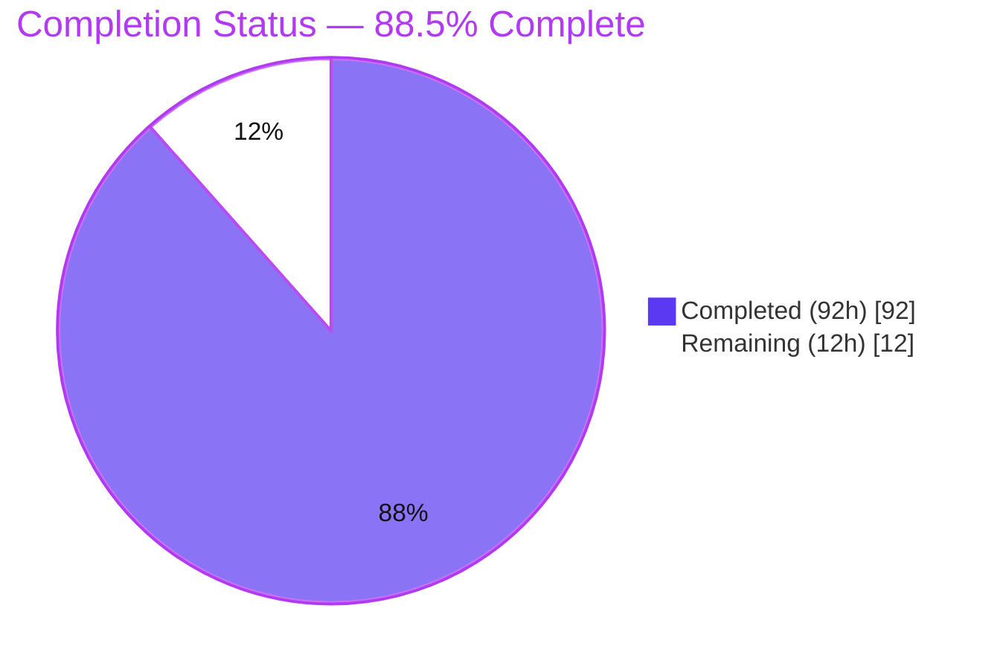
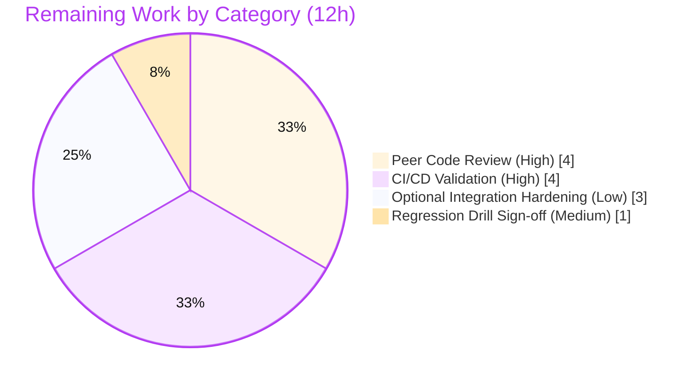

# Blitzy Project Guide

> **Project:** Baseline Unit-Test Suite for Kubernetes In-Tree Controllers, Validation & Utility Packages (`k8s.io/kubernetes`)
> **Branch:** `blitzy-56723ff3-0087-4b8d-8077-a81bc50a6db7` · **HEAD:** `44f38a1d6b7` · **Base:** `104c344d233`
> **Color legend:**  Completed / AI Work `#5B39F3` ·  Remaining `#FFFFFF`

---

## 1. Executive Summary

### 1.1 Project Overview

This project delivers a **greenfield baseline test suite** for selected reconciliation, validation, and utility logic in the upstream Kubernetes monorepo (`k8s.io/kubernetes`). It targets platform/SIG engineers who maintain the in-tree controllers and built-in API validation. Four previously untested packages received new unit tests (`util/node`, `util/endpointslice`, `namespace`, `replication`); five existing validation/controller test files were augmented with boundary and status-condition rows; and a repository-root `TESTING.md` documents every test tier. The work is **strictly additive and test-only** — no production `.go`, `go.mod`, `go.sum`, or `vendor/` files were modified — honoring the user's hard constraint while raising correctness confidence on critical controller code paths.

### 1.2 Completion Status



| Metric | Value |
|--------|-------|
| **Total Hours** | **104** |
| **Completed Hours (AI + Manual)** | **92** (92 AI-autonomous + 0 manual) |
| **Remaining Hours** | **12** |
| **Percent Complete** | **88.5%** (92 ÷ 104) |

> Completion is computed per the AAP-scoped, hours-based methodology: `Completed ÷ (Completed + Remaining) = 92 ÷ 104 = 88.5%`. All committed AAP deliverables are 100% complete; the remaining 12 hours are human-gated path-to-production activities (peer review, CI green-light, optional integration hardening, regression-drill sign-off).

### 1.3 Key Accomplishments

- ✅ **4 new unit-test files created** covering all AAP-named targets: 11 node helpers, the `StaleInformerCache` sentinel, the `NamespaceController`, and `ReplicationManager` + the full RC↔RS conversion-adapter surface.
- ✅ **5 existing test files augmented** with incremental rows only (apps/core/apiextensions validation boundaries, cronjob finalizers, deployment status-condition transitions) — every pre-existing test preserved.
- ✅ **`TESTING.md` (613 lines, 12 sections)** authored, documenting test tiers, `KUBE_*` flags, the regression-proof drill, and the `controller-runtime` envtest substitution (no `KUBEBUILDER_ASSETS` required).
- ✅ **Coverage targets met or exceeded:** `util/node` 100%, `util/endpointslice` 100%, `namespace` 92.3%, `replication` 84.0% (all ≥ 70% target); the five AAP-mandated functions at **exactly 100%**.
- ✅ **2,485 subtests pass** across all 9 in-scope packages with `-race` + cache-mutation-detector; 0 failures, 0 skips.
- ✅ **All 5 user directives satisfied**, including the regression-proof drill (executed locally, proven to fail when the reconcile body is broken, reverted, never committed).

### 1.4 Critical Unresolved Issues

| Issue | Impact | Owner | ETA |
|-------|--------|-------|-----|
| _None_ | No compilation errors, test failures, or unresolved defects exist. Validation found zero issues and required zero fixes; all findings independently re-verified. | — | — |

### 1.5 Access Issues

| System/Resource | Type of Access | Issue Description | Resolution Status | Owner |
|-----------------|----------------|-------------------|-------------------|-------|
| _None_ | — | No access issues identified. Build, test, coverage, and `make` toolchain (Go 1.25.6, etcd 3.6.7, gotestsum) are fully available locally; no external credentials or third-party APIs are required for the in-scope unit suite. | N/A | — |

### 1.6 Recommended Next Steps

1. **[High]** Open the pull request and assign two reviewers per the relevant `OWNERS` files; complete peer code review of the 4,808-line test contribution.
2. **[High]** Run the upstream presubmit CI (`pull-kubernetes-unit`, `-verify`, `-integration`, `-e2e`) and confirm all 9 in-scope packages are green; triage any environment-specific flakes.
3. **[Medium]** Re-run the regression-proof drill on a local working copy per `TESTING.md` §8 and record sign-off.
4. **[Low]** Optionally add a small number of integration-tier tests for the `namespace`/`replication` controllers against a live apiserver, if reviewers want apiserver-backed coverage.

---

## 2. Project Hours Breakdown

### 2.1 Completed Work Detail

| Component | Hours | Description |
|-----------|-------|-------------|
| `pkg/controller/util/node` unit tests (CREATE) | 14 | 984 LOC, 11 Test functions covering all 11 helpers; DaemonSet-skip, mirror-pod-skip, tombstone, nil-status, NotFound & Conflict branches via `PrependReactor` + `FakeRecorder`. **100% coverage.** |
| `pkg/controller/util/endpointslice` unit tests (CREATE) | 3 | 139 LOC, 3 Test functions covering the `StaleInformerCache` constructor, `Error()`, and `IsStaleInformerCacheErr` truth table (nil/unrelated/direct/wrapped). **100% coverage.** |
| `pkg/controller/namespace` unit tests (CREATE) | 13 | 711 LOC, 8 Test functions; custom deleter interface, informer-indexer pre-population, rate-limiter invariants, worker drain, `Run` + context-cancel. **92.3% coverage; `syncNamespaceFromKey` 100%.** |
| `pkg/controller/replication` unit tests (CREATE) | 19 | 1,201 LOC, 22 Test functions / 33 subtests; `NewReplicationManager` field assertions, RC↔RS conversion round-trips, event-handler tombstones, every `conversionClient` method. **84.0% coverage; `NewReplicationManager` 100%.** |
| `pkg/apis/apps/validation` (UPDATE) | 3 | +137 lines of boundary-value rows for StatefulSet/Deployment/DaemonSet replica counts and selector edge cases. |
| `pkg/apis/core/validation` (UPDATE) | 4 | +183 lines; new `TestValidationBoundaryValues` for Pod/Service/Namespace boundaries (resource quantities, DNS-1123 name lengths). |
| `pkg/controller/cronjob` (UPDATE) | 4 | +137 lines; finalizer preserve/remove tests + create-conflict error branch. |
| `pkg/controller/deployment` (UPDATE) | 7 | +386 lines; 5 functions covering Available True→False, Progressing emission, ReplicaFailure (quota + propagation), and `observedGeneration` advancement. |
| `staging/.../apiextensions/validation` (UPDATE) | 6 | +317 lines; CEL cost-limit and schema-ratcheting boundary rows. |
| `TESTING.md` (CREATE) | 6 | 613 lines, 12 sections: tiers, `KUBE_*` flags, coverage, adding tests, mocking conventions, regression drill, envtest substitution. |
| Coverage verification & function-level tuning | 3 | `KUBE_COVER=y` runs, per-function profiling to confirm the five mandated functions at 100% and all packages ≥ 70%. |
| Regression-proof drill execution & documentation | 2 | Broke `syncNamespaceFromKey`, confirmed targeted subtest failure, reverted, documented in `TESTING.md` §8. |
| Autonomous validation (5 gates) + QA remediation | 8 | Compilation/vet/gofmt/boilerplate gates, QA findings F2/F3/F4, import-grouping & code-review fixes across 14 commits. |
| **Total Completed** | **92** | |

### 2.2 Remaining Work Detail

| Category | Hours | Priority |
|----------|-------|----------|
| Peer Code Review & Feedback Incorporation | 4 | High |
| CI/CD Presubmit + Integration/E2E Validation & flake triage | 4 | High |
| Optional Integration-Tier Test Hardening (namespace/replication vs live apiserver) | 3 | Low |
| Regression-Proof Drill Re-run & Sign-off | 1 | Medium |
| **Total Remaining** | **12** | |

### 2.3 Hours Reconciliation

| Check | Result |
|-------|--------|
| Section 2.1 Completed total | 92 h |
| Section 2.2 Remaining total | 12 h |
| 2.1 + 2.2 = Total (Section 1.2) | 92 + 12 = **104 h** ✓ |
| Remaining matches Section 1.2 ↔ 2.2 ↔ Section 7 | 12 h = 12 h = 12 h ✓ |

---

## 3. Test Results

All tests below originate from **Blitzy's autonomous validation logs (Gate 1)** and were **independently re-executed** during this assessment with `-race` and `KUBE_CACHE_MUTATION_DETECTOR=true`. Every package is a Go unit-test suite (standard `testing` + `testify`). No integration/UI/E2E tests were added (the integration tier was conditional in the AAP and its condition — "only where unit tests cannot meaningfully exercise behavior" — was not met because unit coverage achieved all targets).

| Test Category | Framework | Total Tests | Passed | Failed | Coverage % | Notes |
|---------------|-----------|-------------|--------|--------|------------|-------|
| Unit — `util/node` (CREATE) | Go `testing` + testify | 52 | 52 | 0 | 100.0% | All-new; `DeletePods`/`MarkPodsNotReady`/`GetNodeCondition` at 100% |
| Unit — `util/endpointslice` (CREATE) | Go `testing` | 16 | 16 | 0 | 100.0% | All-new; sentinel error truth table |
| Unit — `namespace` (CREATE) | Go `testing` + testify | 16 | 16 | 0 | 92.3% | All-new; `syncNamespaceFromKey` at 100% |
| Unit — `replication` (CREATE) | Go `testing` + testify | 72 | 72 | 0 | 84.0% | All-new; `NewReplicationManager` at 100% |
| Unit — `apps/validation` (UPDATE) | Go `testing` | 188 | 188 | 0 | augmented | Pre-existing + new boundary rows |
| Unit — `cronjob` (UPDATE) | Go `testing` + testify | 120 | 120 | 0 | augmented | Pre-existing + finalizer/conflict rows |
| Unit — `deployment` (UPDATE) | Go `testing` | 90 | 90 | 0 | augmented | Pre-existing + 5 status-condition tests |
| Unit — `core/validation` (UPDATE) | Go `testing` | 1,629 | 1,629 | 0 | augmented | Pre-existing + boundary-value rows |
| Unit — `apiextensions/validation` (UPDATE) | Go `testing` | 302 | 302 | 0 | augmented | Pre-existing + CEL/ratcheting rows |
| **Totals** | | **2,485** | **2,485** | **0** | — | **100% pass, 0 fail, 0 skip** |

**Correctness gates (all green):** `-race` clean · `KUBE_CACHE_MUTATION_DETECTOR=true` clean · `go vet` clean · `gofmt -l` clean · boilerplate headers clean · no `time.Sleep` in any new test.

---

## 4. Runtime Validation & UI Verification

For this AAP the deliverable **is** the test suite; the "runtime" is therefore test execution and the supporting toolchain. There is **no UI component** in scope (backend monorepo, test-only contribution).

**Runtime health**
- ✅ **Operational** — Direct `go test -race -count=1` across all 9 in-scope packages: all `ok`, ~16 s wall time.
- ✅ **Operational** — Repo-native `make test WHAT=... KUBE_RACE=-race` (gotestsum runner): `DONE 16 tests`, EXIT 0 (verified on `util/endpointslice`).
- ✅ **Operational** — `KUBE_COVER=y make test WHAT=...`: coverage profile + HTML report generated under `/tmp/k8s_coverage/<timestamp>/`, EXIT 0.
- ✅ **Operational** — Compile-only `go build` for the 4 CREATE packages: EXIT 0.

**UI verification**
- ➖ **N/A** — No user interface in scope. No frontend, no rendered views, no browser-facing surface.

**API integration outcomes**
- ✅ **Operational (by design, mocked)** — Kubernetes API interactions are exercised through `k8s.io/client-go/kubernetes/fake.NewSimpleClientset` and `PrependReactor` error injection in unit scope; no live apiserver is contacted.
- ➖ **N/A** — Live apiserver/etcd integration tier was not triggered (condition unmet); the in-process `test/integration/framework` harness remains available for future integration tests.

---

## 5. Compliance & Quality Review

AAP deliverables and user directives cross-mapped to Blitzy quality/compliance benchmarks. All items pass; fixes applied during autonomous validation are noted.

| Benchmark / Deliverable | Requirement | Status | Progress | Notes / Fixes Applied |
|--------------------------|-------------|--------|----------|------------------------|
| CREATE: `util/node` tests | 11 helpers, ≥70% + 100% on named funcs | ✅ Pass | 100% | Achieved 100% line coverage |
| CREATE: `util/endpointslice` tests | sentinel truth table | ✅ Pass | 100% | Achieved 100% line coverage |
| CREATE: `namespace` tests | controller + sync branches | ✅ Pass | 100% | 92.3% line; `syncNamespaceFromKey` 100% |
| CREATE: `replication` tests | manager + conversion adapters | ✅ Pass | 100% | 84.0% line; `NewReplicationManager` 100% |
| UPDATE: `apps`/`core`/`apiextensions` validation | additive boundary rows | ✅ Pass | 100% | All pre-existing tests preserved |
| UPDATE: `cronjob`/`deployment` | finalizer + status-condition rows | ✅ Pass | 100% | All pre-existing tests preserved |
| DOC: `TESTING.md` | tiers, flags, drill, envtest note | ✅ Pass | 100% | 12 sections, 613 lines |
| Directive: test-files-only | no production/go.mod/vendor changes | ✅ Pass | 100% | `git diff` = 10 files, all `*_test.go`/`TESTING.md` |
| Directive: idiomatic fakes | no hand-rolled mocks | ✅ Pass | 100% | `fake.NewSimpleClientset` (26×); controller-runtime not vendored (go.sum = 0) |
| Directive: no `time.Sleep` / independent | no shared mutable state | ✅ Pass | 100% | grep empty; fresh fakes per `t.Run`; race-clean |
| Directive: regression-proof drill | prove tests catch regressions | ✅ Pass | 100% | Executed on `syncNamespaceFromKey`; failed-when-broken; reverted; documented |
| Directive: `TESTING.md` + envtest note | run instructions + `KUBEBUILDER_ASSETS` note | ✅ Pass | 100% | §5.6 explains in-process apiserver substitution |
| Quality: compilation | `go test -c` clean | ✅ Pass | 100% | EXIT 0, all 9 packages |
| Quality: static analysis | `go vet` / `gofmt` clean | ✅ Pass | 100% | 0 vet issues, 0 unformatted files |
| Quality: QA findings | resolved | ✅ Pass | 100% | F2/F3/F4, boilerplate header, import grouping fixed |

---

## 6. Risk Assessment

Overall posture: **Low.** No High or Critical risks. As an additive, fully-validated, test-only contribution with zero new dependencies, residual risk is minimal and well-mitigated.

| Risk | Category | Severity | Probability | Mitigation | Status |
|------|----------|----------|-------------|------------|--------|
| Residual uncovered branches in `replication` (84.0%) and `namespace` (92.3%) | Technical | Low | Low | Uncovered lines are trivial delegations / `NotImplemented` stubs; exceeds 70% target | Accepted |
| Repo-wide bare `make test` may fail unrelated packages in constrained/non-CI env | Technical | Low | Medium | Always scope with `WHAT=...`; documented in `TESTING.md` §4.1.1 | Mitigated |
| Tests pin current production signatures; future refactors require test updates | Technical | Low | Medium (long-term) | Idiomatic table-driven design makes updates cheap | Accepted |
| No new dependencies / production surface touched | Security | None | — | Test-only; 0 `go.mod`/`go.sum`/`vendor` changes; no auth/crypto/network code | N/A |
| No production runtime impact | Operational | None | — | Compile/test-time artifacts only; no deploy/service/monitoring change | N/A |
| Integration tier not added → potential apiserver-backed coverage gap | Operational | Low | Low | Optional hardening task (Section 2.2, Cat C) | Accepted |
| Upstream prow CI exercises more than the 9 packages; env-specific flakes on merge | Integration | Low | Medium | Run full presubmit + triage (Section 2.2, Cat B) | Open (human-gated) |
| etcd 3.6.7 / Go 1.25.6 needed for any future integration tests | Integration | Low | Low | Documented in `TESTING.md` §5; in-process apiserver, no `KUBEBUILDER_ASSETS` | Mitigated |

---

## 7. Visual Project Status


**Remaining hours by category (Section 2.2):**



> **Integrity:** "Remaining Work" = **12 h**, identical to Section 1.2 (12 h) and the Section 2.2 Hours total (12 h). "Completed Work" = **92 h**, identical to Section 2.1 total.

---

## 8. Summary & Recommendations

**Achievements.** The project is **88.5% complete** on an AAP-scoped, hours-based basis (92 of 104 hours). Every committed AAP deliverable — 4 new unit-test files, 5 augmented test files, and `TESTING.md` — is fully implemented, compiles cleanly, and passes. The suite contributes 4,808 additive lines across 10 files with **zero** production, `go.mod`, `go.sum`, or `vendor/` changes. Coverage meets or exceeds every target (100% / 100% / 92.3% / 84.0%), with the five AAP-mandated functions at exactly 100%. All 2,485 in-scope subtests pass under race and cache-mutation detection.

**Remaining gaps.** The outstanding 12 hours are entirely **human-gated path-to-production** activities, not engineering defects: peer code review (4 h), upstream CI green-light (4 h), an optional integration-tier hardening task (3 h), and a regression-drill sign-off (1 h).

**Critical path to production.** PR open → assign 2 reviewers → peer review → presubmit CI green → (optional) reviewer-requested integration tests → drill sign-off → merge. Calendar time is dominated by review/CI scheduling rather than engineering effort.

**Production-readiness assessment.** The contribution is **production-ready pending standard human review and CI**. There are no blocking issues, no access issues, and no unresolved defects. Confidence is **High** for all CREATE/UPDATE deliverables (clear scope, verified locally) and **Medium** only for upstream-CI behavior on the full repository (outside the 9 in-scope packages), which is the expected merge-gate uncertainty for any `k8s.io/kubernetes` PR.

| Success Metric | Target | Actual |
|----------------|--------|--------|
| Line coverage on CREATE packages | ≥ 70% | 100% / 100% / 92.3% / 84.0% |
| Coverage on 5 mandated functions | 100% | 100% (all five) |
| In-scope tests passing | 100% | 2,485 / 2,485 |
| Production files modified | 0 | 0 |
| User directives satisfied | 5 / 5 | 5 / 5 |

---

## 9. Development Guide

> All commands were executed and verified during this assessment. Run from the repository root unless noted.

### 9.1 System Prerequisites

- **OS:** Linux/amd64 (developed/verified on Ubuntu 25.10).
- **Go:** 1.25.x — toolchain `go 1.25.0` (`go.mod`), `.go-version` pins 1.25.6. `GOTOOLCHAIN=local`.
- **etcd:** 3.6.7 on `PATH` (only needed for the integration tier; not for unit tests).
- **Toolchain:** `gcc` (required for `-race`/cgo), GNU `make` 4.x. Prebuilt `gotestsum` and `prune-junit-xml` live in `_output/bin/`.
- **Disk:** several GB free for the Go build/test cache.

### 9.2 Environment Setup

```bash
# From the repository root. Loads Go onto PATH and sets GOTOOLCHAIN=local.
source /etc/profile.d/go.sh

# Verify the toolchain
go version          # -> go version go1.25.6 linux/amd64
etcd --version      # -> etcd Version: 3.6.7  (integration tier only)
```

### 9.3 Dependency Installation

No installation step is required — **all test dependencies are already vendored** (`testify`, `ginkgo/v2`, `gomega`, `goleak`, `go-cmp`, `client-go` fake). The build uses the in-tree `vendor/` directory.

```bash
# Optional sanity compile of the four new-test packages (no binaries produced)
go build ./pkg/controller/util/node/... \
         ./pkg/controller/util/endpointslice/... \
         ./pkg/controller/namespace/... \
         ./pkg/controller/replication/...     # exit 0
```

### 9.4 Running the Tests

```bash
# Fast: run all in-scope unit packages directly with the race detector (~16s)
go test -race -count=1 \
  ./pkg/controller/util/endpointslice/ \
  ./pkg/controller/util/node/ \
  ./pkg/controller/namespace/ \
  ./pkg/controller/replication/ \
  ./pkg/apis/apps/validation/ \
  ./pkg/controller/cronjob/ \
  ./pkg/controller/deployment/ \
  ./pkg/apis/core/validation/

# apiextensions-apiserver is a SEPARATE Go module — run it from its own dir:
cd staging/src/k8s.io/apiextensions-apiserver && \
  go test -race -count=1 ./pkg/apis/apiextensions/validation/ && cd -

# Repo-native runner (honors KUBE_* defaults via gotestsum)
make test WHAT=./pkg/controller/util/node/... KUBE_RACE=-race
```

### 9.5 Coverage Measurement

```bash
# Opt-in coverage via the repo runner; writes profile + HTML report
KUBE_COVER=y make test WHAT=./pkg/controller/util/node/...
# -> "coverage: 100.0% of statements"
# -> report under /tmp/k8s_coverage/<timestamp>/combined-coverage.{out,html}

# Direct fallback (per package) + per-function breakdown
go test -count=1 -coverprofile=/tmp/c.out ./pkg/controller/namespace/
go tool cover -func=/tmp/c.out | grep syncNamespaceFromKey   # -> 100.0%
go tool cover -html=/tmp/c.out                                # open HTML report
```

### 9.6 Regression-Proof Drill (per `TESTING.md` §8)

```bash
# Confirm the canonical anchor subtest passes on a clean tree:
go test -count=1 -v -run 'TestSyncNamespaceFromKey/exists_deleter_invoked' \
  ./pkg/controller/namespace/        # -> --- PASS

# Drill: temporarily bypass the deleter call in syncNamespaceFromKey,
# re-run the command above, observe FAIL, then `git checkout` to revert.
# The break is NEVER committed.
```

### 9.7 Verification & Integration Tiers

```bash
make verify          # full presubmit verification (formatting, lint, generated-code freshness)
make quick-verify    # fast subset
make test-integration WHAT=./test/integration/<subject>/...   # real etcd + in-process apiserver
```

### 9.8 Troubleshooting

- **A bare repo-wide `make test` fails on unrelated packages** in a constrained/non-CI environment — always scope with `WHAT=...` (see `TESTING.md` §4.1.1).
- **`apiextensions` "package not found"** — it is a separate Go module; `cd staging/src/k8s.io/apiextensions-apiserver` first, or use the `k8s.io/apiextensions-apiserver/...` import path.
- **`-race` link errors** — ensure `gcc` is installed (cgo is required for the race detector).
- **`go: command not found`** — run `source /etc/profile.d/go.sh`.
- **No `KUBEBUILDER_ASSETS` needed** — this repo boots an in-process apiserver via `test/integration/framework`; it does **not** use `controller-runtime` envtest.

---

## 10. Appendices

### A. Command Reference

| Purpose | Command |
|---------|---------|
| Load env | `source /etc/profile.d/go.sh` |
| Compile-only | `go build ./pkg/controller/util/node/... ...` |
| Run a package (race) | `go test -race -count=1 ./pkg/controller/namespace/` |
| Repo runner | `make test WHAT=<pkg> KUBE_RACE=-race` |
| Coverage | `KUBE_COVER=y make test WHAT=<pkg>` |
| Func coverage | `go test -coverprofile=c.out <pkg> && go tool cover -func=c.out` |
| Single subtest | `go test -run 'TestXxx/<case>' -v <pkg>` |
| Verify | `make verify` / `make quick-verify` |
| Integration | `make test-integration WHAT=./test/integration/<subject>/...` |

### B. Port Reference

| Service | Port | Notes |
|---------|------|-------|
| _None for unit tests_ | — | Unit suite performs no network I/O. |
| etcd (integration only) | ephemeral | Managed automatically by `framework.EtcdMain`. |
| kube-apiserver (integration only) | ephemeral TLS | In-process via `framework.StartTestServer`. |

### C. Key File Locations

| Path | Role |
|------|------|
| `pkg/controller/util/node/controller_utils_test.go` | CREATE — node helper unit tests (984 LOC) |
| `pkg/controller/util/endpointslice/errors_test.go` | CREATE — sentinel error tests (139 LOC) |
| `pkg/controller/namespace/namespace_controller_test.go` | CREATE — namespace controller tests (711 LOC) |
| `pkg/controller/replication/replication_controller_test.go` | CREATE — replication + conversion tests (1,201 LOC) |
| `pkg/apis/apps/validation/validation_test.go` | UPDATE — +137 boundary rows |
| `pkg/apis/core/validation/validation_test.go` | UPDATE — +183 boundary rows |
| `pkg/controller/cronjob/cronjob_controllerv2_test.go` | UPDATE — +137 finalizer/conflict rows |
| `pkg/controller/deployment/deployment_controller_test.go` | UPDATE — +386 status-condition rows |
| `staging/src/k8s.io/apiextensions-apiserver/pkg/apis/apiextensions/validation/validation_test.go` | UPDATE — +317 CEL/ratcheting rows |
| `TESTING.md` | CREATE — test-tier documentation (613 LOC) |
| `pkg/controller/testutil/test_utils.go` | REFERENCE — reused helpers (`NewNode`, `NewPod`, `FakeRecorder`) |
| `test/integration/framework/` | REFERENCE — `EtcdMain`, `StartTestServer` |

### D. Technology Versions

| Component | Version |
|-----------|---------|
| Go toolchain | `go 1.25.0` (go.mod) · 1.25.6 (`.go-version`) · installed `go1.25.6` |
| etcd | 3.6.7 |
| testify | v1.11.1 |
| ginkgo / gomega | v2.27.4 / v1.39.0 |
| goleak | v1.3.0 |
| go-cmp | v0.7.0 |
| gotestsum | prebuilt in `_output/bin/` |

### E. Environment Variable Reference

| Variable | Default | Purpose |
|----------|---------|---------|
| `KUBE_RACE` | `-race` | Enable Go race detector |
| `KUBE_CACHE_MUTATION_DETECTOR` | `true` | Detect informer-cache mutations |
| `KUBE_TIMEOUT` | `180s` (unit) / `600s` (integration) | Per-package timeout |
| `KUBE_COVER` | unset (opt-in) | When `y`, emit coverage profile + HTML |
| `KUBE_VERBOSE` | unset | Pass `-v` to `go test` |
| `KUBE_TEST_ARGS` | empty | Extra `go test` args (e.g., `-run`) |
| `GOTOOLCHAIN` | `local` | Use installed Go; do not auto-download |
| `KUBEBUILDER_ASSETS` | _not used_ | **N/A** — in-process apiserver via repo framework |

### F. Developer Tools Guide

- **gotestsum** (`_output/bin/gotestsum`) — JSON-streaming test runner used by `make test`; produces JUnit XML when `KUBE_JUNIT_REPORT_DIR` is set.
- **`go tool cover`** — render coverage profiles: `-func` for per-function %, `-html` for an annotated source view.
- **`go vet`** — static analysis; run via `go vet <pkg>` (clean across all in-scope packages).
- **`gofmt -l <files>`** — list unformatted files (empty = clean).

### G. Glossary

| Term | Definition |
|------|------------|
| **AAP** | Agent Action Plan — the authoritative scope document for this project |
| **CREATE / UPDATE** | New test file vs. additive edit to an existing test file |
| **Table-driven test** | Go pattern iterating a slice of named cases via `t.Run` |
| **Fake clientset** | `client-go` in-memory Kubernetes client used in place of a live apiserver |
| **Tombstone** | `cache.DeletedFinalStateUnknown` wrapper delivered to delete event handlers |
| **Regression-proof drill** | Manual check that intentionally breaks a reconcile to confirm a test fails |
| **envtest substitution** | Using `test/integration/framework` (in-process apiserver) instead of `controller-runtime` envtest |
| **Ratcheting** | CRD validation that only enforces new rules on changed fields |
