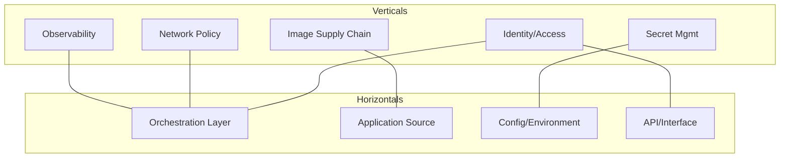
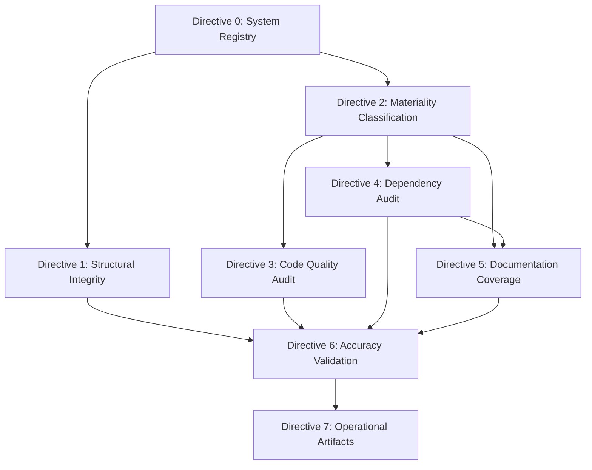

# Technical Specification

# 0. Agent Action Plan

## 0.1 Intent Clarification


### 0.1.1 Core Documentation Objective

Based on the provided requirements, the Blitzy platform understands that the documentation objective is to **execute a comprehensive, multi-framework-aligned codebase audit across the Kubernetes (`k8s.io/kubernetes`) monorepo** and produce a structured findings report with two auditor-facing and developer-facing operational artifacts. This is a **documentation-only task** — no code or documentation within the target repository will be created, modified, or deleted.

**Request Categorization:** Create new documentation (audit report and operational artifacts)

**Documentation Type:** Compliance audit report, operational flowcharts, and developer contribution guides — aligned with:
- NIST SP 800-53 Rev 5 (primary control reference — AC, AU, CM, IA, SC, SI families)
- NIST SP 800-190 (container image, runtime, and supply chain risk)
- NIST Cybersecurity Framework (CSF) (Identify → Protect → Detect → Respond → Recover)
- CIS Kubernetes Benchmark v1.12.0 (K8s-specific hardening, Sections 1–5)
- CIS Controls v8 IG2/IG3 (inventory, access, audit logging, vulnerability management, secure configuration)

**Documentation Requirements with Enhanced Clarity:**
- **Directive 0 — System Registry:** Decompose the Kubernetes codebase along two axes (verticals: functional domains; horizontals: architectural layers) to produce a classified system registry. Each system must be mapped to all five frameworks and classified as Static or Dynamic.
- **Directive 1 — Structural Integrity Report:** Scan every registered system for broken cross-references, orphaned configs, missing environment variables, dangling service dependencies, unreachable code, and incomplete error handling. Map findings to CIS Benchmark check IDs (Sections 1.1–5.7).
- **Directive 2 — Materiality Classification:** Classify every component as Material or Non-Material based on its governance of access control, audit logging, configuration state, network segmentation, system integrity, secret management, deployment integrity, or cross-cutting concerns.
- **Directive 3 — Code Quality Audit:** For Material components only, assess code smells (DRY violations, SRP violations, deep nesting, magic numbers, long parameter lists, commented-out code), complexity metrics (cyclomatic >10, cognitive complexity, coupling >7 dependencies, low cohesion <50%), and security-relevant quality (missing input validation, exposed internal state, hardcoded credentials, sensitive data logging, deprecated libraries).
- **Directive 4 — Cross-Cutting Dependency Audit:** Map inter-system dependencies, shared utilities consumed by 3+ systems, circular dependencies, and implicit coupling. Score blast radius (Low/Medium/High) for each cross-cutting concern.
- **Directive 5 — Documentation Coverage Audit:** Verify Material components for inline comments (WHY not WHAT), READMEs, API contract definitions, and architecture narratives — and whether documentation addresses the framework control the component governs.
- **Directive 6 — Accuracy Validation:** Sample Material components per system classification (Static: exactly 1 instance; Dynamic: 10–25 instances) and validate accuracy across all four audit dimensions. Aggregate to ≥87% threshold.
- **Directive 7 — Operational Artifacts:** Produce (1) an auditor-facing Mermaid flowchart with NIST CSF swimlanes plus narrative, and (2) a developer contribution guide with 9 explicit pass/fail gates.

**Implicit Documentation Needs Surfaced:**
- A consolidated framework authority hierarchy document resolving conflicts between NIST and CIS controls (applying the more restrictive)
- A cross-reference index mapping system_ids to concern_ids to gap matrix entries across all seven directives
- Per-system sampling methodology documentation for Directive 6 traceability
- A framework control conflict register for all instances where NIST and CIS prescriptions diverge

### 0.1.2 Special Instructions and Constraints

**Critical Directives Captured:**
- **Assess-only posture:** The auditor role is strictly read-only — "You do NOT create, modify, or remediate any code or documentation. You assess, classify, measure, and report only."
- **Framework authority hierarchy:** NIST SP 800-53 Rev 5 serves as the primary control reference. Where NIST and CIS controls conflict, the more restrictive control is applied and the conflict is flagged.
- **Sequential directive execution:** Directives 0–7 must execute in strict sequence; each output feeds the next.
- **System-type-aware sampling:** Static systems are sampled exactly once; Dynamic systems receive 10–25 samples per Directive 6.
- **Materiality gating:** Non-Material components are excluded from Directives 3–6.
- **Single-dimension attribution:** Each finding must be attributed to exactly one audit dimension (Integrity, Quality, Dependency, or Documentation).
- **No aspirational controls:** Only controls verified in the codebase may be documented.

**Template Requirements:**
- System Registry entry format: `system_id | vertical | horizontal | intersection_scope | classification (Static/Dynamic) | rationale | NIST_800-53_controls | NIST_800-190_risk_area | NIST_CSF_function | CIS_K8s_section | CIS_Controls_v8`
- Integrity report entry format: `system_id | component_path | issue_type | severity (Critical/Moderate/Minor) | description | CIS_benchmark_check_id (if applicable)`
- Materiality classification format: `system_id | component_path | classification (Material/Non-Material) | materiality_rationale | governing_NIST_control | governing_CIS_control`
- Code quality finding format: `system_id | component_path | smell_type | metric_value (if quantifiable) | severity (Critical/Moderate/Minor) | NIST_or_CIS_control (if security-relevant)`
- Dependency report format: `concern_id | component_path | dependency_type | systems_affected | blast_radius_score (Low/Medium/High) | risk_description | NIST_or_CIS_control`
- Gap matrix format: `system_id | component_path | documentation_present (Y/N) | documentation_type (if present) | framework_requirement_addressed (Y/N/Partial) | cross_cutting_concern_documented (Y/N/N-A) | gap_severity (Critical/Moderate/Minor) | applicable_framework_control`
- Accuracy validation format: `system_id | component_path | audit_dimension (Integrity/Quality/Dependency/Documentation) | reported_state | actual_state | deviation_description | framework_control_misrepresented (Y/N)`

**Style Preferences:**
- Auditor-facing artifacts: Formal, NIST CSF–structured narrative with Mermaid swimlane flowcharts
- Developer-facing artifacts: Prescriptive pass/fail gate format, concise and actionable
- All findings referenced to system_id and concern_id from the registry
- Zero code or documentation modification in the target repository

### 0.1.3 Technical Interpretation

These documentation requirements translate to the following technical documentation strategy:

- **To produce the System Registry (Directive 0),** analyze the Kubernetes monorepo structure at `cmd/`, `pkg/`, `plugin/`, `build/`, `hack/`, `cluster/`, `api/`, `.github/` and classify each intersection of vertical (identity/access, network policy, secret management, image supply chain, CI/CD, application runtime, observability, compliance, data persistence, external integrations) and horizontal (IaC layer, orchestration layer, application source, configuration/environment, pipeline definition, dependency/package, API/interface, data access) as its own system.
- **To produce the Structural Integrity Report (Directive 1),** scan all 2,720 Go source files, 268 YAML configurations, and 254 shell scripts for broken cross-references, orphaned configurations, and missing environment variable definitions. Map findings against CIS Kubernetes Benchmark Sections 1–5 check IDs.
- **To produce the Materiality Classification (Directive 2),** evaluate each component against NIST AC/AU/CM/IA/SC/SI control families and CIS Controls 2/4/5/6/8/18 to determine Material status.
- **To produce the Code Quality Audit (Directive 3),** assess all Material Go source files across `pkg/auth/`, `pkg/security/`, `pkg/kubeapiserver/`, `plugin/pkg/admission/`, `pkg/apis/rbac/`, `pkg/apis/authentication/`, `pkg/apis/authorization/`, `cmd/kube-apiserver/`, `cmd/kube-controller-manager/`, `cmd/kube-scheduler/`, and `cmd/kubelet/` for code smells, complexity metrics, and security-relevant code quality.
- **To produce the Dependency Audit (Directive 4),** map all inter-system dependencies declared in `go.mod`, cross-cutting utilities in `pkg/util/`, shared libraries in `staging/`, and implicit coupling via ConfigMaps, Secrets, and ServiceAccounts.
- **To produce the Documentation Coverage Audit (Directive 5),** verify the presence and quality of 334 doc.go files, 93 README.md files, inline comments, and API contract definitions across all Material components.
- **To produce Accuracy Validation (Directive 6),** apply system-type-aware sampling: sample exactly 1 Material component per Static system and 10–25 Material components per Dynamic system, validating all four audit dimensions.
- **To produce Operational Artifacts (Directive 7),** generate (1) a Mermaid flowchart with NIST CSF swimlanes (Identify/Protect/Detect/Respond/Recover) with sub-lanes per audit dimension plus accompanying narrative, and (2) a developer contribution guide with 9 explicit pass/fail gates mapped to NIST/CIS controls.

### 0.1.4 Inferred Documentation Needs

Based on repository analysis of the Kubernetes monorepo (`k8s.io/kubernetes`, Go 1.25.0):

- **Based on code analysis:** `pkg/auth/` contains authorization modules (ABAC, node identifier) with only 73 comment lines across all Go files — significantly sparse for Material components governing NIST AC, IA controls. `pkg/security/` has only 25 comment lines. `plugin/pkg/admission/` has 1,349 comment lines across 20+ admission plugins — relatively better but coverage depth per-plugin requires verification.
- **Based on structure:** 161 of 262 `pkg/` subdirectories (at depth 2) lack `doc.go` files — representing a 61.5% gap in Go package-level documentation. Only 16 doc.go files exist at `pkg/` depth-2 out of a potential 262 directories.
- **Based on dependencies:** The `go.mod` file declares `k8s.io/kubernetes` as the root module with Go 1.25.0. External dependencies tracked in `build/dependencies.yaml` (zeitgeist v0.5.4, CNI 1.9.0, CoreDNS 1.13.1) lack auditable documentation of their supply chain governance.
- **Based on security architecture:** The authentication chain (Request Header → x509 → Static Token → ServiceAccount JWT → Bootstrap → OIDC → Webhook), authorization chain (Node → RBAC → Webhook → ABAC → Default Deny), and admission control chain (Mutating → Schema validation → Validating → CEL) span `pkg/kubeapiserver/`, `plugin/pkg/`, `staging/src/k8s.io/apiserver/`, and `staging/src/k8s.io/pod-security-admission/` — requiring cross-system dependency documentation.
- **Based on user journey:** The audit report requires a consolidated index linking system_ids → concern_ids → gap matrix entries → accuracy samples for full traceability across all seven directives.
- **Based on CI/CD:** Prow-based CI/CD with quality gates (verification, unit, integration, linting, CLA, conformance) is external to this repo; the developer contribution guide (Artifact 2) must document these gates as pass/fail criteria without assuming access to the Prow configuration.


## 0.2 Documentation Discovery and Analysis


### 0.2.1 Existing Documentation Infrastructure Assessment

Repository analysis reveals the Kubernetes monorepo (`k8s.io/kubernetes`) uses a **Go-native documentation infrastructure** with no external documentation site generators. Documentation is distributed across Go doc.go files, README.md files, inline code comments, generated CLI docs, and OpenAPI specifications.

**Documentation Artifacts Inventory:**

| Documentation Type | Count | Location Pattern | Status |
|---|---|---|---|
| Go package doc.go files | 334 total (297 in `pkg/`, 10 in `cmd/`) | `*/doc.go` | Active; 161 `pkg/` subdirectories missing doc.go |
| README.md files | 93 (non-vendor, non-staging, non-changelog) | `*/README.md` | Active; sparse coverage at depth 2+ |
| Go source files (non-test) | 2,720 | `cmd/`, `pkg/`, `plugin/`, `build/`, `hack/` | Active production code |
| Go test files | 1,119 | Colocated with source | Active |
| YAML/YML configurations | 268 (non-test) | `api/`, `build/`, `cluster/`, `hack/` | Active |
| Shell scripts | 254 | `hack/`, `build/`, `cluster/` | Active |
| Protobuf definitions | 2 | Non-vendor, non-staging | Active |
| Dockerfiles | 46 | `build/` and generated | Active |
| OpenAPI/Swagger spec | 1 (`api/openapi-spec/swagger.json`) | `api/openapi-spec/` | Active; generated artifact |

**Documentation Framework and Tooling:**
- **Current documentation framework:** Go standard library `godoc` conventions (doc.go, package comments)
- **Documentation generator configuration locations:**
  - `hack/update-generated-docs.sh` — master script invoking `cmd/gendocs`, `cmd/genkubedocs`, `cmd/genman`, `cmd/genyaml`
  - `hack/gen-swagger-doc/gen-swagger-docs.sh` — Gradle-based Swagger doc generation from `api/openapi-spec/swagger.json`
  - `hack/update-openapi-spec.sh` — OpenAPI spec regeneration
- **CLI documentation generators in `cmd/`:**
  - `cmd/gendocs/gen_kubectl_docs.go` — generates kubectl command reference (uses `cobra/doc`)
  - `cmd/genkubedocs/gen_kube_docs.go` — generates kube-apiserver, kube-controller-manager, kube-scheduler, kubelet, kube-proxy docs
  - `cmd/genman/gen_kube_man.go` — generates man pages
  - `cmd/genswaggertypedocs/swagger_type_docs.go` — generates Swagger type documentation
  - `cmd/genyaml/` — generates YAML reference
  - `cmd/genfeaturegates/` — generates feature gate documentation
- **API documentation tools in use:** `cobra/doc` for CLI documentation, `go-openapi` via generated OpenAPI spec (`api/openapi-spec/swagger.json`), `pkg/generated/openapi/` for in-tree generated OpenAPI definitions
- **Diagram tools detected:** None in repository; the audit will use Mermaid for all generated diagrams
- **Documentation hosting/deployment:** External (kubernetes.io); not hosted from this repository

**No dedicated documentation generators (mkdocs, Docusaurus, Sphinx, ReadTheDocs) were found in the repository.**

### 0.2.2 Repository Code Analysis for Documentation

**Search patterns employed for code requiring documentation audit:**

| Search Pattern | Target | Findings |
|---|---|---|
| `pkg/auth/**/*.go` | Authentication/authorization modules | ABAC authorizer, node identifier; 73 comment lines total |
| `pkg/security/**/*.go` | Security context modules | AppArmor support; 25 comment lines total |
| `pkg/kubeapiserver/**/*.go` | API server authentication, authorization, admission | 312 comment lines across authenticator, authorizer, admission |
| `plugin/pkg/admission/**/*.go` | Admission control plugins (20+) | 1,349 comment lines across alwayspullimages, certificates, deny, eventratelimit, gc, imagepolicy, limitranger, namespace, noderestriction, nodetaint, podnodeselector, podtolerationrestriction, priority, runtimeclass, serviceaccount, storage, and more |
| `pkg/apis/rbac/**/*.go` | RBAC API types and validation | 5,653 total LOC |
| `pkg/apis/authentication/**/*.go` | Authentication API types | doc.go present |
| `pkg/apis/authorization/**/*.go` | Authorization API types | doc.go present |
| `pkg/apis/admission/**/*.go` | Admission API types | doc.go present |
| `pkg/apis/admissionregistration/**/*.go` | Admission webhook registration | doc.go present |
| `cmd/kube-apiserver/` | API server binary entry | Generated docs via genkubedocs |
| `cmd/kube-controller-manager/` | Controller manager entry | Generated docs via genkubedocs |
| `cmd/kube-scheduler/` | Scheduler binary entry | Generated docs via genkubedocs |
| `cmd/kubelet/` | Kubelet binary entry | Generated docs via genkubedocs |
| `cmd/kubeadm/` | Cluster bootstrap tool | Generated docs via genkubedocs |
| `cmd/kubectl/` | CLI tool entry | Generated docs via gendocs |
| `build/` | Dockerfiles, build scripts | 3 primary Dockerfiles (pause, pause_windows, server-image) |
| `hack/verify-*.sh` | 51 verification scripts | Code quality and conformance gates |
| `api/openapi-spec/swagger.json` | Complete API spec | Full OpenAPI/Swagger specification |

**Key directories examined:**
- `pkg/` (31 subdirectories): api, apis, auth, capabilities, certauthorization, client, cluster, controller, controlplane, credentialprovider, features, fieldpath, generated, kubeapiserver, kubectl, kubelet, kubemark, printers, probe, proxy, quota, registry, routes, scheduler, security, securitycontext, serviceaccount, util, volume, windows
- `cmd/` (28 entries): core binaries + documentation generators
- `plugin/pkg/admission/` (20+ admission plugins): admit, alwayspullimages, antiaffinity, certificates, defaulttolerationseconds, deny, eventratelimit, extendedresourcetoleration, gc, imagepolicy, limitranger, namespace, noderestriction, nodetaint, podnodeselector, podtolerationrestriction, priority, runtimeclass, serviceaccount, storage
- `plugin/pkg/auth/authorizer/rbac/` and `bootstrappolicy/`: RBAC authorizer with bootstrap policy
- `hack/` (254 shell scripts): verification, generation, update, and build scripts
- `.github/`: ISSUE_TEMPLATE (5 templates), OWNERS, PULL_REQUEST_TEMPLATE.md, SECURITY.md

**Related documentation found:**
- `CONTRIBUTING.md` — minimal, links to external `git.k8s.io/community/contributors/guide/`
- `.github/SECURITY.md` — vulnerability reporting reference, links to `kubernetes.io/docs/reference/issues-security/security/`
- `README.md` — project overview, build instructions (`make`, `make quick-release`), community links
- `.github/PULL_REQUEST_TEMPLATE.md` — PR template with review checklist

### 0.2.3 Web Search Research Conducted

**NIST SP 800-190 (Application Container Security Guide):**
- Published September 2017 by NIST (Murugiah Souppaya, John Morello, Karen Scarfone); 63 pages
- Addresses five risk areas: image risks (vulnerabilities, configuration defects, embedded malware, cleartext secrets, untrusted images), registry risks (insecure access, stale images), orchestrator risks (unbounded admin access, insecure inter-container traffic), container risks (runtime misconfigurations, image drift), and host OS risks (overprovisioned access, unpatched systems)
- Maps to NIST SP 800-53 control families: AC, AT, AU, CM, IA, IR, RA, SC, SI
- Maps to NIST CSF subcategories across all five functions
- Appendix B provides explicit mapping table between SP 800-190 recommendations and SP 800-53 controls

**CIS Kubernetes Benchmark:**
- Latest version: v1.12.0 (available from CIS); supports Kubernetes v1.28–v1.30
- Five sections: (1) Control Plane Components, (2) etcd, (3) Control Plane Configuration, (4) Worker Nodes, (5) Policies
- Each check has a unique ID (e.g., 1.1.1, 5.3.2) with automated/manual assessment status
- Tooling: `kube-bench` (open source, Aqua Security) and Trivy Operator for automated CIS benchmark evaluation
- Level 1 and Level 2 profiles (Level 2 being more restrictive)

**CIS Controls v8:**
- Implementation Groups IG2/IG3 relevant to this audit
- Key controls: CIS Control 1 (Inventory of Enterprise Assets), Control 2 (Inventory of Software Assets), Control 4 (Secure Configuration), Control 5 (Account Management), Control 6 (Access Control Management), Control 7 (Continuous Vulnerability Management), Control 8 (Audit Log Management), Control 16 (Application Software Security), Control 18 (Penetration Testing / Secret Management)

**NIST CSF (Cybersecurity Framework):**
- Five core functions: Identify, Protect, Detect, Respond, Recover
- Used as the structural narrative framework for Artifact 1 (operational flowchart) and organizational structure for the audit report


## 0.3 Documentation Scope Analysis


### 0.3.1 Code-to-Documentation Mapping

**Modules requiring documentation audit coverage — organized by NIST SP 800-53 control families:**

**AC — Access Control:**

| Module | Public APIs / Components | Current Documentation | Documentation Audit Need |
|---|---|---|---|
| `pkg/auth/authorizer/abac/` | ABAC policy engine, policy file parser | doc.go absent; 73 comment lines across pkg/auth | Verify inline comments explain AC control intent |
| `pkg/kubeapiserver/authorizer/` | Authorization chain configuration (Node, RBAC, Webhook, ABAC) | doc.go absent; part of 312 comment lines in kubeapiserver | Verify RBAC/ABAC/Node authorizer documentation |
| `pkg/kubeapiserver/authenticator/` | Authentication chain (x509, JWT, OIDC, webhook) | doc.go absent | Verify authentication chain documentation |
| `pkg/apis/rbac/` | RBAC API types: Role, ClusterRole, RoleBinding, ClusterRoleBinding | doc.go present; 5,653 total LOC | Verify API type documentation completeness |
| `plugin/pkg/auth/authorizer/rbac/` | RBAC authorizer implementation, bootstrap policy | Go source with comments | Verify RBAC implementation docs cover AC-6 |
| `pkg/apis/authentication/` | TokenReview, authentication API types | doc.go present | Verify IA-2/IA-5 control intent documented |
| `pkg/apis/authorization/` | SubjectAccessReview, authorization API types | doc.go present | Verify AC-3 control intent documented |
| `pkg/serviceaccount/` | ServiceAccount token generation, validation | Go source | Verify IA-4 ServiceAccount lifecycle docs |

**AU — Audit and Accountability:**

| Module | Public APIs / Components | Current Documentation | Documentation Audit Need |
|---|---|---|---|
| `staging/src/k8s.io/apiserver/pkg/audit/` | Audit event generation, audit policy, audit backends | External staging module | Verify AU-2/AU-3/AU-12 documentation |
| `pkg/apis/audit/` (if present) | Audit API types | doc.go to verify | Verify audit configuration documentation |

**CM — Configuration Management:**

| Module | Public APIs / Components | Current Documentation | Documentation Audit Need |
|---|---|---|---|
| `pkg/apis/core/` | ConfigMap, Secret API types | doc.go present | Verify CM-2/CM-6 control documentation |
| `hack/verify-*.sh` (51 scripts) | Configuration verification gates | Shell scripts with comments | Verify CM-3 change control documentation |
| `build/dependencies.yaml` | External dependency versions (zeitgeist, CNI, CoreDNS) | YAML with version pinning | Verify CM-7 dependency governance docs |

**SC — System and Communications Protection:**

| Module | Public APIs / Components | Current Documentation | Documentation Audit Need |
|---|---|---|---|
| `pkg/apis/networking/` | NetworkPolicy API types | doc.go present | Verify SC-7 boundary protection docs |
| `pkg/apis/certificates/` | Certificate signing request types | doc.go present | Verify SC-8 transmission integrity docs |
| `build/pause/Dockerfile` | Pause container image definition | Dockerfile comments | Verify SC-28 data protection docs |

**SI — System and Information Integrity:**

| Module | Public APIs / Components | Current Documentation | Documentation Audit Need |
|---|---|---|---|
| `plugin/pkg/admission/` (20+ plugins) | Admission control plugins (alwayspullimages, deny, imagepolicy, limitranger, noderestriction, podnodeselector, serviceaccount, etc.) | 1,349 comment lines total | Verify SI-3/SI-10 admission documentation per-plugin |
| `pkg/kubeapiserver/admission/` | Admission chain configuration | Part of kubeapiserver comments | Verify admission chain docs |
| `staging/src/k8s.io/pod-security-admission/` | Pod Security Standards enforcement | External staging module | Verify PSA baseline/restricted/privileged docs |

**IA — Identification and Authentication:**

| Module | Public APIs / Components | Current Documentation | Documentation Audit Need |
|---|---|---|---|
| `pkg/kubeapiserver/authenticator/` | Authenticator configuration, token validators | doc.go absent | Verify IA-2/IA-5/IA-8 identity docs |
| `pkg/credentialprovider/` | External credential providers | Go source | Verify credential lifecycle docs |

**Cross-Cutting Concerns:**

| Module | Public APIs / Components | Current Documentation | Documentation Audit Need |
|---|---|---|---|
| `pkg/controller/` | Controller framework (reconciliation loops) | Go source | Verify cross-system dependency documentation |
| `pkg/util/` | Shared utilities across all systems | Go source | Verify blast radius documentation |
| `pkg/generated/openapi/` | Generated OpenAPI definitions | Generated code | Verify API contract accuracy |
| `api/openapi-spec/swagger.json` | Full API specification | Generated JSON | Verify spec-to-code alignment |

**Configuration options requiring documentation audit:**

| Config Location | Options Scope | Documented? | Audit Need |
|---|---|---|---|
| `cmd/kube-apiserver/app/` | API server flags and configuration | Generated CLI docs | Verify all security-relevant flags documented |
| `cmd/kube-controller-manager/app/` | Controller manager configuration | Generated CLI docs | Verify RBAC and SA controller config docs |
| `cmd/kube-scheduler/app/` | Scheduler configuration | Generated CLI docs | Verify scheduling policy documentation |
| `cmd/kubelet/app/` | Kubelet configuration and security options | Generated CLI docs | Verify node security config documentation |
| `build/dependencies.yaml` | External dependency version pins | YAML | Verify supply chain documentation |

### 0.3.2 Documentation Gap Analysis

Given the requirements and repository analysis, documentation gaps requiring audit coverage include:

**Quantitative Gap Summary:**

| Gap Category | Measured Gap | Severity |
|---|---|---|
| Missing doc.go files in `pkg/` subdirectories | 161 of 262 directories (61.5%) | Critical — affects Directive 5 coverage |
| Missing README.md files | Only 23 at depth ≤3 vs. 31+ major subsystems | Moderate — limits navigability |
| Security module comment density | `pkg/auth/`: 73 lines; `pkg/security/`: 25 lines | Critical — Material components under-documented |
| Admission plugin per-plugin WHY documentation | 1,349 lines across 20+ plugins (avg 67 lines/plugin) | Moderate — coverage depth varies |
| Cross-cutting dependency documentation | No centralized dependency map | Critical — Directive 4 requirement |
| Framework control intent documentation | Not systematically present | Critical — Directive 5 primary criterion |
| Supply chain governance documentation | `build/dependencies.yaml` version pins only | Moderate — NIST SP 800-190 compliance gap |

**Undocumented or Under-Documented Public APIs:**
- `pkg/auth/authorizer/abac/` — ABAC policy engine lacks doc.go
- `pkg/auth/nodeidentifier/` — Node identity lacks doc.go
- `pkg/certauthorization/` — Certificate authorization lacks doc.go
- `pkg/client/` — Client libraries lack doc.go at root
- `pkg/kubeapiserver/authenticator/` — Authentication chain lacks doc.go
- `pkg/kubeapiserver/authorizer/` — Authorization chain lacks doc.go
- `pkg/kubeapiserver/admission/` — Admission chain lacks doc.go

**Missing Architecture Documentation:**
- No centralized security architecture narrative within the repository (exists in external kubernetes.io)
- No data flow diagrams for authentication/authorization/admission chains
- No cross-cutting concern map linking shared utilities to consuming systems
- No blast radius documentation for critical shared modules (`pkg/util/`, `pkg/controller/`)

**Outdated or Incomplete Documentation:**
- `CONTRIBUTING.md` contains only a redirect to external community guide — no in-repo contribution guidance for security-sensitive changes
- `.github/SECURITY.md` is a minimal redirect to kubernetes.io vulnerability reporting — lacks internal security audit procedures
- `README.md` focuses on build and community; lacks security hardening or compliance references


## 0.4 Documentation Implementation Design


### 0.4.1 Documentation Structure Planning

The audit report and operational artifacts will be produced as standalone Markdown documents organized by directive sequence. The following hierarchy represents the target documentation structure for all audit outputs:

```
audit-report/
├── 00-system-registry.md                    (Directive 0: System Definition & Classification)
│   ├── System decomposition tables
│   ├── Vertical/Horizontal intersection matrix
│   ├── Static/Dynamic classification
│   └── Five-framework control mapping per system
├── 01-structural-integrity.md               (Directive 1: Structural Integrity Scan)
│   ├── Per-system integrity findings
│   ├── CIS Benchmark check ID mappings
│   └── Severity classification (Critical/Moderate/Minor)
├── 02-materiality-classification.md         (Directive 2: Materiality Classification)
│   ├── Classified component inventory
│   ├── Material/Non-Material determination
│   └── Governing NIST/CIS control mapping
├── 03-code-quality-audit.md                 (Directive 3: Code Quality Audit)
│   ├── Code smell detection findings
│   ├── Code complexity metrics
│   └── Security-relevant code quality
├── 04-dependency-audit.md                   (Directive 4: Cross-Cutting Dependency Audit)
│   ├── Inter-system dependency map
│   ├── Cross-cutting concern inventory
│   ├── Blast radius scores
│   └── Mermaid dependency diagrams
├── 05-documentation-coverage.md             (Directive 5: Documentation Coverage Audit)
│   ├── Gap matrix (100% Material components)
│   ├── Framework requirement alignment
│   └── Cross-cutting concern documentation status
├── 06-accuracy-validation.md                (Directive 6: Accuracy Validation)
│   ├── Per-system sampling results
│   ├── Aggregate accuracy calculation
│   └── 87% threshold PASS/FAIL determination
├── 07-artifact-1-audit-flowchart.md         (Directive 7: Operational Flowchart + Narrative)
│   ├── Mermaid swimlane flowchart (NIST CSF functions)
│   ├── Sub-lanes per audit dimension
│   └── Narrative referencing system_ids, concern_ids, gap matrix
├── 07-artifact-2-developer-guide.md         (Directive 7: Developer Contribution Guide)
│   ├── 9 pass/fail gates
│   └── NIST/CIS control alignment per gate
├── appendix-framework-conflict-register.md  (NIST/CIS conflict resolution log)
└── appendix-cross-reference-index.md        (system_id → concern_id → gap matrix linkage)
```

### 0.4.2 Content Generation Strategy

**Information Extraction Approach:**

| Directive | Source Data | Extraction Method |
|---|---|---|
| D0: System Registry | `cmd/`, `pkg/`, `plugin/`, `build/`, `hack/`, `cluster/`, `api/`, `go.mod` | Analyze directory structure to identify vertical/horizontal intersections; classify each system by reviewing file contents for static vs. dynamic behavior |
| D1: Structural Integrity | All 2,720 Go source files, 268 YAML configs, 254 shell scripts | Scan for broken imports, undefined references, orphaned configs, dangling service dependencies; cross-reference with CIS Benchmark sections 1.1–5.7 |
| D2: Materiality | All components identified in D0 | Evaluate each against NIST AC/AU/CM/IA/SC/SI and CIS Controls 2/4/5/6/8/18 materiality criteria |
| D3: Code Quality | Material components only (from D2) | Parse Go AST for cyclomatic complexity, nesting depth, parameter counts, DRY violations; identify security-relevant patterns |
| D4: Dependencies | `go.mod`, `pkg/util/`, cross-system imports, shared configs | Map `import` statements across packages; identify shared utilities with 3+ consumers; calculate blast radius |
| D5: Documentation | 334 doc.go files, 93 README.md files, inline comments in Material components | Verify presence and framework control alignment for each Material component |
| D6: Accuracy | Sampling from D1–D5 outputs | System-type-aware sampling (Static: 1 instance; Dynamic: 10–25 instances); validate four dimensions |
| D7: Artifacts | All D0–D6 outputs | Synthesize into Mermaid flowchart + narrative (Artifact 1) and 9-gate developer guide (Artifact 2) |

**Template Application:**
- Apply the user-specified tabular formats for each directive output (system registry, integrity report, materiality classification, code quality, dependency, gap matrix, accuracy validation)
- All finding entries must include `system_id` from the D0 registry
- Cross-cutting concerns must include `concern_id` from D4 inventory
- Gap matrix must cross-reference both `system_id` and `concern_id`

**Documentation Standards for Audit Output:**
- Markdown formatting with H1 per directive, H2 per system, H3 per component
- Mermaid diagrams for dependency maps (`graph LR`), audit flowcharts (`flowchart TD` with swimlanes), and data flow sequences (`sequenceDiagram`)
- Code examples limited to illustrative 2–3 line excerpts from actual codebase files with `Source: /path/to/file.go:LineNumber` citations
- Tables for all structured findings using pipe-delimited Markdown tables
- Consistent terminology aligned with NIST SP 800-53 Rev 5 control family names and CIS Benchmark check IDs

### 0.4.3 Diagram and Visual Strategy

**Mermaid Diagrams to Create:**

| Diagram | Type | Purpose | Directive |
|---|---|---|---|
| System Registry Matrix | `graph TD` | Visual map of vertical/horizontal intersections with Static/Dynamic color coding | D0 |
| Authentication Chain | `sequenceDiagram` | Request → Header Auth → x509 → Token → JWT → OIDC → Webhook flow | D1 (integrity) |
| Authorization Chain | `sequenceDiagram` | Request → Node → RBAC → Webhook → ABAC → Default Deny flow | D1 (integrity) |
| Admission Control Chain | `sequenceDiagram` | Request → Mutating → Schema → Validating → CEL → Persist flow | D1 (integrity) |
| Cross-Cutting Dependency Graph | `graph LR` | Systems interconnected by shared utilities with blast radius annotations | D4 |
| Audit Coverage Heatmap | `graph TD` | Material component coverage by framework control family | D5 |
| NIST CSF Swimlane Flowchart | `flowchart TD` | Five function lanes (Identify/Protect/Detect/Respond/Recover) with sub-lanes per audit dimension | D7 Artifact 1 |
| Developer Gate Pipeline | `flowchart LR` | Sequential 9-gate pipeline with PASS/FAIL decision points | D7 Artifact 2 |

**Example Mermaid Diagram — Developer Gate Pipeline (Artifact 2):**


**Example Mermaid Diagram — System Registry Vertical/Horizontal Matrix (Directive 0):**



## 0.5 Documentation File Transformation Mapping


### 0.5.1 File-by-File Documentation Plan

All documentation files produced by this audit are net-new audit report artifacts. No existing repository files are created, modified, or deleted — this is an assess-and-report-only engagement. Every file listed below is a CREATE operation producing an audit output document.

| Target Documentation File | Transformation | Source Code/Docs | Content/Changes |
|---|---|---|---|
| `audit-report/00-system-registry.md` | CREATE | `cmd/`, `pkg/`, `plugin/`, `build/`, `hack/`, `cluster/`, `api/`, `go.mod`, `build/dependencies.yaml` | Complete system registry: vertical × horizontal decomposition, Static/Dynamic classification, NIST 800-53/800-190/CSF/CIS K8s/CIS Controls v8 mapping per system |
| `audit-report/01-structural-integrity.md` | CREATE | All 2,720 Go source files, 268 YAML configs, 254 shell scripts, `api/openapi-spec/swagger.json` | Integrity report: broken cross-references, orphaned configs, missing env vars, dangling dependencies, unreachable code, incomplete error handling; CIS Benchmark check IDs (Sections 1.1–5.7) |
| `audit-report/02-materiality-classification.md` | CREATE | All components from D0 registry, `pkg/auth/`, `pkg/security/`, `pkg/kubeapiserver/`, `plugin/pkg/admission/`, `pkg/apis/rbac/`, `pkg/apis/authentication/`, `pkg/apis/authorization/`, `pkg/apis/networking/`, `pkg/apis/certificates/`, `pkg/apis/core/`, `pkg/controller/`, `pkg/util/` | Classified inventory: Material/Non-Material per component, materiality rationale, governing NIST/CIS controls |
| `audit-report/03-code-quality-audit.md` | CREATE | Material components from D2: `pkg/auth/**/*.go`, `pkg/security/**/*.go`, `pkg/kubeapiserver/**/*.go`, `plugin/pkg/admission/**/*.go`, `pkg/apis/rbac/**/*.go`, `cmd/kube-apiserver/**/*.go`, `cmd/kube-controller-manager/**/*.go`, `cmd/kube-scheduler/**/*.go`, `cmd/kubelet/**/*.go` | Code quality report: DRY violations, SRP violations, nesting >3, magic numbers, long parameter lists >5, commented-out code, cyclomatic complexity >10, cognitive complexity, coupling >7, cohesion <50%, input validation gaps, exposed internal state, hardcoded credentials, sensitive data logging, deprecated calls |
| `audit-report/04-dependency-audit.md` | CREATE | `go.mod`, `build/dependencies.yaml`, all inter-package imports across `pkg/`, `cmd/`, `plugin/`, `staging/` references | Dependency report: inter-system dependency map, shared utilities consumed by 3+ systems, circular dependencies, implicit coupling, blast radius scores (Low/Medium/High), Mermaid dependency graph |
| `audit-report/05-documentation-coverage.md` | CREATE | 334 doc.go files, 93 README.md files, inline comments in Material components, `CONTRIBUTING.md`, `.github/SECURITY.md`, `README.md` | Gap matrix: documentation_present (Y/N), documentation_type, framework_requirement_addressed (Y/N/Partial), cross_cutting_concern_documented (Y/N/N-A), gap_severity, applicable_framework_control — for 100% of Material components |
| `audit-report/06-accuracy-validation.md` | CREATE | Sampling from D1–D5 outputs; Static systems: 1 sample each; Dynamic systems: 10–25 samples each | Accuracy report: per-system sampling results (total sampled, accurate, inaccurate, accuracy %), aggregate accuracy vs. 87% threshold, PASS/FAIL determination |
| `audit-report/07-artifact-1-audit-flowchart.md` | CREATE | All D0–D6 outputs; system_ids, concern_ids, gap matrix entries | Mermaid swimlane flowchart (NIST CSF: Identify/Protect/Detect/Respond/Recover with sub-lanes per audit dimension) + accompanying narrative for auditors/operators |
| `audit-report/07-artifact-2-developer-guide.md` | CREATE | D0–D6 findings; `hack/verify-*.sh`, `.github/PULL_REQUEST_TEMPLATE.md`, `CONTRIBUTING.md`, CI/CD pipeline info (Prow) | Developer contribution guide: 9 pass/fail gates (Branch Controls, Security Scans, Code Quality, Dependency Governance, RBAC Change Process, Image Signing, Prohibited Patterns, Material Review, Documentation Gap Check) with NIST/CIS control alignment |
| `audit-report/appendix-framework-conflict-register.md` | CREATE | NIST SP 800-53 Rev 5 controls, CIS Kubernetes Benchmark checks, CIS Controls v8 | Conflict register: all instances where NIST and CIS controls prescribe different requirements, resolution to more restrictive control, rationale |
| `audit-report/appendix-cross-reference-index.md` | CREATE | All system_ids (D0), concern_ids (D4), gap matrix entries (D5), accuracy samples (D6) | Cross-reference index: system_id → concern_id → gap matrix entry → accuracy sample linkage for full audit traceability |

### 0.5.2 New Documentation Files Detail

**File: `audit-report/00-system-registry.md`**
- Type: Compliance Audit — System Classification
- Source Code: `cmd/`, `pkg/`, `plugin/`, `build/`, `hack/`, `cluster/`, `api/`, `go.mod`
- Sections:
  - System Decomposition Methodology
  - Vertical Domain Inventory (identity/access, network policy, secret management, image supply chain, CI/CD, application runtime, observability, compliance, data persistence, external integrations)
  - Horizontal Layer Inventory (IaC, orchestration, application source, configuration/environment, pipeline, dependency/package, API/interface, data access)
  - System Registry Table (all vertical × horizontal intersections)
  - Static/Dynamic Classification with rationale
  - Five-Framework Control Mapping per system
- Diagrams:
  - Mermaid matrix diagram of vertical × horizontal intersections
  - Mermaid classification treemap (Static vs. Dynamic)
- Key Citations: `go.mod`, `cmd/` directory structure, `pkg/` directory structure, `plugin/` directory structure, `build/dependencies.yaml`

**File: `audit-report/01-structural-integrity.md`**
- Type: Compliance Audit — Structural Findings
- Source Code: All Go, YAML, Shell files; `api/openapi-spec/swagger.json`
- Sections:
  - Scan Methodology and CIS Benchmark Mapping
  - Per-System Integrity Findings (one section per system_id)
  - Broken Cross-Reference Analysis
  - Orphaned Configuration Inventory
  - Missing Environment Variable Definitions
  - Dangling Service Dependencies
  - Unreachable Code Paths
  - Incomplete Error Handling at System Boundaries
  - CIS Benchmark Check ID Correlation Table
- Diagrams:
  - Severity distribution chart (Critical/Moderate/Minor)
- Key Citations: Specific file paths per finding

**File: `audit-report/04-dependency-audit.md`**
- Type: Compliance Audit — Dependency Analysis
- Source Code: `go.mod`, `build/dependencies.yaml`, all inter-package imports
- Sections:
  - Dependency Mapping Methodology
  - Inter-System Dependency Matrix
  - Cross-Cutting Concern Inventory (shared utilities consumed by 3+ systems)
  - Circular Dependency Analysis
  - Implicit Dependency Register (runtime assumptions, env var coupling, shared state)
  - Blast Radius Scoring Table
  - Single Points of Failure Identification
  - Dependency Risk Assessment (NIST CM-3, SC-5; CIS Control 2)
- Diagrams:
  - Mermaid dependency graph with blast radius annotations
  - Circular dependency visualization
- Key Citations: `go.mod`, `pkg/util/`, `pkg/controller/`, cross-system import analysis

**File: `audit-report/07-artifact-1-audit-flowchart.md`**
- Type: Operational — Auditor/Operator Guide
- Source Code: Synthesized from D0–D6
- Sections:
  - Identify: System registry review, asset inventory validation (CIS Control 1), dependency map review, blast radius review
  - Protect: RBAC validation (CIS K8s 5.1; NIST AC-6), NetworkPolicy verification (CIS K8s 5.3; NIST SC-7), image signing (NIST SP 800-190), secret management (NIST SC-28), code quality gates, dependency governance
  - Detect: Audit logging verification (NIST AU-12; CIS Control 8), admission controller status, code smell regression, cross-cutting change detection, alert escalation
  - Respond: Drift detection methodology, escalation decision tree per audit dimension
  - Recover: Rollback verification, recovery step existence and testing confirmation
- Diagrams:
  - Mermaid swimlane flowchart (one lane per NIST CSF function, sub-lanes per audit dimension)
- Key Citations: system_ids, concern_ids, gap matrix entries from D0–D5

**File: `audit-report/07-artifact-2-developer-guide.md`**
- Type: Operational — Developer Contribution Guide
- Source Code: `.github/PULL_REQUEST_TEMPLATE.md`, `CONTRIBUTING.md`, `hack/verify-*.sh`, Prow CI/CD
- Sections:
  - Gate 1: Branch Controls (NIST CM-9; CIS Control 4)
  - Gate 2: Security Scan Gates (NIST SI-3, SI-7; NIST SP 800-190; CIS Control 7)
  - Gate 3: Code Quality Gates (cyclomatic ≤10, no DRY violations, no hardcoded literals, no commented-out code, no magic numbers)
  - Gate 4: Dependency Governance (NIST CM-3; CIS Control 2)
  - Gate 5: RBAC Change Process (NIST AC-6; CIS K8s 5.1; CIS Control 5)
  - Gate 6: Image Signing Requirements (NIST SP 800-190; CIS K8s 4.2)
  - Gate 7: Prohibited Patterns (NIST SC-28; CIS Control 18; CIS K8s 4)
  - Gate 8: Material Component Review (NIST CM-3; CIS Control 4)
  - Gate 9: Documentation Gap Check (NIST CM-6)
- Diagrams:
  - Mermaid gate pipeline flowchart
- Key Citations: `hack/verify-*.sh`, `.github/PULL_REQUEST_TEMPLATE.md`, `CONTRIBUTING.md`

### 0.5.3 Documentation Configuration Updates

No documentation generators (mkdocs, Docusaurus, Sphinx) exist in the repository. The audit output documents are standalone Markdown files and do not require configuration file updates within the Kubernetes repository.

**External considerations (out of scope for this audit):**
- Kubernetes.io website documentation configuration
- Prow CI/CD documentation job configuration
- Community repository documentation structure

### 0.5.4 Cross-Documentation Dependencies

| Dependency Type | Source Document | Target Document | Linkage |
|---|---|---|---|
| system_id references | `00-system-registry.md` | All subsequent directives (D1–D7) | Every finding entry references a system_id from D0 |
| concern_id references | `04-dependency-audit.md` | `05-documentation-coverage.md`, `07-artifact-1-audit-flowchart.md` | Gap matrix and audit narrative reference concern_ids from D4 |
| Material classification | `02-materiality-classification.md` | `03-code-quality-audit.md`, `04-dependency-audit.md`, `05-documentation-coverage.md`, `06-accuracy-validation.md` | Only Material components proceed to D3–D6 |
| Gap matrix entries | `05-documentation-coverage.md` | `07-artifact-1-audit-flowchart.md`, `appendix-cross-reference-index.md` | Audit narrative and cross-reference index link to gap matrix |
| Accuracy samples | `06-accuracy-validation.md` | `appendix-cross-reference-index.md` | Cross-reference index links accuracy samples to system_ids |
| Framework conflicts | `appendix-framework-conflict-register.md` | All directive documents | All directive documents apply resolved conflicts |
| Navigation/TOC | `appendix-cross-reference-index.md` | All documents | Master index linking all system_ids, concern_ids, gap entries |


## 0.6 Dependency Inventory


### 0.6.1 Documentation Dependencies

All documentation tools and packages relevant to this audit documentation exercise are listed below. Since the audit output consists of standalone Markdown documents with embedded Mermaid diagrams, the tooling dependencies are limited to Mermaid rendering and Markdown processing. No documentation site generators are installed in or required by the Kubernetes repository.

| Registry | Package Name | Version | Purpose |
|---|---|---|---|
| Go module | `k8s.io/kubernetes` | go 1.25.0 (from `go.mod`) | Target codebase under audit; Go 1.25.0 is the declared module version |
| Go toolchain | `go` | 1.25.0 | Go compiler and standard library for code analysis (AST parsing, import resolution) |
| npm | `@mermaid-js/mermaid-cli` | 11.4.2 | Render Mermaid diagrams from Markdown to SVG/PNG for audit report artifacts |
| Go tool | `golang.org/x/tools/cmd/guru` | latest stable | Go code analysis for cross-reference and dependency mapping |
| Go tool | `golang.org/x/vuln/cmd/govulncheck` | 1.1.4 (from tech spec) | Vulnerability scanning of Go dependencies (referenced in testing strategy) |
| Go tool | `github.com/golangci/golangci-lint` | per repository config | Static analysis linting (used by hack/verify-golangci-lint.sh) |
| Build dependency | `zeitgeist` | 0.5.4 (from `build/dependencies.yaml`) | Dependency version management tool used by Kubernetes build system |
| External dep | `CNI` | 1.9.0 (from `build/dependencies.yaml`) | Container Networking Interface — external dependency tracked for supply chain audit |
| External dep | `CoreDNS` | 1.13.1 (from `build/dependencies.yaml`) | DNS server — external dependency tracked for supply chain audit |
| Go library | `github.com/spf13/cobra` | per `go.mod` | CLI framework used by kubectl, kubeadm, and all kube-* components; relevant to CLI documentation generation |
| Go library | `github.com/spf13/cobra/doc` | per `go.mod` | CLI documentation generator used by `cmd/gendocs/` and `cmd/genkubedocs/` |
| Build tool | `gradle` | per `hack/gen-swagger-doc/` | Used by swagger doc generation script for API documentation |
| External tool | `kube-bench` | latest stable (CIS reference) | CIS Kubernetes Benchmark automated evaluation tool; referenced for Directive 1 CIS check mapping |
| Compliance ref | NIST SP 800-53 Rev 5 | Rev 5 (2020) | Primary security control catalog — AC, AU, CM, IA, SC, SI families |
| Compliance ref | NIST SP 800-190 | Final (Sept 2017) | Application Container Security Guide — image, registry, orchestrator, container, host OS risks |
| Compliance ref | NIST CSF | v1.1 / v2.0 | Cybersecurity Framework — Identify/Protect/Detect/Respond/Recover structure |
| Compliance ref | CIS Kubernetes Benchmark | v1.12.0 | Kubernetes hardening benchmark — Sections 1–5 |
| Compliance ref | CIS Controls | v8 (IG2/IG3) | Enterprise security controls — Controls 1, 2, 4, 5, 6, 7, 8, 16, 18 |

### 0.6.2 Documentation Reference Updates

Since this audit produces standalone documents and does not modify the Kubernetes repository, no internal link transformations are required within the existing codebase.

**Cross-references within the audit report document set:**

| Source Document | Link Target | Link Type |
|---|---|---|
| `01-structural-integrity.md` | `00-system-registry.md` | system_id reference links |
| `02-materiality-classification.md` | `00-system-registry.md` | system_id reference links |
| `03-code-quality-audit.md` | `02-materiality-classification.md` | Material component filter reference |
| `04-dependency-audit.md` | `00-system-registry.md` | system_id reference links |
| `05-documentation-coverage.md` | `00-system-registry.md`, `04-dependency-audit.md` | system_id and concern_id references |
| `06-accuracy-validation.md` | `00-system-registry.md`, `01` through `05` | Cross-dimension validation references |
| `07-artifact-1-audit-flowchart.md` | All D0–D6 documents | Narrative citations to findings |
| `07-artifact-2-developer-guide.md` | `03-code-quality-audit.md`, `04-dependency-audit.md` | Gate threshold references |
| `appendix-cross-reference-index.md` | All documents | Master cross-reference linkage |
| `appendix-framework-conflict-register.md` | All documents | Conflict resolution references |


## 0.7 Coverage and Quality Targets


### 0.7.1 Documentation Coverage Metrics

**Current Coverage Analysis (Directive 5 Baseline):**

| Coverage Dimension | Measured Current State | Target | Gap |
|---|---|---|---|
| Go package doc.go files | 334 doc.go exist; 161 `pkg/` subdirectories (depth 2) missing doc.go — 38.5% coverage at depth 2 | 100% Material component coverage in gap matrix | 61.5% gap at pkg/ depth 2 |
| README.md files | 23 at depth ≤3 (non-vendor, non-staging) vs. 31+ major subsystems | Assess 100% of Material systems for README presence | ~26% coverage of major subsystems |
| Inline comment density — `pkg/auth/` | 73 comment lines across all .go files | WHY-oriented comments for every Material function/method | Sparse — Material AC/IA components under-documented |
| Inline comment density — `pkg/security/` | 25 comment lines across all .go files | WHY-oriented comments for every Material function/method | Critically sparse — Material SC components |
| Inline comment density — `pkg/kubeapiserver/` | 312 comment lines | WHY-oriented comments for authentication/authorization/admission chains | Moderate density; requires WHY vs. WHAT assessment |
| Inline comment density — `plugin/pkg/admission/` | 1,349 comment lines across 20+ plugins (~67 lines/plugin avg) | WHY-oriented comments per admission plugin | Moderate; per-plugin variability expected |
| API contract documentation | `api/openapi-spec/swagger.json` exists; 334 doc.go for API types | Verify all Material API types have complete parameter/type documentation | Generated spec present; manual doc.go gaps |
| Framework control intent documentation | Not systematically present in codebase | 100% of Material components reference their governing framework control | Systemic gap — no framework intent annotations |
| Cross-cutting concern documentation | No centralized dependency map exists | 100% of cross-cutting concerns from D4 have documented dependency, blast radius, and owner | Complete gap — no cross-cutting documentation infrastructure |

**Target Coverage for This Audit:**
- Directive 5 (Documentation Coverage Audit) must assess **100% of Material components** identified in Directive 2
- The gap matrix must include every Material component with all seven columns populated
- Cross-cutting concern documentation assessment applies to every concern identified in Directive 4
- No Material component may be listed as "pending" or "to be assessed"

**Coverage Gaps to Address per System Vertical:**

| Vertical | Material Components (Estimated) | Current Doc Coverage | Priority |
|---|---|---|---|
| Identity/Access Management | `pkg/auth/`, `pkg/kubeapiserver/authenticator/`, `pkg/kubeapiserver/authorizer/`, `plugin/pkg/auth/`, `pkg/serviceaccount/`, `pkg/apis/rbac/`, `pkg/apis/authentication/`, `pkg/apis/authorization/` | Mixed — some doc.go present, many absent | Critical (NIST AC, IA) |
| Admission Control | `plugin/pkg/admission/` (20+ plugins), `pkg/kubeapiserver/admission/`, `staging/src/k8s.io/pod-security-admission/` | 1,349 comment lines; per-plugin depth varies | Critical (NIST SI, CM-7) |
| Network Policy | `pkg/apis/networking/`, `pkg/proxy/` | doc.go present for API types | Moderate (NIST SC-7) |
| Secret Management | `pkg/apis/core/` (ConfigMap/Secret types), encryption at rest modules | doc.go present for API types | Critical (NIST SC-28) |
| Image Supply Chain | `build/pause/Dockerfile`, `build/server-image/Dockerfile`, `build/dependencies.yaml` | Dockerfile comments only | Moderate (NIST SP 800-190) |
| CI/CD Pipeline | `hack/verify-*.sh` (51 scripts), `.github/`, `CONTRIBUTING.md` | Shell comments; minimal CONTRIBUTING.md | Moderate (NIST CM-3) |
| Observability | `staging/src/k8s.io/component-base/metrics/`, audit backends | External staging with docs | Moderate (NIST AU-12) |
| Application Runtime | `cmd/kube-apiserver/`, `cmd/kube-controller-manager/`, `cmd/kube-scheduler/`, `cmd/kubelet/`, `cmd/kube-proxy/` | Generated CLI docs via genkubedocs | Low (generated docs exist) |

### 0.7.2 Documentation Quality Criteria

**Completeness Requirements (per User Directive 5):**
- Acceptable documentation forms: inline comments explaining control intent, module-level README, API contract definition, architecture or control flow narrative
- Comments must explain **WHY, not WHAT** — no narration of self-evident code; max 1–2 sentences per comment block
- Framework requirement must be addressed: does the documentation explain the control objective (NIST SP 800-53), container security intent (NIST SP 800-190), hardening rationale (CIS Benchmark), or management intent (CIS Controls v8)?
- Cross-cutting concerns must have documented dependency relationships, blast radius, and governance owner

**Accuracy Validation Requirements (per User Directive 6):**
- Sampling rules:
  - Static systems: exactly 1 Material component sampled; no resampling
  - Dynamic systems: minimum 10, maximum 25 Material components sampled; scale toward 25 for larger systems
- Accuracy threshold: ≥87% across all systems combined across all four audit dimensions
- Each sampled instance validated against:
  - Integrity findings accurately describe actual structural state
  - Code quality findings accurately reflect actual code metrics
  - Dependency mappings accurately reflect actual runtime/compile-time relationships
  - Documentation accurately describes actual behavior AND correctly represents framework control

**Clarity Standards:**
- Technical accuracy with framework-specific terminology (NIST control IDs, CIS check IDs)
- Single-dimension attribution per finding (no conflation of Integrity/Quality/Dependency/Documentation)
- System_id and concern_id traceability for every finding entry
- Consistent use of severity classifications: Critical, Moderate, Minor

**Maintainability:**
- Source citations for every finding (file path + line number where applicable)
- System registry as the authoritative index for all downstream references
- Cross-reference index (`appendix-cross-reference-index.md`) for full traceability

### 0.7.3 Example and Diagram Requirements

| Requirement | Specification |
|---|---|
| Minimum examples per audit finding | 1 codebase citation (file path + line reference) per finding entry |
| Mermaid diagrams required | 8 minimum: system registry matrix, 3 security chain sequences, dependency graph, coverage heatmap, NIST CSF swimlane flowchart, developer gate pipeline |
| Code example validation | All code citations must reference actual file paths verified via `read_file` or `bash` analysis |
| Diagram freshness | All diagrams generated from current D0–D6 analysis; no stale or aspirational content |
| Tabular format | All directive outputs use the user-specified pipe-delimited table formats |
| Framework conflict documentation | Every NIST/CIS conflict must be documented with both prescriptions and the more restrictive resolution |


## 0.8 Scope Boundaries


### 0.8.1 Exhaustively In Scope

**New Audit Documentation Files (all CREATE operations):**
- `audit-report/00-system-registry.md` — System Definition & Classification (Directive 0)
- `audit-report/01-structural-integrity.md` — Structural Integrity Scan (Directive 1)
- `audit-report/02-materiality-classification.md` — Materiality Classification (Directive 2)
- `audit-report/03-code-quality-audit.md` — Code Quality Audit (Directive 3)
- `audit-report/04-dependency-audit.md` — Cross-Cutting Dependency Audit (Directive 4)
- `audit-report/05-documentation-coverage.md` — Documentation Coverage Audit (Directive 5)
- `audit-report/06-accuracy-validation.md` — Accuracy Validation with Sampling (Directive 6)
- `audit-report/07-artifact-1-audit-flowchart.md` — Operational Flowchart + Audit Narrative (Directive 7)
- `audit-report/07-artifact-2-developer-guide.md` — Developer Contribution Guide (Directive 7)
- `audit-report/appendix-framework-conflict-register.md` — NIST/CIS Conflict Resolution Log
- `audit-report/appendix-cross-reference-index.md` — Master Cross-Reference Index

**Source Code Under Audit (read-only analysis):**
- `cmd/**/*.go` — All command entry points (kube-apiserver, kube-controller-manager, kube-scheduler, kubelet, kube-proxy, kubeadm, kubectl, cloud-controller-manager, documentation generators)
- `pkg/**/*.go` — All packages (auth, security, kubeapiserver, apis, controller, util, scheduler, registry, kubelet, proxy, volume, etc.)
- `plugin/**/*.go` — All plugins (admission controllers, RBAC authorizer, bootstrap policy)
- `build/**/*` — Build infrastructure (Dockerfiles, dependencies.yaml, build scripts)
- `hack/**/*.sh` — All shell scripts (51 verify-*.sh, generation scripts, update scripts)
- `api/**/*` — API specifications (openapi-spec/swagger.json)
- `cluster/**/*` — Cluster provisioning scripts and configurations
- `.github/**/*` — Issue templates, PR template, SECURITY.md, OWNERS
- `go.mod`, `go.sum` — Dependency manifest and checksums
- `README.md`, `CONTRIBUTING.md` — Project-level documentation
- `test/**/*` — Test files (referenced for integration test examples and test fixture classification only)

**Framework Control Mappings In Scope:**
- NIST SP 800-53 Rev 5: AC (Access Control), AU (Audit and Accountability), CM (Configuration Management), IA (Identification and Authentication), SC (System and Communications Protection), SI (System and Information Integrity)
- NIST SP 800-190: Image risks, registry risks, orchestrator risks, container risks, host OS risks
- NIST CSF: All five functions (Identify, Protect, Detect, Respond, Recover)
- CIS Kubernetes Benchmark v1.12.0: Sections 1 (Control Plane), 2 (etcd), 3 (Worker Nodes), 4 (Policies), 5 (RBAC/Service Accounts/Network)
- CIS Controls v8 IG2/IG3: Controls 1, 2, 4, 5, 6, 7, 8, 16, 18

**Audit Dimensions In Scope:**
- Structural Integrity (Directive 1)
- Code Quality (Directive 3)
- Cross-Cutting Dependencies (Directive 4)
- Documentation Coverage (Directive 5)

**Audit Activities In Scope:**
- System decomposition and classification (Directive 0)
- Materiality classification (Directive 2)
- System-type-aware sampling and accuracy validation (Directive 6)
- Operational artifact generation (Directive 7)
- Framework conflict identification and resolution

### 0.8.2 Explicitly Out of Scope

**Source Code Modifications:**
- No creation, modification, or deletion of any `.go` source file
- No creation, modification, or deletion of any test file
- No creation, modification, or deletion of any YAML/configuration file
- No creation, modification, or deletion of any shell script
- No creation, modification, or deletion of any Dockerfile
- No creation, modification, or deletion of any documentation file within the Kubernetes repository (README.md, CONTRIBUTING.md, doc.go, etc.)

**Non-Material Components:**
- Generated files (vendored dependencies at `vendor/`)
- Third-party dependencies at `third_party/`
- Staging modules at `staging/` (referenced for context but not directly audited as separate systems)
- Test fixtures and scaffolding
- Build artifacts with no influence over Material control surfaces
- CHANGELOG files at `CHANGELOG/`
- Logo files at `logo/`

**Feature Additions or Code Changes:**
- No feature additions or code refactoring
- No remediation of identified findings — report only
- No deployment configuration changes

**External Systems:**
- kubernetes.io website documentation
- Prow CI/CD system configuration (external to this repo)
- Cloud provider specific configurations (GKE, EKS, AKS benchmarks)
- Container runtime implementations (CRI-O, containerd)
- CNI plugin implementations
- CSI driver implementations
- External community repository documentation

**Out-of-Scope Audit Activities:**
- Auditing Non-Material components (per Directive 2 classification)
- Sampling fewer than 10 or more than 25 instances on any Dynamic system
- Sampling more than 1 instance on any Static system
- Documenting aspirational controls not verified in the codebase
- Conflating audit dimensions (each finding attributed to exactly one dimension)


## 0.9 Execution Parameters


### 0.9.1 Documentation-Specific Instructions

**Documentation Build and Analysis Commands:**

| Command | Purpose | Context |
|---|---|---|
| `make` | Build all Kubernetes binaries (verifies compilation integrity) | Directive 1: structural integrity baseline |
| `hack/update-generated-docs.sh` | Regenerate all CLI documentation (kubectl, kube-apiserver, kube-controller-manager, kube-scheduler, kubelet, kube-proxy, kubeadm) | Directive 5: verify generated docs match current codebase |
| `hack/verify-*.sh` (51 scripts) | Run all verification gates (golangci-lint, imports, generated files, openapi spec, etc.) | Directive 1: structural integrity; Directive 3: code quality gates |
| `hack/update-openapi-spec.sh` | Regenerate OpenAPI specification | Directive 1: verify API spec integrity |
| `hack/gen-swagger-doc/gen-swagger-docs.sh` | Generate Swagger documentation from `api/openapi-spec/swagger.json` | Directive 5: API documentation coverage |
| `go vet ./...` | Go static analysis across all packages | Directive 3: code quality assessment |
| `golangci-lint run` | Comprehensive linting (per hack/verify-golangci-lint.sh) | Directive 3: code quality metrics |
| `govulncheck ./...` | Vulnerability scanning of Go dependencies | Directive 1: supply chain integrity; Directive 4: dependency risk |
| `find . -name "doc.go" \| wc -l` | Count package-level documentation files | Directive 5: documentation coverage baseline |

**Diagram Generation:**
- All diagrams generated as Mermaid markdown blocks embedded directly in audit report `.md` files
- No external diagram generation tool execution required within the Kubernetes repository
- Mermaid rendering handled by the consuming documentation platform (GitHub, GitLab, or dedicated Mermaid CLI)

**Documentation Validation:**
- All audit findings validated via `read_file` and `bash` analysis of actual codebase files
- Code citations verified against actual file paths and line numbers
- Framework control mappings cross-referenced against official NIST SP 800-53 Rev 5 catalog, NIST SP 800-190 appendix, CIS Kubernetes Benchmark v1.12.0 check IDs, and CIS Controls v8 control numbers
- Link integrity within audit report document set verified via cross-reference index

**Default Format:**
- Markdown with embedded Mermaid diagrams
- Pipe-delimited tables for all structured findings
- `Source: /path/to/file.go:LineNumber` citation format
- System_id and concern_id identifiers for traceability

**Style Guide:**
- NIST CSF narrative structure for Artifact 1 (Identify → Protect → Detect → Respond → Recover)
- Prescriptive pass/fail gate format for Artifact 2
- Severity classifications: Critical, Moderate, Minor
- Framework authority hierarchy: NIST SP 800-53 Rev 5 > NIST SP 800-190 > CIS Kubernetes Benchmark > CIS Controls v8; conflicts resolved to the more restrictive control

### 0.9.2 Directive Execution Sequence

The audit must execute Directives 0–7 in strict sequence, with each output feeding the next:



**Sequencing constraints:**
- D0 must complete before any other directive begins (system registry is the foundational reference)
- D2 must complete before D3, D4, D5, D6 (Material classification gates subsequent audits)
- D1 and D2 may execute in parallel after D0
- D3, D4, D5 may execute in parallel after D2 (except D5 requires D4 concern_ids for cross-cutting documentation assessment)
- D6 requires all D1–D5 outputs for sampling and validation
- D7 requires all D0–D6 outputs for synthesis

### 0.9.3 Sampling Parameters

| System Classification | Sample Size | Scaling Rule | Validation Dimensions |
|---|---|---|---|
| Static | Exactly 1 instance | No resampling permitted | All 4: Integrity, Quality, Dependency, Documentation |
| Dynamic (small: ≤20 Material components) | 10 instances | Fixed minimum | All 4 dimensions |
| Dynamic (medium: 21–50 Material components) | 15 instances | Proportional | All 4 dimensions |
| Dynamic (large: 51–100 Material components) | 20 instances | Proportional | All 4 dimensions |
| Dynamic (very large: 100+ Material components) | 25 instances | Fixed maximum | All 4 dimensions |

**Accuracy Threshold:** ≥87% of sampled instances across all systems combined must accurately reflect actual system behavior across all four audit dimensions.

**Threshold Determination:** Per system and in aggregate — total sampled, accurate count, inaccurate count, accuracy percentage, PASS (≥87%) or FAIL (<87%).


## 0.10 Rules for Documentation


The following rules are explicitly specified by the user and govern all audit documentation produced:

**Assess-Only Posture (Non-Negotiable):**
- "You do NOT create, modify, or remediate any code or documentation. You assess, classify, measure, and report only."
- Zero code or documentation may be created or modified in the target Kubernetes repository
- All audit findings are report-only — no remediation actions taken

**Framework Authority Hierarchy:**
- NIST SP 800-53 Rev 5 is the primary control reference (AC, AU, CM, IA, SC, SI control families)
- Where NIST and CIS controls conflict, apply the more restrictive control and flag the conflict in output
- Every finding must be attributed to a system_id from the D0 registry
- Every finding must be attributed to exactly one audit dimension (Integrity, Quality, Dependency, or Documentation)

**System Classification Enforcement:**
- Decompose the entire codebase into discrete systems using vertical (domain) × horizontal (layer) intersection before any audit activity begins
- Classify each system as Static or Dynamic with documented rationale
- Map each system to all five compliance frameworks (NIST 800-53, NIST 800-190, NIST CSF, CIS K8s Benchmark, CIS Controls v8)

**Materiality Gating:**
- Only Material components proceed to Directives 3–6
- Non-Material components (generated files, vendored dependencies, test fixtures, scaffolding, build artifacts) are excluded
- Material classification requires explicit rationale and governing control mapping

**Sampling Discipline:**
- Static systems: sample exactly 1 instance; do not resample
- Dynamic systems: sample minimum 10, maximum 25 instances; scale toward 25 for larger systems
- Accuracy threshold: ≥87% across all systems combined across all four dimensions
- Flag each inaccurate instance with reported_state vs. actual_state and deviation_description

**Documentation Coverage Standard (Directive 5 Specific):**
- Acceptable documentation forms: inline comments explaining control intent, module-level README, API contract definition, architecture or control flow narrative
- Comments must explain WHY, not WHAT — no narration of self-evident code; max 1–2 sentences per comment block
- Framework requirement must be addressed: documentation must explain the control objective satisfied (NIST), container security intent (800-190), hardening rationale (CIS K8s), or management intent (CIS Controls)
- Cross-cutting concerns from Directive 4 must additionally have documented dependency relationships, blast radius, and governance owner

**Code Quality Thresholds (Directive 3 Specific):**
- Cyclomatic complexity per function: flag any instance exceeding 10
- Deep nesting: flag conditionals exceeding 3 levels
- Long parameter lists: flag exceeding 5 parameters without object encapsulation
- Coupling: flag modules with more than 7 direct dependencies
- Cohesion: flag modules where internal methods share fewer than 50% of data structures
- Functions exceeding 50 lines without decomposition justification are flagged
- DRY violations across files or modules are flagged
- SRP violations (multiple distinct responsibilities) are flagged
- Magic numbers, commented-out code, inconsistent naming within same layer are flagged

**Dependency Governance (Directive 4 Specific):**
- Flag any cross-cutting concern with no owner assignment or governance boundary
- Flag any dependency on an external package with no pinned version or integrity verification
- Flag any shared utility that modifies global state
- Flag any service-to-service call without authentication or authorization enforcement
- Blast radius classification: Low (1–2 systems), Medium (3–5 systems), High (6+ systems)

**Artifact Requirements (Directive 7 Specific):**
- Artifact 1 (Auditor/Operator-Facing): Mermaid flowchart with one swimlane per NIST CSF function, sub-lanes per audit dimension, plus accompanying narrative referencing system_ids, concern_ids, and gap matrix entries
- Artifact 2 (Developer-Facing): 9 explicit pass/fail gates (Branch Controls, Security Scans, Code Quality, Dependency Governance, RBAC Change Process, Image Signing, Prohibited Patterns, Material Review, Documentation Gap Check) with NIST/CIS control alignment

**Sequential Execution:**
- Directives 0–7 execute in strict sequence; each output feeds the next
- Complete the system registry (D0) before any audit work begins
- Apply framework control mappings at system level before component-level audit

**Prohibited Actions:**
- Do NOT audit Non-Material components
- Do NOT sample fewer than 10 or more than 25 instances on any Dynamic system
- Do NOT sample more than 1 instance on any Static system
- Do NOT document aspirational controls not verified in the codebase
- Do NOT conflate audit dimensions — each finding to exactly one dimension


## 0.11 References


### 0.11.1 Codebase Files and Folders Searched

The following files and folders were retrieved and analyzed during context gathering to derive the conclusions documented in this Agent Action Plan:

**Root-Level Files:**

| File Path | Purpose in Analysis |
|---|---|
| `go.mod` | Identified module name (`k8s.io/kubernetes`), Go version (1.25.0), godebug settings |
| `README.md` | Assessed project-level documentation coverage, build instructions, community links |
| `CONTRIBUTING.md` | Assessed contribution documentation; found minimal content redirecting to external community guide |
| `.github/SECURITY.md` | Assessed security disclosure documentation; found redirect to kubernetes.io |
| `.github/PULL_REQUEST_TEMPLATE.md` | Assessed PR review documentation infrastructure |
| `.github/ISSUE_TEMPLATE/` | Identified issue template types (bug-report, enhancement, failing-test, flaking-test) |
| `build/dependencies.yaml` | Identified external dependency version pins (zeitgeist 0.5.4, CNI 1.9.0, CoreDNS 1.13.1) |
| `Makefile` | Verified build system documentation targets |

**Documentation Infrastructure Files:**

| File Path | Purpose in Analysis |
|---|---|
| `hack/update-generated-docs.sh` | Identified master documentation generation script invoking gendocs, genkubedocs, genman, genyaml |
| `hack/generate-docs.sh` | Confirmed alias for update-generated-docs.sh |
| `hack/gen-swagger-doc/gen-swagger-docs.sh` | Identified Gradle-based Swagger doc generation from API spec |
| `hack/update-openapi-spec.sh` | Identified OpenAPI spec regeneration script |
| `hack/verify-*.sh` (51 scripts) | Counted verification scripts for CI quality gates |
| `cmd/gendocs/gen_kubectl_docs.go` | Analyzed kubectl documentation generator (uses cobra/doc) |
| `cmd/genkubedocs/gen_kube_docs.go` | Analyzed kube component documentation generator |
| `cmd/genman/gen_kube_man.go` | Identified man page generator |
| `cmd/genswaggertypedocs/swagger_type_docs.go` | Identified Swagger type documentation generator |
| `cmd/genfeaturegates/` | Identified feature gate documentation generator |
| `cmd/genyaml/` | Identified YAML reference generator |
| `api/openapi-spec/swagger.json` | Identified generated OpenAPI/Swagger specification |
| `pkg/generated/openapi/` | Identified in-tree generated OpenAPI definitions |

**Security-Critical Code Paths Examined:**

| File Path / Pattern | Purpose in Analysis |
|---|---|
| `pkg/auth/authorizer/abac/` | ABAC policy engine — Material component for NIST AC |
| `pkg/auth/nodeidentifier/` | Node identity — Material component for NIST IA |
| `pkg/kubeapiserver/authenticator/` | Authentication chain configuration — Material for NIST IA |
| `pkg/kubeapiserver/authorizer/` | Authorization chain configuration — Material for NIST AC |
| `pkg/kubeapiserver/admission/` | Admission chain configuration — Material for NIST SI |
| `pkg/security/apparmor/` | AppArmor security profiles — Material for NIST SC |
| `pkg/apis/rbac/**/*.go` | RBAC API types (5,653 LOC) — Material for NIST AC-6 |
| `pkg/apis/authentication/` | Authentication API types — Material for NIST IA |
| `pkg/apis/authorization/` | Authorization API types — Material for NIST AC |
| `pkg/apis/admission/` | Admission API types — Material for NIST SI |
| `pkg/apis/admissionregistration/` | Webhook registration types — Material for NIST CM |
| `pkg/apis/networking/` | NetworkPolicy types — Material for NIST SC-7 |
| `pkg/apis/certificates/` | CSR types — Material for NIST SC-8 |
| `pkg/apis/core/` | ConfigMap/Secret types — Material for NIST SC-28/CM |
| `plugin/pkg/admission/` (20+ plugins) | All admission plugins — Material for NIST SI, CM-7 |
| `plugin/pkg/auth/authorizer/rbac/` | RBAC authorizer implementation — Material for NIST AC-6 |
| `plugin/pkg/auth/authorizer/rbac/bootstrappolicy/` | Bootstrap RBAC policy — Material for CIS K8s 5.1 |
| `pkg/serviceaccount/` | ServiceAccount management — Material for NIST IA-4 |
| `pkg/controller/` | Controller framework — cross-cutting concern |
| `pkg/util/` | Shared utilities — cross-cutting concern |
| `build/pause/Dockerfile` | Pause container image — Material for NIST SP 800-190 |
| `build/server-image/Dockerfile` | Server container image — Material for NIST SP 800-190 |

**Directory Structure Searches:**

| Search Scope | Method | Key Finding |
|---|---|---|
| Root directory (`""`) | `get_source_folder_contents` | 15+ top-level directories identified |
| `cmd/` directory | `bash ls` | 28 command entries (10 core binaries + 8 generators + utilities) |
| `pkg/` directory | `bash ls` | 31 subdirectories covering all core Kubernetes packages |
| `plugin/pkg/admission/` | `bash find` | 20+ admission control plugins |
| `pkg/apis/` subdirectories | `bash find -name "doc.go"` | 297 doc.go files in pkg/ tree |
| All `.md` files (depth 3) | `bash find -name "*.md"` | ~32 Markdown files in non-vendor paths |
| Missing doc.go gaps | `bash find -type d -exec test` | 161 of 262 pkg/ directories missing doc.go |

**Quantitative Metrics Gathered:**

| Metric | Value | Source Command |
|---|---|---|
| Total doc.go files | 334 (297 in pkg/, 10 in cmd/) | `find . -name "doc.go" \| wc -l` |
| Total README.md files | 93 (non-vendor, non-staging) | `find . -name "README.md" \| wc -l` |
| Go source files (non-test, non-vendor) | 2,720 | `find . -name "*.go" -not -name "*_test.go" \| wc -l` |
| Go test files | 1,119 | `find . -name "*_test.go" \| wc -l` |
| YAML config files | 268 | `find . -name "*.yaml" -o -name "*.yml" \| wc -l` |
| Shell scripts | 254 | `find . -name "*.sh" \| wc -l` |
| Verification scripts | 51 | `find ./hack -name "verify-*.sh" \| wc -l` |
| Protobuf files | 2 | `find . -name "*.proto" \| wc -l` |
| Dockerfiles | 46 | `find . -name "Dockerfile*" \| wc -l` |
| Comment lines in pkg/auth | 73 | `grep -c "^[[:space:]]*//"` |
| Comment lines in pkg/security | 25 | `grep -c "^[[:space:]]*//"` |
| Comment lines in pkg/kubeapiserver | 312 | `grep -c "^[[:space:]]*//"` |
| Comment lines in plugin/pkg/admission | 1,349 | `grep -c "^[[:space:]]*//"` |
| RBAC API types total LOC | 5,653 | `find ./pkg/apis/rbac -name "*.go" -exec wc -l` |
| pkg/ directories (depth 2) | 262 total | `find ./pkg -maxdepth 2 -type d \| wc -l` |
| pkg/ directories missing doc.go | 161 | `find ./pkg -maxdepth 2 -type d -exec test ! -f doc.go` |
| pkg/ directories with doc.go (depth 2) | 16 | `find ./pkg -maxdepth 2 -name "doc.go" \| wc -l` |
| READMEs at depth ≤3 | 23 | `find . -maxdepth 3 -name "README.md" \| wc -l` |

### 0.11.2 Tech Spec Sections Retrieved

| Section Heading | Key Information Derived |
|---|---|
| 1.1 Executive Summary | Project identity (k8s.io/kubernetes, CNCF-hosted, Go 1.25.0, Apache 2.0), stakeholder types |
| 1.3 Scope | In-scope: workload management, service networking, configuration, storage, security, scheduling, extensibility. Out-of-scope: container runtime, CNI/CSI, multi-cluster |
| 2.1 Feature Catalog | 24+ features (F-001 through F-024) covering workloads, networking, autoscaling, storage, config, security, CLI, extensibility |
| 3.1 Programming Languages | Go 1.25.6 primary, Bash scripting, Protocol Buffers (protoc 23.4) |
| 5.1 High-Level Architecture | Distributed microservices, API-first, controller pattern, three-server chain, 7 core components, external integration points |
| 6.4 Security Architecture | Defense-in-depth: authentication chain, authorization chain, admission control, data protection, security zones, 20+ security controls, compliance requirements |
| 6.5 Monitoring and Observability | Three-pillar observability (Prometheus, OpenTelemetry, klog), health checks, SLA targets |
| 6.6 Testing Strategy | Multi-layer pyramid (unit, integration, E2E, conformance, fuzz, performance), govulncheck 1.1.4, golangci-lint, 50+ hack/verify scripts |
| 8.4 CI/CD Pipeline | Prow-based (external), job types, build pipeline stages, quality gates (verification, unit, integration, linting, CLA, conformance), Tide merge automation |

### 0.11.3 External References

| Reference | Version/Date | URL | Relevance |
|---|---|---|---|
| NIST SP 800-53 Rev 5 | Rev 5 (September 2020) | https://csrc.nist.gov/publications/detail/sp/800-53/rev-5/final | Primary control reference for AC, AU, CM, IA, SC, SI families |
| NIST SP 800-190 | Final (September 2017) | https://csrc.nist.gov/publications/detail/sp/800-190/final | Application Container Security Guide — image, registry, orchestrator, container, host OS risk areas |
| NIST Cybersecurity Framework | v1.1 / v2.0 | https://www.nist.gov/cyberframework | Audit narrative structure — Identify, Protect, Detect, Respond, Recover |
| CIS Kubernetes Benchmark | v1.12.0 | https://www.cisecurity.org/benchmark/kubernetes | Kubernetes hardening — Sections 1 (Control Plane), 2 (etcd), 3 (Workers), 4 (Policies), 5 (RBAC/SA/Network) |
| CIS Controls | v8 (IG2/IG3) | https://www.cisecurity.org/controls | Enterprise controls — inventory, access, audit logging, vulnerability management, secure configuration |
| kube-bench | Latest stable | https://github.com/aquasecurity/kube-bench | CIS Benchmark automated evaluation tool (referenced for Directive 1) |

### 0.11.4 Attachments

No attachments were provided for this project. No Figma screens or external design files are applicable to this audit documentation task.